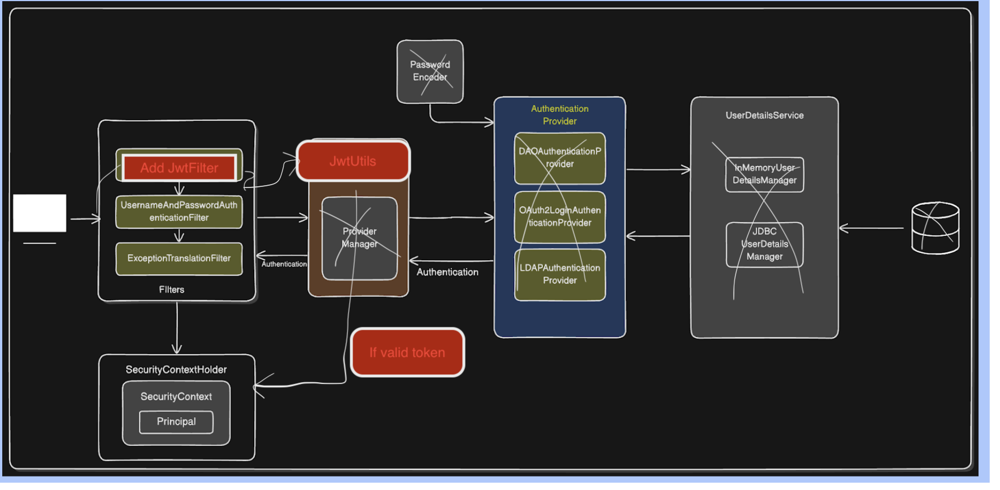

# Spring Boot Topics

---

## Why Spring Framework Was Needed

### Problems in Traditional Java/J2EE Development (Before Spring)

#### 1. **Tight Coupling**
- Traditional Java applications had tight coupling between components.
- Classes were directly dependent on concrete implementations, making it hard to change or test.
- Example: If a `UserService` directly instantiated a `UserDAO`, you couldn't easily swap the DAO implementation or test the service in isolation.

```java
// Tight Coupling - BAD
public class UserService {
    private UserDAO userDAO = new UserDAOImpl(); // Direct instantiation
    
    public User getUser(int id) {
        return userDAO.findById(id);
    }
}
```

#### 2. **Complex Configuration**
- Enterprise applications required extensive XML configuration for setting up components, transactions, security, etc.
- J2EE applications needed complex deployment descriptors and JNDI lookups.
- Boilerplate code for resources like database connections, transactions, and EJB lookups.

#### 3. **Difficult Testing**
- Tightly coupled code was hard to unit test.
- Testing required the full application server to be running.
- Mocking dependencies was difficult or impossible.

#### 4. **Heavy EJB Framework**
- Enterprise JavaBeans (EJB) was the standard for enterprise applications, but it was:
  - **Complex:** Required multiple interfaces and XML descriptors.
  - **Heavy:** Needed a full-fledged application server.
  - **Invasive:** Your code had to extend EJB classes and implement EJB interfaces.
  - **Slow Development:** Long build and deployment cycles.

#### 5. **Resource Management**
- Manual management of resources like database connections, transactions, and thread pools.
- Error-prone code for opening/closing connections, handling transactions, and managing exceptions.

---

### How Spring Framework Solved These Problems

#### 1. **Dependency Injection (DI) / Inversion of Control (IoC)**
- **Solution:** Spring manages object creation and dependency injection.
- **Benefit:** Loose coupling—components depend on interfaces, not concrete implementations.
- **Result:** Easy to swap implementations, test with mocks, and maintain code.

```java
// Loose Coupling with Spring - GOOD
@Service
public class UserService {
    private final UserDAO userDAO;
    
    @Autowired // Spring injects the dependency
    public UserService(UserDAO userDAO) {
        this.userDAO = userDAO;
    }
    
    public User getUser(int id) {
        return userDAO.findById(id);
    }
}
```

#### 2. **Simplified Configuration**
- **Solution:** Spring introduced annotation-based and Java-based configuration.
- **Benefit:** Reduced XML configuration and boilerplate code.
- **Result:** Cleaner, more readable configuration.

```java
@Configuration
public class AppConfig {
    @Bean
    public UserDAO userDAO() {
        return new UserDAOImpl();
    }
}
```

#### 3. **Easy Testing**
- **Solution:** DI makes it easy to inject mock dependencies.
- **Benefit:** Unit tests can run without a full application server.
- **Result:** Faster development and testing cycles.

```java
@Test
public void testGetUser() {
    UserDAO mockDAO = Mockito.mock(UserDAO.class);
    UserService service = new UserService(mockDAO);
    // Test logic...
}
```

#### 4. **Lightweight and Non-Invasive**
- **Solution:** Spring is a POJO (Plain Old Java Object) framework.
- **Benefit:** No need to extend Spring classes or implement Spring interfaces.
- **Result:** Your code remains clean and independent of the framework.

#### 5. **Declarative Transaction and Security Management**
- **Solution:** Spring provides declarative transaction management using `@Transactional` and declarative security.
- **Benefit:** No boilerplate code for transaction handling.
- **Result:** Cleaner business logic, easier to maintain.

```java
@Transactional
public void transferMoney(Account from, Account to, double amount) {
    from.debit(amount);
    to.credit(amount);
    // Spring handles transaction commit/rollback
}
```

#### 6. **Integration with Other Technologies**
- **Solution:** Spring provides seamless integration with Hibernate, JPA, JDBC, JMS, etc.
- **Benefit:** Use best-of-breed technologies without vendor lock-in.
- **Result:** Flexible architecture.

---

**Summary: Why Spring Was Needed**
- **Problem:** Tight coupling, complex configuration, difficult testing, heavy EJB framework, manual resource management.
- **Solution:** Spring introduced DI/IoC, simplified configuration, easy testing, lightweight POJO-based framework, declarative transaction/security management, and integration with other technologies.

---

## Why Spring Boot Was Introduced

### Problems with Traditional Spring Framework

Even though Spring solved many problems of J2EE, it still had challenges:

#### 1. **Complex Configuration**
- Spring applications required extensive configuration (XML or Java-based).
- Developers had to manually configure:
  - `DataSource` for database connections
  - `EntityManagerFactory` for JPA
  - `TransactionManager` for transactions
  - `DispatcherServlet` for web applications
  - View resolvers, message converters, etc.
- Example: Setting up a simple web application could require 100+ lines of configuration.

#### 2. **Dependency Management**
- Developers had to manually manage compatible versions of Spring and third-party libraries.
- Dependency conflicts and version mismatches were common.
- Required deep knowledge of which libraries to include and their compatible versions.

#### 3. **Long Setup Time**
- Setting up a new Spring project from scratch was time-consuming.
- Required creating project structure, adding dependencies, writing configuration files, and setting up build tools.
- Steep learning curve for beginners.

#### 4. **Deployment Complexity**
- Traditional Spring web applications needed to be packaged as WAR files.
- Required external application servers (Tomcat, JBoss, WebLogic) to run.
- Deployment process was complex and environment-dependent.

#### 5. **No Production-Ready Features**
- Spring didn't provide built-in support for monitoring, health checks, and metrics.
- Developers had to manually integrate tools for production monitoring.

#### 6. **Boilerplate Code**
- Repetitive code for common tasks like setting up web servers, configuring databases, etc.
- Every project required similar setup steps.

---

### How Spring Boot Solved These Problems

#### 1. **Auto-Configuration**
- **Solution:** Spring Boot automatically configures your application based on the dependencies in your classpath.
- **Benefit:** Zero or minimal configuration required.
- **Result:** You can start building features immediately without spending time on setup.

**Example:**
```java
// Just add spring-boot-starter-data-jpa dependency
// Spring Boot auto-configures DataSource, EntityManager, TransactionManager, etc.

@SpringBootApplication // Enables auto-configuration
public class MyApp {
    public static void main(String[] args) {
        SpringApplication.run(MyApp.class, args);
    }
}
```

#### 2. **Starter Dependencies (Opinionated Defaults)**
- **Solution:** Spring Boot provides "starter" dependencies that bundle commonly used libraries with compatible versions.
- **Benefit:** No need to worry about version conflicts or which libraries to include.
- **Result:** Simplified dependency management.

**Example:**
```xml
<!-- One dependency brings everything needed for web applications -->
<dependency>
    <groupId>org.springframework.boot</groupId>
    <artifactId>spring-boot-starter-web</artifactId>
</dependency>
```

This single dependency includes:
- Spring MVC
- Embedded Tomcat server
- Jackson for JSON
- Validation framework
- And more...

#### 3. **Embedded Servers**
- **Solution:** Spring Boot includes embedded servers (Tomcat, Jetty, Undertow) that run inside your application.
- **Benefit:** No need for external application servers; applications run as standalone JAR files.
- **Result:** Easy deployment—just run `java -jar myapp.jar`.

**Example:**
```bash
# Package as JAR
mvn clean package

# Run anywhere with Java installed
java -jar target/myapp.jar
```

#### 4. **Spring Initializr (Quick Project Setup)**
- **Solution:** Spring Boot provides [Spring Initializr](https://start.spring.io/) to generate project structure.
- **Benefit:** Start a new project in seconds with all necessary dependencies and configuration.
- **Result:** Developers can focus on business logic from day one.

#### 5. **Production-Ready Features (Actuator)**
- **Solution:** Spring Boot Actuator provides built-in endpoints for monitoring, health checks, and metrics.
- **Benefit:** Out-of-the-box production monitoring without additional setup.
- **Result:** Better observability and operational insights.

**Example:**
```xml
<dependency>
    <groupId>org.springframework.boot</groupId>
    <artifactId>spring-boot-starter-actuator</artifactId>
</dependency>
```

Access endpoints like:
- `/actuator/health` - Application health status
- `/actuator/metrics` - Application metrics
- `/actuator/env` - Environment properties

#### 6. **Externalized Configuration**
- **Solution:** Spring Boot makes it easy to externalize configuration using `application.properties` or `application.yml`.
- **Benefit:** Change configuration without modifying code.
- **Result:** Same application can run in different environments with different configs.

**Example:**
```properties
# application.properties
spring.datasource.url=jdbc:mysql://localhost:3306/mydb
spring.datasource.username=root
spring.datasource.password=secret
server.port=8080
```

#### 7. **Convention Over Configuration**
- **Solution:** Spring Boot follows "convention over configuration" philosophy.
- **Benefit:** Sensible defaults are provided; you only configure what's different.
- **Result:** Less code, faster development.

**Example:**
- Put static files in `src/main/resources/static` → Automatically served
- Put templates in `src/main/resources/templates` → Automatically used by template engine
- Put `application.properties` in `src/main/resources` → Automatically loaded

#### 8. **Developer Tools**
- **Solution:** Spring Boot DevTools provides automatic restart, live reload, and enhanced development experience.
- **Benefit:** Faster development with hot reloading.
- **Result:** See changes immediately without manual restarts.

---

### Comparison Table: Spring vs Spring Boot

| Aspect                  | Spring Framework                              | Spring Boot                                    |
|-------------------------|-----------------------------------------------|------------------------------------------------|
| **Configuration**       | Extensive XML or Java configuration required  | Auto-configuration, minimal setup              |
| **Dependency Mgmt**     | Manual version management                     | Starter dependencies with compatible versions  |
| **Project Setup**       | Manual setup, time-consuming                  | Spring Initializr, setup in seconds            |
| **Server**              | Requires external application server (WAR)    | Embedded server, runs as standalone JAR        |
| **Deployment**          | Complex, environment-dependent                | Simple, `java -jar myapp.jar`                  |
| **Monitoring**          | Manual integration required                   | Built-in Actuator for production monitoring    |
| **Development Time**    | Longer due to setup and configuration         | Faster with sensible defaults                  |
| **Learning Curve**      | Steep                                         | Easier for beginners                           |
| **Use Case**            | Full control, highly customized applications  | Rapid development, microservices, cloud apps   |

---

### Industry Scenario

**Before Spring Boot:**
- Setting up a microservice with Spring required configuring Spring MVC, database, security, logging, etc.
- A simple REST API project could take hours or days to set up properly.
- Each team member might configure things differently, leading to inconsistencies.

**After Spring Boot:**
- Use Spring Initializr to generate a project with all necessary dependencies in 30 seconds.
- Run the application immediately with embedded Tomcat.
- Focus on writing business logic instead of configuration.
- Standardized setup across all microservices in the organization.

---

**Summary: Why Spring Boot Was Introduced**
- **Problem:** Spring Framework required extensive configuration, complex dependency management, long setup time, deployment complexity, and lacked production-ready features.
- **Solution:** Spring Boot introduced auto-configuration, starter dependencies, embedded servers, Spring Initializr, production-ready Actuator, externalized configuration, convention over configuration, and developer tools.
- **Result:** Faster development, easier deployment, standardized setup, and production-ready applications out of the box.

---

## Spring Boot Auto-Configuration

### What is Auto-Configuration in Spring Boot?

Auto-configuration is a core feature of Spring Boot that automatically configures your application based on the dependencies present in your classpath. It reduces the need for manual configuration and boilerplate code, enabling rapid development.

**Key Benefits:**
- **Zero Configuration:** Most features work out-of-the-box without any setup
- **Smart Defaults:** Provides sensible default configurations
- **Conditional Setup:** Only configures what's needed based on your dependencies
- **Easy Override:** You can customize or replace any auto-configured bean

---

### Key Annotation: `@EnableAutoConfiguration`

`@EnableAutoConfiguration` is the annotation that triggers auto-configuration in Spring Boot.

**Important Points:**
- It is included in the `@SpringBootApplication` annotation
- You usually don't need to add it explicitly
- It tells Spring Boot to scan the classpath and automatically configure beans

**Example:**
```java
@SpringBootApplication // Combines three annotations
public class MyApp {
    public static void main(String[] args) {
        SpringApplication.run(MyApp.class, args);
    }
}
```

**What `@SpringBootApplication` includes:**
```java
// Equivalent to:
@Configuration          // Marks the class as a source of bean definitions
@EnableAutoConfiguration // Enables auto-configuration based on classpath
@ComponentScan          // Tells Spring to scan for beans/components in current package and sub-packages
public class MyApp {
    public static void main(String[] args) {
        SpringApplication.run(MyApp.class, args);
    }
}
```

**Annotation Breakdown:**
- `@Configuration`: Allows you to define beans using `@Bean` methods
- `@EnableAutoConfiguration`: Enables Spring Boot's auto-configuration mechanism
- `@ComponentScan`: Scans the package and sub-packages for `@Component`, `@Service`, `@Repository`, `@Controller` classes

---

### How Does Auto-Configuration Work?

Auto-configuration happens in the following steps:

#### 1. **Classpath Scanning**
Spring Boot checks which libraries (web, JPA, security, etc.) are present in your classpath.

**Example:**
- If `spring-boot-starter-web` is in classpath → Configures Spring MVC, embedded Tomcat, Jackson
- If `spring-boot-starter-data-jpa` is in classpath → Configures JPA, Hibernate, DataSource

#### 2. **Conditional Configuration**
Uses conditional annotations to apply configuration only when certain conditions are met:

- `@ConditionalOnClass`: Registers a bean only if a specific class is present on the classpath
- `@ConditionalOnMissingBean`: Registers a bean only if a bean of the same type is not already defined
- `@ConditionalOnProperty`: Registers a bean only if a specific property is set in configuration
- `@ConditionalOnBean`: Registers a bean only if another bean is present in the context

### Example: Manually Configuring After Excluding Auto-Configuration

Sometimes you need full control over certain configurations. You can exclude auto-configuration and provide your own.

#### Step 1: Exclude Auto-Configuration

**Method 1: Using `@SpringBootApplication`**
```java
@SpringBootApplication(exclude = { 
    DataSourceAutoConfiguration.class,
    HibernateJpaAutoConfiguration.class
})
public class MyApp {
    public static void main(String[] args) {
        SpringApplication.run(MyApp.class, args);
    }
}
```

**Method 2: Using `application.properties`**
```properties
spring.autoconfigure.exclude=\
  org.springframework.boot.autoconfigure.jdbc.DataSourceAutoConfiguration,\
  org.springframework.boot.autoconfigure.orm.jpa.HibernateJpaAutoConfiguration
```

#### Step 2: Provide Your Own Configuration

**Custom DataSource Configuration:**
```java
@Configuration
public class CustomDataSourceConfig {
    
    @Bean
    public DataSource dataSource() {
        // Using HikariCP (production-ready connection pool)
        HikariConfig config = new HikariConfig();
        
        // Database connection settings
        config.setJdbcUrl("jdbc:mysql://localhost:3306/mydb");
        config.setUsername("root");
        config.setPassword("password");
        
        // Connection pool settings
        config.setMaximumPoolSize(10); // Max 10 connections
        config.setMinimumIdle(5); // Min 5 idle connections
        config.setConnectionTimeout(30000); // 30 seconds
        config.setIdleTimeout(600000); // 10 minutes
        config.setMaxLifetime(1800000); // 30 minutes
        
        // Connection pool name
        config.setPoolName("MyAppHikariCP");
        
        // Additional settings
        config.addDataSourceProperty("cachePrepStmts", "true");
        config.addDataSourceProperty("prepStmtCacheSize", "250");
        config.addDataSourceProperty("prepStmtCacheSqlLimit", "2048");
        
        return new HikariDataSource(config);
    }
    
    @Bean
    public LocalContainerEntityManagerFactoryBean entityManagerFactory(DataSource dataSource) {
        LocalContainerEntityManagerFactoryBean em = new LocalContainerEntityManagerFactoryBean();
        em.setDataSource(dataSource);
        em.setPackagesToScan("com.example.entity"); // Scan for @Entity classes
        
        // Configure Hibernate as JPA provider
        JpaVendorAdapter vendorAdapter = new HibernateJpaVendorAdapter();
        em.setJpaVendorAdapter(vendorAdapter);
        
        // Hibernate properties
        Properties properties = new Properties();
        properties.setProperty("hibernate.hbm2ddl.auto", "update");
        properties.setProperty("hibernate.dialect", "org.hibernate.dialect.MySQL8Dialect");
        properties.setProperty("hibernate.show_sql", "true");
        properties.setProperty("hibernate.format_sql", "true");
        em.setJpaProperties(properties);
        
        return em;
    }
    
    @Bean
    public PlatformTransactionManager transactionManager(EntityManagerFactory entityManagerFactory) {
        JpaTransactionManager transactionManager = new JpaTransactionManager();
        transactionManager.setEntityManagerFactory(entityManagerFactory);
        return transactionManager;
    }
}
```

**Why Manually Configure?**
- **Custom Connection Pool Settings:** Fine-tune performance for your specific needs
- **Multiple DataSources:** Connect to multiple databases
- **Special Security Requirements:** Custom encryption, connection validation
- **Legacy Systems:** Work with older database versions or special drivers

---

### Common Auto-Configurations Provided by Spring Boot

Spring Boot provides many auto-configurations to simplify application setup. Here are the most important ones:

| Auto-Configuration Class                      | What It Does                                                      | Triggered By (Starter Dependency)      |
|-----------------------------------------------|-------------------------------------------------------------------|----------------------------------------|
| **DataSourceAutoConfiguration**               | Sets up database connection pool and DataSource bean              | `spring-boot-starter-data-jpa`         |
| **JpaRepositoriesAutoConfiguration**          | Enables Spring Data JPA repositories                              | `spring-boot-starter-data-jpa`         |
| **HibernateJpaAutoConfiguration**             | Configures Hibernate as the JPA provider                          | `spring-boot-starter-data-jpa`         |
| **WebMvcAutoConfiguration**                   | Sets up Spring MVC for web applications                           | `spring-boot-starter-web`              |
| **DispatcherServletAutoConfiguration**        | Configures the main servlet for handling web requests             | `spring-boot-starter-web`              |
| **JacksonAutoConfiguration**                  | Configures Jackson for JSON serialization/deserialization         | `spring-boot-starter-web`              |
| **SecurityAutoConfiguration**                 | Sets up basic security (login page, authentication, etc.)         | `spring-boot-starter-security`         |
| **ErrorMvcAutoConfiguration**                 | Provides default error handling pages                             | `spring-boot-starter-web`              |
| **EmbeddedWebServerFactoryCustomizerAutoConfiguration** | Starts embedded Tomcat/Jetty/Undertow web server       | `spring-boot-starter-web`              |
| **MailSenderAutoConfiguration**               | Configures JavaMailSender for sending emails                      | `spring-boot-starter-mail`             |
| **CacheAutoConfiguration**                    | Sets up caching support                                           | `spring-boot-starter-cache`            |
| **RabbitAutoConfiguration**                   | Configures RabbitMQ messaging                                     | `spring-boot-starter-amqp`             |
| **MongoAutoConfiguration**                    | Sets up MongoDB connection and beans                              | `spring-boot-starter-data-mongodb`     |
| **ActuatorAutoConfiguration**                 | Enables Spring Boot Actuator endpoints for monitoring             | `spring-boot-starter-actuator`         |
| **LiquibaseAutoConfiguration**                | Configures Liquibase for database migrations                      | `liquibase-core`                       |
| **FlywayAutoConfiguration**                   | Configures Flyway for database migrations                         | `flyway-core`                          |
| **ThymeleafAutoConfiguration**                | Sets up Thymeleaf template engine for web views                   | `spring-boot-starter-thymeleaf`        |
| **RestClientAutoConfiguration**               | Configures RestClient bean for HTTP calls (Spring Boot 3.2+)      | `spring-boot-starter-web`              |
| **QuartzAutoConfiguration**                   | Sets up Quartz scheduler for jobs                                 | `spring-boot-starter-quartz`           |

**How It Works:**
1. Spring Boot scans your classpath and project settings
2. If it finds relevant dependencies (e.g., `spring-boot-starter-data-jpa`), it applies the matching auto-configuration classes
3. You can override or exclude any auto-configuration as needed

---

### Is Auto-Configuration Based on Dependencies in pom.xml?

**Yes! Auto-configuration is triggered by the presence of specific dependencies in your project.**

When you add a starter dependency to your `pom.xml` (Maven) or `build.gradle` (Gradle), Spring Boot detects it on the classpath and automatically applies the relevant auto-configuration.

#### Example 1: Web Application

**Add dependency:**
```xml
<dependency>
    <groupId>org.springframework.boot</groupId>
    <artifactId>spring-boot-starter-web</artifactId>
</dependency>
```

**What Spring Boot auto-configures:**
- ✅ Spring MVC framework
- ✅ Embedded Tomcat server (runs on port 8080 by default)
- ✅ Jackson for JSON serialization/deserialization
- ✅ Validation framework for request validation
- ✅ Default error pages
- ✅ Static resource handling

**You can start building REST APIs immediately:**
```java
@RestController
@RequestMapping("/api/users")
public class UserController {
    
    @GetMapping("/{id}")
    public User getUser(@PathVariable Long id) {
        return new User(id, "John Doe", "john@example.com");
    }
}
```

#### Example 2: Database Application

**Add dependency:**
```xml
<dependency>
    <groupId>org.springframework.boot</groupId>
    <artifactId>spring-boot-starter-data-jpa</artifactId>
</dependency>
<dependency>
    <groupId>com.mysql</groupId>
    <artifactId>mysql-connector-j</artifactId>
</dependency>
```

**What Spring Boot auto-configures:**
- ✅ DataSource (connection pool)
- ✅ EntityManagerFactory (JPA)
- ✅ TransactionManager (for @Transactional)
- ✅ Hibernate as JPA provider
- ✅ Spring Data JPA repositories

**Just add configuration in `application.properties`:**
```properties
spring.datasource.url=jdbc:mysql://localhost:3306/mydb
spring.datasource.username=root
spring.datasource.password=password
spring.jpa.hibernate.ddl-auto=update
```

**You can start using JPA immediately:**
```java
@Entity
public class User {
    @Id
    @GeneratedValue(strategy = GenerationType.IDENTITY)
    private Long id;
    private String name;
    private String email;
    // Getters and setters
}

@Repository
public interface UserRepository extends JpaRepository<User, Long> {
    List<User> findByName(String name);
}

@Service
public class UserService {
    @Autowired
    private UserRepository userRepository;
    
    @Transactional
    public User createUser(User user) {
        return userRepository.save(user);
    }
}
```

#### Example 3: Security Application

**Add dependency:**
```xml
<dependency>
    <groupId>org.springframework.boot</groupId>
    <artifactId>spring-boot-starter-security</artifactId>
</dependency>
```

**What Spring Boot auto-configures:**
- ✅ Basic authentication for all endpoints
- ✅ Default login page at `/login`
- ✅ Default user with username `user` and random password (printed in console)
- ✅ CSRF protection
- ✅ Session management

**Console output on startup:**
```
Using generated security password: 8e557245-73e2-4286-969a-ff57fe326336
```

**All endpoints are now secured by default!**

---

### Summary

**Auto-Configuration Workflow:**
```
1. Add dependency to pom.xml
   ↓
2. Spring Boot detects it on classpath
   ↓
3. Checks conditions (@ConditionalOnClass, @ConditionalOnMissingBean, etc.)
   ↓
4. Applies relevant auto-configuration classes
   ↓
5. Registers default beans
   ↓
6. Your application is ready to use (with sensible defaults)
   ↓
7. You can override any bean by defining your own
```

**Key Takeaways:**
- ✅ Auto-configuration is triggered by dependencies in your `pom.xml` or `build.gradle`
- ✅ Spring Boot provides sensible defaults for common use cases
- ✅ You can customize or exclude any auto-configuration
- ✅ This enables rapid development with minimal setup
- ✅ Focus on business logic instead of infrastructure configuration

---

## Spring MVC Architecture and Components

### What is Spring MVC?

Spring MVC is a module of the Spring Framework that provides a powerful way to build web applications. It follows the **Model-View-Controller (MVC)** design pattern, which helps separate the application's concerns, making it easier to manage and scale.

**Key Benefits:**
- **Separation of Concerns:** Clear division between presentation, business logic, and data
- **Testability:** Each component can be tested independently
- **Flexibility:** Support for multiple view technologies (JSP, Thymeleaf, FreeMarker, etc.)
- **Clean Architecture:** Well-defined roles for each component

---

### Key Components of Spring MVC

#### 1. **DispatcherServlet**
- The **front controller** that handles all incoming HTTP requests
- Acts as the central entry point for the application
- Delegates requests to appropriate handlers
- Coordinates the entire request-response workflow

#### 2. **Controller**
- Processes user requests and prepares the model data
- Interacts with the service layer for business logic
- Returns the view name or response data
- Annotated with `@Controller` or `@RestController`

#### 3. **Model**
- Represents the application's data and business logic
- Can be a simple Java object (POJO) or complex service
- Holds data that needs to be displayed in the view
- Passed between controller and view

#### 4. **View**
- The presentation layer that renders the model data to the user
- Can be JSP, Thymeleaf, FreeMarker, or any other view technology
- Receives data from the model and displays it
- Responsible for generating HTML, JSON, XML, etc.

#### 5. **HandlerMapping**
- Maps incoming HTTP requests to the appropriate controller method
- Uses URL patterns, HTTP methods, and request parameters
- Configured automatically by Spring Boot

#### 6. **ViewResolver**
- Resolves the logical view name returned by the controller to an actual view implementation
- Locates the correct view template file
- Examples: `InternalResourceViewResolver`, `ThymeleafViewResolver`

---

### Spring MVC Architecture Flow Diagram

Here's how a request flows through the Spring MVC architecture:

```
Client (Browser/Mobile App)
     |
     | 1. HTTP Request (GET /orders/123)
     v
+------------------------+
|   DispatcherServlet    | ← Front Controller
+------------------------+
     |
     | 2. Find Handler
     v
+------------------------+
|    HandlerMapping      | ← Maps URL to Controller
+------------------------+
     |
     | 3. Execute Handler
     v
+------------------------+
|      Controller        | ← Processes Request
+------------------------+
     |
     | 4. Business Logic
     v
+------------------------+
|       Service          | ← Business Logic
+------------------------+
     |
     | 5. Data Access
     v
+------------------------+
|      Repository        | ← Database Operations
+------------------------+
     |
     | 6. Return Model Data
     v
+------------------------+
|        Model           | ← Holds Data
+------------------------+
     |
     | 7. Return View Name
     v
+------------------------+
|     ViewResolver       | ← Resolves View
+------------------------+
     |
     | 8. Render View
     v
+------------------------+
|         View           | ← Generates Response
+------------------------+
     |
     | 9. HTTP Response (HTML/JSON)
     v
Client (Browser/Mobile App)
```

---

### How Spring MVC Works (Step-by-Step)

#### Step 1: Client Sends Request
- User enters URL: `http://localhost:8080/orders/123`
- Browser sends HTTP GET request to the server

#### Step 2: DispatcherServlet Receives Request
- `DispatcherServlet` intercepts all requests
- Acts as the front controller

#### Step 3: Find Handler (HandlerMapping)
- `DispatcherServlet` consults `HandlerMapping`
- Finds the appropriate controller method based on URL pattern
- Example: `/orders/{id}` maps to `OrderController.getOrder()`

#### Step 4: Execute Controller Method
- Controller method is invoked
- Processes the request (validates, calls service layer)
- Prepares model data

#### Step 5: Interact with Service Layer
- Controller calls service methods for business logic
- Service interacts with repository for database operations

#### Step 6: Return View Name or Data
- For traditional web apps: Returns view name (e.g., `"orderDetails"`)
- For REST APIs: Returns data directly (e.g., `Order` object)

#### Step 7: Resolve View (ViewResolver)
- `ViewResolver` maps the view name to actual view template
- Example: `"orderDetails"` → `/WEB-INF/views/orderDetails.jsp`

#### Step 8: Render View
- View template receives model data
- Generates HTML, JSON, or XML response

#### Step 9: Send Response to Client
- `DispatcherServlet` sends the response back to the client
- Browser displays the page or processes the data

---

### Code Example: Traditional Web Application

**Controller:**
```java
@Controller // Marks this class as a Spring MVC controller
@RequestMapping("/orders") // Base URL for all methods
public class OrderController {
    
    @Autowired
    private OrderService orderService;

    // GET /orders/123
    @GetMapping("/{id}") // Maps GET requests for /orders/{id}
    public String getOrder(@PathVariable String id, Model model) {
        // Fetch order from service layer
        Order order = orderService.getOrderById(id);
        
        // Add data to model (will be available in the view)
        model.addAttribute("order", order);
        model.addAttribute("pageTitle", "Order Details");
        
        // Return view name (resolved to actual template by ViewResolver)
        return "orderDetails"; // → /WEB-INF/views/orderDetails.jsp
    }
    
    // GET /orders (List all orders)
    @GetMapping
    public String listOrders(Model model) {
        List<Order> orders = orderService.getAllOrders();
        model.addAttribute("orders", orders);
        return "orderList"; // → orderList.jsp
    }
    
    // GET /orders/new (Show order creation form)
    @GetMapping("/new")
    public String showCreateForm(Model model) {
        model.addAttribute("order", new Order());
        return "orderForm"; // → orderForm.jsp
    }
    
    // POST /orders (Create new order)
    @PostMapping
    public String createOrder(@ModelAttribute Order order, RedirectAttributes redirectAttributes) {
        Order savedOrder = orderService.createOrder(order);
        redirectAttributes.addFlashAttribute("message", "Order created successfully!");
        return "redirect:/orders/" + savedOrder.getId(); // Redirect to order details
    }
}
```

**View (orderDetails.jsp):**
```jsp
<%@ page contentType="text/html;charset=UTF-8" language="java" %>
<!DOCTYPE html>
<html>
<head>
    <title>${pageTitle}</title>
</head>
<body>
    <h1>Order Details</h1>
    <p><strong>Order ID:</strong> ${order.id}</p>
    <p><strong>Customer:</strong> ${order.customerName}</p>
    <p><strong>Amount:</strong> $${order.amount}</p>
    <p><strong>Status:</strong> ${order.status}</p>
    <a href="/orders">Back to Orders</a>
</body>
</html>
```

**Configuration (application.properties):**
```properties
# View Resolver Configuration
spring.mvc.view.prefix=/WEB-INF/views/
spring.mvc.view.suffix=.jsp
```

**Annotations Explained:**
- `@Controller`: Marks the class as a Spring MVC controller
- `@RequestMapping`: Maps HTTP requests to controller methods
- `@GetMapping`: Handles HTTP GET requests
- `@PostMapping`: Handles HTTP POST requests
- `@PathVariable`: Extracts values from the URL path
- `@ModelAttribute`: Binds request parameters to a model object
- `Model`: Container for model attributes to be rendered by the view
- `RedirectAttributes`: Passes attributes during redirect

---

## Difference Between `@Controller` and `@RestController`

### `@Controller`

**Purpose:**
- Used for **traditional web applications** where you return views (HTML pages)
- Methods return a **view name** that is resolved by `ViewResolver`
- Designed for server-side rendering

**How it Works:**
- Returns a string representing the view name
- `ViewResolver` maps the view name to an actual template
- Template is rendered with model data and sent to the client as HTML

**When to Use:**
- Building traditional web applications
- Server-side rendering with JSP, Thymeleaf, FreeMarker
- Admin dashboards, CMS, traditional e-commerce sites

**Example:**
```java
@Controller // Handles web requests and returns view names
public class ProductController {
    
    @Autowired
    private ProductService productService;
    
    @GetMapping("/products/{id}")
    public String getProduct(@PathVariable Long id, Model model) {
        Product product = productService.getProductById(id);
        model.addAttribute("product", product);
        return "productDetails"; // Returns view name → productDetails.jsp
    }
    
    // To return JSON data instead of view (requires @ResponseBody)
    @GetMapping("/api/products/{id}")
    @ResponseBody // Tells Spring to serialize the return value to JSON
    public Product getProductAsJson(@PathVariable Long id) {
        return productService.getProductById(id); // Returned as JSON
    }
}
```

**Key Points:**
- Default behavior: Returns view name
- To return data: Add `@ResponseBody` annotation to the method
- View is rendered on the server and HTML is sent to the client

---

### `@RestController`

**Purpose:**
- Used for **RESTful web services** where you return data (JSON/XML)
- Combines `@Controller` + `@ResponseBody`
- Methods return objects that are automatically serialized to JSON/XML

**How it Works:**
- Returns Java objects directly
- Spring automatically converts objects to JSON using Jackson
- No view rendering—data is sent directly to the client

**When to Use:**
- Building REST APIs
- Mobile app backends
- Microservices
- Single Page Applications (SPA) backends (React, Angular, Vue)

**Example:**
```java
@RestController // Combines @Controller + @ResponseBody
@RequestMapping("/api/products")
public class ProductRestController {
    
    @Autowired
    private ProductService productService;
    
    // GET /api/products/123 → Returns JSON
    @GetMapping("/{id}")
    public ResponseEntity<Product> getProduct(@PathVariable Long id) {
        Product product = productService.getProductById(id);
        return ResponseEntity.ok(product); // Auto-serialized to JSON
    }
    
    // GET /api/products → Returns JSON array
    @GetMapping
    public ResponseEntity<List<Product>> getAllProducts() {
        List<Product> products = productService.getAllProducts();
        return ResponseEntity.ok(products);
    }
    
    // POST /api/products → Accepts JSON, Returns JSON
    @PostMapping
    public ResponseEntity<Product> createProduct(@RequestBody Product product) {
        Product createdProduct = productService.createProduct(product);
        return ResponseEntity.status(HttpStatus.CREATED).body(createdProduct);
    }
    
    // PUT /api/products/123 → Accepts JSON, Returns JSON
    @PutMapping("/{id}")
    public ResponseEntity<Product> updateProduct(
            @PathVariable Long id, 
            @RequestBody Product product) {
        Product updatedProduct = productService.updateProduct(id, product);
        return ResponseEntity.ok(updatedProduct);
    }
    
    // DELETE /api/products/123 → Returns status only
    @DeleteMapping("/{id}")
    public ResponseEntity<Void> deleteProduct(@PathVariable Long id) {
        productService.deleteProduct(id);
        return ResponseEntity.noContent().build(); // HTTP 204
    }
}
```

**Key Points:**
- All methods automatically return JSON (no `@ResponseBody` needed)
- No view rendering
- Perfect for REST APIs

---

### Comparison Table: `@Controller` vs `@RestController`

| Aspect                  | `@Controller`                                  | `@RestController`                        |
|-------------------------|------------------------------------------------|------------------------------------------|
| **Primary Use**         | Traditional web applications (HTML)            | RESTful web services (JSON/XML)          |
| **Return Type**         | View name (String) or Model                    | Java objects (auto-serialized to JSON)   |
| **ViewResolver**        | Yes (resolves view name to template)           | No (direct data serialization)           |
| **Response Format**     | HTML (rendered from templates)                 | JSON/XML (serialized objects)            |
| **@ResponseBody**       | Required for each method returning data        | Automatic (built-in)                     |
| **Typical Response**    | HTML page                                      | JSON data                                |
| **Client Type**         | Web browser                                    | Mobile app, SPA, other services          |
| **Example Apps**        | Admin dashboard, CMS, e-commerce website       | Mobile backend, microservices, APIs      |
| **Annotation Combo**    | `@Controller`                                  | `@Controller` + `@ResponseBody`          |

---

### When to Use Which?

#### Use `@Controller` When:
✅ Building traditional web applications with server-side rendering  
✅ Need to render HTML pages using templates (JSP, Thymeleaf)  
✅ Creating admin dashboards, content management systems  
✅ Building multi-page applications (MPA)

**Industry Examples:**
- Company intranet portal
- Admin dashboard for managing users
- Traditional e-commerce website with server-rendered pages

---

#### Use `@RestController` When:
✅ Building REST APIs  
✅ Creating backend services for mobile apps  
✅ Developing microservices  
✅ Building backends for Single Page Applications (React, Angular, Vue)  
✅ Providing data to external systems via API

**Industry Examples:**
- Mobile app backend (iOS/Android)
- Microservices in a distributed system
- API for third-party integrations
- Backend for modern SPA applications

---

### Real-World Industry Scenario

**Scenario: E-Commerce Platform**

#### Traditional Web App (Uses `@Controller`)
```java
@Controller
@RequestMapping("/shop")
public class ShopController {
    
    @GetMapping("/products")
    public String showProducts(Model model) {
        List<Product> products = productService.getAllProducts();
        model.addAttribute("products", products);
        return "productCatalog"; // Renders productCatalog.jsp
    }
}
```
- Server renders HTML and sends to browser
- Users see fully rendered HTML pages
- Good for SEO, simple deployment

#### Modern SPA + REST API (Uses `@RestController`)
```java
@RestController
@RequestMapping("/api/products")
public class ProductApiController {
    
    @GetMapping
    public ResponseEntity<List<Product>> getProducts() {
        List<Product> products = productService.getAllProducts();
        return ResponseEntity.ok(products); // Returns JSON
    }
}
```
- React/Angular/Vue frontend fetches JSON data
- Frontend renders UI dynamically
- Same API can serve web, mobile, and other clients

---

### Summary

**Key Takeaways:**
- ✅ Spring MVC follows the Model-View-Controller pattern for clean separation of concerns
- ✅ `DispatcherServlet` is the front controller that coordinates the entire request-response cycle
- ✅ Use `@Controller` for traditional web apps with server-side rendering
- ✅ Use `@RestController` for REST APIs that return JSON/XML data
- ✅ Spring Boot auto-configures Spring MVC with sensible defaults

---

## Spring Beans and ApplicationContext

### What is a Bean?

A **Bean** is a Plain Old Java Object (POJO) that is managed by the Spring Framework. When we say "managed by Spring," it means that Spring is responsible for:
- Creating the object (instantiation)
- Managing its lifecycle (initialization and destruction)
- Injecting its dependencies (Dependency Injection)
- Storing it in the ApplicationContext (Spring IoC Container)

**Key Points:**
- Any Java class can become a Bean when it's managed by Spring
- Regular Java objects created using `new` keyword are NOT Beans
- Spring Beans are singleton by default (one instance per application)
- Beans are stored and managed in the Spring IoC Container

**Example:**
```java
// Regular Java Object (NOT a Bean)
public class ProductService {
    public void processProduct() {
        System.out.println("Processing product...");
    }
}

// Usage without Spring
ProductService service = new ProductService(); // You manage this object
service.processProduct();
```

```java
// Spring Bean (Managed by Spring)
@Component // This annotation tells Spring to manage this class as a Bean
public class ProductService {
    public void processProduct() {
        System.out.println("Processing product...");
    }
}

// Usage with Spring
@RestController
public class ProductController {
    @Autowired // Spring automatically injects the Bean
    private ProductService productService; // Spring manages this object
    
    @GetMapping("/process")
    public String process() {
        productService.processProduct();
        return "Product processed";
    }
}
```

---

### What is ApplicationContext?

**ApplicationContext** is the actual implementation of the Spring IoC (Inversion of Control) Container. It acts as the backbone of your Spring application, managing all beans and their lifecycle.

**Responsibilities of ApplicationContext:**
- **Bean Creation:** Creates instances of all beans in your application
- **Dependency Injection:** Automatically injects dependencies into beans
- **Bean Lifecycle Management:** Manages initialization and destruction of beans
- **Configuration Management:** Loads and manages application configuration
- **Event Handling:** Publishes and listens to application events

**Key Interfaces:**
```
BeanFactory (Parent Interface)
    ↓
ApplicationContext (Child Interface - More Features)
    ↓
Implementations:
- AnnotationConfigApplicationContext (Java-based configuration)
- ClassPathXmlApplicationContext (XML-based configuration)
- WebApplicationContext (Web applications)
```

**BeanFactory vs ApplicationContext:**

| Feature                | BeanFactory                    | ApplicationContext                  |
|------------------------|--------------------------------|-------------------------------------|
| Bean Creation          | Lazy (on-demand)               | Eager (at startup)                  |
| Internationalization   | Not supported                  | Supported                           |
| Event Publishing       | Not supported                  | Supported                           |
| AOP Support            | Manual configuration           | Built-in support                    |
| Usage                  | Legacy, resource-constrained   | Modern Spring applications          |

**Why ApplicationContext?**
- ApplicationContext is the preferred container in modern Spring applications
- Provides more enterprise-level features than BeanFactory
- Spring Boot uses ApplicationContext automatically

---

### How to Create Beans

There are two main approaches to create beans in Spring:

#### Approach 1: Using Stereotype Annotations

Stereotype annotations mark a class as a Spring-managed component. Spring automatically scans and registers these classes as beans.

**Available Stereotype Annotations:**

##### 1. `@Component`
- **Purpose:** General-purpose annotation to mark any class as a Spring Bean
- **When to Use:** When the class doesn't fit into specific categories (Service, Repository, Controller)
- **Example Use Cases:** Utility classes, helper classes, custom components

**Example:**
```java
@Component // Marks this class as a Spring Bean
public class EmailValidator {
    
    public boolean isValidEmail(String email) {
        String emailRegex = "^[A-Za-z0-9+_.-]+@(.+)$";
        return email != null && email.matches(emailRegex);
    }
    
    public boolean isValidDomain(String email) {
        return email.endsWith("@company.com");
    }
}
```

**Usage:**
```java
@Service
public class UserService {
    
    @Autowired
    private EmailValidator emailValidator; // Spring injects this Bean
    
    public void registerUser(String email) {
        if (emailValidator.isValidEmail(email)) {
            // Register user
        }
    }
}
```

##### 2. `@Service`
- **Purpose:** Marks a class as a Service layer component containing business logic
- **Specialization of:** `@Component`
- **When to Use:** Business logic, validations, data transformations
- **Benefits:** Clearly indicates the role of the class in the application

**Example:**
```java
@Service // Specialized @Component for business logic
public class ProductService {
    
    @Autowired
    private ProductRepository productRepository;
    
    public Product getProductById(Long id) {
        return productRepository.findById(id)
                .orElseThrow(() -> new ProductNotFoundException("Product not found"));
    }
    
    public Product createProduct(Product product) {
        // Business logic: validate product
        if (product.getPrice() <= 0) {
            throw new InvalidProductException("Price must be positive");
        }
        return productRepository.save(product);
    }
    
    public double calculateDiscountedPrice(Product product, double discountPercent) {
        // Business logic: calculate discount
        return product.getPrice() * (1 - discountPercent / 100);
    }
}
```

##### 3. `@Repository`
- **Purpose:** Marks a class as a Repository/DAO layer component for database operations
- **Specialization of:** `@Component`
- **When to Use:** Database access, CRUD operations
- **Benefits:** Automatic translation of database exceptions to Spring's DataAccessException

**Example:**
```java
@Repository // Specialized @Component for database operations
public interface ProductRepository extends JpaRepository<Product, Long> {
    
    List<Product> findByCategory(String category);
    
    List<Product> findByPriceLessThan(Double price);
    
    @Query("SELECT p FROM Product p WHERE p.name LIKE %:name%")
    List<Product> searchByName(@Param("name") String name);
}
```

##### 4. `@Controller`
- **Purpose:** Marks a class as a Spring MVC Controller for web applications
- **Specialization of:** `@Component`
- **When to Use:** Traditional web applications with server-side rendering
- **Returns:** View names that are resolved to templates

**Example:**
```java
@Controller // Specialized @Component for web controllers
@RequestMapping("/products")
public class ProductWebController {
    
    @Autowired
    private ProductService productService;
    
    @GetMapping("/{id}")
    public String getProduct(@PathVariable Long id, Model model) {
        Product product = productService.getProductById(id);
        model.addAttribute("product", product);
        return "productDetails"; // Returns view name
    }
}
```

##### 5. `@RestController`
- **Purpose:** Marks a class as a REST API Controller returning data (JSON/XML)
- **Specialization of:** `@Controller` + `@ResponseBody`
- **When to Use:** REST APIs, microservices, mobile backends
- **Returns:** Data objects (automatically serialized to JSON)

**Example:**
```java
@RestController // Specialized @Component for REST APIs (combines @Controller + @ResponseBody)
@RequestMapping("/api/products")
public class ProductRestController {
    
    @Autowired
    private ProductService productService;
    
    @GetMapping("/{id}")
    public ResponseEntity<Product> getProduct(@PathVariable Long id) {
        Product product = productService.getProductById(id);
        return ResponseEntity.ok(product); // Returns JSON
    }
    
    @PostMapping
    public ResponseEntity<Product> createProduct(@RequestBody Product product) {
        Product createdProduct = productService.createProduct(product);
        return ResponseEntity.status(HttpStatus.CREATED).body(createdProduct);
    }
}
```

**Annotation Hierarchy:**
```
@Component (Base Annotation)
    ↓
    ├── @Service (Business Logic)
    ├── @Repository (Database Operations)
    └── @Controller (Web Requests)
            ↓
            └── @RestController (@Controller + @ResponseBody)
```

**Complete Example with All Annotations:**
```java
// Component: Utility class
@Component
public class PriceCalculator {
    public double calculateTax(double amount) {
        return amount * 0.18; // 18% tax
    }
}

// Repository: Database operations
@Repository
public interface OrderRepository extends JpaRepository<Order, Long> {
    List<Order> findByCustomerId(Long customerId);
}

// Service: Business logic
@Service
public class OrderService {
    
    @Autowired
    private OrderRepository orderRepository;
    
    @Autowired
    private PriceCalculator priceCalculator;
    
    public Order createOrder(Order order) {
        // Business logic: calculate total with tax
        double tax = priceCalculator.calculateTax(order.getAmount());
        order.setTotalAmount(order.getAmount() + tax);
        return orderRepository.save(order);
    }
}

// RestController: REST API
@RestController
@RequestMapping("/api/orders")
public class OrderRestController {
    
    @Autowired
    private OrderService orderService;
    
    @PostMapping
    public ResponseEntity<Order> createOrder(@RequestBody Order order) {
        Order createdOrder = orderService.createOrder(order);
        return ResponseEntity.status(HttpStatus.CREATED).body(createdOrder);
    }
}

// Controller: Traditional web
@Controller
@RequestMapping("/orders")
public class OrderWebController {
    
    @Autowired
    private OrderService orderService;
    
    @GetMapping("/{id}")
    public String viewOrder(@PathVariable Long id, Model model) {
        Order order = orderService.getOrderById(id);
        model.addAttribute("order", order);
        return "orderDetails"; // View name
    }
}
```

**Key Points:**
- All stereotype annotations (`@Service`, `@Repository`, `@Controller`, `@RestController`) are specialized versions of `@Component`
- Spring automatically scans packages for these annotations during component scanning
- You can use `@Component` for any class, but specialized annotations provide better clarity and additional features

---

#### Approach 2: Using `@Configuration` and `@Bean` Annotations

This approach is used when you need to:
- Define beans programmatically
- Work with third-party classes that you cannot annotate
- Create multiple beans from the same class (different configurations)
- Work with interfaces and choose which implementation to use

##### `@Configuration`
- **Purpose:** Marks a class as a source of bean definitions
- **Acts as:** A replacement for XML configuration
- **Contains:** Methods annotated with `@Bean`

##### `@Bean`
- **Purpose:** Marks a method as a bean producer
- **Returns:** An object that will be registered as a Spring Bean
- **Bean Name:** By default, the method name becomes the bean name

**Example: Interface with Multiple Implementations**

**Step 1: Define Interface**
```java
public interface PaymentService {
    void processPayment(double amount);
    String getPaymentMethod();
}
```

**Step 2: Create Implementations**
```java
// Implementation 1: Google Pay
public class GooglePayService implements PaymentService {
    
    @Override
    public void processPayment(double amount) {
        System.out.println("Processing Google Pay payment: $" + amount);
        // Google Pay specific logic
    }
    
    @Override
    public String getPaymentMethod() {
        return "Google Pay";
    }
}

// Implementation 2: Credit Card
public class CreditCardService implements PaymentService {
    
    private String cardType;
    
    public CreditCardService(String cardType) {
        this.cardType = cardType;
    }
    
    @Override
    public void processPayment(double amount) {
        System.out.println("Processing " + cardType + " payment: $" + amount);
        // Credit card specific logic
    }
    
    @Override
    public String getPaymentMethod() {
        return "Credit Card (" + cardType + ")";
    }
}

// Implementation 3: PayPal
public class PayPalService implements PaymentService {
    
    @Override
    public void processPayment(double amount) {
        System.out.println("Processing PayPal payment: $" + amount);
        // PayPal specific logic
    }
    
    @Override
    public String getPaymentMethod() {
        return "PayPal";
    }
}
```

**Step 3: Create Configuration Class with Bean Definitions**
```java
@Configuration // Marks this class as a configuration class
public class PaymentConfig {
    
    @Bean(name = "googlePay") // Bean name is "googlePay"
    public PaymentService googlePayService() {
        return new GooglePayService();
    }
    
    @Bean(name = "creditCard") // Bean name is "creditCard"
    public PaymentService creditCardService() {
        return new CreditCardService("Visa");
    }
    
    @Bean(name = "paypal") // Bean name is "paypal"
    public PaymentService paypalService() {
        return new PayPalService();
    }
    
    @Bean // Bean name is "defaultPaymentService" (method name)
    public PaymentService defaultPaymentService() {
        return new GooglePayService(); // Default payment method
    }
}
```

**Step 4: Use the Beans**
```java
@Service
public class CheckoutService {
    
    // Inject specific bean by name using @Qualifier
    @Autowired
    @Qualifier("googlePay") // Injects googlePayService bean
    private PaymentService googlePayService;
    
    @Autowired
    @Qualifier("creditCard") // Injects creditCardService bean
    private PaymentService creditCardService;
    
    @Autowired
    @Qualifier("paypal") // Injects paypalService bean
    private PaymentService paypalService;
    
    public void processGooglePayment(double amount) {
        googlePayService.processPayment(amount);
    }
    
    public void processCreditCardPayment(double amount) {
        creditCardService.processPayment(amount);
    }
    
    public void processPayPalPayment(double amount) {
        paypalService.processPayment(amount);
    }
}
```

**Alternative: Using `@Primary` for Default Bean**
```java
@Configuration
public class PaymentConfig {
    
    @Bean
    @Primary // This bean will be injected by default when @Qualifier is not specified
    public PaymentService googlePayService() {
        return new GooglePayService();
    }
    
    @Bean
    public PaymentService creditCardService() {
        return new CreditCardService("Visa");
    }
    
    @Bean
    public PaymentService paypalService() {
        return new PayPalService();
    }
}
```

**Usage with `@Primary`:**
```java
@Service
public class CheckoutService {
    
    @Autowired // Injects the @Primary bean (googlePayService)
    private PaymentService paymentService;
    
    public void processPayment(double amount) {
        paymentService.processPayment(amount); // Uses Google Pay
    }
}
```

**Explanation of Annotations:**

**`@Qualifier`:**
- **Purpose:** Specifies which bean to inject when multiple beans of the same type exist
- **Usage:** `@Qualifier("beanName")`
- **When to Use:** When you have multiple implementations of the same interface
- **Example:** `@Qualifier("googlePay")` injects the bean named "googlePay"

**`@Primary`:**
- **Purpose:** Marks a bean as the default choice when multiple beans of the same type exist
- **Usage:** `@Primary` on the bean definition
- **When to Use:** When you want one implementation to be the default
- **Example:** If no `@Qualifier` is specified, the `@Primary` bean is injected

**Complete Real-World Example: Payment Processing System**
```java
// Configuration
@Configuration
public class PaymentConfig {
    
    @Bean
    @Primary
    public PaymentService googlePayService() {
        return new GooglePayService();
    }
    
    @Bean
    public PaymentService visaService() {
        return new CreditCardService("Visa");
    }
    
    @Bean
    public PaymentService mastercardService() {
        return new CreditCardService("Mastercard");
    }
    
    @Bean
    public PaymentService paypalService() {
        return new PayPalService();
    }
}

// Service using payment methods
@Service
public class OrderService {
    
    @Autowired
    private PaymentService defaultPaymentService; // Injects @Primary (Google Pay)
    
    @Autowired
    @Qualifier("visaService")
    private PaymentService visaPaymentService;
    
    @Autowired
    @Qualifier("paypalService")
    private PaymentService paypalPaymentService;
    
    public void processOrder(Order order) {
        String paymentMethod = order.getPaymentMethod();
        
        switch (paymentMethod) {
            case "GOOGLE_PAY":
                defaultPaymentService.processPayment(order.getAmount());
                break;
            case "VISA":
                visaPaymentService.processPayment(order.getAmount());
                break;
            case "PAYPAL":
                paypalPaymentService.processPayment(order.getAmount());
                break;
            default:
                defaultPaymentService.processPayment(order.getAmount());
        }
    }
}

// REST Controller
@RestController
@RequestMapping("/api/orders")
public class OrderController {
    
    @Autowired
    private OrderService orderService;
    
    @PostMapping
    public ResponseEntity<String> createOrder(@RequestBody Order order) {
        orderService.processOrder(order);
        return ResponseEntity.ok("Order processed successfully");
    }
}
```

---

### How to Check if Beans are Present in the Application

There are two main ways to verify that beans are registered and available in the Spring ApplicationContext:

#### Method 1: Using Spring Boot Actuator

Spring Boot Actuator provides production-ready endpoints to monitor and manage your application, including inspecting all registered beans.

**Step 1: Add Actuator Dependency**
```xml
<dependency>
    <groupId>org.springframework.boot</groupId>
    <artifactId>spring-boot-starter-actuator</artifactId>
</dependency>
```

**Step 2: Enable Beans Endpoint in `application.properties`**
```properties
# Expose actuator endpoints
management.endpoints.web.exposure.include=beans,health,info

# Optional: Change actuator base path
management.endpoints.web.base-path=/actuator
```

**Step 3: Access Beans Endpoint**
```
GET http://localhost:8080/actuator/beans
```

**Response Example:**
```json
{
  "contexts": {
    "application": {
      "beans": {
        "productService": {
          "aliases": [],
          "scope": "singleton",
          "type": "com.example.service.ProductService",
          "resource": "file [ProductService.class]",
          "dependencies": ["productRepository"]
        },
        "googlePayService": {
          "aliases": [],
          "scope": "singleton",
          "type": "com.example.service.GooglePayService",
          "resource": "com.example.config.PaymentConfig",
          "dependencies": []
        },
        "productRepository": {
          "aliases": [],
          "scope": "singleton",
          "type": "com.example.repository.ProductRepository",
          "resource": "JpaRepositoriesRegistrar",
          "dependencies": []
        }
      }
    }
  }
}
```

**What You Can See:**
- ✅ Bean names
- ✅ Bean types (fully qualified class names)
- ✅ Bean scope (singleton, prototype, etc.)
- ✅ Dependencies of each bean
- ✅ Source of bean definition (class, configuration, etc.)

---

#### Method 2: Programmatic Access Using ApplicationContext

You can programmatically access the ApplicationContext to retrieve and inspect beans.

**Example 1: Retrieve Specific Bean by Name**
```java
@SpringBootApplication
public class MyApplication {
    
    public static void main(String[] args) {
        // Get ApplicationContext
        ConfigurableApplicationContext context = SpringApplication.run(MyApplication.class, args);
        
        // Retrieve bean by name
        ProductService productService = (ProductService) context.getBean("productService");
        System.out.println("ProductService Bean: " + productService);
        
        // Use the bean
        productService.processProduct();
        
        // Close context
        context.close();
    }
}
```

**Example 2: Retrieve Bean by Type**
```java
@SpringBootApplication
public class MyApplication {
    
    public static void main(String[] args) {
        ConfigurableApplicationContext context = SpringApplication.run(MyApplication.class, args);
        
        // Retrieve bean by type (class)
        ProductService productService = context.getBean(ProductService.class);
        System.out.println("ProductService Bean: " + productService);
        
        productService.processProduct();
    }
}
```

**Example 3: Retrieve Bean by Name and Type (Recommended)**
```java
@SpringBootApplication
public class MyApplication {
    
    public static void main(String[] args) {
        ConfigurableApplicationContext context = SpringApplication.run(MyApplication.class, args);
        
        // Retrieve bean by name and type (type-safe)
        ProductService productService = context.getBean("productService", ProductService.class);
        System.out.println("ProductService Bean: " + productService);
        
        productService.processProduct();
    }
}
```

**Example 4: List All Beans of a Specific Type**
```java
@SpringBootApplication
public class MyApplication {
    
    public static void main(String[] args) {
        ConfigurableApplicationContext context = SpringApplication.run(MyApplication.class, args);
        
        // Get all beans of type PaymentService
        Map<String, PaymentService> paymentBeans = context.getBeansOfType(PaymentService.class);
        
        System.out.println("Found " + paymentBeans.size() + " PaymentService beans:");
        paymentBeans.forEach((name, bean) -> {
            System.out.println("Bean Name: " + name + ", Type: " + bean.getClass().getSimpleName());
            System.out.println("Payment Method: " + bean.getPaymentMethod());
        });
    }
}
```

**Output:**
```
Found 3 PaymentService beans:
Bean Name: googlePay, Type: GooglePayService
Payment Method: Google Pay
Bean Name: creditCard, Type: CreditCardService
Payment Method: Credit Card (Visa)
Bean Name: paypal, Type: PayPalService
Payment Method: PayPal
```

**Example 5: List All Bean Names in ApplicationContext**
```java
@SpringBootApplication
public class MyApplication {
    
    public static void main(String[] args) {
        ConfigurableApplicationContext context = SpringApplication.run(MyApplication.class, args);
        
        // Get all bean names
        String[] beanNames = context.getBeanDefinitionNames();
        
        System.out.println("Total beans: " + beanNames.length);
        System.out.println("\nAll beans in ApplicationContext:");
        
        for (String beanName : beanNames) {
            System.out.println(beanName);
        }
    }
}
```

**Output (Sample):**
```
Total beans: 127

All beans in ApplicationContext:
org.springframework.context.annotation.internalConfigurationAnnotationProcessor
org.springframework.context.annotation.internalAutowiredAnnotationProcessor
myApplication
productService
productRepository
googlePay
creditCard
paypal
orderService
orderController
...
```

**Example 6: Check if a Bean Exists**
```java
@SpringBootApplication
public class MyApplication {
    
    public static void main(String[] args) {
        ConfigurableApplicationContext context = SpringApplication.run(MyApplication.class, args);
        
        // Check if bean exists
        boolean exists = context.containsBean("productService");
        System.out.println("ProductService bean exists: " + exists);
        
        if (exists) {
            ProductService service = context.getBean("productService", ProductService.class);
            service.processProduct();
        }
    }
}
```

**Example 7: Using ApplicationContext in a Component**
```java
@Component
public class BeanInspector {
    
    @Autowired
    private ApplicationContext applicationContext;
    
    public void inspectBeans() {
        // List all PaymentService beans
        Map<String, PaymentService> paymentBeans = 
            applicationContext.getBeansOfType(PaymentService.class);
        
        System.out.println("Available Payment Services:");
        paymentBeans.forEach((name, bean) -> {
            System.out.println("- " + name + " (" + bean.getPaymentMethod() + ")");
        });
    }
    
    public void checkBeanExists(String beanName) {
        if (applicationContext.containsBean(beanName)) {
            System.out.println("Bean '" + beanName + "' is registered");
        } else {
            System.out.println("Bean '" + beanName + "' is NOT registered");
        }
    }
}
```

**Usage in Controller:**
```java
@RestController
@RequestMapping("/api/beans")
public class BeanController {
    
    @Autowired
    private BeanInspector beanInspector;
    
    @GetMapping("/inspect")
    public ResponseEntity<String> inspectBeans() {
        beanInspector.inspectBeans();
        return ResponseEntity.ok("Check console for bean details");
    }
    
    @GetMapping("/check/{beanName}")
    public ResponseEntity<String> checkBean(@PathVariable String beanName) {
        beanInspector.checkBeanExists(beanName);
        return ResponseEntity.ok("Check console for result");
    }
}
```

---

### Summary

**Key Takeaways:**

**What is a Bean?**
- ✅ A Bean is a POJO managed by Spring
- ✅ Spring handles creation, dependency injection, and lifecycle
- ✅ Beans are singleton by default (one instance per application)

**What is ApplicationContext?**
- ✅ ApplicationContext is the Spring IoC Container
- ✅ It manages all beans and their dependencies
- ✅ Preferred over BeanFactory for modern applications

**How to Create Beans:**
1. **Using Stereotype Annotations:** `@Component`, `@Service`, `@Repository`, `@Controller`, `@RestController`
   - Use for your own classes
   - Spring automatically scans and registers them
2. **Using `@Configuration` and `@Bean`:**
   - Use for third-party classes or programmatic configuration
   - Useful for interfaces with multiple implementations
   - Use `@Qualifier` to specify which bean to inject
   - Use `@Primary` to mark a default bean

**How to Check Beans:**
1. **Spring Boot Actuator:** `/actuator/beans` endpoint
2. **Programmatic Access:** Using `ApplicationContext` methods
   - `getBean(name)` - Get bean by name
   - `getBean(type)` - Get bean by type
   - `getBeanDefinitionNames()` - List all beans
   - `getBeansOfType(type)` - Get all beans of a specific type
   - `containsBean(name)` - Check if bean exists

---

## Dependency Injection (DI) in Spring Boot

### Why Dependency Injection?

#### The Problem: Tight Coupling

Without Dependency Injection, classes are tightly coupled, meaning one class directly creates instances of other classes. This creates several problems:

**Problem Example:**
```java
// Tightly Coupled Code (BAD)
public class User {
    private Order order;
    
    public User() {
        // User class directly creates Order instance
        this.order = new Order(); // Tight coupling!
    }
    
    public void placeOrder() {
        order.processOrder();
    }
}

public class Order {
    public void processOrder() {
        System.out.println("Processing order...");
    }
}
```

**Issues with Tight Coupling:**
1. **Hard to Test:** Cannot easily mock or replace `Order` with a test implementation
2. **Difficult to Extend:** If we need different types of orders (online order, offline order), we need to modify the `User` class
3. **Violates Dependency Inversion Principle:** High-level modules (User) should not depend on low-level modules (Order concrete class); both should depend on abstractions

#### Refactoring with Interface (Still Has Problems)

```java
// Creating an interface
public interface Order {
    void processOrder();
}

// Implementation 1: Online Order
public class OnlineOrder implements Order {
    @Override
    public void processOrder() {
        System.out.println("Processing online order...");
    }
}

// Implementation 2: Offline Order
public class OfflineOrder implements Order {
    @Override
    public void processOrder() {
        System.out.println("Processing offline order...");
    }
}

// User class still tightly coupled
public class User {
    private Order order;
    
    public User() {
        // Still creating concrete implementation
        this.order = new OnlineOrder(); // Which one to choose? Still tight coupling!
    }
    
    public void placeOrder() {
        order.processOrder();
    }
}
```

**Remaining Problems:**
- User class still decides which implementation to use
- To switch from `OnlineOrder` to `OfflineOrder`, we must modify the `User` class
- Violates **Open/Closed Principle** (open for extension, closed for modification)
- **Violates Dependency Inversion Principle:** User depends on concrete implementation, not abstraction

---

### What is Dependency Injection?

**Dependency Injection (DI)** is a design pattern where objects receive their dependencies from an external source rather than creating them internally. In Spring Boot, the **Spring IoC (Inversion of Control) Container** handles this injection automatically at runtime when the application starts up.

**Key Concepts:**
- **Dependency:** An object that another object needs to function (e.g., `Order` is a dependency of `User`)
- **Injection:** The process of providing the dependency from outside the class
- **IoC Container:** Spring's container that manages object creation and dependency injection

**How Spring DI Solves the Problem:**
```java
// Order interface
public interface Order {
    void processOrder();
}

// Implementation 1
@Component
public class OnlineOrder implements Order {
    @Override
    public void processOrder() {
        System.out.println("Processing online order...");
    }
}

// Implementation 2
@Component
public class OfflineOrder implements Order {
    @Override
    public void processOrder() {
        System.out.println("Processing offline order...");
    }
}

// User class with DI (GOOD)
@Component
public class User {
    private final Order order;
    
    // Spring automatically injects the dependency
    @Autowired
    public User(Order order) {
        this.order = order; // Dependency is injected, not created!
    }
    
    public void placeOrder() {
        order.processOrder();
    }
}
```

**Benefits:**
✅ **Loose Coupling:** User class doesn't know or care about which `Order` implementation is used  
✅ **Easy Testing:** Can inject mock implementations for unit testing  
✅ **Flexibility:** Can switch implementations without modifying `User` class  
✅ **Follows Dependency Inversion Principle:** User depends on the `Order` abstraction

---

### Types of Dependency Injection

Spring Boot supports three types of Dependency Injection:

#### 1. Field Injection

Dependencies are injected directly into class fields using the `@Autowired` annotation.

**Example:**
```java
@Component
public class User {
    
    @Autowired // Field injection
    private Order order;
    
    public void placeOrder() {
        order.processOrder();
    }
}
```

**Advantages:**
✅ Simple and concise  
✅ Less boilerplate code  
✅ Quick to write

**Disadvantages:**
❌ **Cannot use with `final` fields:** Cannot make dependencies immutable
```java
@Component
public class User {
    @Autowired
    private final Order order; // Compilation error! Cannot use final with field injection
}
```

❌ **Increases risk of NullPointerException:** If object is created outside Spring container
```java
// If you create User manually (not managed by Spring)
User user = new User(); // order field is null!
user.placeOrder(); // NullPointerException!
```

❌ **Hard to test:** Cannot easily inject mock dependencies in unit tests  
❌ **Hides dependencies:** Not clear what dependencies a class needs just by looking at the constructor

**When to Use:**
- Quick prototyping or demos
- Legacy code (not recommended for new code)

---

#### 2. Setter Injection

Dependencies are injected through setter methods using the `@Autowired` annotation.

**Example:**
```java
@Component
public class User {
    
    private Order order;
    
    @Autowired // Setter injection
    public void setOrder(Order order) {
        this.order = order;
    }
    
    public void placeOrder() {
        order.processOrder();
    }
}
```

**Advantages:**
✅ **Allows changing dependencies after object creation:** Can re-inject different implementations
```java
User user = context.getBean(User.class);
user.setOrder(new OfflineOrder()); // Change dependency at runtime
```

✅ **Easy for JUnit testing:** Can manually call setter in tests
```java
@Test
public void testPlaceOrder() {
    User user = new User();
    Order mockOrder = Mockito.mock(Order.class);
    user.setOrder(mockOrder); // Easy to inject mock
    user.placeOrder();
}
```

✅ **Optional dependencies:** Good for non-mandatory dependencies

**Disadvantages:**
❌ **Cannot use with `final` fields:** Cannot make dependencies immutable
```java
@Component
public class User {
    private final Order order; // Cannot use final with setter injection
    
    @Autowired
    public void setOrder(Order order) {
        this.order = order; // Compilation error! Cannot assign final field
    }
}
```

❌ **Dependencies can be changed unexpectedly:** Anyone can call setter and change dependency  
❌ **Harder to read and maintain:** Need to look for all setters to understand dependencies  
❌ **Object can be in incomplete state:** Object exists before all dependencies are set

**When to Use:**
- Optional dependencies (dependencies that may or may not be present)
- When you need to change dependencies at runtime

---

#### 3. Constructor Injection (Recommended ✅)

Dependencies are provided through the class constructor. This is the **recommended approach** in the industry.

**Example:**
```java
@Component
public class User {
    
    private final Order order; // Can use final (immutable)
    
    @Autowired // Constructor injection (can be omitted if there's only one constructor)
    public User(Order order) {
        this.order = order;
    }
    
    public void placeOrder() {
        order.processOrder();
    }
}
```

**Note:** Since Spring 4.3, `@Autowired` is optional if there's only one constructor:
```java
@Component
public class User {
    
    private final Order order;
    
    // @Autowired is optional here
    public User(Order order) {
        this.order = order;
    }
    
    public void placeOrder() {
        order.processOrder();
    }
}
```

**Advantages:**

✅ **Ensures all mandatory dependencies are injected at initialization**
```java
// Spring ensures Order is provided when User is created
User user = new User(order); // Cannot create User without Order
```

✅ **Prevents NullPointerException:** Dependencies are guaranteed to be set before object is used
```java
// Order will never be null if User object exists
user.placeOrder(); // Safe! No NPE
```

✅ **Allows immutable objects using `final` fields**
```java
@Component
public class User {
    private final Order order; // Immutable! Cannot be changed after creation
    
    public User(Order order) {
        this.order = order;
    }
}
```

✅ **Fail-fast behavior:** Application won't start if dependencies are missing
```java
// If Order bean is missing, application fails at startup
// You'll see error like: "No qualifying bean of type 'Order' found"
```

✅ **Easy to test:** Can directly call constructor in unit tests
```java
@Test
public void testPlaceOrder() {
    Order mockOrder = Mockito.mock(Order.class);
    User user = new User(mockOrder); // Clean and simple
    user.placeOrder();
}
```

✅ **Clear dependencies:** All dependencies are visible in constructor signature
```java
// Easy to see User depends on Order, PaymentService, and NotificationService
public User(Order order, PaymentService paymentService, NotificationService notificationService) {
    this.order = order;
    this.paymentService = paymentService;
    this.notificationService = notificationService;
}
```

**When to Use:**
- ✅ **Always use for mandatory dependencies** (recommended by Spring team)
- ✅ Production code
- ✅ When you want immutable objects
- ✅ When you want fail-fast behavior

**Complete Example with Multiple Dependencies:**
```java
@Component
public class OrderProcessor {
    
    private final Order order;
    private final PaymentService paymentService;
    private final NotificationService notificationService;
    
    // Constructor injection with multiple dependencies
    public OrderProcessor(
            Order order, 
            PaymentService paymentService, 
            NotificationService notificationService) {
        this.order = order;
        this.paymentService = paymentService;
        this.notificationService = notificationService;
    }
    
    public void processOrder() {
        order.processOrder();
        paymentService.processPayment();
        notificationService.sendNotification();
    }
}
```

---

### Comparison Table: DI Types

| Aspect                      | Field Injection           | Setter Injection          | Constructor Injection ✅  |
|-----------------------------|---------------------------|---------------------------|---------------------------|
| **Syntax**                  | `@Autowired private T dep;` | `@Autowired setDep(T dep)` | `@Autowired Constructor(T dep)` |
| **Immutability (final)**    | ❌ Not supported          | ❌ Not supported          | ✅ Supported              |
| **Mandatory Dependencies**  | ⚠️ Not enforced           | ⚠️ Not enforced           | ✅ Enforced               |
| **NullPointerException Risk** | ⚠️ High                  | ⚠️ Medium                 | ✅ Low                    |
| **Testability**             | ❌ Harder                 | ✅ Moderate               | ✅ Easiest                |
| **Fail-Fast**               | ❌ No                     | ❌ No                     | ✅ Yes                    |
| **Code Readability**        | ⚠️ Dependencies hidden    | ⚠️ Scattered in setters   | ✅ Clear in constructor   |
| **Industry Recommendation** | ❌ Not recommended        | ⚠️ For optional deps only | ✅ **Recommended**        |

---

### Common Issues and Solutions

#### Issue 1: Circular Dependencies

**What is Circular Dependency?**  
Circular dependency occurs when two or more beans depend on each other, creating a cycle.

**Example:**
```java
@Component
public class User {
    private final Order order;
    
    public User(Order order) {
        this.order = order;
    }
}

@Component
public class Order {
    private final User user;
    
    public Order(User user) {
        this.user = user;
    }
}

// Circular dependency: User → Order → User
```

**Error Message:**
```
***************************
APPLICATION FAILED TO START
***************************

Description:

The dependencies of some of the beans in the application context form a cycle:

┌─────┐
|  user defined in file [User.class]
↑     ↓
|  order defined in file [Order.class]
└─────┘
```

**Why Does This Happen?**
1. Spring tries to create `User` bean
2. User needs `Order` bean, so Spring tries to create `Order`
3. Order needs `User` bean, but `User` is still being created
4. Infinite loop! Spring cannot resolve this

---

##### Solution 1: Using `@Lazy` Annotation

The `@Lazy` annotation defers the initialization of a bean until it's actually needed, breaking the circular dependency.

**How it Works:**
- `@Lazy` creates a proxy object instead of the actual bean
- The real bean is only created when a method is called on it
- This breaks the circular dependency during initialization

**Example:**
```java
@Component
public class User {
    private final Order order;
    
    // @Lazy creates a proxy for Order, delaying its initialization
    public User(@Lazy Order order) {
        this.order = order;
    }
    
    public void placeOrder() {
        order.processOrder(); // Order bean is created here (when actually needed)
    }
}

@Component
public class Order {
    private final User user;
    
    public Order(User user) {
        this.user = user;
    }
    
    public void processOrder() {
        System.out.println("Processing order for user: " + user);
    }
}
```

**What Happens:**
1. Spring creates `Order` bean first (no `@Lazy` on it)
2. For `User` bean, Spring creates a **proxy** of `Order` (because of `@Lazy`)
3. When `placeOrder()` is called, the real `Order` bean is initialized
4. Circular dependency is broken!

**When to Use:**
- When you have legitimate circular dependencies that cannot be refactored
- Temporary solution (refactoring is preferred)

---

##### Solution 2: Using `@PostConstruct` Annotation

The `@PostConstruct` annotation allows you to inject dependencies after the bean is constructed, breaking the circular dependency.

**How it Works:**
- Bean is created with constructor
- After construction, `@PostConstruct` method is called
- Dependencies can be set in this method

**Example:**
```java
@Component
public class User {
    private Order order;
    
    @Autowired
    private ApplicationContext context;
    
    // No Order dependency in constructor
    public User() {
        System.out.println("User bean created");
    }
    
    @PostConstruct // Called after User bean is fully constructed
    public void init() {
        // Now it's safe to get Order bean
        this.order = context.getBean(Order.class);
        System.out.println("Order dependency injected via @PostConstruct");
    }
    
    public void placeOrder() {
        order.processOrder();
    }
}

@Component
public class Order {
    private final User user;
    
    public Order(User user) {
        this.user = user;
    }
    
    public void processOrder() {
        System.out.println("Processing order for user: " + user);
    }
}
```

**What Happens:**
1. Spring creates `User` bean (constructor doesn't need `Order`)
2. Spring creates `Order` bean (can use `User` since it's already created)
3. Spring calls `@PostConstruct` method on `User`
4. `User` retrieves `Order` from ApplicationContext
5. Circular dependency is broken!

**When to Use:**
- When initialization logic needs to run after all dependencies are available
- When you need to perform setup that requires the bean to be fully constructed

---

##### Best Solution: Refactor to Remove Circular Dependency

**The best approach is to refactor your code to eliminate the circular dependency.**

**Example: Introduce a Service Layer**
```java
// Remove circular dependency by introducing OrderService
@Component
public class User {
    private final Long userId;
    
    public User() {
        this.userId = 1L;
    }
    
    public Long getUserId() {
        return userId;
    }
}

@Component
public class Order {
    private final Long orderId;
    
    public Order() {
        this.orderId = 100L;
    }
    
    public void processOrder() {
        System.out.println("Processing order: " + orderId);
    }
}

@Service // Service layer manages both User and Order
public class OrderService {
    private final User user;
    private final Order order;
    
    public OrderService(User user, Order order) {
        this.user = user;
        this.order = order;
    }
    
    public void placeOrderForUser() {
        System.out.println("User " + user.getUserId() + " is placing an order");
        order.processOrder();
    }
}
```

**Benefits:**
- No circular dependency
- Clear separation of concerns
- Easier to test and maintain

---

#### Issue 2: Unsatisfied Dependency

**What is Unsatisfied Dependency?**  
This occurs when Spring cannot determine which bean to inject because multiple implementations of the same interface exist.

**Example:**
```java
// Interface
public interface Order {
    void processOrder();
}

// Implementation 1
@Component
public class OnlineOrder implements Order {
    @Override
    public void processOrder() {
        System.out.println("Processing online order");
    }
}

// Implementation 2
@Component
public class OfflineOrder implements Order {
    @Override
    public void processOrder() {
        System.out.println("Processing offline order");
    }
}

// User class - Which Order implementation to inject?
@Component
public class User {
    private final Order order;
    
    public User(Order order) {
        this.order = order; // ERROR! Spring doesn't know which one to inject
    }
}
```

**Error Message:**
```
***************************
APPLICATION FAILED TO START
***************************

Description:

Parameter 0 of constructor in com.example.User required a single bean, but 2 were found:
	- onlineOrder: defined in file [OnlineOrder.class]
	- offlineOrder: defined in file [OfflineOrder.class]

Action:

Consider marking one of the beans as @Primary, or using @Qualifier
```

---

##### Solution 1: Using `@Primary` Annotation

The `@Primary` annotation marks one implementation as the default choice when multiple beans of the same type exist.

**Example:**
```java
// Interface
public interface Order {
    void processOrder();
}

// Primary implementation
@Component
@Primary // This will be injected by default
public class OnlineOrder implements Order {
    @Override
    public void processOrder() {
        System.out.println("Processing online order");
    }
}

// Alternative implementation
@Component
public class OfflineOrder implements Order {
    @Override
    public void processOrder() {
        System.out.println("Processing offline order");
    }
}

// User class
@Component
public class User {
    private final Order order;
    
    public User(Order order) {
        this.order = order; // OnlineOrder will be injected (because of @Primary)
    }
    
    public void placeOrder() {
        order.processOrder(); // Output: Processing online order
    }
}
```

**When to Use:**
- When you have one preferred/default implementation
- When most of your code should use the same implementation
- Simple scenarios with a clear default choice

---

##### Solution 2: Using `@Qualifier` Annotation

The `@Qualifier` annotation explicitly specifies which bean to inject by name.

**Example:**
```java
// Interface
public interface Order {
    void processOrder();
}

// Implementation 1
@Component("onlineOrder") // Bean name
public class OnlineOrder implements Order {
    @Override
    public void processOrder() {
        System.out.println("Processing online order");
    }
}

// Implementation 2
@Component("offlineOrder") // Bean name
public class OfflineOrder implements Order {
    @Override
    public void processOrder() {
        System.out.println("Processing offline order");
    }
}

// User class with @Qualifier
@Component
public class User {
    private final Order onlineOrder;
    private final Order offlineOrder;
    
    public User(
            @Qualifier("onlineOrder") Order onlineOrder,  // Specify which bean
            @Qualifier("offlineOrder") Order offlineOrder) { // Specify which bean
        this.onlineOrder = onlineOrder;
        this.offlineOrder = offlineOrder;
    }
    
    public void placeOnlineOrder() {
        onlineOrder.processOrder(); // Output: Processing online order
    }
    
    public void placeOfflineOrder() {
        offlineOrder.processOrder(); // Output: Processing offline order
    }
}
```

**Alternative Syntax with Single Dependency:**
```java
@Component
public class User {
    private final Order order;
    
    public User(@Qualifier("onlineOrder") Order order) {
        this.order = order; // OnlineOrder will be injected
    }
    
    public void placeOrder() {
        order.processOrder(); // Output: Processing online order
    }
}
```

**When to Use:**
- When you need to inject specific implementations in different places
- When you want explicit control over which bean is injected
- When you have multiple beans of the same type and no clear default

---

##### Comparison: `@Primary` vs `@Qualifier`

| Aspect              | `@Primary`                              | `@Qualifier`                           |
|---------------------|-----------------------------------------|----------------------------------------|
| **Purpose**         | Marks default implementation            | Specifies exact bean to inject         |
| **Where to Use**    | On the bean definition (`@Component`)   | At injection point (constructor/field) |
| **Priority**        | Default choice when no qualifier        | Overrides `@Primary`                   |
| **Use Case**        | One clear default implementation        | Need different implementations in different places |
| **Example**         | `@Primary @Component`                   | `@Qualifier("beanName")`               |

**Complete Example: Using Both `@Primary` and `@Qualifier`**
```java
// Interface
public interface PaymentService {
    void processPayment(double amount);
}

// Primary implementation (default)
@Component
@Primary
public class CreditCardService implements PaymentService {
    @Override
    public void processPayment(double amount) {
        System.out.println("Processing credit card payment: $" + amount);
    }
}

// Alternative implementations
@Component
public class PayPalService implements PaymentService {
    @Override
    public void processPayment(double amount) {
        System.out.println("Processing PayPal payment: $" + amount);
    }
}

@Component
public class GooglePayService implements PaymentService {
    @Override
    public void processPayment(double amount) {
        System.out.println("Processing Google Pay payment: $" + amount);
    }
}

// Service using different payment methods
@Service
public class OrderService {
    
    private final PaymentService defaultPayment; // CreditCardService (Primary)
    private final PaymentService paypalPayment;
    private final PaymentService googlePayPayment;
    
    public OrderService(
            PaymentService defaultPayment, // @Primary is injected
            @Qualifier("payPalService") PaymentService paypalPayment,
            @Qualifier("googlePayService") PaymentService googlePayPayment) {
        this.defaultPayment = defaultPayment;
        this.paypalPayment = paypalPayment;
        this.googlePayPayment = googlePayPayment;
    }
    
    public void processOrder(String paymentMethod, double amount) {
        switch (paymentMethod) {
            case "PAYPAL":
                paypalPayment.processPayment(amount);
                break;
            case "GOOGLE_PAY":
                googlePayPayment.processPayment(amount);
                break;
            default:
                defaultPayment.processPayment(amount); // Uses @Primary
        }
    }
}
```

---

### Summary

**Key Takeaways:**

**Why Dependency Injection?**
- ✅ Eliminates tight coupling between classes
- ✅ Makes code easier to test and maintain
- ✅ Follows SOLID principles (especially Dependency Inversion Principle)
- ✅ Spring IoC container manages dependencies automatically

**What is Dependency Injection?**
- ✅ Process of injecting dependencies at runtime by Spring container
- ✅ Objects don't create their own dependencies
- ✅ Dependencies are provided from outside

**Types of Dependency Injection:**
1. **Field Injection:** `@Autowired` on field
   - ❌ Not recommended (cannot use final, NPE risk)
2. **Setter Injection:** `@Autowired` on setter method
   - ⚠️ Use for optional dependencies only
3. **Constructor Injection:** `@Autowired` on constructor
   - ✅ **Recommended** (immutability, fail-fast, clear dependencies)

**Common Issues and Solutions:**

**1. Circular Dependencies:**
- **Solution 1:** `@Lazy` - Delays bean initialization
- **Solution 2:** `@PostConstruct` - Injects after construction
- **Best Solution:** Refactor to eliminate circular dependency

**2. Unsatisfied Dependency (Multiple Implementations):**
- **Solution 1:** `@Primary` - Marks default implementation
- **Solution 2:** `@Qualifier` - Explicitly specifies which bean to inject

**Best Practices:**
- ✅ Always use **Constructor Injection** for mandatory dependencies
- ✅ Use `final` fields with constructor injection for immutability
- ✅ Use `@Primary` for default implementations
- ✅ Use `@Qualifier` when you need specific implementations
- ✅ Avoid circular dependencies by proper design
- ✅ Keep dependencies minimal and clear

---

## `@ComponentScan` Annotation in Spring

### What is Component Scanning?

**Component Scanning** is a crucial mechanism in Spring applications that enables the application to automatically discover and register beans during initialization. It tells Spring which packages to scan for classes annotated with stereotype annotations (`@Component`, `@Service`, `@Repository`, `@Controller`, `@RestController`) and convert them into Spring Beans.

**Key Concepts:**
- **Bean Discovery:** Spring scans specified packages to find classes with stereotype annotations
- **Automatic Registration:** Found classes are automatically registered as beans in the ApplicationContext
- **Package-Based Scanning:** You define which packages to scan using `@ComponentScan`

**Without Component Scanning:**
```java
// You would have to manually define each bean
@Configuration
public class AppConfig {
    @Bean
    public UserService userService() {
        return new UserService();
    }
    
    @Bean
    public OrderService orderService() {
        return new OrderService();
    }
    
    @Bean
    public ProductService productService() {
        return new ProductService();
    }
    // Tedious and error-prone!
}
```

**With Component Scanning:**
```java
// Spring automatically finds and registers all beans
@Component
public class UserService { }

@Component
public class OrderService { }

@Component
public class ProductService { }

// No manual registration needed!
```

---

### Default Behavior of `@ComponentScan`

#### Implicit `@ComponentScan` in Spring Boot

In Spring Boot applications, you rarely see `@ComponentScan` explicitly written because it's **implicitly included** in the `@SpringBootApplication` annotation.

**`@SpringBootApplication` Breakdown:**
```java
@SpringBootApplication // This single annotation includes three annotations
public class EcomApplication {
    public static void main(String[] args) {
        SpringApplication.run(EcomApplication.class, args);
    }
}
```

**What `@SpringBootApplication` Actually Contains:**
```java
// Equivalent to:
@Configuration          // Marks this as a configuration class
@EnableAutoConfiguration // Enables auto-configuration
@ComponentScan          // Enables component scanning (with default settings)
public class EcomApplication {
    public static void main(String[] args) {
        SpringApplication.run(EcomApplication.class, args);
    }
}
```

#### Default Scanning Behavior

**By default, `@ComponentScan` scans:**
1. The package where the main application class is located
2. **All sub-packages** of that package

**Example Project Structure:**
```
com.example.ecom               ← Main package (EcomApplication.java is here)
    ├── EcomApplication.java   ← Main class with @SpringBootApplication
    ├── config                 ← Sub-package (WILL be scanned)
    │   └── AppConfig.java
    ├── controller             ← Sub-package (WILL be scanned)
    │   ├── UserController.java
    │   └── OrderController.java
    ├── service                ← Sub-package (WILL be scanned)
    │   ├── UserService.java
    │   └── OrderService.java
    └── repository             ← Sub-package (WILL be scanned)
        ├── UserRepository.java
        └── OrderRepository.java

com.example.external           ← Different parent package (WILL NOT be scanned)
    └── ExternalService.java
```

**Complete Example:**

**Main Application Class:**
```java
package com.example.ecom;

import org.springframework.boot.SpringApplication;
import org.springframework.boot.autoconfigure.SpringBootApplication;

@SpringBootApplication // Implicitly includes @ComponentScan
public class EcomApplication {
    public static void main(String[] args) {
        SpringApplication.run(EcomApplication.class, args);
    }
}
```

**Service in Sub-package (WILL BE SCANNED):**
```java
package com.example.ecom.service;

import org.springframework.stereotype.Service;

@Service // This will be found and registered as a bean
public class UserService {
    public void registerUser(String username) {
        System.out.println("Registering user: " + username);
    }
}
```

**Controller in Sub-package (WILL BE SCANNED):**
```java
package com.example.ecom.controller;

import org.springframework.beans.factory.annotation.Autowired;
import org.springframework.web.bind.annotation.*;

@RestController // This will be found and registered as a bean
@RequestMapping("/api/users")
public class UserController {
    
    @Autowired
    private UserService userService; // Spring can inject this because it was scanned
    
    @PostMapping("/register")
    public String registerUser(@RequestParam String username) {
        userService.registerUser(username);
        return "User registered successfully";
    }
}
```

**Service Outside Default Scan Path (WILL NOT BE SCANNED):**
```java
package com.example.external;

import org.springframework.stereotype.Service;

@Service // This will NOT be found! It's outside the default scan path
public class ExternalService {
    public void doSomething() {
        System.out.println("External service action");
    }
}
```

**Result:**
- ✅ `UserService` will be registered (in `com.example.ecom.service`)
- ✅ `UserController` will be registered (in `com.example.ecom.controller`)
- ❌ `ExternalService` will NOT be registered (in `com.example.external`)

**Error When Trying to Use `ExternalService`:**
```
***************************
APPLICATION FAILED TO START
***************************

Description:

Field externalService in com.example.ecom.controller.SomeController required a bean of type 'com.example.external.ExternalService' that could not be found.

Action:

Consider defining a bean of type 'com.example.external.ExternalService' in your configuration.
```

---

### Customizing Package Scanning with `basePackages`

When you have beans outside the default scan path, you need to explicitly tell Spring which additional packages to scan using the `basePackages` attribute.

#### Scanning a Single Additional Package

**Example:**
```java
package com.example.ecom;

import org.springframework.boot.SpringApplication;
import org.springframework.boot.autoconfigure.SpringBootApplication;
import org.springframework.context.annotation.ComponentScan;

@SpringBootApplication
@ComponentScan(basePackages = "com.example.external") // Scan external package
public class EcomApplication {
    public static void main(String[] args) {
        SpringApplication.run(EcomApplication.class, args);
    }
}
```

**⚠️ Problem:** This **replaces** the default scanning behavior! Now Spring will **only** scan `com.example.external`, **not** `com.example.ecom`.

**Result:**
- ✅ `ExternalService` will be registered (in `com.example.external`)
- ❌ `UserService` will NOT be registered (in `com.example.ecom.service`)
- ❌ `UserController` will NOT be registered (in `com.example.ecom.controller`)

---

#### Scanning Multiple Packages (Correct Approach)

**Solution:** Explicitly include **both** the default package and additional packages.

**Method 1: Array of Packages**
```java
package com.example.ecom;

import org.springframework.boot.SpringApplication;
import org.springframework.boot.autoconfigure.SpringBootApplication;
import org.springframework.context.annotation.ComponentScan;

@SpringBootApplication
@ComponentScan(basePackages = {
    "com.example.ecom",      // Default package (main application package)
    "com.example.external"    // Additional package
})
public class EcomApplication {
    public static void main(String[] args) {
        SpringApplication.run(EcomApplication.class, args);
    }
}
```

**Result:**
- ✅ All classes in `com.example.ecom` and sub-packages will be scanned
- ✅ All classes in `com.example.external` and sub-packages will be scanned

---

#### Efficient Scanning: Using Common Parent Package

If you have multiple related packages, you can scan their common parent package instead of listing each one individually.

**Project Structure:**
```
com.example                    ← Common parent package
    ├── ecom                   ← E-commerce application
    │   ├── EcomApplication.java
    │   ├── controller
    │   │   └── OrderController.java
    │   └── service
    │       └── OrderService.java
    ├── payment                ← Payment module
    │   ├── controller
    │   │   └── PaymentController.java
    │   └── service
    │       └── PaymentService.java
    └── notification           ← Notification module
        ├── controller
        │   └── NotificationController.java
        └── service
            └── NotificationService.java
```

**Inefficient Way (Listing Each Package):**
```java
@SpringBootApplication
@ComponentScan(basePackages = {
    "com.example.ecom",
    "com.example.payment",
    "com.example.notification"
})
public class EcomApplication {
    public static void main(String[] args) {
        SpringApplication.run(EcomApplication.class, args);
    }
}
```

**Efficient Way (Scan Common Parent):**
```java
@SpringBootApplication
@ComponentScan(basePackages = "com.example") // Scans all sub-packages
public class EcomApplication {
    public static void main(String[] args) {
        SpringApplication.run(EcomApplication.class, args);
    }
}
```

**Result:**
- ✅ All packages under `com.example` will be scanned
- ✅ Includes `ecom`, `payment`, `notification`, and any future packages

---

### Using `@ComponentScan` with `@Configuration`

`@ComponentScan` should always be used with the `@Configuration` annotation. Since `@SpringBootApplication` already includes `@Configuration`, you don't need to add it explicitly when using `@SpringBootApplication`.

However, you can create **separate configuration classes** to organize component scanning for different modules.

#### Creating Separate Configuration Classes

**Example: Module-Based Configuration**

**Main Application:**
```java
package com.example.ecom;

import org.springframework.boot.SpringApplication;
import org.springframework.boot.autoconfigure.SpringBootApplication;

@SpringBootApplication
public class EcomApplication {
    public static void main(String[] args) {
        SpringApplication.run(EcomApplication.class, args);
    }
}
```

**Payment Module Configuration:**
```java
package com.example.ecom.config;

import org.springframework.context.annotation.ComponentScan;
import org.springframework.context.annotation.Configuration;

@Configuration // Required when using @ComponentScan
@ComponentScan(basePackages = "com.example.payment") // Scan payment module
public class PaymentConfig {
    // Payment-specific bean configurations can go here
}
```

**Notification Module Configuration:**
```java
package com.example.ecom.config;

import org.springframework.context.annotation.ComponentScan;
import org.springframework.context.annotation.Configuration;

@Configuration // Required when using @ComponentScan
@ComponentScan(basePackages = "com.example.notification") // Scan notification module
public class NotificationConfig {
    // Notification-specific bean configurations can go here
}
```

**Benefits:**
- ✅ Modular configuration
- ✅ Each module can have its own configuration
- ✅ Easier to manage large applications
- ✅ Can enable/disable modules by including/excluding configuration classes

**Complete Example:**

**Project Structure:**
```
com.example.ecom
    ├── EcomApplication.java
    └── config
        ├── PaymentConfig.java
        └── NotificationConfig.java

com.example.payment
    ├── controller
    │   └── PaymentController.java
    └── service
        └── PaymentService.java

com.example.notification
    ├── controller
    │   └── NotificationController.java
    └── service
        └── NotificationService.java
```

**PaymentService:**
```java
package com.example.payment.service;

import org.springframework.stereotype.Service;

@Service
public class PaymentService {
    public void processPayment(double amount) {
        System.out.println("Processing payment: $" + amount);
    }
}
```

**PaymentController:**
```java
package com.example.payment.controller;

import com.example.payment.service.PaymentService;
import org.springframework.beans.factory.annotation.Autowired;
import org.springframework.web.bind.annotation.*;

@RestController
@RequestMapping("/api/payments")
public class PaymentController {
    
    @Autowired
    private PaymentService paymentService;
    
    @PostMapping
    public String processPayment(@RequestParam double amount) {
        paymentService.processPayment(amount);
        return "Payment processed successfully";
    }
}
```

---

### Excluding Specific Beans with `excludeFilters`

Sometimes you want to prevent certain classes from being scanned and registered as beans, even if they have stereotype annotations. The `excludeFilters` attribute allows you to exclude specific classes or types.

#### Filter Types

**Available `FilterType` Options:**

1. **`FilterType.ASSIGNABLE_TYPE`:** Exclude specific classes
2. **`FilterType.ANNOTATION`:** Exclude classes with specific annotations
3. **`FilterType.REGEX`:** Exclude classes matching a regex pattern
4. **`FilterType.ASPECTJ`:** Exclude classes matching AspectJ pattern
5. **`FilterType.CUSTOM`:** Use custom filter logic

---

#### Excluding by Class Type (`ASSIGNABLE_TYPE`)

**Example: Exclude a Deprecated Service**

**Deprecated Service:**
```java
package com.example.ecom.service;

import org.springframework.stereotype.Service;

@Service
@Deprecated // Marked as deprecated but still has @Service annotation
public class DeprecatedUtilityService {
    public void doOldTask() {
        System.out.println("This is deprecated functionality");
    }
}
```

**Modern Service:**
```java
package com.example.ecom.service;

import org.springframework.stereotype.Service;

@Service
public class ModernUtilityService {
    public void doNewTask() {
        System.out.println("This is modern functionality");
    }
}
```

**Main Application with Exclusion:**
```java
package com.example.ecom;

import com.example.ecom.service.DeprecatedUtilityService;
import org.springframework.boot.SpringApplication;
import org.springframework.boot.autoconfigure.SpringBootApplication;
import org.springframework.context.annotation.ComponentScan;
import org.springframework.context.annotation.FilterType;

@SpringBootApplication
@ComponentScan(
    basePackages = "com.example.ecom",
    excludeFilters = @ComponentScan.Filter(
        type = FilterType.ASSIGNABLE_TYPE,
        classes = DeprecatedUtilityService.class // Exclude this specific class
    )
)
public class EcomApplication {
    public static void main(String[] args) {
        SpringApplication.run(EcomApplication.class, args);
    }
}
```

**Result:**
- ✅ `ModernUtilityService` will be registered
- ❌ `DeprecatedUtilityService` will NOT be registered (even though it has `@Service`)

---

#### Excluding Multiple Classes

**Example:**
```java
@SpringBootApplication
@ComponentScan(
    basePackages = "com.example.ecom",
    excludeFilters = @ComponentScan.Filter(
        type = FilterType.ASSIGNABLE_TYPE,
        classes = {
            DeprecatedUtilityService.class,
            LegacyOrderService.class,
            OldPaymentProcessor.class
        }
    )
)
public class EcomApplication {
    public static void main(String[] args) {
        SpringApplication.run(EcomApplication.class, args);
    }
}
```

---

#### Excluding by Annotation (`ANNOTATION`)

**Example: Exclude All `@Deprecated` Classes**

```java
package com.example.ecom;

import org.springframework.boot.SpringApplication;
import org.springframework.boot.autoconfigure.SpringBootApplication;
import org.springframework.context.annotation.ComponentScan;
import org.springframework.context.annotation.FilterType;

@SpringBootApplication
@ComponentScan(
    basePackages = "com.example.ecom",
    excludeFilters = @ComponentScan.Filter(
        type = FilterType.ANNOTATION,
        classes = Deprecated.class // Exclude all classes with @Deprecated
    )
)
public class EcomApplication {
    public static void main(String[] args) {
        SpringApplication.run(EcomApplication.class, args);
    }
}
```

**Services:**
```java
@Service
@Deprecated
public class OldUserService {
    // Will NOT be registered
}

@Service
@Deprecated
public class OldOrderService {
    // Will NOT be registered
}

@Service
public class NewUserService {
    // WILL be registered (no @Deprecated)
}
```

---

#### Excluding by Regex Pattern (`REGEX`)

**Example: Exclude All Classes Ending with "Legacy"**

```java
@SpringBootApplication
@ComponentScan(
    basePackages = "com.example.ecom",
    excludeFilters = @ComponentScan.Filter(
        type = FilterType.REGEX,
        pattern = ".*Legacy.*" // Exclude classes with "Legacy" in name
    )
)
public class EcomApplication {
    public static void main(String[] args) {
        SpringApplication.run(EcomApplication.class, args);
    }
}
```

**Services:**
```java
@Service
public class LegacyUserService {
    // Will NOT be registered (matches pattern)
}

@Service
public class LegacyOrderService {
    // Will NOT be registered (matches pattern)
}

@Service
public class UserService {
    // WILL be registered (doesn't match pattern)
}
```

---

#### Excluding by Custom Annotation

**Example: Create Custom Annotation for Test Beans**

**Custom Annotation:**
```java
package com.example.ecom.annotation;

import java.lang.annotation.*;

@Target(ElementType.TYPE)
@Retention(RetentionPolicy.RUNTIME)
public @interface TestOnly {
}
```

**Test Services:**
```java
package com.example.ecom.service;

import com.example.ecom.annotation.TestOnly;
import org.springframework.stereotype.Service;

@Service
@TestOnly // Mark as test-only bean
public class MockPaymentService {
    public void processPayment(double amount) {
        System.out.println("Mock payment: $" + amount);
    }
}

@Service
public class RealPaymentService {
    public void processPayment(double amount) {
        System.out.println("Real payment processing: $" + amount);
    }
}
```

**Main Application:**
```java
package com.example.ecom;

import com.example.ecom.annotation.TestOnly;
import org.springframework.boot.SpringApplication;
import org.springframework.boot.autoconfigure.SpringBootApplication;
import org.springframework.context.annotation.ComponentScan;
import org.springframework.context.annotation.FilterType;

@SpringBootApplication
@ComponentScan(
    basePackages = "com.example.ecom",
    excludeFilters = @ComponentScan.Filter(
        type = FilterType.ANNOTATION,
        classes = TestOnly.class // Exclude all @TestOnly beans in production
    )
)
public class EcomApplication {
    public static void main(String[] args) {
        SpringApplication.run(EcomApplication.class, args);
    }
}
```

**Result:**
- ✅ `RealPaymentService` will be registered
- ❌ `MockPaymentService` will NOT be registered

---

#### Multiple Exclusion Filters

**Example: Exclude by Multiple Criteria**

```java
@SpringBootApplication
@ComponentScan(
    basePackages = "com.example.ecom",
    excludeFilters = {
        @ComponentScan.Filter(
            type = FilterType.ANNOTATION,
            classes = Deprecated.class
        ),
        @ComponentScan.Filter(
            type = FilterType.REGEX,
            pattern = ".*Legacy.*"
        ),
        @ComponentScan.Filter(
            type = FilterType.ASSIGNABLE_TYPE,
            classes = TemporaryService.class
        )
    }
)
public class EcomApplication {
    public static void main(String[] args) {
        SpringApplication.run(EcomApplication.class, args);
    }
}
```

**Result:**
- ❌ All `@Deprecated` classes excluded
- ❌ All classes with "Legacy" in name excluded
- ❌ `TemporaryService` class excluded

---

### Complete Real-World Example

**Project Structure:**
```
com.example.ecom
    ├── EcomApplication.java
    ├── controller
    │   ├── UserController.java
    │   └── OrderController.java
    ├── service
    │   ├── UserService.java
    │   ├── OrderService.java
    │   └── DeprecatedService.java (excluded)
    └── repository
        ├── UserRepository.java
        └── OrderRepository.java

com.example.payment
    ├── controller
    │   └── PaymentController.java
    └── service
        └── PaymentService.java

com.example.notification
    ├── controller
    │   └── NotificationController.java
    └── service
        └── NotificationService.java
```

**Main Application:**
```java
package com.example.ecom;

import com.example.ecom.service.DeprecatedService;
import org.springframework.boot.SpringApplication;
import org.springframework.boot.autoconfigure.SpringBootApplication;
import org.springframework.context.annotation.ComponentScan;
import org.springframework.context.annotation.FilterType;

@SpringBootApplication
@ComponentScan(
    basePackages = {
        "com.example.ecom",       // Scan main application
        "com.example.payment",     // Scan payment module
        "com.example.notification" // Scan notification module
    },
    excludeFilters = {
        @ComponentScan.Filter(
            type = FilterType.ASSIGNABLE_TYPE,
            classes = DeprecatedService.class // Exclude deprecated service
        ),
        @ComponentScan.Filter(
            type = FilterType.ANNOTATION,
            classes = Deprecated.class // Exclude all @Deprecated classes
        )
    }
)
public class EcomApplication {
    public static void main(String[] args) {
        SpringApplication.run(EcomApplication.class, args);
    }
}
```

**What Gets Scanned:**
- ✅ All controllers, services, repositories in `com.example.ecom`
- ✅ All controllers, services in `com.example.payment`
- ✅ All controllers, services in `com.example.notification`
- ❌ `DeprecatedService` (explicitly excluded)
- ❌ Any class with `@Deprecated` annotation

---

### Summary

**Key Takeaways:**

**What is Component Scanning?**
- ✅ Mechanism to automatically discover and register beans
- ✅ Scans packages for classes with stereotype annotations
- ✅ Converts found classes into Spring Beans

**Default Behavior:**
- ✅ `@SpringBootApplication` implicitly includes `@ComponentScan`
- ✅ Scans the package where main class is located + all sub-packages
- ✅ Classes outside the default path will NOT be scanned

**Customizing with `basePackages`:**
- ✅ Use `basePackages` to scan additional packages
- ✅ Can specify single package or array of packages
- ✅ Scan common parent package for efficiency
- ⚠️ Explicitly include default package when adding custom packages

**Using with `@Configuration`:**
- ✅ `@ComponentScan` requires `@Configuration` annotation
- ✅ `@SpringBootApplication` already includes `@Configuration`
- ✅ Create separate config classes for modular scanning

**Excluding Beans with `excludeFilters`:**
- ✅ `FilterType.ASSIGNABLE_TYPE` - Exclude specific classes
- ✅ `FilterType.ANNOTATION` - Exclude by annotation
- ✅ `FilterType.REGEX` - Exclude by regex pattern
- ✅ Can combine multiple filters
- ✅ Useful for excluding deprecated, legacy, or test-only beans

**Best Practices:**
- ✅ Use default scanning when possible (keep beans in sub-packages of main class)
- ✅ Organize code in logical package structure
- ✅ Use `excludeFilters` instead of removing `@Component` annotations
- ✅ Create separate configuration classes for different modules
- ✅ Scan parent package instead of listing many individual packages
- ✅ Document any custom component scanning configuration

---

## Bean Lifecycle and Customization

### What is Customizing Bean Nature?

**Customizing Bean Nature** refers to performing custom actions at specific points in a bean's lifecycle:
- **Initialization:** Actions to perform right after a bean is created and dependencies are injected
- **Destruction:** Actions to perform just before a bean is destroyed and removed from the container

**Common Use Cases:**

**Initialization Examples:**
- Opening database connections
- Loading configuration files
- Initializing cache
- Starting background threads
- Connecting to external services
- Validating required properties

**Destruction Examples:**
- Closing database connections
- Releasing file handles
- Clearing memory/cache
- Stopping background threads
- Disconnecting from external services
- Saving state before shutdown

**Why Customize Bean Lifecycle?**
- ✅ Proper resource management
- ✅ Clean initialization and cleanup
- ✅ Prevent resource leaks
- ✅ Ensure application stability
- ✅ Graceful shutdown

---

### Bean Lifecycle Overview

The complete lifecycle of a Spring Bean includes several phases:

**Bean Lifecycle Phases:**

```
1. Application Start
   ↓
2. Spring IoC Container Startup
   ↓
3. Bean Creation (Instantiation)
   ↓
4. Dependency Injection (Properties Set)
   ↓
5. Custom Initialization (afterPropertiesSet() or @PostConstruct)
   ↓
6. Bean Ready for Use
   ↓
7. Application Running (Bean is being used)
   ↓
8. Application Shutdown Triggered
   ↓
9. Custom Destruction (destroy() or @PreDestroy)
   ↓
10. Bean Destruction
   ↓
11. Spring IoC Container Shutdown
   ↓
12. Application Stop
```

**Visual Representation:**

```
┌─────────────────────────────────────────────┐
│         Application Starts                  │
└──────────────────┬──────────────────────────┘
                   │
┌──────────────────▼──────────────────────────┐
│    Spring IoC Container Initializes         │
└──────────────────┬──────────────────────────┘
                   │
┌──────────────────▼──────────────────────────┐
│         Bean Instantiated                   │
│    (Constructor called)                     │
└──────────────────┬──────────────────────────┘
                   │
┌──────────────────▼──────────────────────────┐
│    Dependencies Injected                    │
│  (Setter or Constructor Injection)          │
└──────────────────┬──────────────────────────┘
                   │
┌──────────────────▼──────────────────────────┐
│   🔧 Custom Initialization                  │
│   (afterPropertiesSet() / @PostConstruct)   │
└──────────────────┬──────────────────────────┘
                   │
┌──────────────────▼──────────────────────────┐
│     ✅ Bean Ready to Use                    │
│  (Available in ApplicationContext)          │
└──────────────────┬──────────────────────────┘
                   │
                   │  (Application Running)
                   │  (Bean is being used)
                   │
┌──────────────────▼──────────────────────────┐
│    Application Shutdown Triggered           │
└──────────────────┬──────────────────────────┘
                   │
┌──────────────────▼──────────────────────────┐
│   🔧 Custom Destruction                     │
│     (destroy() / @PreDestroy)               │
└──────────────────┬──────────────────────────┘
                   │
┌──────────────────▼──────────────────────────┐
│        Bean Destroyed                       │
└──────────────────┬──────────────────────────┘
                   │
┌──────────────────▼──────────────────────────┐
│    Spring IoC Container Shutdown            │
└──────────────────┬──────────────────────────┘
                   │
┌──────────────────▼──────────────────────────┐
│         Application Stops                   │
└─────────────────────────────────────────────┘
```

---

### Customization Methods

Spring provides **two main approaches** to customize bean lifecycle:

1. **Interface-Based Approach:** Implement `InitializingBean` and `DisposableBean` interfaces
2. **Annotation-Based Approach:** Use `@PostConstruct` and `@PreDestroy` annotations (✅ **Recommended**)

---

### Method 1: Using Interfaces (Legacy Approach)

#### `InitializingBean` Interface

The `InitializingBean` interface provides the `afterPropertiesSet()` method, which is called immediately after all bean properties have been set.

**Interface Definition:**
```java
package org.springframework.beans.factory;

public interface InitializingBean {
    void afterPropertiesSet() throws Exception;
}
```

**Example: Database Connection Service**

```java
package com.example.service;

import org.springframework.beans.factory.InitializingBean;
import org.springframework.stereotype.Component;
import java.sql.Connection;
import java.sql.DriverManager;

@Component
public class DatabaseService implements InitializingBean {
    
    private Connection connection;
    private String dbUrl = "jdbc:mysql://localhost:3306/mydb";
    private String username = "root";
    private String password = "password";
    
    // Constructor
    public DatabaseService() {
        System.out.println("1. DatabaseService: Constructor called");
    }
    
    // Called by Spring after properties are set
    @Override
    public void afterPropertiesSet() throws Exception {
        System.out.println("2. DatabaseService: afterPropertiesSet() called - Initializing DB connection");
        
        // Custom initialization logic
        try {
            connection = DriverManager.getConnection(dbUrl, username, password);
            System.out.println("   ✅ Database connection established successfully");
        } catch (Exception e) {
            System.err.println("   ❌ Failed to establish database connection: " + e.getMessage());
            throw e;
        }
    }
    
    public void executeQuery(String query) {
        if (connection != null) {
            System.out.println("   Executing query: " + query);
            // Execute query logic...
        } else {
            System.err.println("   No database connection available");
        }
    }
    
    public Connection getConnection() {
        return connection;
    }
}
```

**Output when Spring creates this bean:**
```
1. DatabaseService: Constructor called
2. DatabaseService: afterPropertiesSet() called - Initializing DB connection
   ✅ Database connection established successfully
```

---

#### `DisposableBean` Interface

The `DisposableBean` interface provides the `destroy()` method, which is invoked just before the bean is destroyed.

**Interface Definition:**
```java
package org.springframework.beans.factory;

public interface DisposableBean {
    void destroy() throws Exception;
}
```

**Example: Complete Service with Both Interfaces**

```java
package com.example.service;

import org.springframework.beans.factory.DisposableBean;
import org.springframework.beans.factory.InitializingBean;
import org.springframework.stereotype.Component;
import java.sql.Connection;
import java.sql.DriverManager;

@Component
public class DatabaseService implements InitializingBean, DisposableBean {
    
    private Connection connection;
    private String dbUrl = "jdbc:mysql://localhost:3306/mydb";
    private String username = "root";
    private String password = "password";
    
    public DatabaseService() {
        System.out.println("1. DatabaseService: Constructor called");
    }
    
    @Override
    public void afterPropertiesSet() throws Exception {
        System.out.println("2. DatabaseService: afterPropertiesSet() - Opening DB connection");
        connection = DriverManager.getConnection(dbUrl, username, password);
        System.out.println("   ✅ Database connection opened");
    }
    
    @Override
    public void destroy() throws Exception {
        System.out.println("3. DatabaseService: destroy() - Closing DB connection");
        if (connection != null && !connection.isClosed()) {
            connection.close();
            System.out.println("   ✅ Database connection closed successfully");
        }
    }
    
    public void executeQuery(String query) {
        System.out.println("   Executing query: " + query);
    }
}
```

**How to Trigger `destroy()` Method:**

The `destroy()` method is called when the Spring context is closed. You need to **explicitly close** the context:

```java
package com.example;

import com.example.service.DatabaseService;
import org.springframework.boot.SpringApplication;
import org.springframework.boot.autoconfigure.SpringBootApplication;
import org.springframework.context.ConfigurableApplicationContext;

@SpringBootApplication
public class MyApplication {
    
    public static void main(String[] args) {
        // Get the application context
        ConfigurableApplicationContext context = 
            SpringApplication.run(MyApplication.class, args);
        
        // Use the bean
        DatabaseService dbService = context.getBean(DatabaseService.class);
        dbService.executeQuery("SELECT * FROM users");
        
        // Explicitly close the context to trigger destroy() methods
        System.out.println("\n--- Closing Spring Context ---");
        context.close(); // This triggers destroy() on all beans
    }
}
```

**Output:**
```
1. DatabaseService: Constructor called
2. DatabaseService: afterPropertiesSet() - Opening DB connection
   ✅ Database connection opened
   Executing query: SELECT * FROM users

--- Closing Spring Context ---
3. DatabaseService: destroy() - Closing DB connection
   ✅ Database connection closed successfully
```

**Disadvantages of Interface-Based Approach:**
❌ Tight coupling to Spring framework (your class depends on Spring interfaces)  
❌ Less flexible (can't use on methods that throw checked exceptions easily)  
❌ Requires implementing interfaces (adds boilerplate)  
❌ Less readable than annotations  
❌ Considered legacy approach

---

### Method 2: Using Annotations (✅ Recommended)

#### `@PostConstruct` Annotation

The `@PostConstruct` annotation marks a method to be executed **after dependency injection** is complete. This is the **modern and recommended** way to handle initialization.

**Key Points:**
- Method can have any name
- Method must have `void` return type
- Method must take no arguments
- Method can be `public`, `protected`, or `private`
- Only **one** `@PostConstruct` method per class
- Part of JSR-250 (Java standard, not Spring-specific)

**Example:**

```java
package com.example.service;

import org.springframework.stereotype.Component;
import javax.annotation.PostConstruct;
import java.sql.Connection;
import java.sql.DriverManager;

@Component
public class DatabaseService {
    
    private Connection connection;
    private String dbUrl = "jdbc:mysql://localhost:3306/mydb";
    private String username = "root";
    private String password = "password";
    
    public DatabaseService() {
        System.out.println("1. DatabaseService: Constructor called");
    }
    
    @PostConstruct // Called after dependency injection
    public void initialize() {
        System.out.println("2. DatabaseService: @PostConstruct - Initializing DB connection");
        try {
            connection = DriverManager.getConnection(dbUrl, username, password);
            System.out.println("   ✅ Database connection established");
        } catch (Exception e) {
            System.err.println("   ❌ Failed to connect: " + e.getMessage());
        }
    }
    
    public void executeQuery(String query) {
        System.out.println("   Executing query: " + query);
    }
}
```

---

#### `@PreDestroy` Annotation

The `@PreDestroy` annotation marks a method to be executed **before the bean is removed** from the container. This allows for cleanup operations.

**Key Points:**
- Method can have any name
- Method must have `void` return type
- Method must take no arguments
- Method can be `public`, `protected`, or `private`
- Only **one** `@PreDestroy` method per class
- Part of JSR-250 (Java standard, not Spring-specific)

**Complete Example with Both Annotations:**

```java
package com.example.service;

import org.springframework.stereotype.Component;
import javax.annotation.PostConstruct;
import javax.annotation.PreDestroy;
import java.sql.Connection;
import java.sql.DriverManager;

@Component
public class DatabaseService {
    
    private Connection connection;
    private String dbUrl = "jdbc:mysql://localhost:3306/mydb";
    private String username = "root";
    private String password = "password";
    
    // 1. Constructor
    public DatabaseService() {
        System.out.println("1. Constructor: DatabaseService instance created");
    }
    
    // 2. After dependency injection
    @PostConstruct
    public void initialize() {
        System.out.println("2. @PostConstruct: Performing custom initialization");
        System.out.println("   - Opening database connection...");
        try {
            connection = DriverManager.getConnection(dbUrl, username, password);
            System.out.println("   ✅ Database connection established successfully");
        } catch (Exception e) {
            System.err.println("   ❌ Database connection failed: " + e.getMessage());
        }
    }
    
    // 3. Bean is now ready to use
    public void executeQuery(String query) {
        System.out.println("   📊 Executing query: " + query);
        // Query execution logic...
    }
    
    // 4. Before bean destruction
    @PreDestroy
    public void cleanup() {
        System.out.println("3. @PreDestroy: Performing cleanup before destruction");
        System.out.println("   - Closing database connection...");
        try {
            if (connection != null && !connection.isClosed()) {
                connection.close();
                System.out.println("   ✅ Database connection closed successfully");
            }
        } catch (Exception e) {
            System.err.println("   ❌ Error closing connection: " + e.getMessage());
        }
    }
}
```

**Using the Service:**

```java
package com.example;

import com.example.service.DatabaseService;
import org.springframework.boot.SpringApplication;
import org.springframework.boot.autoconfigure.SpringBootApplication;
import org.springframework.context.ConfigurableApplicationContext;

@SpringBootApplication
public class MyApplication {
    
    public static void main(String[] args) {
        // Start Spring application
        ConfigurableApplicationContext context = 
            SpringApplication.run(MyApplication.class, args);
        
        // Get and use the bean
        DatabaseService dbService = context.getBean(DatabaseService.class);
        dbService.executeQuery("SELECT * FROM users");
        dbService.executeQuery("SELECT * FROM orders");
        
        // Close context (triggers @PreDestroy)
        System.out.println("\n--- Shutting down application ---");
        context.close();
    }
}
```

**Output:**
```
1. Constructor: DatabaseService instance created
2. @PostConstruct: Performing custom initialization
   - Opening database connection...
   ✅ Database connection established successfully
   
   📊 Executing query: SELECT * FROM users
   📊 Executing query: SELECT * FROM orders

--- Shutting down application ---
3. @PreDestroy: Performing cleanup before destruction
   - Closing database connection...
   ✅ Database connection closed successfully
```

---

### Real-World Examples

#### Example 1: Cache Service

```java
package com.example.service;

import org.springframework.stereotype.Service;
import javax.annotation.PostConstruct;
import javax.annotation.PreDestroy;
import java.util.HashMap;
import java.util.Map;

@Service
public class CacheService {
    
    private Map<String, Object> cache;
    private long startTime;
    
    @PostConstruct
    public void initializeCache() {
        System.out.println("📦 CacheService: Initializing cache...");
        cache = new HashMap<>();
        startTime = System.currentTimeMillis();
        
        // Pre-load some data
        cache.put("config_version", "1.0");
        cache.put("max_users", 1000);
        
        System.out.println("   ✅ Cache initialized with " + cache.size() + " entries");
    }
    
    public void put(String key, Object value) {
        cache.put(key, value);
        System.out.println("   📥 Cached: " + key);
    }
    
    public Object get(String key) {
        Object value = cache.get(key);
        System.out.println("   📤 Retrieved: " + key + " = " + value);
        return value;
    }
    
    @PreDestroy
    public void clearCache() {
        System.out.println("🧹 CacheService: Clearing cache before shutdown...");
        
        long uptime = System.currentTimeMillis() - startTime;
        System.out.println("   ℹ️ Cache was active for " + uptime + " ms");
        System.out.println("   ℹ️ Total entries: " + cache.size());
        
        // Clear cache
        cache.clear();
        System.out.println("   ✅ Cache cleared successfully");
    }
}
```

---

#### Example 2: File Manager Service

```java
package com.example.service;

import org.springframework.stereotype.Service;
import javax.annotation.PostConstruct;
import javax.annotation.PreDestroy;
import java.io.*;
import java.nio.file.*;

@Service
public class FileManagerService {
    
    private Path tempDirectory;
    private BufferedWriter logWriter;
    
    @PostConstruct
    public void setup() throws IOException {
        System.out.println("📁 FileManagerService: Setting up...");
        
        // Create temporary directory
        tempDirectory = Files.createTempDirectory("app-temp-");
        System.out.println("   ✅ Temp directory created: " + tempDirectory);
        
        // Open log file
        Path logFile = tempDirectory.resolve("application.log");
        logWriter = Files.newBufferedWriter(logFile);
        System.out.println("   ✅ Log file opened: " + logFile);
        
        logWriter.write("Application started at: " + System.currentTimeMillis());
        logWriter.newLine();
        logWriter.flush();
    }
    
    public void writeLog(String message) throws IOException {
        logWriter.write(message);
        logWriter.newLine();
        logWriter.flush();
        System.out.println("   📝 Logged: " + message);
    }
    
    @PreDestroy
    public void cleanup() throws IOException {
        System.out.println("🧹 FileManagerService: Cleaning up...");
        
        // Close log file
        if (logWriter != null) {
            logWriter.write("Application stopped at: " + System.currentTimeMillis());
            logWriter.close();
            System.out.println("   ✅ Log file closed");
        }
        
        // Delete temporary directory
        if (tempDirectory != null && Files.exists(tempDirectory)) {
            Files.walk(tempDirectory)
                .sorted((a, b) -> -a.compareTo(b)) // Delete files before directories
                .forEach(path -> {
                    try {
                        Files.delete(path);
                    } catch (IOException e) {
                        System.err.println("   ❌ Failed to delete: " + path);
                    }
                });
            System.out.println("   ✅ Temp directory deleted");
        }
    }
}
```

---

#### Example 3: Thread Pool Service

```java
package com.example.service;

import org.springframework.stereotype.Service;
import javax.annotation.PostConstruct;
import javax.annotation.PreDestroy;
import java.util.concurrent.ExecutorService;
import java.util.concurrent.Executors;
import java.util.concurrent.TimeUnit;

@Service
public class TaskExecutorService {
    
    private ExecutorService executorService;
    
    @PostConstruct
    public void initializeThreadPool() {
        System.out.println("🔧 TaskExecutorService: Initializing thread pool...");
        executorService = Executors.newFixedThreadPool(10);
        System.out.println("   ✅ Thread pool created with 10 threads");
    }
    
    public void executeTask(Runnable task) {
        System.out.println("   ⚙️ Submitting task to thread pool");
        executorService.submit(task);
    }
    
    @PreDestroy
    public void shutdownThreadPool() {
        System.out.println("🛑 TaskExecutorService: Shutting down thread pool...");
        
        if (executorService != null) {
            executorService.shutdown(); // Disable new tasks
            
            try {
                // Wait for existing tasks to complete
                if (!executorService.awaitTermination(60, TimeUnit.SECONDS)) {
                    System.out.println("   ⚠️ Tasks didn't finish in time, forcing shutdown...");
                    executorService.shutdownNow(); // Force shutdown
                    
                    // Wait again after forcing shutdown
                    if (!executorService.awaitTermination(60, TimeUnit.SECONDS)) {
                        System.err.println("   ❌ Thread pool did not terminate");
                    }
                }
                System.out.println("   ✅ Thread pool shut down successfully");
            } catch (InterruptedException e) {
                System.err.println("   ❌ Shutdown interrupted");
                executorService.shutdownNow();
                Thread.currentThread().interrupt();
            }
        }
    }
}
```

---

#### Example 4: External API Client

```java
package com.example.service;

import org.springframework.beans.factory.annotation.Value;
import org.springframework.stereotype.Service;
import javax.annotation.PostConstruct;
import javax.annotation.PreDestroy;
import java.net.http.HttpClient;

@Service
public class ExternalApiClient {
    
    @Value("${api.base.url}")
    private String apiBaseUrl;
    
    @Value("${api.timeout:30}")
    private int timeout;
    
    private HttpClient httpClient;
    private boolean connected = false;
    
    @PostConstruct
    public void connect() {
        System.out.println("🌐 ExternalApiClient: Connecting to API...");
        System.out.println("   API URL: " + apiBaseUrl);
        System.out.println("   Timeout: " + timeout + " seconds");
        
        // Initialize HTTP client
        httpClient = HttpClient.newBuilder()
                .connectTimeout(java.time.Duration.ofSeconds(timeout))
                .build();
        
        // Perform connection test
        try {
            // Test connection logic here
            connected = true;
            System.out.println("   ✅ Successfully connected to external API");
        } catch (Exception e) {
            System.err.println("   ❌ Failed to connect to API: " + e.getMessage());
        }
    }
    
    public void sendRequest(String endpoint) {
        if (connected) {
            System.out.println("   📡 Sending request to: " + apiBaseUrl + endpoint);
            // Request logic...
        } else {
            System.err.println("   ❌ Not connected to API");
        }
    }
    
    @PreDestroy
    public void disconnect() {
        System.out.println("🔌 ExternalApiClient: Disconnecting from API...");
        
        if (connected) {
            // Cleanup resources, close connections
            httpClient = null;
            connected = false;
            System.out.println("   ✅ Disconnected successfully");
        }
    }
}
```

---

### Comparison: Interfaces vs Annotations

| Aspect                  | InitializingBean / DisposableBean | @PostConstruct / @PreDestroy    |
|-------------------------|-----------------------------------|---------------------------------|
| **Coupling**            | ❌ Tight (depends on Spring)      | ✅ Loose (JSR-250 standard)     |
| **Readability**         | ⚠️ Moderate                       | ✅ Excellent                    |
| **Flexibility**         | ⚠️ Limited                        | ✅ High                         |
| **Method Name**         | ❌ Fixed (afterPropertiesSet, destroy) | ✅ Any name                |
| **Industry Standard**   | ❌ Spring-specific                | ✅ Java standard (JSR-250)      |
| **Recommendation**      | ❌ Legacy approach                | ✅ **Recommended**              |
| **Exception Handling**  | ✅ Throws Exception               | ⚠️ Must handle internally       |
| **Multiple Methods**    | ❌ Only one callback              | ❌ Only one per annotation      |

---

### Complete Bean Lifecycle with Customization

**Step-by-Step Lifecycle:**

```
1. Application Start
   │
2. Spring IoC Container Initialization
   │
3. Bean Instantiation
   │   └─ Constructor called
   │
4. Dependency Injection
   │   └─ @Autowired fields/setters/constructors resolved
   │
5. 🔧 Custom Initialization
   │   ├─ afterPropertiesSet() (if implements InitializingBean)
   │   └─ @PostConstruct method called
   │
6. ✅ Bean Ready for Use
   │   └─ Bean is fully initialized and available
   │
   │   (Application Running - Bean is being used)
   │
7. Application Shutdown Signal
   │
8. 🔧 Custom Destruction
   │   ├─ @PreDestroy method called
   │   └─ destroy() (if implements DisposableBean)
   │
9. Bean Destruction
   │
10. Spring IoC Container Shutdown
    │
11. Application Stop
```

**Complete Example Demonstrating Full Lifecycle:**

```java
package com.example.service;

import org.springframework.beans.factory.DisposableBean;
import org.springframework.beans.factory.InitializingBean;
import org.springframework.beans.factory.annotation.Autowired;
import org.springframework.beans.factory.annotation.Value;
import org.springframework.stereotype.Service;
import javax.annotation.PostConstruct;
import javax.annotation.PreDestroy;

@Service
public class CompleteLifecycleDemo implements InitializingBean, DisposableBean {
    
    @Value("${app.name:MyApp}")
    private String appName;
    
    @Autowired
    private CacheService cacheService; // Example dependency
    
    // Step 1: Constructor
    public CompleteLifecycleDemo() {
        System.out.println("Step 1: Constructor - Bean instance created");
    }
    
    // Step 2: Dependency Injection happens automatically here
    
    // Step 3a: @PostConstruct (recommended)
    @PostConstruct
    public void postConstruct() {
        System.out.println("Step 3a: @PostConstruct - Custom initialization (recommended)");
        System.out.println("        App Name: " + appName);
        System.out.println("        Cache Service injected: " + (cacheService != null));
    }
    
    // Step 3b: afterPropertiesSet (legacy)
    @Override
    public void afterPropertiesSet() throws Exception {
        System.out.println("Step 3b: afterPropertiesSet() - Custom initialization (legacy)");
    }
    
    // Step 4: Bean is ready to use
    public void doWork() {
        System.out.println("Step 4: Bean is working - doWork() called");
    }
    
    // Step 5a: @PreDestroy (recommended)
    @PreDestroy
    public void preDestroy() {
        System.out.println("Step 5a: @PreDestroy - Cleanup before destruction (recommended)");
    }
    
    // Step 5b: destroy (legacy)
    @Override
    public void destroy() throws Exception {
        System.out.println("Step 5b: destroy() - Cleanup before destruction (legacy)");
    }
}
```

**Execution Order:**
```
Step 1: Constructor - Bean instance created
Step 3a: @PostConstruct - Custom initialization (recommended)
Step 3b: afterPropertiesSet() - Custom initialization (legacy)
Step 4: Bean is working - doWork() called
Step 5a: @PreDestroy - Cleanup before destruction (recommended)
Step 5b: destroy() - Cleanup before destruction (legacy)
```

**Note:** When both interfaces and annotations are used, the order is:
1. Constructor
2. Dependency Injection
3. `@PostConstruct` method
4. `afterPropertiesSet()` method
5. Bean ready to use
6. `@PreDestroy` method
7. `destroy()` method

---

### Best Practices

**✅ DO:**
- Use `@PostConstruct` and `@PreDestroy` annotations (modern, recommended)
- Keep initialization and cleanup methods simple and fast
- Handle exceptions properly in lifecycle methods
- Log initialization and cleanup activities
- Release resources in `@PreDestroy` methods
- Use meaningful method names (`initialize()`, `cleanup()`, `connect()`, `disconnect()`)

**❌ DON'T:**
- Use `InitializingBean` and `DisposableBean` interfaces for new code (legacy)
- Perform time-consuming operations in lifecycle methods (delays application startup/shutdown)
- Throw unchecked exceptions from `@PreDestroy` methods
- Access other beans that might already be destroyed in `@PreDestroy`
- Assume `@PreDestroy` will always be called (JVM crash won't trigger it)

**Common Use Cases:**
- 📦 Initializing caches
- 🗄️ Opening/closing database connections
- 📁 Managing file handles
- 🌐 Connecting/disconnecting from external services
- 🔧 Starting/stopping thread pools
- 📊 Loading/saving configuration
- 🧹 Clearing temporary data

---

### Summary

**Key Takeaways:**

**What is Bean Lifecycle Customization?**
- ✅ Performing custom actions after bean creation (initialization)
- ✅ Performing custom actions before bean destruction (cleanup)
- ✅ Essential for proper resource management

**Complete Bean Lifecycle:**
```
Application Start → Container Init → Bean Creation → 
Dependency Injection → @PostConstruct → Bean Ready → 
Application Running → Shutdown Signal → @PreDestroy → 
Bean Destruction → Container Shutdown → Application Stop
```

**Two Approaches:**

**1. Interface-Based (Legacy):**
- `InitializingBean` interface → `afterPropertiesSet()` method
- `DisposableBean` interface → `destroy()` method
- ❌ Not recommended for new code

**2. Annotation-Based (✅ Recommended):**
- `@PostConstruct` → Initialization callback
- `@PreDestroy` → Destruction callback
- ✅ Modern, flexible, Java standard (JSR-250)

**Why Annotations are Better:**
- ✅ No tight coupling to Spring framework
- ✅ More readable and maintainable
- ✅ Industry standard (JSR-250)
- ✅ Flexible method naming
- ✅ Cleaner code

**Common Use Cases:**
- Database connection management
- Cache initialization and cleanup
- File resource management
- Thread pool lifecycle
- External service connections
- Configuration loading

**Remember:**
- `@PreDestroy` requires explicitly closing Spring context
- Only one `@PostConstruct` and one `@PreDestroy` method per class
- Methods must be `void` and take no arguments
- Always clean up resources to prevent leaks

---

## Spring Bean Scopes

### What is a Spring Bean Scope?

**Spring Bean Scope** defines the **lifecycle** and **visibility** of a bean within the Spring IoC container. It determines:
- **How many instances** of a bean are created
- **When** the bean is created (eagerly or lazily)
- **How long** the bean lives
- **Where** the bean is available (application-wide, per request, per session, etc.)

**Why Bean Scopes Matter:**
- ✅ Control bean lifecycle and memory usage
- ✅ Manage stateful vs stateless beans
- ✅ Optimize application performance
- ✅ Handle web-specific scenarios (HTTP requests, sessions)
- ✅ Prevent resource wastage

**Prerequisites:**
Before diving into bean scopes, you should understand:
1. **Spring Bean Lifecycle** - How beans are created and destroyed
2. **Dependency Injection (DI)** - How beans are injected into other beans

---

### Types of Spring Bean Scopes

Spring provides **5 main bean scopes**:

| Scope       | Instances Created | When Created      | Availability          | Use Case                        |
|-------------|-------------------|-------------------|-----------------------|---------------------------------|
| **Singleton** | 1 per container   | Eagerly (startup) | Application-wide      | Stateless beans, services       |
| **Prototype** | New for each request | Lazily (on demand) | Not shared         | Stateful beans, temporary objects |
| **Request**   | 1 per HTTP request | Lazily            | Single HTTP request   | Web request-specific data       |
| **Session**   | 1 per HTTP session | Lazily            | Single HTTP session   | User session data               |
| **Application** | 1 per ServletContext | Lazily          | Entire web app        | Application-wide shared data    |

**Note:** `request`, `session`, and `application` scopes are only available in **web-aware** Spring applications (Spring MVC, Spring Boot web apps).

---

### 1. Singleton Scope (Default)

#### What is Singleton Scope?

**Singleton scope** is the **default scope** in Spring. When a bean is defined as singleton:
- **Only one instance** of the bean is created for the entire application context
- This single instance is **shared** across all components that need it
- Bean is created **eagerly** (at application startup) by default

**Key Characteristics:**
- ✅ Default scope (no annotation needed)
- ✅ Only one instance per Spring container
- ✅ Eagerly initialized (created at startup)
- ✅ Shared across the entire application
- ✅ Best for stateless beans

#### How to Define Singleton Scope

**Option 1: No Annotation (Default)**
```java
@Component
public class UserService {
    // This is singleton by default
}
```

**Option 2: Explicit Annotation**
```java
@Component
@Scope("singleton") // Explicitly defining singleton scope
public class UserService {
    // Same as above, but explicit
}
```

**Option 3: Using Constant**
```java
import org.springframework.beans.factory.config.ConfigurableBeanFactory;
import org.springframework.context.annotation.Scope;

@Component
@Scope(ConfigurableBeanFactory.SCOPE_SINGLETON) // Using constant
public class UserService {
    // Best practice: use constant for clarity
}
```

#### Complete Example: Singleton Scope

**Service with Singleton Scope:**
```java
package com.example.service;

import org.springframework.stereotype.Service;
import org.springframework.beans.factory.config.ConfigurableBeanFactory;
import org.springframework.context.annotation.Scope;

@Service
@Scope(ConfigurableBeanFactory.SCOPE_SINGLETON) // Singleton scope (default)
public class DatabaseService {
    
    private int requestCount = 0;
    
    public DatabaseService() {
        System.out.println("DatabaseService: Constructor called - Bean created");
        System.out.println("DatabaseService: HashCode = " + this.hashCode());
    }
    
    public void processRequest() {
        requestCount++;
        System.out.println("DatabaseService: Processing request #" + requestCount);
        System.out.println("DatabaseService: HashCode = " + this.hashCode());
    }
    
    public int getRequestCount() {
        return requestCount;
    }
}
```

**Controller 1:**
```java
package com.example.controller;

import com.example.service.DatabaseService;
import org.springframework.beans.factory.annotation.Autowired;
import org.springframework.web.bind.annotation.*;

@RestController
@RequestMapping("/api/users")
public class UserController {
    
    @Autowired
    private DatabaseService databaseService;
    
    @GetMapping
    public String getUsers() {
        databaseService.processRequest();
        return "UserController - Service HashCode: " + databaseService.hashCode() +
               ", Request Count: " + databaseService.getRequestCount();
    }
}
```

**Controller 2:**
```java
package com.example.controller;

import com.example.service.DatabaseService;
import org.springframework.beans.factory.annotation.Autowired;
import org.springframework.web.bind.annotation.*;

@RestController
@RequestMapping("/api/orders")
public class OrderController {
    
    @Autowired
    private DatabaseService databaseService;
    
    @GetMapping
    public String getOrders() {
        databaseService.processRequest();
        return "OrderController - Service HashCode: " + databaseService.hashCode() +
               ", Request Count: " + databaseService.getRequestCount();
    }
}
```

**Application Output:**

When application starts:
```
DatabaseService: Constructor called - Bean created
DatabaseService: HashCode = 123456789
```

When accessing `/api/users`:
```
DatabaseService: Processing request #1
DatabaseService: HashCode = 123456789
Response: UserController - Service HashCode: 123456789, Request Count: 1
```

When accessing `/api/orders`:
```
DatabaseService: Processing request #2
DatabaseService: HashCode = 123456789
Response: OrderController - Service HashCode: 123456789, Request Count: 2
```

**Observation:**
- ✅ Constructor called **only once** (at startup)
- ✅ **Same HashCode** in both controllers (123456789)
- ✅ **Same instance** shared across both controllers
- ✅ `requestCount` increments because it's the same instance

#### When to Use Singleton Scope

**✅ Use Singleton When:**
- Bean is **stateless** (no instance variables that change)
- Bean contains **business logic** without state
- Bean is a **service, repository, or controller**
- Bean is **thread-safe**
- You want to **share the same instance** across the application

**❌ Avoid Singleton When:**
- Bean holds **user-specific data** (not thread-safe)
- Bean has **mutable state** that changes per request
- Different parts of application need **different instances**

**Common Singleton Beans:**
- `@Service` - Business logic services
- `@Repository` - Database access layers
- `@Controller` / `@RestController` - Request handlers
- `@Component` - Utility classes

---

### 2. Prototype Scope

#### What is Prototype Scope?

**Prototype scope** creates a **new instance** of the bean every time it is requested or injected.
- **New instance** created for each injection or `getBean()` call
- Bean is created **lazily** (only when requested, not at startup)
- Spring does **not manage** the complete lifecycle (no `@PreDestroy` callback)

**Key Characteristics:**
- ✅ New instance for every request
- ✅ Lazily initialized (created on demand)
- ✅ Not shared between components
- ✅ Best for stateful beans
- ⚠️ Spring doesn't call `@PreDestroy` on prototype beans

#### How to Define Prototype Scope

```java
import org.springframework.beans.factory.config.ConfigurableBeanFactory;
import org.springframework.context.annotation.Scope;

@Component
@Scope(ConfigurableBeanFactory.SCOPE_PROTOTYPE) // Prototype scope
public class ShoppingCart {
    // New instance created each time
}
```

#### Complete Example: Prototype Scope

**Service with Prototype Scope:**
```java
package com.example.service;

import org.springframework.beans.factory.config.ConfigurableBeanFactory;
import org.springframework.context.annotation.Scope;
import org.springframework.stereotype.Service;

@Service
@Scope(ConfigurableBeanFactory.SCOPE_PROTOTYPE) // New instance each time
public class ShoppingCartService {
    
    private int itemCount = 0;
    
    public ShoppingCartService() {
        System.out.println("ShoppingCartService: Constructor called - New instance created");
        System.out.println("ShoppingCartService: HashCode = " + this.hashCode());
    }
    
    public void addItem(String item) {
        itemCount++;
        System.out.println("ShoppingCartService: Added item '" + item + "' - Total items: " + itemCount);
        System.out.println("ShoppingCartService: HashCode = " + this.hashCode());
    }
    
    public int getItemCount() {
        return itemCount;
    }
}
```

**Controller:**
```java
package com.example.controller;

import com.example.service.ShoppingCartService;
import org.springframework.beans.factory.annotation.Autowired;
import org.springframework.context.ApplicationContext;
import org.springframework.web.bind.annotation.*;

@RestController
@RequestMapping("/api/cart")
public class CartController {
    
    @Autowired
    private ApplicationContext context;
    
    @GetMapping("/test")
    public String testPrototypeScope() {
        // Get first instance
        ShoppingCartService cart1 = context.getBean(ShoppingCartService.class);
        cart1.addItem("Laptop");
        cart1.addItem("Mouse");
        
        // Get second instance
        ShoppingCartService cart2 = context.getBean(ShoppingCartService.class);
        cart2.addItem("Keyboard");
        
        // Get third instance
        ShoppingCartService cart3 = context.getBean(ShoppingCartService.class);
        
        return "Cart1 HashCode: " + cart1.hashCode() + ", Items: " + cart1.getItemCount() + "\n" +
               "Cart2 HashCode: " + cart2.hashCode() + ", Items: " + cart2.getItemCount() + "\n" +
               "Cart3 HashCode: " + cart3.hashCode() + ", Items: " + cart3.getItemCount();
    }
}
```

**Application Output:**

When application starts:
```
(Nothing printed - prototype beans are NOT created at startup)
```

When accessing `/api/cart/test`:
```
ShoppingCartService: Constructor called - New instance created
ShoppingCartService: HashCode = 111111111
ShoppingCartService: Added item 'Laptop' - Total items: 1
ShoppingCartService: HashCode = 111111111
ShoppingCartService: Added item 'Mouse' - Total items: 2
ShoppingCartService: HashCode = 111111111

ShoppingCartService: Constructor called - New instance created
ShoppingCartService: HashCode = 222222222
ShoppingCartService: Added item 'Keyboard' - Total items: 1
ShoppingCartService: HashCode = 222222222

ShoppingCartService: Constructor called - New instance created
ShoppingCartService: HashCode = 333333333

Response:
Cart1 HashCode: 111111111, Items: 2
Cart2 HashCode: 222222222, Items: 1
Cart3 HashCode: 333333333, Items: 0
```

**Observation:**
- ✅ Constructor called **three times** (one for each `getBean()`)
- ✅ **Different HashCodes** (111111111, 222222222, 333333333)
- ✅ **Different instances** with independent state
- ✅ Each cart has its own `itemCount`

#### Important: Prototype Bean Injection Issue

**Problem:** When a prototype bean is injected into a singleton bean, the prototype bean is created only once (at injection time), defeating the purpose of prototype scope.

**Example of the Problem:**
```java
@Service // Singleton scope (default)
public class OrderService {
    
    @Autowired
    private ShoppingCartService cartService; // Prototype bean injected ONCE
    
    public void processOrder() {
        // cartService is always the SAME instance (not prototype behavior!)
        cartService.addItem("Order item");
    }
}
```

**Solution:** Use `ApplicationContext.getBean()` to get a new instance each time:
```java
@Service
public class OrderService {
    
    @Autowired
    private ApplicationContext context;
    
    public void processOrder() {
        // Get new instance each time
        ShoppingCartService cartService = context.getBean(ShoppingCartService.class);
        cartService.addItem("Order item");
    }
}
```

#### When to Use Prototype Scope

**✅ Use Prototype When:**
- Bean holds **user-specific or request-specific state**
- You need **different instances** for different operations
- Bean is **not thread-safe** due to mutable state
- Creating **temporary objects** that should be independent

**❌ Avoid Prototype When:**
- Bean is **stateless** (use singleton instead)
- You want to **share data** across the application
- Creating beans is **expensive** (performance impact)

**Common Prototype Beans:**
- Shopping carts
- User sessions (before `@SessionScope`)
- Form data objects
- Temporary calculation objects

---

### 3. Request Scope (Web-Specific)

#### What is Request Scope?

**Request scope** creates **one bean instance per HTTP request**. The bean is available throughout a single HTTP request and is destroyed when the request completes.
- **One instance per HTTP request**
- Bean is created **lazily** (when first accessed in the request)
- Different requests get **different instances**
- Same instance is **shared within** a single request

**Key Characteristics:**
- ✅ One instance per HTTP request
- ✅ Lazily initialized
- ✅ Automatically destroyed after request completes
- ✅ Only available in web applications
- ✅ Best for request-specific data

#### How to Define Request Scope

```java
import org.springframework.context.annotation.Scope;
import org.springframework.web.context.WebApplicationContext;

@Component
@Scope(WebApplicationContext.SCOPE_REQUEST) // Request scope
// OR
@Scope("request")
// OR (preferred)
@RequestScope
public class RequestLogger {
    // New instance for each HTTP request
}
```

#### Complete Example: Request Scope

**Service with Request Scope:**
```java
package com.example.service;

import org.springframework.stereotype.Service;
import org.springframework.web.context.annotation.RequestScope;
import javax.annotation.PostConstruct;

@Service
@RequestScope // One instance per HTTP request
public class RequestLoggerService {
    
    private String requestId;
    private int accessCount = 0;
    
    public RequestLoggerService() {
        System.out.println("RequestLoggerService: Constructor called");
    }
    
    @PostConstruct
    public void init() {
        this.requestId = "REQ-" + System.currentTimeMillis();
        System.out.println("RequestLoggerService: Initialized with RequestId = " + requestId);
        System.out.println("RequestLoggerService: HashCode = " + this.hashCode());
    }
    
    public void logAccess(String source) {
        accessCount++;
        System.out.println("RequestLoggerService: Accessed by " + source + 
                         " - Access count: " + accessCount + 
                         " - HashCode: " + this.hashCode());
    }
    
    public String getRequestId() {
        return requestId;
    }
    
    public int getAccessCount() {
        return accessCount;
    }
}
```

**Controller:**
```java
package com.example.controller;

import com.example.service.RequestLoggerService;
import org.springframework.beans.factory.annotation.Autowired;
import org.springframework.web.bind.annotation.*;

@RestController
@RequestMapping("/api/request-test")
public class RequestTestController {
    
    @Autowired
    private RequestLoggerService loggerService;
    
    @GetMapping("/test1")
    public String test1() {
        loggerService.logAccess("test1");
        
        return "Test1 - RequestId: " + loggerService.getRequestId() +
               ", HashCode: " + loggerService.hashCode() +
               ", Access Count: " + loggerService.getAccessCount();
    }
    
    @GetMapping("/test2")
    public String test2() {
        loggerService.logAccess("test2");
        
        return "Test2 - RequestId: " + loggerService.getRequestId() +
               ", HashCode: " + loggerService.hashCode() +
               ", Access Count: " + loggerService.getAccessCount();
    }
    
    @GetMapping("/test3")
    public String test3() {
        // Access the same bean multiple times within the same request
        loggerService.logAccess("test3 - first call");
        loggerService.logAccess("test3 - second call");
        loggerService.logAccess("test3 - third call");
        
        return "Test3 - RequestId: " + loggerService.getRequestId() +
               ", HashCode: " + loggerService.hashCode() +
               ", Access Count: " + loggerService.getAccessCount();
    }
}
```

**Application Output:**

**Request 1:** `GET /api/request-test/test1`
```
RequestLoggerService: Constructor called
RequestLoggerService: Initialized with RequestId = REQ-1726543210001
RequestLoggerService: HashCode = 123456789
RequestLoggerService: Accessed by test1 - Access count: 1 - HashCode: 123456789

Response: Test1 - RequestId: REQ-1726543210001, HashCode: 123456789, Access Count: 1
```

**Request 2:** `GET /api/request-test/test2` (New HTTP request)
```
RequestLoggerService: Constructor called
RequestLoggerService: Initialized with RequestId = REQ-1726543215002
RequestLoggerService: HashCode = 987654321
RequestLoggerService: Accessed by test2 - Access count: 1 - HashCode: 987654321

Response: Test2 - RequestId: REQ-1726543215002, HashCode: 987654321, Access Count: 1
```

**Request 3:** `GET /api/request-test/test3` (Multiple accesses in same request)
```
RequestLoggerService: Constructor called
RequestLoggerService: Initialized with RequestId = REQ-1726543220003
RequestLoggerService: HashCode = 555555555
RequestLoggerService: Accessed by test3 - first call - Access count: 1 - HashCode: 555555555
RequestLoggerService: Accessed by test3 - second call - Access count: 2 - HashCode: 555555555
RequestLoggerService: Accessed by test3 - third call - Access count: 3 - HashCode: 555555555

Response: Test3 - RequestId: REQ-1726543220003, HashCode: 555555555, Access Count: 3
```

**Observation:**
- ✅ **Different RequestIds** for different HTTP requests
- ✅ **Different HashCodes** for different HTTP requests
- ✅ **Same HashCode** within a single HTTP request (test3)
- ✅ `accessCount` increments within same request, resets for new request

#### Proxy Mode for Request Scope

**Why Proxy Mode is Needed:**

When you inject a **request-scoped bean** into a **singleton bean**, you face a problem:
- Singleton bean is created **once at startup**
- Request-scoped bean doesn't exist yet (no HTTP request at startup)
- Spring throws an error: `BeanCreationException`

**Problem Example:**
```java
@Service // Singleton scope
public class UserService {
    
    @Autowired
    private RequestLoggerService loggerService; // Request-scoped bean
    // ERROR! RequestLoggerService doesn't exist at startup
}
```

**Error Message:**
```
Error creating bean with name 'userService': 
Scope 'request' is not active for the current thread
```

**Solution: Use Proxy Mode**

**Proxy mode** creates a **proxy (wrapper)** object that acts as a placeholder:
- The **proxy** is injected into the singleton bean at startup
- When you call methods on the proxy, it delegates to the **real bean** for the current request
- Different requests get different real bean instances

**How to Enable Proxy Mode:**

```java
import org.springframework.context.annotation.Scope;
import org.springframework.context.annotation.ScopedProxyMode;
import org.springframework.web.context.WebApplicationContext;

@Service
@Scope(value = WebApplicationContext.SCOPE_REQUEST, proxyMode = ScopedProxyMode.TARGET_CLASS)
public class RequestLoggerService {
    // Proxy is injected into singleton beans
    // Real instance created per HTTP request
}
```

**Proxy Mode Options:**

| Proxy Mode         | Description                                      | When to Use                    |
|--------------------|--------------------------------------------------|--------------------------------|
| `NO`               | No proxy created (default)                       | Bean not injected into singleton |
| `INTERFACES`       | JDK dynamic proxy (bean must implement interface) | Bean implements interface      |
| `TARGET_CLASS`     | CGLIB proxy (creates subclass)                   | Bean is a class (most common)  |

**Complete Example with Proxy Mode:**

**Request-Scoped Service:**
```java
package com.example.service;

import org.springframework.context.annotation.Scope;
import org.springframework.context.annotation.ScopedProxyMode;
import org.springframework.stereotype.Service;
import org.springframework.web.context.WebApplicationContext;

@Service
@Scope(value = WebApplicationContext.SCOPE_REQUEST, proxyMode = ScopedProxyMode.TARGET_CLASS)
public class RequestDataService {
    
    private String userId;
    
    public void setUserId(String userId) {
        this.userId = userId;
        System.out.println("RequestDataService: UserId set to " + userId + " - HashCode: " + this.hashCode());
    }
    
    public String getUserId() {
        System.out.println("RequestDataService: Getting UserId " + userId + " - HashCode: " + this.hashCode());
        return userId;
    }
}
```

**Singleton Service Using Request-Scoped Bean:**
```java
package com.example.service;

import org.springframework.beans.factory.annotation.Autowired;
import org.springframework.stereotype.Service;

@Service // Singleton scope (default)
public class UserService {
    
    @Autowired
    private RequestDataService requestDataService; // Proxy injected here
    
    public String processUser(String userId) {
        // Each HTTP request uses different RequestDataService instance
        requestDataService.setUserId(userId);
        return "Processed user: " + requestDataService.getUserId();
    }
}
```

**Controller:**
```java
@RestController
@RequestMapping("/api/users")
public class UserController {
    
    @Autowired
    private UserService userService; // Singleton service
    
    @GetMapping("/{userId}")
    public String getUser(@PathVariable String userId) {
        return userService.processUser(userId);
    }
}
```

**How It Works:**
1. At startup: `UserService` (singleton) is created
2. At startup: **Proxy** of `RequestDataService` is injected into `UserService`
3. Request 1: Real `RequestDataService` instance created for this request
4. Request 2: New `RequestDataService` instance created for this request
5. Proxy delegates calls to the correct instance for each request

#### When to Use Request Scope

**✅ Use Request Scope When:**
- Storing **request-specific data** (user ID, request context, tracking info)
- Need to **share data** across multiple components within a single request
- Building **audit logs** for individual requests
- Managing **request-level transactions** or state

**❌ Avoid Request Scope When:**
- Data needs to persist **beyond a single request**
- Bean is **stateless** (use singleton instead)
- In **non-web applications** (request scope doesn't exist)

**Common Request-Scoped Beans:**
- Request context/metadata
- Request-level logging
- Request tracking/correlation IDs
- Request-specific configuration

---

### 4. Session Scope (Web-Specific)

#### What is Session Scope?

**Session scope** creates **one bean instance per HTTP session**. The bean is available throughout the user's session (which can span multiple HTTP requests) and is destroyed when the session expires or is invalidated.
- **One instance per HTTP session**
- Bean is created **lazily** (when first accessed in the session)
- Different sessions get **different instances**
- Same instance is **shared across multiple requests** within the same session

**Key Characteristics:**
- ✅ One instance per HTTP session
- ✅ Lazily initialized
- ✅ Shared across multiple requests in the same session
- ✅ Automatically destroyed when session expires
- ✅ Only available in web applications

#### How to Define Session Scope

```java
import org.springframework.context.annotation.Scope;
import org.springframework.context.annotation.ScopedProxyMode;
import org.springframework.web.context.WebApplicationContext;

@Component
@Scope(value = WebApplicationContext.SCOPE_SESSION, proxyMode = ScopedProxyMode.TARGET_CLASS)
// OR
@SessionScope
public class UserSessionData {
    // New instance for each HTTP session
}
```

#### Complete Example: Session Scope

**Service with Session Scope:**
```java
package com.example.service;

import org.springframework.context.annotation.Scope;
import org.springframework.context.annotation.ScopedProxyMode;
import org.springframework.stereotype.Service;
import org.springframework.web.context.WebApplicationContext;
import javax.annotation.PostConstruct;

@Service
@Scope(value = WebApplicationContext.SCOPE_SESSION, proxyMode = ScopedProxyMode.TARGET_CLASS)
public class UserSessionService {
    
    private String sessionId;
    private String username;
    private int requestCount = 0;
    
    public UserSessionService() {
        System.out.println("UserSessionService: Constructor called - New session instance created");
    }
    
    @PostConstruct
    public void init() {
        this.sessionId = "SESSION-" + System.currentTimeMillis();
        System.out.println("UserSessionService: Initialized with SessionId = " + sessionId);
        System.out.println("UserSessionService: HashCode = " + this.hashCode());
    }
    
    public void setUsername(String username) {
        this.username = username;
        System.out.println("UserSessionService: Username set to " + username);
    }
    
    public void incrementRequestCount() {
        requestCount++;
        System.out.println("UserSessionService: Request count = " + requestCount + 
                         " - HashCode: " + this.hashCode());
    }
    
    public String getSessionInfo() {
        return "SessionId: " + sessionId + 
               ", Username: " + username + 
               ", Requests: " + requestCount + 
               ", HashCode: " + this.hashCode();
    }
    
    public String getSessionId() {
        return sessionId;
    }
}
```

**Controller:**
```java
package com.example.controller;

import com.example.service.UserSessionService;
import org.springframework.beans.factory.annotation.Autowired;
import org.springframework.web.bind.annotation.*;
import javax.servlet.http.HttpSession;

@RestController
@RequestMapping("/api/session")
public class SessionController {
    
    @Autowired
    private UserSessionService userSessionService;
    
    @PostMapping("/login")
    public String login(@RequestParam String username) {
        userSessionService.setUsername(username);
        userSessionService.incrementRequestCount();
        return "Login successful - " + userSessionService.getSessionInfo();
    }
    
    @GetMapping("/info")
    public String getSessionInfo() {
        userSessionService.incrementRequestCount();
        return "Session Info - " + userSessionService.getSessionInfo();
    }
    
    @PostMapping("/logout")
    public String logout(HttpSession session) {
        String info = userSessionService.getSessionInfo();
        session.invalidate(); // Destroy session
        return "Logged out - " + info;
    }
}
```

**Application Output:**

**Browser 1 - Request 1:** `POST /api/session/login?username=Alice`
```
UserSessionService: Constructor called - New session instance created
UserSessionService: Initialized with SessionId = SESSION-1726543210001
UserSessionService: HashCode = 111111111
UserSessionService: Username set to Alice
UserSessionService: Request count = 1 - HashCode: 111111111

Response: Login successful - SessionId: SESSION-1726543210001, Username: Alice, Requests: 1, HashCode: 111111111
```

**Browser 1 - Request 2:** `GET /api/session/info` (Same session)
```
UserSessionService: Request count = 2 - HashCode: 111111111

Response: Session Info - SessionId: SESSION-1726543210001, Username: Alice, Requests: 2, HashCode: 111111111
```

**Browser 1 - Request 3:** `GET /api/session/info` (Same session)
```
UserSessionService: Request count = 3 - HashCode: 111111111

Response: Session Info - SessionId: SESSION-1726543210001, Username: Alice, Requests: 3, HashCode: 111111111
```

**Browser 2 - Request 1:** `POST /api/session/login?username=Bob` (Different session)
```
UserSessionService: Constructor called - New session instance created
UserSessionService: Initialized with SessionId = SESSION-1726543220002
UserSessionService: HashCode = 222222222
UserSessionService: Username set to Bob
UserSessionService: Request count = 1 - HashCode: 222222222

Response: Login successful - SessionId: SESSION-1726543220002, Username: Bob, Requests: 1, HashCode: 222222222
```

**Browser 1 - Request 4:** `POST /api/session/logout` (Invalidate Alice's session)
```
Response: Logged out - SessionId: SESSION-1726543210001, Username: Alice, Requests: 3, HashCode: 111111111
```

**Browser 1 - Request 5:** `GET /api/session/info` (New session after logout)
```
UserSessionService: Constructor called - New session instance created
UserSessionService: Initialized with SessionId = SESSION-1726543230003
UserSessionService: HashCode = 333333333
UserSessionService: Request count = 1 - HashCode: 333333333

Response: Session Info - SessionId: SESSION-1726543230003, Username: null, Requests: 1, HashCode: 333333333
```

**Observation:**
- ✅ **Same HashCode** within the same session (111111111 for Alice)
- ✅ **Different HashCode** for different sessions (222222222 for Bob)
- ✅ `requestCount` increments across multiple requests in the same session
- ✅ New instance created after `session.invalidate()`
- ✅ Different browsers get different session instances

#### Session Scope vs Request Scope

| Aspect              | Request Scope                | Session Scope                     |
|---------------------|------------------------------|-----------------------------------|
| **Instance Per**    | HTTP Request                 | HTTP Session                      |
| **Lifetime**        | Single request               | Multiple requests (until logout)  |
| **Data Sharing**    | Within one request only      | Across multiple requests          |
| **Use Case**        | Request-specific data        | User session data                 |
| **Example**         | Request tracking ID          | Logged-in user info, shopping cart |

#### When to Use Session Scope

**✅ Use Session Scope When:**
- Storing **user-specific data** across multiple requests (user profile, preferences)
- Managing **shopping carts** in e-commerce applications
- Tracking **user activity** throughout the session
- Maintaining **authentication state** (user login info)
- Storing **user preferences** (language, theme)

**❌ Avoid Session Scope When:**
- Data is **request-specific** (use request scope instead)
- Bean is **stateless** (use singleton instead)
- In **non-web applications** (session scope doesn't exist)
- Managing **large amounts of data** (memory concern)

**Common Session-Scoped Beans:**
- Shopping cart
- User profile/preferences
- Logged-in user information
- Session-level cache
- User activity tracking

---

### 5. Application Scope (Web-Specific)

#### What is Application Scope?

**Application scope** creates **one bean instance per ServletContext** (entire web application). It's similar to singleton but specifically for web applications.
- **One instance for the entire web application**
- Shared across **all sessions and requests**
- Bean is created **lazily** (when first accessed)
- Lives for the **entire application lifetime**

**Key Characteristics:**
- ✅ One instance per ServletContext
- ✅ Lazily initialized
- ✅ Shared across all users and sessions
- ✅ Only available in web applications
- ✅ Similar to singleton but web-specific

#### How to Define Application Scope

```java
import org.springframework.context.annotation.Scope;
import org.springframework.context.annotation.ScopedProxyMode;
import org.springframework.web.context.WebApplicationContext;

@Component
@Scope(value = WebApplicationContext.SCOPE_APPLICATION, proxyMode = ScopedProxyMode.TARGET_CLASS)
// OR
@ApplicationScope
public class GlobalCounter {
    // Shared across entire application
}
```

#### Complete Example: Application Scope

```java
package com.example.service;

import org.springframework.stereotype.Service;
import org.springframework.web.context.annotation.ApplicationScope;
import java.util.concurrent.atomic.AtomicInteger;

@Service
@ApplicationScope
public class GlobalCounterService {
    
    private final AtomicInteger totalRequests = new AtomicInteger(0);
    private final AtomicInteger totalUsers = new AtomicInteger(0);
    
    public int incrementRequests() {
        return totalRequests.incrementAndGet();
    }
    
    public int incrementUsers() {
        return totalUsers.incrementAndGet();
    }
    
    public String getStats() {
        return "Total Requests: " + totalRequests.get() + 
               ", Total Users: " + totalUsers.get() +
               ", HashCode: " + this.hashCode();
    }
}
```

**Application Scope vs Singleton:**
- Both create one instance
- Singleton is Spring container-specific
- Application scope is ServletContext-specific
- Use singleton for most cases; use application scope for web-specific global data

---

### Comparison Table: All Bean Scopes

| Scope         | Instances     | Lifecycle     | Sharing          | Use Case                    | Proxy Needed? |
|---------------|---------------|---------------|------------------|-----------------------------|---------------|
| **Singleton** | 1 per container | Eager        | Application-wide | Stateless services          | No            |
| **Prototype** | Many          | Lazy          | Not shared       | Stateful objects            | No            |
| **Request**   | 1 per request | Lazy          | Single request   | Request-specific data       | Yes (usually) |
| **Session**   | 1 per session | Lazy          | Single session   | User session data           | Yes (usually) |
| **Application** | 1 per ServletContext | Lazy   | All users        | Global web app data         | Yes (usually) |

---

### Why Use Proxy Mode?

**The Problem:**
When a **short-lived scoped bean** (request, session) is injected into a **long-lived bean** (singleton):
- Singleton bean is created at startup
- Short-lived bean doesn't exist yet
- Spring cannot inject the real bean

**The Solution: Proxy Mode**

**What is a Proxy?**
A **proxy** is a wrapper/placeholder object that:
- Is injected into the long-lived bean at startup
- Delegates method calls to the **real bean** at runtime
- Creates/retrieves the correct bean instance for the current request/session

**Visual Representation:**

```
┌─────────────────────────────────────────┐
│   Singleton Bean (UserService)          │
│                                          │
│   @Autowired                             │
│   private RequestDataService data; ──────┼───► PROXY (injected at startup)
│                                          │          │
└─────────────────────────────────────────┘          │
                                                      │
                                                      ▼
                                         ┌────────────────────────┐
                                         │   Proxy delegates to:  │
                                         └────────────────────────┘
                                                      │
                            ┌─────────────────────────┼─────────────────────────┐
                            ▼                         ▼                         ▼
                   ┌─────────────────┐    ┌─────────────────┐    ┌─────────────────┐
                   │ Real Bean       │    │ Real Bean       │    │ Real Bean       │
                   │ (Request 1)     │    │ (Request 2)     │    │ (Request 3)     │
                   └─────────────────┘    └─────────────────┘    └─────────────────┘
```

**When to Use Proxy Mode:**
- ✅ Request-scoped bean injected into singleton
- ✅ Session-scoped bean injected into singleton
- ✅ Application-scoped bean injected into singleton
- ❌ Not needed for prototype beans (use `ApplicationContext.getBean()` instead)

**Proxy Mode Types:**

```java
// For classes (most common)
@Scope(value = "request", proxyMode = ScopedProxyMode.TARGET_CLASS)

// For interfaces
@Scope(value = "request", proxyMode = ScopedProxyMode.INTERFACES)

// No proxy (default - will cause errors if injected into singleton)
@Scope(value = "request", proxyMode = ScopedProxyMode.NO)
```

---

### Best Practices

**✅ DO:**
- Use **singleton** for stateless beans (services, repositories)
- Use **prototype** for stateful beans that need isolation
- Use **request scope** for request-specific data (tracking, logging)
- Use **session scope** for user session data (cart, preferences)
- Use **proxy mode** when injecting request/session beans into singletons
- Make singleton beans **thread-safe**
- Use `@RequestScope` and `@SessionScope` annotations (cleaner syntax)

**❌ DON'T:**
- Store **mutable state** in singleton beans (not thread-safe)
- Inject **request/session beans** into singletons without proxy mode
- Use **prototype** when singleton would suffice (performance impact)
- Store **large objects** in session scope (memory leak risk)
- Forget to **invalidate sessions** when user logs out

**Thread Safety:**
- **Singleton beans** must be thread-safe (multiple threads access same instance)
- **Prototype/Request/Session beans** don't need thread safety (one thread per instance)

---

### Summary

**Key Takeaways:**

**What is Bean Scope?**
- ✅ Defines lifecycle and visibility of a bean
- ✅ Controls how many instances are created
- ✅ Determines when beans are created (eager vs lazy)

**Five Bean Scopes:**

**1. Singleton (Default):**
- One instance per container
- Eagerly initialized
- Shared across application
- Best for stateless beans

**2. Prototype:**
- New instance for each request
- Lazily initialized
- Not shared
- Best for stateful beans

**3. Request:**
- One instance per HTTP request
- Lazily initialized
- Shared within single request
- Best for request-specific data

**4. Session:**
- One instance per HTTP session
- Lazily initialized
- Shared across multiple requests in same session
- Best for user session data

**5. Application:**
- One instance per ServletContext
- Lazily initialized
- Shared across entire web application
- Best for global web app data

**Proxy Mode:**
- ✅ Required when injecting request/session beans into singletons
- ✅ Creates placeholder that delegates to real bean at runtime
- ✅ Use `ScopedProxyMode.TARGET_CLASS` for classes
- ✅ Use `ScopedProxyMode.INTERFACES` for interfaces

**Common Mistakes to Avoid:**
- ❌ Storing mutable state in singleton beans
- ❌ Forgetting proxy mode for request/session beans in singletons
- ❌ Using wrong scope (prototype when singleton is better)
- ❌ Not invalidating sessions properly

**Remember:**
- Choose scope based on **state management** needs
- Singleton for **stateless**, prototype for **stateful**
- Use **proxy mode** to bridge scope differences
- Always consider **thread safety** for singleton beans

---

## `@ConditionalOnProperty` Annotation

### What is `@ConditionalOnProperty`?

**`@ConditionalOnProperty`** is a Spring Boot annotation that enables **conditional bean creation** based on the presence and value of properties in `application.properties` or `application.yml`. A bean annotated with `@ConditionalOnProperty` will only be created if the specified condition is met.

**Key Concept:**
- Bean is created **only if** the property matches the expected value
- If the condition is **not met**, the bean is **not created**
- Prevents unnecessary beans from cluttering the application context
- Enables **feature toggling** without code changes

**Prerequisites:**
Before diving into `@ConditionalOnProperty`, you should understand:
1. **Dependency Injection (DI)** - How beans are injected into other beans
2. **Bean Lifecycle** - When and how beans are created
3. **Bean Scopes** - Singleton, prototype, etc.

---

### Why Use `@ConditionalOnProperty`?

**Problems Without `@ConditionalOnProperty`:**

```java
// Without @ConditionalOnProperty: ALL beans are created at startup
@Configuration
public class DatabaseConfig {
    
    @Bean
    public MySQLConnection mySQLConnection() {
        return new MySQLConnection(); // Created even if not needed
    }
    
    @Bean
    public MongoDBConnection mongoDBConnection() {
        return new MongoDBConnection(); // Created even if not needed
    }
    
    @Bean
    public PostgreSQLConnection postgreSQLConnection() {
        return new PostgreSQLConnection(); // Created even if not needed
    }
}

// Result: ALL 3 database connections created at startup!
// - Wastes memory
// - Slower startup time
// - Cluttered application context
// - May cause errors if all databases aren't available
```

**Benefits of `@ConditionalOnProperty`:**
- ✅ **Prevents application context clutter** - Only necessary beans are created
- ✅ **Faster initialization** - Fewer beans to initialize at startup
- ✅ **Memory optimization** - Only required beans consume memory
- ✅ **Feature toggling** - Enable/disable features via configuration
- ✅ **Environment-specific beans** - Different beans for dev/test/prod
- ✅ **Shared codebase flexibility** - Same code, different configurations

---

### Use Cases and Scenarios

#### Scenario 1: Database Migration (Creating Only One of Multiple Beans)

**Context:**  
Your application is migrating from MySQL to MongoDB. During the migration period:
- **Development environment** uses MySQL
- **Staging environment** tests MongoDB
- You want **only one database connection** active at a time

**Without `@ConditionalOnProperty` (❌ Bad):**
```java
@Configuration
public class DatabaseConfig {
    
    @Bean
    public MySQLConnection mySQLConnection() {
        System.out.println("MySQL connection created");
        return new MySQLConnection();
    }
    
    @Bean
    public MongoDBConnection mongoDBConnection() {
        System.out.println("MongoDB connection created");
        return new MongoDBConnection();
    }
}

// Result: BOTH connections created!
// Output:
// MySQL connection created
// MongoDB connection created
// ❌ Wastes resources, both databases must be available
```

**With `@ConditionalOnProperty` (✅ Good):**

**Database Connection Classes:**
```java
package com.example.database;

public class MySQLConnection {
    public MySQLConnection() {
        System.out.println("✅ MySQL connection initialized");
    }
    
    public void connect() {
        System.out.println("Connecting to MySQL database...");
    }
}

public class MongoDBConnection {
    public MongoDBConnection() {
        System.out.println("✅ MongoDB connection initialized");
    }
    
    public void connect() {
        System.out.println("Connecting to MongoDB database...");
    }
}
```

**Configuration with `@ConditionalOnProperty`:**
```java
package com.example.config;

import com.example.database.MySQLConnection;
import com.example.database.MongoDBConnection;
import org.springframework.boot.autoconfigure.condition.ConditionalOnProperty;
import org.springframework.context.annotation.Bean;
import org.springframework.context.annotation.Configuration;

@Configuration
public class DatabaseConfig {
    
    @Bean
    @ConditionalOnProperty(
        prefix = "database",
        name = "type",
        havingValue = "mysql"
    )
    public MySQLConnection mySQLConnection() {
        return new MySQLConnection();
    }
    
    @Bean
    @ConditionalOnProperty(
        prefix = "database",
        name = "type",
        havingValue = "mongodb"
    )
    public MongoDBConnection mongoDBConnection() {
        return new MongoDBConnection();
    }
}
```

**application.properties (MySQL enabled):**
```properties
database.type=mysql
```

**Output when application starts:**
```
✅ MySQL connection initialized
(MongoDB connection NOT created)
```

**application.properties (MongoDB enabled):**
```properties
database.type=mongodb
```

**Output when application starts:**
```
✅ MongoDB connection initialized
(MySQL connection NOT created)
```

**Benefits:**
- ✅ Only ONE database connection created
- ✅ Switch databases by changing ONE property
- ✅ No code changes needed
- ✅ Faster startup, less memory

---

#### Scenario 2: Shared Codebase with Different Requirements

**Context:**  
Multiple applications share the same codebase but have different requirements:
- **Application A** needs MySQL connection
- **Application B** needs MongoDB connection
- **Application C** needs both connections

**Shared Configuration Module:**
```java
package com.shared.config;

import com.shared.database.MySQLConnection;
import com.shared.database.MongoDBConnection;
import org.springframework.boot.autoconfigure.condition.ConditionalOnProperty;
import org.springframework.context.annotation.Bean;
import org.springframework.context.annotation.Configuration;

@Configuration
public class SharedDatabaseConfig {
    
    @Bean
    @ConditionalOnProperty(
        prefix = "app.database",
        name = "mysql.enabled",
        havingValue = "true",
        matchIfMissing = false // Don't create if property is missing
    )
    public MySQLConnection mySQLConnection() {
        return new MySQLConnection();
    }
    
    @Bean
    @ConditionalOnProperty(
        prefix = "app.database",
        name = "mongodb.enabled",
        havingValue = "true",
        matchIfMissing = false
    )
    public MongoDBConnection mongoDBConnection() {
        return new MongoDBConnection();
    }
}
```

**Application A (MySQL only):**
```properties
# application.properties for Application A
app.database.mysql.enabled=true
app.database.mongodb.enabled=false
```

**Application B (MongoDB only):**
```properties
# application.properties for Application B
app.database.mysql.enabled=false
app.database.mongodb.enabled=true
```

**Application C (Both databases):**
```properties
# application.properties for Application C
app.database.mysql.enabled=true
app.database.mongodb.enabled=true
```

**Benefits:**
- ✅ Same codebase for all applications
- ✅ Each application gets only what it needs
- ✅ Easy to maintain and update
- ✅ Configuration-driven, not code-driven

---

### How to Use `@ConditionalOnProperty`

#### Annotation Parameters

**Complete Parameter List:**

```java
@ConditionalOnProperty(
    prefix = "feature",           // Property prefix (optional)
    name = "enabled",              // Property name (required)
    havingValue = "true",          // Expected value (optional, default: "true")
    matchIfMissing = false         // Behavior if property is missing (optional, default: false)
)
```

**Parameter Details:**

| Parameter       | Type      | Required | Description                                                  | Default   |
|-----------------|-----------|----------|--------------------------------------------------------------|-----------|
| `prefix`        | String    | No       | Property prefix (e.g., "app", "feature")                     | ""        |
| `name` / `value`| String    | Yes      | Property name (e.g., "enabled")                              | -         |
| `havingValue`   | String    | No       | Expected property value for bean creation                    | ""        |
| `matchIfMissing`| boolean   | No       | Create bean if property is missing?                          | `false`   |

---

#### Understanding the Parameters

**1. `prefix` + `name` = Property Key**

```java
@ConditionalOnProperty(
    prefix = "app.feature",
    name = "cache.enabled"
)
// Looks for property: app.feature.cache.enabled
```

**application.properties:**
```properties
app.feature.cache.enabled=true
```

**2. `havingValue` - Expected Value**

```java
@ConditionalOnProperty(
    prefix = "database",
    name = "type",
    havingValue = "mysql"
)
// Bean created only if database.type=mysql
```

**application.properties:**
```properties
database.type=mysql  # ✅ Bean created
# database.type=postgres  # ❌ Bean NOT created
```

**3. `matchIfMissing` - Handle Missing Property**

```java
@ConditionalOnProperty(
    prefix = "feature",
    name = "email.enabled",
    havingValue = "true",
    matchIfMissing = true  // Create bean even if property is missing
)
```

**Scenarios:**

| Property in File? | Property Value | matchIfMissing | Bean Created? |
|-------------------|----------------|----------------|---------------|
| ✅ Yes            | `true`         | `true`         | ✅ Yes        |
| ✅ Yes            | `true`         | `false`        | ✅ Yes        |
| ✅ Yes            | `false`        | `true`         | ❌ No         |
| ✅ Yes            | `false`        | `false`        | ❌ No         |
| ❌ No             | -              | `true`         | ✅ Yes        |
| ❌ No             | -              | `false`        | ❌ No         |

---

### Complete Implementation Example

#### Service Classes

**Email Service (Conditional):**
```java
package com.example.service;

import org.springframework.boot.autoconfigure.condition.ConditionalOnProperty;
import org.springframework.stereotype.Service;

@Service
@ConditionalOnProperty(
    prefix = "app.features",
    name = "email.enabled",
    havingValue = "true",
    matchIfMissing = false
)
public class EmailService {
    
    public EmailService() {
        System.out.println("✅ EmailService: Bean created");
    }
    
    public void sendEmail(String to, String message) {
        System.out.println("📧 Sending email to: " + to);
        System.out.println("   Message: " + message);
    }
}
```

**SMS Service (Conditional):**
```java
package com.example.service;

import org.springframework.boot.autoconfigure.condition.ConditionalOnProperty;
import org.springframework.stereotype.Service;

@Service
@ConditionalOnProperty(
    prefix = "app.features",
    name = "sms.enabled",
    havingValue = "true",
    matchIfMissing = false
)
public class SmsService {
    
    public SmsService() {
        System.out.println("✅ SmsService: Bean created");
    }
    
    public void sendSms(String phoneNumber, String message) {
        System.out.println("📱 Sending SMS to: " + phoneNumber);
        System.out.println("   Message: " + message);
    }
}
```

**Push Notification Service (Conditional):**
```java
package com.example.service;

import org.springframework.boot.autoconfigure.condition.ConditionalOnProperty;
import org.springframework.stereotype.Service;

@Service
@ConditionalOnProperty(
    prefix = "app.features",
    name = "push.enabled",
    havingValue = "true",
    matchIfMissing = true  // Create by default if property is missing
)
public class PushNotificationService {
    
    public PushNotificationService() {
        System.out.println("✅ PushNotificationService: Bean created");
    }
    
    public void sendPushNotification(String userId, String message) {
        System.out.println("🔔 Sending push notification to: " + userId);
        System.out.println("   Message: " + message);
    }
}
```

---

#### Important: Using `@Autowired(required = false)`

**Problem:** If a conditional bean is not created, autowiring it will cause the application to fail.

**Example of the Problem:**
```java
@Service
public class NotificationService {
    
    @Autowired
    private EmailService emailService; // ERROR if EmailService is not created!
    
    public void notifyUser(String userId, String message) {
        emailService.sendEmail(userId + "@example.com", message);
    }
}
```

**Error Message:**
```
***************************
APPLICATION FAILED TO START
***************************

Description:

Field emailService in com.example.service.NotificationService required a bean of type 'com.example.service.EmailService' that could not be found.

Action:

Consider defining a bean of type 'com.example.service.EmailService' in your configuration.
```

**Solution: Use `@Autowired(required = false)`**

```java
package com.example.service;

import com.example.service.EmailService;
import com.example.service.SmsService;
import com.example.service.PushNotificationService;
import org.springframework.beans.factory.annotation.Autowired;
import org.springframework.stereotype.Service;

@Service
public class NotificationService {
    
    @Autowired(required = false) // Won't fail if EmailService is not created
    private EmailService emailService;
    
    @Autowired(required = false) // Won't fail if SmsService is not created
    private SmsService smsService;
    
    @Autowired(required = false) // Won't fail if PushNotificationService is not created
    private PushNotificationService pushNotificationService;
    
    public void notifyUser(String userId, String message) {
        System.out.println("\n📢 Sending notifications to user: " + userId);
        
        // Check if EmailService is available
        if (emailService != null) {
            emailService.sendEmail(userId + "@example.com", message);
        } else {
            System.out.println("⚠️ EmailService not available");
        }
        
        // Check if SmsService is available
        if (smsService != null) {
            smsService.sendSms("+1234567890", message);
        } else {
            System.out.println("⚠️ SmsService not available");
        }
        
        // Check if PushNotificationService is available
        if (pushNotificationService != null) {
            pushNotificationService.sendPushNotification(userId, message);
        } else {
            System.out.println("⚠️ PushNotificationService not available");
        }
    }
}
```

**Controller:**
```java
package com.example.controller;

import com.example.service.NotificationService;
import org.springframework.beans.factory.annotation.Autowired;
import org.springframework.web.bind.annotation.*;

@RestController
@RequestMapping("/api/notifications")
public class NotificationController {
    
    @Autowired
    private NotificationService notificationService;
    
    @PostMapping("/send")
    public String sendNotification(@RequestParam String userId, @RequestParam String message) {
        notificationService.notifyUser(userId, message);
        return "Notification sent successfully";
    }
}
```

---

#### Configuration Scenarios and Outputs

**Scenario 1: All Features Enabled**

**application.properties:**
```properties
app.features.email.enabled=true
app.features.sms.enabled=true
app.features.push.enabled=true
```

**Application Startup Output:**
```
✅ EmailService: Bean created
✅ SmsService: Bean created
✅ PushNotificationService: Bean created
```

**API Call:** `POST /api/notifications/send?userId=john&message=Hello`

**Output:**
```
📢 Sending notifications to user: john
📧 Sending email to: john@example.com
   Message: Hello
📱 Sending SMS to: +1234567890
   Message: Hello
🔔 Sending push notification to: john
   Message: Hello
```

---

**Scenario 2: Only Email Enabled**

**application.properties:**
```properties
app.features.email.enabled=true
app.features.sms.enabled=false
app.features.push.enabled=false
```

**Application Startup Output:**
```
✅ EmailService: Bean created
(SmsService NOT created)
(PushNotificationService NOT created)
```

**API Call:** `POST /api/notifications/send?userId=john&message=Hello`

**Output:**
```
📢 Sending notifications to user: john
📧 Sending email to: john@example.com
   Message: Hello
⚠️ SmsService not available
⚠️ PushNotificationService not available
```

---

**Scenario 3: No Properties Defined (Testing `matchIfMissing`)**

**application.properties:**
```properties
# No notification properties defined
```

**Application Startup Output:**
```
✅ PushNotificationService: Bean created
(EmailService NOT created - matchIfMissing=false)
(SmsService NOT created - matchIfMissing=false)
(PushNotificationService created - matchIfMissing=true)
```

**API Call:** `POST /api/notifications/send?userId=john&message=Hello`

**Output:**
```
📢 Sending notifications to user: john
⚠️ EmailService not available
⚠️ SmsService not available
🔔 Sending push notification to: john
   Message: Hello
```

---

### Real-World Example: Payment Gateway Integration

**Scenario:**  
An e-commerce application supports multiple payment gateways:
- Stripe
- PayPal
- Razorpay

Only enable the payment gateways that are configured for the specific deployment environment.

**Payment Service Interfaces:**
```java
package com.example.payment;

public interface PaymentGateway {
    String processPayment(double amount, String currency);
}
```

**Stripe Payment Service:**
```java
package com.example.payment.impl;

import com.example.payment.PaymentGateway;
import org.springframework.boot.autoconfigure.condition.ConditionalOnProperty;
import org.springframework.stereotype.Service;

@Service("stripeGateway")
@ConditionalOnProperty(
    prefix = "payment.gateway",
    name = "stripe.enabled",
    havingValue = "true"
)
public class StripePaymentService implements PaymentGateway {
    
    public StripePaymentService() {
        System.out.println("💳 StripePaymentService: Initialized");
    }
    
    @Override
    public String processPayment(double amount, String currency) {
        return "Stripe payment processed: " + amount + " " + currency;
    }
}
```

**PayPal Payment Service:**
```java
package com.example.payment.impl;

import com.example.payment.PaymentGateway;
import org.springframework.boot.autoconfigure.condition.ConditionalOnProperty;
import org.springframework.stereotype.Service;

@Service("paypalGateway")
@ConditionalOnProperty(
    prefix = "payment.gateway",
    name = "paypal.enabled",
    havingValue = "true"
)
public class PayPalPaymentService implements PaymentGateway {
    
    public PayPalPaymentService() {
        System.out.println("💳 PayPalPaymentService: Initialized");
    }
    
    @Override
    public String processPayment(double amount, String currency) {
        return "PayPal payment processed: " + amount + " " + currency;
    }
}
```

**Razorpay Payment Service:**
```java
package com.example.payment.impl;

import com.example.payment.PaymentGateway;
import org.springframework.boot.autoconfigure.condition.ConditionalOnProperty;
import org.springframework.stereotype.Service;

@Service("razorpayGateway")
@ConditionalOnProperty(
    prefix = "payment.gateway",
    name = "razorpay.enabled",
    havingValue = "true"
)
public class RazorpayPaymentService implements PaymentGateway {
    
    public RazorpayPaymentService() {
        System.out.println("💳 RazorpayPaymentService: Initialized");
    }
    
    @Override
    public String processPayment(double amount, String currency) {
        return "Razorpay payment processed: " + amount + " " + currency;
    }
}
```

**Payment Orchestration Service:**
```java
package com.example.service;

import com.example.payment.PaymentGateway;
import org.springframework.beans.factory.annotation.Autowired;
import org.springframework.beans.factory.annotation.Qualifier;
import org.springframework.stereotype.Service;

@Service
public class PaymentService {
    
    @Autowired(required = false)
    @Qualifier("stripeGateway")
    private PaymentGateway stripeGateway;
    
    @Autowired(required = false)
    @Qualifier("paypalGateway")
    private PaymentGateway paypalGateway;
    
    @Autowired(required = false)
    @Qualifier("razorpayGateway")
    private PaymentGateway razorpayGateway;
    
    public String processPayment(String gateway, double amount, String currency) {
        switch (gateway.toLowerCase()) {
            case "stripe":
                if (stripeGateway != null) {
                    return stripeGateway.processPayment(amount, currency);
                }
                return "❌ Stripe gateway not configured";
                
            case "paypal":
                if (paypalGateway != null) {
                    return paypalGateway.processPayment(amount, currency);
                }
                return "❌ PayPal gateway not configured";
                
            case "razorpay":
                if (razorpayGateway != null) {
                    return razorpayGateway.processPayment(amount, currency);
                }
                return "❌ Razorpay gateway not configured";
                
            default:
                return "❌ Unknown payment gateway: " + gateway;
        }
    }
    
    public String getAvailableGateways() {
        StringBuilder available = new StringBuilder("Available payment gateways: ");
        
        if (stripeGateway != null) available.append("Stripe, ");
        if (paypalGateway != null) available.append("PayPal, ");
        if (razorpayGateway != null) available.append("Razorpay, ");
        
        String result = available.toString();
        return result.endsWith(", ") ? result.substring(0, result.length() - 2) : result;
    }
}
```

**Configuration for Different Environments:**

**Development Environment (application-dev.properties):**
```properties
# Enable only Stripe for development
payment.gateway.stripe.enabled=true
payment.gateway.paypal.enabled=false
payment.gateway.razorpay.enabled=false
```

**Production Environment (application-prod.properties):**
```properties
# Enable all gateways in production
payment.gateway.stripe.enabled=true
payment.gateway.paypal.enabled=true
payment.gateway.razorpay.enabled=true
```

**Testing Environment (application-test.properties):**
```properties
# Enable only Razorpay for testing
payment.gateway.stripe.enabled=false
payment.gateway.paypal.enabled=false
payment.gateway.razorpay.enabled=true
```

---

### Advantages of `@ConditionalOnProperty`

#### 1. Feature Toggling

**Enable/disable features without code changes:**

```properties
# Turn off feature temporarily
app.features.recommendation-engine.enabled=false

# Turn on feature
app.features.recommendation-engine.enabled=true
```

**Benefits:**
- ✅ Quick feature rollback
- ✅ A/B testing capabilities
- ✅ Gradual feature rollout
- ✅ Emergency feature disable

---

#### 2. Avoids Cluttering Application Context

**Without `@ConditionalOnProperty`:**
```
Application Context contains 500 beans
├── 300 beans actually used
└── 200 beans created but never used ❌
```

**With `@ConditionalOnProperty`:**
```
Application Context contains 300 beans
└── 300 beans actually used ✅
```

**Benefits:**
- ✅ Cleaner application context
- ✅ Easier debugging
- ✅ Better performance monitoring
- ✅ Reduced complexity

---

#### 3. Memory Saving and Reduced Startup Time

**Performance Comparison:**

| Scenario                | Beans Created | Startup Time | Memory Usage |
|-------------------------|---------------|--------------|--------------|
| Without Conditional     | 500           | 5.2 seconds  | 512 MB       |
| With Conditional (Dev)  | 300           | 3.1 seconds  | 320 MB       |
| With Conditional (Prod) | 450           | 4.5 seconds  | 450 MB       |

**Benefits:**
- ✅ 40% faster startup in development
- ✅ 37% less memory in development
- ✅ Only necessary beans initialized
- ✅ Faster container restarts during development

---

### Disadvantages of `@ConditionalOnProperty`

#### 1. Misconfiguration / Manual Error

**Example of Misconfiguration:**

**Code expects:**
```java
@ConditionalOnProperty(
    prefix = "database",
    name = "type",
    havingValue = "mysql"
)
```

**Developer accidentally types:**
```properties
database.type=mysqll  # ❌ Typo: "mysqll" instead of "mysql"
```

**Result:**
- ❌ Bean not created (condition doesn't match)
- ❌ Application may fail silently
- ❌ Hard to debug (no clear error message)

**Prevention:**
```java
// Use enums for property values
public enum DatabaseType {
    MYSQL, MONGODB, POSTGRESQL
}

// Validate configuration at startup
@PostConstruct
public void validateConfig() {
    if (databaseConnection == null) {
        throw new IllegalStateException("No database connection configured!");
    }
}
```

---

#### 2. Increased Code Complexity

**Problem: Too Many Conditional Beans**

```java
@Service
public class ComplexService {
    
    @Autowired(required = false)
    private EmailService emailService;
    
    @Autowired(required = false)
    private SmsService smsService;
    
    @Autowired(required = false)
    private PushService pushService;
    
    @Autowired(required = false)
    private SlackService slackService;
    
    @Autowired(required = false)
    private TeamsService teamsService;
    
    @Autowired(required = false)
    private WebhookService webhookService;
    
    // Every method needs null checks ❌
    public void notify(String message) {
        if (emailService != null) emailService.send(message);
        if (smsService != null) smsService.send(message);
        if (pushService != null) pushService.send(message);
        if (slackService != null) slackService.send(message);
        if (teamsService != null) teamsService.send(message);
        if (webhookService != null) webhookService.send(message);
    }
}
```

**Consequences:**
- ❌ Too many null checks
- ❌ Hard to maintain
- ❌ Difficult to test
- ❌ Error-prone

**Better Approach: Strategy Pattern**

```java
// Notification interface
public interface NotificationChannel {
    void send(String message);
}

// Auto-collect all available channels
@Service
public class NotificationService {
    
    @Autowired
    private List<NotificationChannel> channels; // Spring auto-injects all available implementations
    
    public void notify(String message) {
        channels.forEach(channel -> channel.send(message));
    }
}
```

---

### Best Practices

**✅ DO:**
- Use meaningful property names (`app.features.email.enabled` not `e.e`)
- Group related properties with common prefix
- Document property requirements in README or comments
- Use `@Autowired(required = false)` for conditional dependencies
- Set sensible defaults with `matchIfMissing`
- Validate critical configurations at startup
- Use enums for property values when possible

**❌ DON'T:**
- Overuse conditional beans (causes complexity)
- Use cryptic property names
- Forget to document conditional beans
- Mix conditional logic with business logic
- Create circular dependencies with conditional beans
- Ignore startup warnings about missing beans

**Configuration Organization:**
```properties
# ✅ GOOD: Organized, clear, prefixed
app.features.email.enabled=true
app.features.sms.enabled=false
app.features.push.enabled=true

app.database.type=mysql
app.database.pool.size=10

app.payment.stripe.enabled=true
app.payment.paypal.enabled=false

# ❌ BAD: Scattered, unclear
email=true
sms=no
push-notification-service=1
db=mysql
stripe_on=true
paypal_off=false
```

---

### Summary

**Key Takeaways:**

**What is `@ConditionalOnProperty`?**
- ✅ Enables conditional bean creation based on property values
- ✅ Bean created only if condition is met
- ✅ Prevents unnecessary beans from cluttering application context

**When to Use:**
- ✅ Feature toggling (enable/disable features)
- ✅ Environment-specific beans (dev/test/prod)
- ✅ Database migration scenarios
- ✅ Shared codebase with different requirements
- ✅ Multiple implementations (payment gateways, notification channels)

**Key Parameters:**
- `prefix` + `name` = Property key in application.properties
- `havingValue` = Expected value for bean creation
- `matchIfMissing` = Create bean if property is missing?

**Advantages:**
- ✅ Feature toggling without code changes
- ✅ Cleaner application context
- ✅ Faster startup time
- ✅ Reduced memory usage
- ✅ Environment-specific configurations

**Disadvantages:**
- ❌ Misconfiguration risk (typos in property names/values)
- ❌ Increased code complexity with too many conditionals
- ❌ Requires null checks with `@Autowired(required = false)`

**Critical Points:**
- Always use `@Autowired(required = false)` for conditional dependencies
- Document conditional beans and their property requirements
- Validate critical configurations at startup
- Don't overuse - can make codebase hard to maintain
- Use strategy pattern for multiple similar conditional beans

**Example Use Cases:**
- Database connections (MySQL, MongoDB, PostgreSQL)
- Payment gateways (Stripe, PayPal, Razorpay)
- Notification channels (Email, SMS, Push)
- Feature flags (Recommendation engine, Analytics, A/B testing)
- Environment-specific services (Mock services in dev, real services in prod)

**Remember:**
- Property key = `prefix` + `name` (e.g., "app.features" + "email.enabled")
- Bean created if property value matches `havingValue`
- Use `matchIfMissing=true` for default-enabled features
- Use `matchIfMissing=false` for default-disabled features

---

## Spring Profiles

### What are Spring Profiles?

**Spring Profiles** provide a way to segregate parts of your application configuration and make it available only in certain environments. They allow you to manage different configurations for different environments (Development, QA/Staging, Production) without changing code.

**Key Concept:**
- Create **separate configuration files** for each environment
- Spring loads the configuration based on the **active profile**
- Switch environments by changing the **active profile** setting
- No code changes needed when deploying to different environments

**Why Use Spring Profiles?**
- ✅ **Environment-specific configurations** - Different settings for Dev/QA/Prod
- ✅ **No manual configuration changes** - Switch environments by changing one property
- ✅ **Reduces deployment errors** - No need to manually edit properties files
- ✅ **Cleaner codebase** - Separate concerns for different environments
- ✅ **Conditional bean creation** - Create beans only for specific environments

---

### The Problem Without Spring Profiles

**Scenario:**  
You need different configurations for different environments:

**Development Environment:**
- Database: `localhost:3306/dev_db`
- Database User: `dev_user`
- Server Port: `8081`
- Logging Level: `DEBUG`
- External API: Mock server

**Production Environment:**
- Database: `prod-server.example.com:3306/prod_db`
- Database User: `prod_user`
- Server Port: `80`
- Logging Level: `ERROR`
- External API: Real production server

**Without Spring Profiles (❌ Bad Approach):**

**application.properties:**
```properties
# Before deploying to PROD, you must manually change ALL these values ❌
spring.datasource.url=jdbc:mysql://localhost:3306/dev_db
spring.datasource.username=dev_user
spring.datasource.password=dev_password
server.port=8081
logging.level.root=DEBUG
api.external.url=http://localhost:9000
```

**Problems:**
- ❌ **Manual changes every deployment** - Easy to forget or make mistakes
- ❌ **Error-prone** - Might deploy dev credentials to production
- ❌ **Time-consuming** - Must edit properties file before each deployment
- ❌ **Version control issues** - Hard to track changes for different environments
- ❌ **Security risk** - Production credentials might leak into dev environment

---

### Solution: Spring Profiles

**With Spring Profiles (✅ Good Approach):**

Create **separate configuration files** for each environment:

**1. application.properties (Base/Common Configuration):**
```properties
# Common properties for ALL environments
spring.application.name=Employee Management System
app.version=1.0.0

# Default profile (if no profile is active)
spring.profiles.active=dev
```

**2. application-dev.properties (Development Configuration):**
```properties
# Development-specific configuration
spring.datasource.url=jdbc:mysql://localhost:3306/dev_db
spring.datasource.username=dev_user
spring.datasource.password=dev_password
server.port=8081
logging.level.root=DEBUG
logging.level.com.example=DEBUG
api.external.url=http://localhost:9000
api.external.timeout=10000
app.feature.mock-enabled=true
```

**3. application-qa.properties (QA/Staging Configuration):**
```properties
# QA-specific configuration
spring.datasource.url=jdbc:mysql://qa-server:3306/qa_db
spring.datasource.username=qa_user
spring.datasource.password=qa_password
server.port=8080
logging.level.root=INFO
logging.level.com.example=DEBUG
api.external.url=http://qa-api.example.com
api.external.timeout=5000
app.feature.mock-enabled=false
```

**4. application-prod.properties (Production Configuration):**
```properties
# Production-specific configuration
spring.datasource.url=jdbc:mysql://prod-server.example.com:3306/prod_db
spring.datasource.username=prod_user
spring.datasource.password=prod_secure_password
server.port=80
logging.level.root=ERROR
logging.level.com.example=WARN
api.external.url=https://api.example.com
api.external.timeout=3000
app.feature.mock-enabled=false
```

**Benefits:**
- ✅ **One-line deployment** - Just change the active profile
- ✅ **No manual editing** - All configurations pre-configured
- ✅ **No errors** - No risk of forgetting to change a property
- ✅ **Clean separation** - Each environment has its own file
- ✅ **Easy to maintain** - Add/modify properties per environment independently

---

### How to Activate Profiles

Spring provides **three ways** to activate a profile at application startup.

---

#### Method 1: Using `spring.profiles.active` in application.properties

**Set the active profile in the main application.properties file:**

**application.properties:**
```properties
# Activate the 'dev' profile
spring.profiles.active=dev
```

**Application Startup Output:**
```
The following 1 profile is active: "dev"
Loading configuration from: application-dev.properties
Database URL: jdbc:mysql://localhost:3306/dev_db
Server running on port: 8081
```

**To switch to production:**
```properties
# Change to production profile
spring.profiles.active=prod
```

**Application Startup Output:**
```
The following 1 profile is active: "prod"
Loading configuration from: application-prod.properties
Database URL: jdbc:mysql://prod-server.example.com:3306/prod_db
Server running on port: 80
```

**Pros:**
- ✅ Simple and straightforward
- ✅ Good for local development

**Cons:**
- ❌ Requires changing the file before deployment
- ❌ Not ideal for CI/CD pipelines

---

#### Method 2: Using Command-Line Arguments (Dynamic)

**Activate profile dynamically when running the application:**

**Run with Maven:**
```bash
mvn spring-boot:run -Dspring-boot.run.profiles=prod
```

**Run with Gradle:**
```bash
gradle bootRun --args='--spring.profiles.active=prod'
```

**Run JAR file:**
```bash
java -jar myapp.jar --spring.profiles.active=prod
```

**Run with JVM argument:**
```bash
java -Dspring.profiles.active=prod -jar myapp.jar
```

**Application Startup Output:**
```
The following 1 profile is active: "prod"
Loading configuration from: application-prod.properties
Database URL: jdbc:mysql://prod-server.example.com:3306/prod_db
Server running on port: 80
```

**Pros:**
- ✅ No need to modify application.properties
- ✅ Perfect for CI/CD pipelines
- ✅ Can override profile at runtime

**Cons:**
- ❌ Must remember to pass the argument

---

#### Method 3: Using Maven Profiles in pom.xml

**Define profiles in your pom.xml:**

**pom.xml:**
```xml
<project>
    <!-- ...existing configuration... -->
    
    <profiles>
        <!-- Development Profile -->
        <profile>
            <id>development</id>
            <activation>
                <activeByDefault>true</activeByDefault> <!-- Default profile -->
            </activation>
            <properties>
                <spring.profiles.active>dev</spring.profiles.active>
            </properties>
        </profile>
        
        <!-- QA Profile -->
        <profile>
            <id>qa</id>
            <properties>
                <spring.profiles.active>qa</spring.profiles.active>
            </properties>
        </profile>
        
        <!-- Production Profile -->
        <profile>
            <id>production</id>
            <properties>
                <spring.profiles.active>prod</spring.profiles.active>
            </properties>
        </profile>
    </profiles>
    
    <build>
        <resources>
            <resource>
                <directory>src/main/resources</directory>
                <filtering>true</filtering> <!-- Enable variable substitution -->
            </resource>
        </resources>
    </build>
</project>
```

**application.properties:**
```properties
# Use Maven profile variable
spring.profiles.active=@spring.profiles.active@
```

**Run with specific Maven profile:**

```bash
# Run with development profile (default)
mvn spring-boot:run

# Run with QA profile
mvn spring-boot:run -Pqa

# Run with production profile
mvn spring-boot:run -Pproduction
```

**Build JAR with specific profile:**
```bash
# Build with production profile
mvn clean package -Pproduction

# Run the built JAR (profile is already set)
java -jar target/myapp.jar
```

**Application Startup Output:**
```
The following 1 profile is active: "prod"
Loading configuration from: application-prod.properties
Database URL: jdbc:mysql://prod-server.example.com:3306/prod_db
Server running on port: 80
```

**Pros:**
- ✅ Profile baked into the JAR during build
- ✅ No need to pass arguments at runtime
- ✅ Great for automated builds

**Cons:**
- ❌ Requires rebuilding to change profile
- ❌ More complex setup

---

### Property Resolution Hierarchy

**How Spring Resolves Properties:**

When you activate a profile, Spring looks for properties in this order:

1. **Profile-specific file** (`application-{profile}.properties`)
2. **Base/common file** (`application.properties`)
3. **Application fails** if property is not found in either

**Example:**

**application.properties (Base):**
```properties
spring.application.name=Employee Management System
app.version=1.0.0
server.port=8080
logging.level.root=INFO
```

**application-dev.properties (Dev-specific):**
```properties
spring.datasource.url=jdbc:mysql://localhost:3306/dev_db
server.port=8081
logging.level.root=DEBUG
# Note: app.version is NOT defined here
```

**When `dev` profile is active:**

| Property                  | Value Found In              | Value                           |
|---------------------------|-----------------------------|---------------------------------|
| `spring.application.name` | application.properties      | "Employee Management System"    |
| `app.version`             | application.properties      | "1.0.0"                         |
| `server.port`             | application-dev.properties  | `8081` (overrides base)         |
| `logging.level.root`      | application-dev.properties  | `DEBUG` (overrides base)        |
| `spring.datasource.url`   | application-dev.properties  | "jdbc:mysql://localhost:3306/dev_db" |

**Key Points:**
- ✅ Profile-specific properties **override** base properties
- ✅ If property is not in profile-specific file, Spring uses base file
- ❌ If property is in **neither file**, application startup **fails**

**Example of Missing Property (Error):**

**application.properties:**
```properties
spring.application.name=Employee Management System
# spring.datasource.url is NOT defined
```

**application-dev.properties:**
```properties
server.port=8081
# spring.datasource.url is NOT defined here either
```

**Application Startup Error:**
```
***************************
APPLICATION FAILED TO START
***************************

Description:

Failed to configure a DataSource: 'url' attribute is not specified and no embedded datasource could be configured.

Reason: Failed to determine a suitable driver class

Action:

Consider the following:
    If you want an embedded database (H2, HSQL or Derby), please put it on the classpath.
    If you have database settings to be loaded from a particular profile you may need to activate it (no profiles are currently active).
```

**Best Practice:**
- Define **common/default properties** in `application.properties`
- Define **environment-specific overrides** in `application-{profile}.properties`
- Always ensure **critical properties** are defined in at least one file

---

### Using @Profile Annotation for Conditional Beans

**The `@Profile` annotation** allows you to create beans that are **only available when a specific profile is active**. This is useful for injecting different implementations based on the environment.

**Use Cases:**
- Different database connections for different environments
- Mock services in development, real services in production
- Environment-specific configurations

---

#### Example 1: Profile-Specific Database Connections

**MySQL Connection (Dev Environment):**
```java
package com.example.config;

import org.springframework.context.annotation.Profile;
import org.springframework.stereotype.Component;

@Component
@Profile("dev") // Bean created ONLY when 'dev' profile is active
public class MySQLConnection {
    
    public MySQLConnection() {
        System.out.println("✅ MySQLConnection: Bean created (Dev environment)");
    }
    
    public void connect() {
        System.out.println("🔗 Connecting to MySQL (localhost:3306/dev_db)");
    }
    
    public String getConnectionInfo() {
        return "MySQL Connection - localhost:3306/dev_db";
    }
}
```

**NoSQL Connection (Production Environment):**
```java
package com.example.config;

import org.springframework.context.annotation.Profile;
import org.springframework.stereotype.Component;

@Component
@Profile("prod") // Bean created ONLY when 'prod' profile is active
public class NoSQLConnection {
    
    public NoSQLConnection() {
        System.out.println("✅ NoSQLConnection: Bean created (Production environment)");
    }
    
    public void connect() {
        System.out.println("🔗 Connecting to MongoDB (prod-server.example.com:27017/prod_db)");
    }
    
    public String getConnectionInfo() {
        return "NoSQL Connection - prod-server.example.com:27017/prod_db";
    }
}
```

**Service Using Profile-Specific Beans:**
```java
package com.example.service;

import com.example.config.MySQLConnection;
import com.example.config.NoSQLConnection;
import org.springframework.beans.factory.annotation.Autowired;
import org.springframework.stereotype.Service;

@Service
public class DatabaseService {
    
    @Autowired(required = false) // Won't fail if MySQLConnection is not created
    private MySQLConnection mySQLConnection;
    
    @Autowired(required = false) // Won't fail if NoSQLConnection is not created
    private NoSQLConnection noSQLConnection;
    
    public void connectToDatabase() {
        if (mySQLConnection != null) {
            System.out.println("📊 Using MySQL connection");
            mySQLConnection.connect();
        } else if (noSQLConnection != null) {
            System.out.println("📊 Using NoSQL connection");
            noSQLConnection.connect();
        } else {
            System.out.println("⚠️ No database connection available");
        }
    }
    
    public String getDatabaseInfo() {
        if (mySQLConnection != null) {
            return mySQLConnection.getConnectionInfo();
        } else if (noSQLConnection != null) {
            return noSQLConnection.getConnectionInfo();
        } else {
            return "No database connection configured";
        }
    }
}
```

**Controller:**
```java
package com.example.controller;

import com.example.service.DatabaseService;
import org.springframework.beans.factory.annotation.Autowired;
import org.springframework.web.bind.annotation.GetMapping;
import org.springframework.web.bind.annotation.RequestMapping;
import org.springframework.web.bind.annotation.RestController;

@RestController
@RequestMapping("/api/database")
public class DatabaseController {
    
    @Autowired
    private DatabaseService databaseService;
    
    @GetMapping("/info")
    public String getDatabaseInfo() {
        databaseService.connectToDatabase();
        return databaseService.getDatabaseInfo();
    }
}
```

---

#### Application Outputs with Different Profiles

**Scenario 1: Dev Profile Active**

**Command:**
```bash
mvn spring-boot:run -Dspring-boot.run.profiles=dev
```

**Application Startup Output:**
```
The following 1 profile is active: "dev"
✅ MySQLConnection: Bean created (Dev environment)
(NoSQLConnection NOT created)
```

**API Call:** `GET /api/database/info`

**Output:**
```
📊 Using MySQL connection
🔗 Connecting to MySQL (localhost:3306/dev_db)

Response: MySQL Connection - localhost:3306/dev_db
```

---

**Scenario 2: Production Profile Active**

**Command:**
```bash
mvn spring-boot:run -Dspring-boot.run.profiles=prod
```

**Application Startup Output:**
```
The following 1 profile is active: "prod"
✅ NoSQLConnection: Bean created (Production environment)
(MySQLConnection NOT created)
```

**API Call:** `GET /api/database/info`

**Output:**
```
📊 Using NoSQL connection
🔗 Connecting to MongoDB (prod-server.example.com:27017/prod_db)

Response: NoSQL Connection - prod-server.example.com:27017/prod_db
```

---

#### Example 2: Mock vs Real External API

**Mock API Client (Development):**
```java
package com.example.client;

import org.springframework.context.annotation.Profile;
import org.springframework.stereotype.Component;

@Component
@Profile("dev")
public class MockApiClient {
    
    public MockApiClient() {
        System.out.println("✅ MockApiClient: Bean created (Dev environment)");
    }
    
    public String fetchData(String endpoint) {
        System.out.println("🧪 MockApiClient: Returning fake data for: " + endpoint);
        return "{\"status\": \"success\", \"data\": \"mock_data\", \"source\": \"mock_server\"}";
    }
}
```

**Real API Client (Production):**
```java
package com.example.client;

import org.springframework.context.annotation.Profile;
import org.springframework.stereotype.Component;
import org.springframework.web.client.RestTemplate;

@Component
@Profile("prod")
public class RealApiClient {
    
    private final RestTemplate restTemplate = new RestTemplate();
    
    public RealApiClient() {
        System.out.println("✅ RealApiClient: Bean created (Production environment)");
    }
    
    public String fetchData(String endpoint) {
        System.out.println("🌐 RealApiClient: Calling real API: " + endpoint);
        String apiUrl = "https://api.example.com/" + endpoint;
        // Real HTTP call to external API
        return restTemplate.getForObject(apiUrl, String.class);
    }
}
```

**Service:**
```java
package com.example.service;

import com.example.client.MockApiClient;
import com.example.client.RealApiClient;
import org.springframework.beans.factory.annotation.Autowired;
import org.springframework.stereotype.Service;

@Service
public class ExternalApiService {
    
    @Autowired(required = false)
    private MockApiClient mockApiClient;
    
    @Autowired(required = false)
    private RealApiClient realApiClient;
    
    public String getData(String endpoint) {
        if (mockApiClient != null) {
            return mockApiClient.fetchData(endpoint);
        } else if (realApiClient != null) {
            return realApiClient.fetchData(endpoint);
        } else {
            throw new IllegalStateException("No API client available");
        }
    }
}
```

**Outputs:**

**Dev Profile:**
```
The following 1 profile is active: "dev"
✅ MockApiClient: Bean created (Dev environment)

API Call: GET /api/data?endpoint=users
🧪 MockApiClient: Returning fake data for: users
Response: {"status": "success", "data": "mock_data", "source": "mock_server"}
```

**Production Profile:**
```
The following 1 profile is active: "prod"
✅ RealApiClient: Bean created (Production environment)

API Call: GET /api/data?endpoint=users
🌐 RealApiClient: Calling real API: users
Response: {"status": "success", "data": [...real user data...], "source": "production_api"}
```

---

### Multiple Active Profiles

Spring allows you to activate **multiple profiles simultaneously**.

**Activate Multiple Profiles:**

**application.properties:**
```properties
spring.profiles.active=dev,qa
```

**Command-line:**
```bash
java -jar myapp.jar --spring.profiles.active=dev,qa
```

**Maven:**
```bash
mvn spring-boot:run -Dspring-boot.run.profiles=dev,qa
```

---

#### Property Resolution with Multiple Profiles

**Important:** When multiple profiles are active, properties are loaded in the order listed, with **later profiles overriding earlier ones**.

**Example:**

**application.properties:**
```properties
server.port=8080
logging.level.root=INFO
```

**application-dev.properties:**
```properties
server.port=8081
logging.level.root=DEBUG
app.name=Dev App
```

**application-qa.properties:**
```properties
server.port=8082
logging.level.root=WARN
app.version=QA-1.0
```

**Activate Multiple Profiles:**
```properties
spring.profiles.active=dev,qa
```

**Property Resolution:**

| Property              | Value                                   | Reason                                    |
|-----------------------|-----------------------------------------|-------------------------------------------|
| `server.port`         | `8082`                                  | QA overrides Dev (last profile wins)     |
| `logging.level.root`  | `WARN`                                  | QA overrides Dev (last profile wins)     |
| `app.name`            | `Dev App`                               | Only defined in Dev                       |
| `app.version`         | `QA-1.0`                                | Only defined in QA                        |

**Key Rule:**
- ✅ **Last profile wins** for conflicting properties
- ✅ Non-conflicting properties from all profiles are **merged**

---

#### Bean Creation with Multiple Profiles

**Important:** When multiple profiles are active, **all beans** from **all active profiles** are created.

**Example:**

**Dev Bean:**
```java
@Component
@Profile("dev")
public class DevService {
    public DevService() {
        System.out.println("✅ DevService created");
    }
}
```

**QA Bean:**
```java
@Component
@Profile("qa")
public class QaService {
    public QaService() {
        System.out.println("✅ QaService created");
    }
}
```

**Production Bean:**
```java
@Component
@Profile("prod")
public class ProdService {
    public ProdService() {
        System.out.println("✅ ProdService created");
    }
}
```

**Activate Multiple Profiles:**
```bash
mvn spring-boot:run -Dspring-boot.run.profiles=dev,qa
```

**Application Startup Output:**
```
The following 2 profiles are active: "dev", "qa"
✅ DevService created
✅ QaService created
(ProdService NOT created - 'prod' profile not active)
```

**Key Rule:**
- ✅ **All beans** from **all active profiles** are created
- ✅ Useful for enabling multiple features simultaneously

---

### Advanced @Profile Usage

#### 1. Negation (NOT Profile)

**Create bean when profile is NOT active:**

```java
@Component
@Profile("!prod") // Created for all profiles EXCEPT 'prod'
public class DebugService {
    public DebugService() {
        System.out.println("✅ DebugService created (Not in production)");
    }
}
```

**Outputs:**

| Active Profile | DebugService Created? |
|----------------|-----------------------|
| `dev`          | ✅ Yes                |
| `qa`           | ✅ Yes                |
| `prod`         | ❌ No                 |

---

#### 2. Multiple Profiles (OR Logic)

**Create bean if ANY of the profiles is active:**

```java
@Component
@Profile({"dev", "qa"}) // Created if 'dev' OR 'qa' is active
public class TestService {
    public TestService() {
        System.out.println("✅ TestService created (Dev or QA)");
    }
}
```

**Outputs:**

| Active Profile | TestService Created? |
|----------------|----------------------|
| `dev`          | ✅ Yes               |
| `qa`           | ✅ Yes               |
| `prod`         | ❌ No                |
| `dev,qa`       | ✅ Yes               |

---

#### 3. Complex Expressions

**Combine NOT and OR:**

```java
@Component
@Profile({"dev", "qa", "!prod"}) // Created if (dev OR qa) AND NOT prod
public class NonProdService {
    public NonProdService() {
        System.out.println("✅ NonProdService created");
    }
}
```

---

### Real-World Example: Complete Multi-Environment Setup

**Project Structure:**
```
src/main/resources/
├── application.properties              (Common/Base)
├── application-dev.properties          (Development)
├── application-qa.properties           (QA/Staging)
└── application-prod.properties         (Production)
```

---

**application.properties (Base):**
```properties
# Common properties for all environments
spring.application.name=Employee Management System
app.version=2.0.0

# Default profile (if none specified)
spring.profiles.active=dev

# Common database pool settings
spring.datasource.hikari.maximum-pool-size=10
spring.datasource.hikari.minimum-idle=5
spring.datasource.hikari.connection-timeout=30000

# Common JPA settings
spring.jpa.show-sql=false
spring.jpa.hibernate.ddl-auto=validate
```

---

**application-dev.properties (Development):**
```properties
# Development Database
spring.datasource.url=jdbc:mysql://localhost:3306/employee_dev
spring.datasource.username=dev_user
spring.datasource.password=dev_password

# Server Configuration
server.port=8081

# Logging
logging.level.root=DEBUG
logging.level.com.example=TRACE
logging.file.name=logs/dev-app.log

# Development-specific settings
spring.jpa.show-sql=true
spring.jpa.hibernate.ddl-auto=update

# External API (Mock)
api.external.url=http://localhost:9000
api.external.timeout=10000

# Features
app.feature.mock-enabled=true
app.feature.email-enabled=false
app.feature.cache-enabled=false
```

---

**application-qa.properties (QA/Staging):**
```properties
# QA Database
spring.datasource.url=jdbc:mysql://qa-db-server:3306/employee_qa
spring.datasource.username=qa_user
spring.datasource.password=qa_password

# Server Configuration
server.port=8080

# Logging
logging.level.root=INFO
logging.level.com.example=DEBUG
logging.file.name=logs/qa-app.log

# QA-specific settings
spring.jpa.show-sql=true
spring.jpa.hibernate.ddl-auto=validate

# External API (QA Environment)
api.external.url=http://qa-api.example.com
api.external.timeout=5000

# Features
app.feature.mock-enabled=false
app.feature.email-enabled=true
app.feature.cache-enabled=true
```

---

**application-prod.properties (Production):**
```properties
# Production Database
spring.datasource.url=jdbc:mysql://prod-db-server.example.com:3306/employee_prod
spring.datasource.username=prod_user
spring.datasource.password=${DB_PASSWORD} # Environment variable for security

# Server Configuration
server.port=80

# Logging
logging.level.root=ERROR
logging.level.com.example=WARN
logging.file.name=/var/log/employee-app/prod-app.log

# Production-specific settings
spring.jpa.show-sql=false
spring.jpa.hibernate.ddl-auto=validate

# External API (Production)
api.external.url=https://api.example.com
api.external.timeout=3000

# Features
app.feature.mock-enabled=false
app.feature.email-enabled=true
app.feature.cache-enabled=true

# Security
server.ssl.enabled=true
server.ssl.key-store=/path/to/keystore.p12
server.ssl.key-store-password=${SSL_PASSWORD}
```

---

**Profile-Specific Beans:**

**Development Configuration:**
```java
package com.example.config;

import org.springframework.context.annotation.Bean;
import org.springframework.context.annotation.Configuration;
import org.springframework.context.annotation.Profile;

@Configuration
@Profile("dev")
public class DevelopmentConfig {
    
    @Bean
    public String environmentInfo() {
        return "Development Environment - Using H2 in-memory database and mock services";
    }
    
    @Bean
    public MockEmailService mockEmailService() {
        System.out.println("✅ MockEmailService created (Dev)");
        return new MockEmailService();
    }
    
    @Bean
    public DebugInterceptor debugInterceptor() {
        System.out.println("✅ DebugInterceptor created (Dev)");
        return new DebugInterceptor();
    }
}
```

**Production Configuration:**
```java
package com.example.config;

import org.springframework.context.annotation.Bean;
import org.springframework.context.annotation.Configuration;
import org.springframework.context.annotation.Profile;

@Configuration
@Profile("prod")
public class ProductionConfig {
    
    @Bean
    public String environmentInfo() {
        return "Production Environment - Using MySQL and real external services";
    }
    
    @Bean
    public RealEmailService realEmailService() {
        System.out.println("✅ RealEmailService created (Prod)");
        return new RealEmailService();
    }
    
    @Bean
    public SecurityInterceptor securityInterceptor() {
        System.out.println("✅ SecurityInterceptor created (Prod)");
        return new SecurityInterceptor();
    }
}
```

---

### Comparison: Spring Profiles vs @ConditionalOnProperty

| Aspect                 | Spring Profiles                          | @ConditionalOnProperty                  |
|------------------------|------------------------------------------|-----------------------------------------|
| **Purpose**            | Environment-specific configurations      | Feature toggling and conditional beans  |
| **Activation**         | Profile name (`dev`, `prod`)             | Property value (`enabled=true`)         |
| **Configuration Files**| Separate files per profile               | Single file with properties             |
| **Use Case**           | Dev/QA/Prod environments                 | Enable/disable specific features        |
| **Bean Creation**      | `@Profile("dev")`                        | `@ConditionalOnProperty(...)`           |
| **Granularity**        | Coarse-grained (entire environment)      | Fine-grained (individual features)      |
| **Typical Usage**      | Database configs, logging levels         | Feature flags, optional services        |
| **Override**           | Change active profile                    | Change property value                   |

**When to Use:**
- ✅ **Use Profiles** for environment-specific configurations (Dev/QA/Prod)
- ✅ **Use @ConditionalOnProperty** for feature flags and optional components
- ✅ **Combine both** for maximum flexibility

---

### Best Practices

**✅ DO:**
- Use **meaningful profile names** (`dev`, `qa`, `prod` not `profile1`, `profile2`)
- Keep **common properties** in base `application.properties`
- Store **sensitive data** (passwords) in **environment variables** or **secure vaults**
- Use **@Profile** for environment-specific beans
- Document **required properties** for each profile
- Use **multiple profiles** for cross-cutting concerns (e.g., `dev,logging`)
- Test with **all profiles** before deployment
- Use **@Autowired(required = false)** with profile-specific beans

**❌ DON'T:**
- Hard-code **production credentials** in property files
- Use **too many profiles** (causes complexity)
- Mix **environment config** with **feature flags** (use @ConditionalOnProperty for features)
- Forget to **validate properties** at startup
- Commit **sensitive data** to version control
- Create **profile-specific code logic** (use configuration instead)
- Use **default profile** for production (explicitly set `prod`)

**Security Best Practices:**
```properties
# ❌ BAD: Hard-coded production password
spring.datasource.password=prod_secret_password

# ✅ GOOD: Use environment variable
spring.datasource.password=${DB_PASSWORD}

# ✅ GOOD: Use Spring Cloud Config Server or Vault
spring.cloud.config.uri=https://config-server.example.com
```

**Configuration Validation:**
```java
@Component
public class ConfigValidator {
    
    @Value("${spring.datasource.url}")
    private String databaseUrl;
    
    @PostConstruct
    public void validate() {
        if (databaseUrl == null || databaseUrl.isEmpty()) {
            throw new IllegalStateException("Database URL is not configured!");
        }
        System.out.println("✅ Configuration validated successfully");
    }
}
```

---

### Summary

**Key Takeaways:**

**What are Spring Profiles?**
- ✅ Mechanism to manage **environment-specific configurations**
- ✅ Separate configuration files for each environment (Dev/QA/Prod)
- ✅ Switch environments by changing **active profile**
- ✅ No code changes needed when deploying to different environments

**Creating Profile-Specific Configurations:**
- ✅ Base file: `application.properties` (common properties)
- ✅ Dev file: `application-dev.properties`
- ✅ QA file: `application-qa.properties`
- ✅ Prod file: `application-prod.properties`

**Three Ways to Activate Profiles:**
1. **application.properties:** `spring.profiles.active=dev`
2. **Command-line:** `java -jar app.jar --spring.profiles.active=prod`
3. **Maven profiles:** `mvn spring-boot:run -Pproduction`

**Property Resolution Hierarchy:**
- ✅ Profile-specific properties **override** base properties
- ✅ If not in profile-specific file, Spring uses **base file**
- ❌ If property is in **neither file**, application **fails to start**

**@Profile Annotation:**
- ✅ Conditionally create beans based on active profile
- ✅ `@Profile("dev")` - Bean created only in dev environment
- ✅ `@Profile("!prod")` - Bean created in all environments EXCEPT prod
- ✅ `@Profile({"dev", "qa"})` - Bean created if dev OR qa is active

**Multiple Active Profiles:**
- ✅ Activate multiple profiles: `spring.profiles.active=dev,qa`
- ✅ **Last profile wins** for conflicting properties
- ✅ **All beans** from all active profiles are created

**Common Use Cases:**
- Database configurations (different databases per environment)
- Logging levels (DEBUG in dev, ERROR in prod)
- External API URLs (mock in dev, real in prod)
- Server ports (8081 in dev, 80 in prod)
- Feature toggles (enable/disable features per environment)
- Security settings (SSL in prod, disabled in dev)

**Advantages:**
- ✅ **No manual configuration changes** during deployment
- ✅ **Reduces errors** (no risk of deploying dev config to prod)
- ✅ **Clean separation** of environment concerns
- ✅ **Easy to maintain** (each environment has its own file)
- ✅ **Supports CI/CD** (automated deployments with different profiles)

**Remember:**
- Use **profiles** for environment-specific configurations
- Use **@ConditionalOnProperty** for feature flags
- Keep **sensitive data** in environment variables
- Always use **@Autowired(required = false)** with profile-specific beans
- **Document** required properties for each profile
- **Test** with all profiles before deployment

---

## Exception Handling in Spring Boot

### What is Exception Handling?

**Exception handling** in Spring Boot is the mechanism to catch and handle errors that occur during the execution of your application. Proper exception handling ensures that your API returns meaningful error messages to clients instead of cryptic stack traces or server crashes.

**Key Concepts:**
- **Catch exceptions** before they reach the client
- Return **user-friendly error messages** (not stack traces)
- Use **HTTP status codes** appropriately (400, 404, 500, etc.)
- **Centralize** exception handling logic to avoid code duplication
- Provide **consistent error response format** across all APIs

**Why Use Proper Exception Handling?**
- ✅ **Better user experience** - Clear error messages instead of stack traces
- ✅ **Security** - Don't expose internal implementation details
- ✅ **Maintainability** - Centralized error handling, no code duplication
- ✅ **Debugging** - Easier to track and fix issues
- ✅ **API consistency** - Uniform error response format

---

### The Problem: Traditional Try-Catch Approach

**Without proper exception handling, every API endpoint must handle exceptions individually using try-catch blocks.**

#### Example: Employee Management API

**Employee Service:**
```java
package com.example.service;

import com.example.model.Employee;
import com.example.repository.EmployeeRepository;
import org.springframework.beans.factory.annotation.Autowired;
import org.springframework.stereotype.Service;
import java.util.Optional;

@Service
public class EmployeeService {
    
    @Autowired
    private EmployeeRepository employeeRepository;
    
    public Employee getEmployeeById(Long id) {
        Optional<Employee> employee = employeeRepository.findById(id);
        if (employee.isEmpty()) {
            throw new RuntimeException("Employee not found with id: " + id);
        }
        return employee.get();
    }
    
    public Employee createEmployee(Employee employee) {
        if (employee.getEmail() == null || employee.getEmail().isEmpty()) {
            throw new RuntimeException("Email is required");
        }
        if (employeeRepository.existsByEmail(employee.getEmail())) {
            throw new RuntimeException("Employee with email " + employee.getEmail() + " already exists");
        }
        return employeeRepository.save(employee);
    }
    
    public void deleteEmployee(Long id) {
        if (!employeeRepository.existsById(id)) {
            throw new RuntimeException("Employee not found with id: " + id);
        }
        employeeRepository.deleteById(id);
    }
}
```

**Controller with Traditional Try-Catch (❌ Bad Approach):**
```java
package com.example.controller;

import com.example.model.Employee;
import com.example.service.EmployeeService;
import org.springframework.beans.factory.annotation.Autowired;
import org.springframework.http.HttpStatus;
import org.springframework.http.ResponseEntity;
import org.springframework.web.bind.annotation.*;

@RestController
@RequestMapping("/api/employees")
public class EmployeeController {
    
    @Autowired
    private EmployeeService employeeService;
    
    // ❌ BAD: Try-catch in every method
    @GetMapping("/{id}")
    public ResponseEntity<?> getEmployee(@PathVariable Long id) {
        try {
            Employee employee = employeeService.getEmployeeById(id);
            return ResponseEntity.ok(employee);
        } catch (RuntimeException e) {
            return ResponseEntity.status(HttpStatus.NOT_FOUND)
                    .body("Error: " + e.getMessage());
        }
    }
    
    // ❌ BAD: Duplicate try-catch logic
    @PostMapping
    public ResponseEntity<?> createEmployee(@RequestBody Employee employee) {
        try {
            Employee createdEmployee = employeeService.createEmployee(employee);
            return ResponseEntity.status(HttpStatus.CREATED).body(createdEmployee);
        } catch (RuntimeException e) {
            return ResponseEntity.status(HttpStatus.BAD_REQUEST)
                    .body("Error: " + e.getMessage());
        }
    }
    
    // ❌ BAD: Same try-catch code repeated
    @DeleteMapping("/{id}")
    public ResponseEntity<?> deleteEmployee(@PathVariable Long id) {
        try {
            employeeService.deleteEmployee(id);
            return ResponseEntity.noContent().build();
        } catch (RuntimeException e) {
            return ResponseEntity.status(HttpStatus.NOT_FOUND)
                    .body("Error: " + e.getMessage());
        }
    }
}
```

**Problems with This Approach:**

**1. Code Duplication:**
```java
// Same try-catch block repeated in EVERY method ❌
try {
    // API logic
} catch (RuntimeException e) {
    return ResponseEntity.status(HttpStatus.BAD_REQUEST)
            .body("Error: " + e.getMessage());
}
```

**2. Hard to Maintain:**
- If you want to change error message format, you must update **every method**
- If you add a new exception type, you must update **all try-catch blocks**
- Easy to miss updating some methods, leading to inconsistent responses

**3. Inconsistent Error Responses:**
```json
// Endpoint 1 returns:
{ "error": "Employee not found" }

// Endpoint 2 returns:
"Error: Employee not found"

// Endpoint 3 returns:
{ "message": "Employee not found", "status": 404 }

// ❌ Different formats make it hard for clients to parse errors
```

**4. No Centralized Error Management:**
- Error messages scattered across multiple controllers
- Hard to implement logging, monitoring, or analytics
- Difficult to enforce consistent error handling policies

**5. Security Risk:**
```java
// Might accidentally expose stack traces ❌
catch (Exception e) {
    return ResponseEntity.status(HttpStatus.INTERNAL_SERVER_ERROR)
            .body(e.toString()); // Exposes internal details!
}
```

---

### Solution 1: @ExceptionHandler (Controller-Level)

**`@ExceptionHandler`** allows you to handle exceptions within a **single controller** by defining a dedicated exception handling method.

**How It Works:**
- Create a method annotated with `@ExceptionHandler` in your controller
- Specify which exception type(s) the method should handle
- When any API in that controller throws the specified exception, this method is called automatically
- Return a custom error response

---

#### Example: Using @ExceptionHandler in a Single Controller

**Custom Exception:**
```java
package com.example.exception;

public class EmployeeNotFoundException extends RuntimeException {
    public EmployeeNotFoundException(String message) {
        super(message);
    }
}
```

**Controller with @ExceptionHandler:**
```java
package com.example.controller;

import com.example.exception.EmployeeNotFoundException;
import com.example.model.Employee;
import com.example.service.EmployeeService;
import org.springframework.beans.factory.annotation.Autowired;
import org.springframework.http.HttpStatus;
import org.springframework.http.ResponseEntity;
import org.springframework.web.bind.annotation.*;

@RestController
@RequestMapping("/api/employees")
public class EmployeeController {
    
    @Autowired
    private EmployeeService employeeService;
    
    // ✅ GOOD: No try-catch needed
    @GetMapping("/{id}")
    public ResponseEntity<Employee> getEmployee(@PathVariable Long id) {
        Employee employee = employeeService.getEmployeeById(id);
        return ResponseEntity.ok(employee);
    }
    
    // ✅ GOOD: Clean API logic
    @PostMapping
    public ResponseEntity<Employee> createEmployee(@RequestBody Employee employee) {
        Employee createdEmployee = employeeService.createEmployee(employee);
        return ResponseEntity.status(HttpStatus.CREATED).body(createdEmployee);
    }
    
    // ✅ GOOD: No exception handling clutter
    @DeleteMapping("/{id}")
    public ResponseEntity<Void> deleteEmployee(@PathVariable Long id) {
        employeeService.deleteEmployee(id);
        return ResponseEntity.noContent().build();
    }
    
    // ✅ Exception Handler: Centralized for this controller
    @ExceptionHandler(EmployeeNotFoundException.class)
    public ResponseEntity<String> handleEmployeeNotFound(EmployeeNotFoundException ex) {
        System.out.println("❌ Exception caught: " + ex.getMessage());
        return ResponseEntity.status(HttpStatus.NOT_FOUND)
                .body("Error: " + ex.getMessage());
    }
}
```

**Updated Service to throw custom exception:**
```java
@Service
public class EmployeeService {
    
    @Autowired
    private EmployeeRepository employeeRepository;
    
    public Employee getEmployeeById(Long id) {
        return employeeRepository.findById(id)
                .orElseThrow(() -> new EmployeeNotFoundException("Employee not found with id: " + id));
    }
    
    public void deleteEmployee(Long id) {
        if (!employeeRepository.existsById(id)) {
            throw new EmployeeNotFoundException("Employee not found with id: " + id);
        }
        employeeRepository.deleteById(id);
    }
}
```

**How It Works:**

**Request:** `GET /api/employees/999` (ID doesn't exist)

**Execution Flow:**
```
1. Client calls: GET /api/employees/999
2. Controller: getEmployee(999) is invoked
3. Service: getEmployeeById(999) throws EmployeeNotFoundException
4. Spring catches the exception
5. Spring calls: handleEmployeeNotFound(exception)
6. Response: HTTP 404 with "Error: Employee not found with id: 999"
```

**Console Output:**
```
❌ Exception caught: Employee not found with id: 999
```

**API Response:**
```
HTTP/1.1 404 Not Found
Content-Type: text/plain

Error: Employee not found with id: 999
```

---

#### Advantages of @ExceptionHandler

**✅ Benefits:**
- **No try-catch blocks** in API methods (cleaner code)
- **Centralized** exception handling within the controller
- **Reusable** for all methods in the same controller
- **Consistent** error responses for that controller

**❌ Limitation:**
- **Only works for exceptions thrown by the same controller**
- If you have 10 controllers, you need 10 duplicate `@ExceptionHandler` methods
- Still leads to **code duplication** across controllers

---

#### Handling Multiple Exception Types

**You can add multiple `@ExceptionHandler` methods in the same controller:**

```java
@RestController
@RequestMapping("/api/employees")
public class EmployeeController {
    
    // API methods...
    
    // Handle EmployeeNotFoundException
    @ExceptionHandler(EmployeeNotFoundException.class)
    public ResponseEntity<String> handleEmployeeNotFound(EmployeeNotFoundException ex) {
        return ResponseEntity.status(HttpStatus.NOT_FOUND)
                .body("Error: " + ex.getMessage());
    }
    
    // Handle InvalidEmailException
    @ExceptionHandler(InvalidEmailException.class)
    public ResponseEntity<String> handleInvalidEmail(InvalidEmailException ex) {
        return ResponseEntity.status(HttpStatus.BAD_REQUEST)
                .body("Error: " + ex.getMessage());
    }
    
    // Handle DuplicateEmployeeException
    @ExceptionHandler(DuplicateEmployeeException.class)
    public ResponseEntity<String> handleDuplicateEmployee(DuplicateEmployeeException ex) {
        return ResponseEntity.status(HttpStatus.CONFLICT)
                .body("Error: " + ex.getMessage());
    }
    
    // Handle any other RuntimeException
    @ExceptionHandler(RuntimeException.class)
    public ResponseEntity<String> handleGenericException(RuntimeException ex) {
        return ResponseEntity.status(HttpStatus.INTERNAL_SERVER_ERROR)
                .body("Error: An unexpected error occurred");
    }
}
```

**Problem:** If you have multiple controllers (EmployeeController, DepartmentController, ProjectController), you must **duplicate** these `@ExceptionHandler` methods in **each controller**.

---

### Solution 2: @ControllerAdvice (Global Exception Handling)

**`@ControllerAdvice`** provides a **global, centralized** approach to exception handling that applies to **all controllers** in your application.

**How It Works:**
- Create a dedicated class annotated with `@ControllerAdvice`
- Add `@ExceptionHandler` methods in this class
- These handlers will catch exceptions from **any controller** in the application
- No need to duplicate exception handling logic across controllers

---

#### Example: Global Exception Handling with @ControllerAdvice

**Step 1: Create Custom Exceptions**

```java
package com.example.exception;

// Employee not found
public class EmployeeNotFoundException extends RuntimeException {
    public EmployeeNotFoundException(String message) {
        super(message);
    }
}

// Invalid email format
public class InvalidEmailException extends RuntimeException {
    public InvalidEmailException(String message) {
        super(message);
    }
}

// Duplicate employee
public class DuplicateEmployeeException extends RuntimeException {
    public DuplicateEmployeeException(String message) {
        super(message);
    }
}
```

**Step 2: Create Global Exception Handler with @ControllerAdvice**

```java
package com.example.exception;

import org.springframework.http.HttpStatus;
import org.springframework.http.ResponseEntity;
import org.springframework.web.bind.annotation.ControllerAdvice;
import org.springframework.web.bind.annotation.ExceptionHandler;
import org.springframework.web.bind.annotation.ResponseBody;
import java.time.LocalDateTime;
import java.util.HashMap;
import java.util.Map;

@ControllerAdvice // Global exception handler for ALL controllers
public class GlobalExceptionHandler {
    
    // Handle EmployeeNotFoundException globally
    @ExceptionHandler(EmployeeNotFoundException.class)
    @ResponseBody // Required to return JSON (unless using @RestControllerAdvice)
    public ResponseEntity<Map<String, Object>> handleEmployeeNotFound(EmployeeNotFoundException ex) {
        System.out.println("🌐 Global handler caught: " + ex.getMessage());
        
        Map<String, Object> errorResponse = new HashMap<>();
        errorResponse.put("timestamp", LocalDateTime.now());
        errorResponse.put("status", HttpStatus.NOT_FOUND.value());
        errorResponse.put("error", "Not Found");
        errorResponse.put("message", ex.getMessage());
        
        return ResponseEntity.status(HttpStatus.NOT_FOUND).body(errorResponse);
    }
    
    // Handle InvalidEmailException globally
    @ExceptionHandler(InvalidEmailException.class)
    @ResponseBody
    public ResponseEntity<Map<String, Object>> handleInvalidEmail(InvalidEmailException ex) {
        System.out.println("🌐 Global handler caught: " + ex.getMessage());
        
        Map<String, Object> errorResponse = new HashMap<>();
        errorResponse.put("timestamp", LocalDateTime.now());
        errorResponse.put("status", HttpStatus.BAD_REQUEST.value());
        errorResponse.put("error", "Bad Request");
        errorResponse.put("message", ex.getMessage());
        
        return ResponseEntity.status(HttpStatus.BAD_REQUEST).body(errorResponse);
    }
    
    // Handle DuplicateEmployeeException globally
    @ExceptionHandler(DuplicateEmployeeException.class)
    @ResponseBody
    public ResponseEntity<Map<String, Object>> handleDuplicateEmployee(DuplicateEmployeeException ex) {
        System.out.println("🌐 Global handler caught: " + ex.getMessage());
        
        Map<String, Object> errorResponse = new HashMap<>();
        errorResponse.put("timestamp", LocalDateTime.now());
        errorResponse.put("status", HttpStatus.CONFLICT.value());
        errorResponse.put("error", "Conflict");
        errorResponse.put("message", ex.getMessage());
        
        return ResponseEntity.status(HttpStatus.CONFLICT).body(errorResponse);
    }
    
    // Handle any other RuntimeException globally
    @ExceptionHandler(RuntimeException.class)
    @ResponseBody
    public ResponseEntity<Map<String, Object>> handleGenericException(RuntimeException ex) {
        System.out.println("🌐 Global handler caught unexpected error: " + ex.getMessage());
        
        Map<String, Object> errorResponse = new HashMap<>();
        errorResponse.put("timestamp", LocalDateTime.now());
        errorResponse.put("status", HttpStatus.INTERNAL_SERVER_ERROR.value());
        errorResponse.put("error", "Internal Server Error");
        errorResponse.put("message", "An unexpected error occurred");
        
        return ResponseEntity.status(HttpStatus.INTERNAL_SERVER_ERROR).body(errorResponse);
    }
}
```

**Step 3: Update Service to Throw Custom Exceptions**

```java
package com.example.service;

import com.example.exception.*;
import com.example.model.Employee;
import com.example.repository.EmployeeRepository;
import org.springframework.beans.factory.annotation.Autowired;
import org.springframework.stereotype.Service;

@Service
public class EmployeeService {
    
    @Autowired
    private EmployeeRepository employeeRepository;
    
    public Employee getEmployeeById(Long id) {
        return employeeRepository.findById(id)
                .orElseThrow(() -> new EmployeeNotFoundException("Employee not found with id: " + id));
    }
    
    public Employee createEmployee(Employee employee) {
        // Validate email
        if (employee.getEmail() == null || employee.getEmail().isEmpty()) {
            throw new InvalidEmailException("Email is required");
        }
        if (!isValidEmail(employee.getEmail())) {
            throw new InvalidEmailException("Invalid email format: " + employee.getEmail());
        }
        
        // Check for duplicates
        if (employeeRepository.existsByEmail(employee.getEmail())) {
            throw new DuplicateEmployeeException("Employee with email " + employee.getEmail() + " already exists");
        }
        
        return employeeRepository.save(employee);
    }
    
    public void deleteEmployee(Long id) {
        if (!employeeRepository.existsById(id)) {
            throw new EmployeeNotFoundException("Employee not found with id: " + id);
        }
        employeeRepository.deleteById(id);
    }
    
    private boolean isValidEmail(String email) {
        String emailRegex = "^[A-Za-z0-9+_.-]+@(.+)$";
        return email.matches(emailRegex);
    }
}
```

**Step 4: Clean Controllers (No Exception Handling Code)**

```java
package com.example.controller;

import com.example.model.Employee;
import com.example.service.EmployeeService;
import org.springframework.beans.factory.annotation.Autowired;
import org.springframework.http.HttpStatus;
import org.springframework.http.ResponseEntity;
import org.springframework.web.bind.annotation.*;
import java.util.List;

@RestController
@RequestMapping("/api/employees")
public class EmployeeController {
    
    @Autowired
    private EmployeeService employeeService;
    
    // ✅ Clean API logic - no try-catch, no exception handling
    @GetMapping("/{id}")
    public ResponseEntity<Employee> getEmployee(@PathVariable Long id) {
        Employee employee = employeeService.getEmployeeById(id);
        return ResponseEntity.ok(employee);
    }
    
    // ✅ No exception handling code needed
    @PostMapping
    public ResponseEntity<Employee> createEmployee(@RequestBody Employee employee) {
        Employee createdEmployee = employeeService.createEmployee(employee);
        return ResponseEntity.status(HttpStatus.CREATED).body(createdEmployee);
    }
    
    // ✅ Simple and clean
    @DeleteMapping("/{id}")
    public ResponseEntity<Void> deleteEmployee(@PathVariable Long id) {
        employeeService.deleteEmployee(id);
        return ResponseEntity.noContent().build();
    }
}
```

---

#### Application Execution Examples

**Example 1: Employee Not Found**

**Request:** `GET /api/employees/999`

**Execution Flow:**
```
1. Client: GET /api/employees/999
2. Controller: getEmployee(999)
3. Service: getEmployeeById(999) → throws EmployeeNotFoundException
4. Spring catches exception
5. GlobalExceptionHandler: handleEmployeeNotFound() is called
6. Response: HTTP 404 with JSON error
```

**Console Output:**
```
🌐 Global handler caught: Employee not found with id: 999
```

**API Response:**
```json
HTTP/1.1 404 Not Found
Content-Type: application/json

{
  "timestamp": "2026-01-17T10:30:45.123",
  "status": 404,
  "error": "Not Found",
  "message": "Employee not found with id: 999"
}
```

---

**Example 2: Invalid Email**

**Request:** `POST /api/employees`
```json
{
  "name": "John Doe",
  "email": "invalid-email",
  "department": "IT"
}
```

**Execution Flow:**
```
1. Client: POST /api/employees with invalid email
2. Controller: createEmployee(employee)
3. Service: createEmployee() → validates email → throws InvalidEmailException
4. Spring catches exception
5. GlobalExceptionHandler: handleInvalidEmail() is called
6. Response: HTTP 400 with JSON error
```

**Console Output:**
```
🌐 Global handler caught: Invalid email format: invalid-email
```

**API Response:**
```json
HTTP/1.1 400 Bad Request
Content-Type: application/json

{
  "timestamp": "2026-01-17T10:35:12.456",
  "status": 400,
  "error": "Bad Request",
  "message": "Invalid email format: invalid-email"
}
```

---

**Example 3: Duplicate Employee**

**Request:** `POST /api/employees`
```json
{
  "name": "Jane Smith",
  "email": "jane@example.com",
  "department": "HR"
}
```
(Assuming jane@example.com already exists)

**Console Output:**
```
🌐 Global handler caught: Employee with email jane@example.com already exists
```

**API Response:**
```json
HTTP/1.1 409 Conflict
Content-Type: application/json

{
  "timestamp": "2026-01-17T10:40:23.789",
  "status": 409,
  "error": "Conflict",
  "message": "Employee with email jane@example.com already exists"
}
```

---

### @RestControllerAdvice vs @ControllerAdvice

**The Difference:**

| Aspect               | @ControllerAdvice                       | @RestControllerAdvice                   |
|----------------------|-----------------------------------------|-----------------------------------------|
| **Purpose**          | Global exception handling               | Global exception handling for REST APIs |
| **@ResponseBody**    | Must add `@ResponseBody` to each method | Automatically includes `@ResponseBody`  |
| **Use Case**         | MVC applications (returning views)      | RESTful APIs (returning JSON/XML)       |
| **Annotation Combo** | Just `@ControllerAdvice`                | `@ControllerAdvice` + `@ResponseBody`   |

**@ControllerAdvice (Requires @ResponseBody on each method):**
```java
@ControllerAdvice
public class GlobalExceptionHandler {
    
    @ExceptionHandler(EmployeeNotFoundException.class)
    @ResponseBody // ❌ Must add @ResponseBody to return JSON
    public ResponseEntity<Map<String, Object>> handleEmployeeNotFound(EmployeeNotFoundException ex) {
        // ...
    }
    
    @ExceptionHandler(InvalidEmailException.class)
    @ResponseBody // ❌ Must add @ResponseBody to return JSON
    public ResponseEntity<Map<String, Object>> handleInvalidEmail(InvalidEmailException ex) {
        // ...
    }
}
```

**@RestControllerAdvice (No need for @ResponseBody):**
```java
@RestControllerAdvice // ✅ Combines @ControllerAdvice + @ResponseBody
public class GlobalExceptionHandler {
    
    @ExceptionHandler(EmployeeNotFoundException.class)
    // ✅ No need for @ResponseBody - automatically returns JSON
    public ResponseEntity<Map<String, Object>> handleEmployeeNotFound(EmployeeNotFoundException ex) {
        // ...
    }
    
    @ExceptionHandler(InvalidEmailException.class)
    // ✅ No need for @ResponseBody
    public ResponseEntity<Map<String, Object>> handleInvalidEmail(InvalidEmailException ex) {
        // ...
    }
}
```

**Best Practice for REST APIs:**
- ✅ **Use `@RestControllerAdvice`** for RESTful applications
- ✅ Cleaner code (no need to repeat `@ResponseBody`)
- ✅ Consistent with `@RestController` pattern

---

### Complete Example: Professional Error Response Structure

**Error Response DTO:**
```java
package com.example.dto;

import com.fasterxml.jackson.annotation.JsonFormat;
import java.time.LocalDateTime;

public class ErrorResponse {
    
    @JsonFormat(shape = JsonFormat.Shape.STRING, pattern = "yyyy-MM-dd HH:mm:ss")
    private LocalDateTime timestamp;
    private int status;
    private String error;
    private String message;
    private String path;
    
    public ErrorResponse() {
        this.timestamp = LocalDateTime.now();
    }
    
    public ErrorResponse(int status, String error, String message, String path) {
        this.timestamp = LocalDateTime.now();
        this.status = status;
        this.error = error;
        this.message = message;
        this.path = path;
    }
    
    // Getters and Setters
    public LocalDateTime getTimestamp() { return timestamp; }
    public void setTimestamp(LocalDateTime timestamp) { this.timestamp = timestamp; }
    
    public int getStatus() { return status; }
    public void setStatus(int status) { this.status = status; }
    
    public String getError() { return error; }
    public void setError(String error) { this.error = error; }
    
    public String getMessage() { return message; }
    public void setMessage(String message) { this.message = message; }
    
    public String getPath() { return path; }
    public void setPath(String path) { this.path = path; }
}
```

**Global Exception Handler with @RestControllerAdvice:**
```java
package com.example.exception;

import com.example.dto.ErrorResponse;
import org.springframework.http.HttpStatus;
import org.springframework.http.ResponseEntity;
import org.springframework.web.bind.annotation.ExceptionHandler;
import org.springframework.web.bind.annotation.RestControllerAdvice;
import org.springframework.web.context.request.WebRequest;

@RestControllerAdvice // ✅ Combines @ControllerAdvice + @ResponseBody
public class GlobalExceptionHandler {
    
    // Handle EmployeeNotFoundException
    @ExceptionHandler(EmployeeNotFoundException.class)
    public ResponseEntity<ErrorResponse> handleEmployeeNotFound(
            EmployeeNotFoundException ex, 
            WebRequest request) {
        
        System.out.println("🌐 Global handler: EmployeeNotFoundException - " + ex.getMessage());
        
        ErrorResponse errorResponse = new ErrorResponse(
                HttpStatus.NOT_FOUND.value(),
                "Not Found",
                ex.getMessage(),
                request.getDescription(false).replace("uri=", "")
        );
        
        return ResponseEntity.status(HttpStatus.NOT_FOUND).body(errorResponse);
    }
    
    // Handle InvalidEmailException
    @ExceptionHandler(InvalidEmailException.class)
    public ResponseEntity<ErrorResponse> handleInvalidEmail(
            InvalidEmailException ex, 
            WebRequest request) {
        
        System.out.println("🌐 Global handler: InvalidEmailException - " + ex.getMessage());
        
        ErrorResponse errorResponse = new ErrorResponse(
                HttpStatus.BAD_REQUEST.value(),
                "Bad Request",
                ex.getMessage(),
                request.getDescription(false).replace("uri=", "")
        );
        
        return ResponseEntity.status(HttpStatus.BAD_REQUEST).body(errorResponse);
    }
    
    // Handle DuplicateEmployeeException
    @ExceptionHandler(DuplicateEmployeeException.class)
    public ResponseEntity<ErrorResponse> handleDuplicateEmployee(
            DuplicateEmployeeException ex, 
            WebRequest request) {
        
        System.out.println("🌐 Global handler: DuplicateEmployeeException - " + ex.getMessage());
        
        ErrorResponse errorResponse = new ErrorResponse(
                HttpStatus.CONFLICT.value(),
                "Conflict",
                ex.getMessage(),
                request.getDescription(false).replace("uri=", "")
        );
        
        return ResponseEntity.status(HttpStatus.CONFLICT).body(errorResponse);
    }
    
    // Handle IllegalArgumentException
    @ExceptionHandler(IllegalArgumentException.class)
    public ResponseEntity<ErrorResponse> handleIllegalArgument(
            IllegalArgumentException ex, 
            WebRequest request) {
        
        System.out.println("🌐 Global handler: IllegalArgumentException - " + ex.getMessage());
        
        ErrorResponse errorResponse = new ErrorResponse(
                HttpStatus.BAD_REQUEST.value(),
                "Bad Request",
                ex.getMessage(),
                request.getDescription(false).replace("uri=", "")
        );
        
        return ResponseEntity.status(HttpStatus.BAD_REQUEST).body(errorResponse);
    }
    
    // Handle any other RuntimeException
    @ExceptionHandler(RuntimeException.class)
    public ResponseEntity<ErrorResponse> handleGenericRuntimeException(
            RuntimeException ex, 
            WebRequest request) {
        
        System.out.println("🌐 Global handler: RuntimeException - " + ex.getMessage());
        ex.printStackTrace(); // Log full stack trace for debugging
        
        ErrorResponse errorResponse = new ErrorResponse(
                HttpStatus.INTERNAL_SERVER_ERROR.value(),
                "Internal Server Error",
                "An unexpected error occurred. Please contact support.",
                request.getDescription(false).replace("uri=", "")
        );
        
        return ResponseEntity.status(HttpStatus.INTERNAL_SERVER_ERROR).body(errorResponse);
    }
    
    // Handle ALL other exceptions (catch-all)
    @ExceptionHandler(Exception.class)
    public ResponseEntity<ErrorResponse> handleGlobalException(
            Exception ex, 
            WebRequest request) {
        
        System.out.println("🌐 Global handler: Exception - " + ex.getMessage());
        ex.printStackTrace(); // Log full stack trace
        
        ErrorResponse errorResponse = new ErrorResponse(
                HttpStatus.INTERNAL_SERVER_ERROR.value(),
                "Internal Server Error",
                "An unexpected error occurred. Please try again later.",
                request.getDescription(false).replace("uri=", "")
        );
        
        return ResponseEntity.status(HttpStatus.INTERNAL_SERVER_ERROR).body(errorResponse);
    }
}
```

**Professional Error Response:**

**Request:** `GET /api/employees/999`

**Response:**
```json
HTTP/1.1 404 Not Found
Content-Type: application/json

{
  "timestamp": "2026-01-17 10:45:30",
  "status": 404,
  "error": "Not Found",
  "message": "Employee not found with id: 999",
  "path": "/api/employees/999"
}
```

---

### Handling Multiple Exceptions with One Handler

**You can handle multiple exception types with a single `@ExceptionHandler` method:**

```java
@RestControllerAdvice
public class GlobalExceptionHandler {
    
    // Handle multiple exceptions with one method
    @ExceptionHandler({
        EmployeeNotFoundException.class,
        DepartmentNotFoundException.class,
        ProjectNotFoundException.class
    })
    public ResponseEntity<ErrorResponse> handleNotFoundExceptions(
            RuntimeException ex, 
            WebRequest request) {
        
        System.out.println("🌐 Global handler: NotFound exceptions - " + ex.getMessage());
        
        ErrorResponse errorResponse = new ErrorResponse(
                HttpStatus.NOT_FOUND.value(),
                "Not Found",
                ex.getMessage(),
                request.getDescription(false).replace("uri=", "")
        );
        
        return ResponseEntity.status(HttpStatus.NOT_FOUND).body(errorResponse);
    }
}
```

---

### Exception Handler Priority

**When multiple `@ExceptionHandler` methods could handle an exception, Spring chooses the most specific one:**

**Priority Order (Highest to Lowest):**
1. **Exact exception match** (e.g., `EmployeeNotFoundException.class`)
2. **Parent exception class** (e.g., `RuntimeException.class`)
3. **Most general exception** (e.g., `Exception.class`)

**Example:**
```java
@RestControllerAdvice
public class GlobalExceptionHandler {
    
    // Priority 1: Most specific - handles EmployeeNotFoundException
    @ExceptionHandler(EmployeeNotFoundException.class)
    public ResponseEntity<ErrorResponse> handleEmployeeNotFound(EmployeeNotFoundException ex) {
        System.out.println("✅ Specific handler called");
        // ...
    }
    
    // Priority 2: Less specific - handles all RuntimeException
    @ExceptionHandler(RuntimeException.class)
    public ResponseEntity<ErrorResponse> handleRuntimeException(RuntimeException ex) {
        System.out.println("⚠️ RuntimeException handler called");
        // ...
    }
    
    // Priority 3: Least specific - handles ALL exceptions
    @ExceptionHandler(Exception.class)
    public ResponseEntity<ErrorResponse> handleAllExceptions(Exception ex) {
        System.out.println("❌ Generic exception handler called");
        // ...
    }
}
```

**When `EmployeeNotFoundException` is thrown:**
```
✅ Specific handler called
```

**When `IllegalArgumentException` is thrown (not handled specifically):**
```
⚠️ RuntimeException handler called
```

**When `IOException` is thrown (checked exception):**
```
❌ Generic exception handler called
```

---

### Best Practices

**✅ DO:**
- Use **`@RestControllerAdvice`** for REST APIs (automatically adds `@ResponseBody`)
- Create **custom exception classes** for different error scenarios
- Return **consistent error response format** (use ErrorResponse DTO)
- Include **timestamp, status, error, message, and path** in error responses
- Log exceptions with **appropriate log levels** (ERROR for server issues, WARN for client issues)
- Use **specific HTTP status codes** (404 for not found, 400 for bad request, 409 for conflict, 500 for server error)
- Handle **most specific exceptions first**, then more general ones
- Use **`WebRequest`** to get request path/details
- Add **validation** in service layer and throw appropriate exceptions
- Create a **catch-all handler** (`Exception.class`) for unexpected errors

**❌ DON'T:**
- Expose **internal details** or **stack traces** to clients (security risk)
- Use **generic error messages** ("Error occurred") - be specific
- Return **different error formats** from different handlers (inconsistency)
- Forget to **log exceptions** (makes debugging difficult)
- Handle **too many exceptions** in one method (use specific handlers)
- Use **200 OK** for error responses (use appropriate status codes)
- Ignore **exception hierarchy** (handle specific exceptions before general ones)
- Catch **`Throwable`** (too broad, can catch system errors)
- Put **business logic** in exception handlers (keep them simple)

**Logging Best Practices:**
```java
@RestControllerAdvice
public class GlobalExceptionHandler {
    
    private static final Logger logger = LoggerFactory.getLogger(GlobalExceptionHandler.class);
    
    @ExceptionHandler(EmployeeNotFoundException.class)
    public ResponseEntity<ErrorResponse> handleEmployeeNotFound(
            EmployeeNotFoundException ex, 
            WebRequest request) {
        
        // ✅ GOOD: Log with appropriate level
        logger.warn("Employee not found: {}", ex.getMessage());
        
        // Return error response
        ErrorResponse errorResponse = new ErrorResponse(/*...*/);
        return ResponseEntity.status(HttpStatus.NOT_FOUND).body(errorResponse);
    }
    
    @ExceptionHandler(RuntimeException.class)
    public ResponseEntity<ErrorResponse> handleRuntimeException(
            RuntimeException ex, 
            WebRequest request) {
        
        // ✅ GOOD: Log server errors with stack trace
        logger.error("Unexpected runtime exception", ex);
        
        // Return generic error (don't expose internal details)
        ErrorResponse errorResponse = new ErrorResponse(
                HttpStatus.INTERNAL_SERVER_ERROR.value(),
                "Internal Server Error",
                "An unexpected error occurred. Please contact support.",
                request.getDescription(false).replace("uri=", "")
        );
        return ResponseEntity.status(HttpStatus.INTERNAL_SERVER_ERROR).body(errorResponse);
    }
}
```

---

### Summary

**Key Takeaways:**

**Exception Handling Evolution:**
1. **Traditional Try-Catch (❌ Bad):**
   - Try-catch in every controller method
   - Code duplication across methods
   - Inconsistent error responses
   - Hard to maintain

2. **@ExceptionHandler (✅ Better):**
   - Centralized exception handling within a controller
   - No try-catch in API methods
   - Still requires duplication across multiple controllers

3. **@ControllerAdvice (✅ Best):**
   - Global exception handling for all controllers
   - Single place to manage all exceptions
   - Consistent error responses across entire application
   - Clean controller code

**Annotations:**
- **`@ExceptionHandler`:** Handle exceptions within a controller or in @ControllerAdvice class
- **`@ControllerAdvice`:** Create global exception handler (requires `@ResponseBody` on methods)
- **`@RestControllerAdvice`:** Combines `@ControllerAdvice` + `@ResponseBody` (best for REST APIs)

**Benefits of @ControllerAdvice / @RestControllerAdvice:**
- ✅ **Global exception handling** across all controllers
- ✅ **No code duplication** (single source of truth)
- ✅ **Consistent error responses** (same format everywhere)
- ✅ **Clean controllers** (no try-catch or exception handling code)
- ✅ **Centralized logging** and monitoring
- ✅ **Easy to maintain** (change error format in one place)
- ✅ **Security** (prevent exposing stack traces to clients)

**Professional Error Response Structure:**
```json
{
  "timestamp": "2026-01-17 10:45:30",
  "status": 404,
  "error": "Not Found",
  "message": "Employee not found with id: 999",
  "path": "/api/employees/999"
}
```

**Exception Handler Priority:**
1. Most specific exception (e.g., `EmployeeNotFoundException`)
2. Parent exception (e.g., `RuntimeException`)
3. Most general exception (e.g., `Exception`)

**Remember:**
- Use **`@RestControllerAdvice`** for REST APIs
- Create **custom exceptions** for different scenarios
- Return **consistent error format** using ErrorResponse DTO
- Use **appropriate HTTP status codes** (404, 400, 409, 500)
- **Log exceptions** with proper log levels
- **Never expose** stack traces or internal details to clients
- Always have a **catch-all handler** (`Exception.class`) for unexpected errors

---

## Spring AOP (Aspect-Oriented Programming)

### What is AOP?

**AOP (Aspect-Oriented Programming)** enables modularization of cross-cutting concerns—functionalities that span multiple parts of an application but aren't part of core business logic.

**Cross-Cutting Concerns Examples:**
- Logging
- Security/Authentication
- Transaction management
- Performance monitoring
- Exception handling

**Problem Without AOP:**
```java
public class EmployeeService {
    public void createEmployee(Employee emp) {
        System.out.println("LOG: Method started"); // ❌ Logging mixed with business logic
        // Business logic
        System.out.println("LOG: Method ended");   // ❌ Repeated everywhere
    }
}
```

**Solution With AOP:**
- Separate cross-cutting concerns into **Aspects**
- Business logic remains clean
- Apply concerns automatically via configuration

---

### Core AOP Terminologies

| Term         | Description                                                          | Example                                    |
|--------------|----------------------------------------------------------------------|--------------------------------------------|
| **Aspect**   | Class that encapsulates cross-cutting concern                        | `@Aspect class LoggingAspect`              |
| **Join Point**| Point in program execution where aspect can be applied              | Method execution, field access             |
| **Advice**   | Action taken by aspect at join point                                 | `@Before`, `@After`, `@Around`             |
| **Pointcut** | Expression defining where advice should be applied                   | `execution(* com.example.service.*.*(..))`|
| **Proxy**    | Object wrapping target bean to intercept method calls               | JDK Dynamic Proxy or CGLIB Proxy           |

---

### How Spring AOP Works (Proxy-Based)

```
Client Call
    ↓
[Proxy Object] ← Created by Spring
    ↓
Executes Advice (@Before, @After, @Around)
    ↓
[Actual Business Object]
    ↓
Returns Result
```

**Proxy Types:**
- **JDK Dynamic Proxy**: Used when bean implements an interface
- **CGLIB Proxy**: Used when bean has no interface (creates subclass)

---

### Complete AOP Example: Logging Aspect

**Step 1: Enable AspectJ (Spring Boot includes this automatically)**

```java
@SpringBootApplication
@EnableAspectJAutoProxy // ✅ Optional in Spring Boot, required in plain Spring
public class Application {
    public static void main(String[] args) {
        SpringApplication.run(Application.class, args);
    }
}
```

**Step 2: Business Service (Clean, No Logging)**

```java
package com.example.service;

import org.springframework.stereotype.Service;

@Service
public class EmployeeService {
    
    public void createEmployee(String name) {
        System.out.println("📝 Creating employee: " + name);
    }
    
    public String getEmployee(Long id) {
        System.out.println("🔍 Fetching employee with id: " + id);
        return "Employee-" + id;
    }
    
    public void deleteEmployee(Long id) {
        System.out.println("🗑️ Deleting employee with id: " + id);
    }
}
```

**Step 3: Logging Aspect**

```java
package com.example.aspect;

import org.aspectj.lang.JoinPoint;
import org.aspectj.lang.ProceedingJoinPoint;
import org.aspectj.lang.annotation.*;
import org.springframework.stereotype.Component;

@Aspect
@Component
public class LoggingAspect {
    
    // @Before: Runs BEFORE method execution
    @Before("execution(* com.example.service.EmployeeService.*(..))")
    public void logBefore(JoinPoint joinPoint) {
        System.out.println("⏰ [BEFORE] Method: " + joinPoint.getSignature().getName());
    }
    
    // @After: Runs AFTER method execution (success or exception)
    @After("execution(* com.example.service.EmployeeService.*(..))")
    public void logAfter(JoinPoint joinPoint) {
        System.out.println("✅ [AFTER] Method: " + joinPoint.getSignature().getName());
    }
    
    // @AfterReturning: Runs AFTER successful method execution
    @AfterReturning(pointcut = "execution(* com.example.service.EmployeeService.get*(..))", 
                    returning = "result")
    public void logAfterReturning(JoinPoint joinPoint, Object result) {
        System.out.println("📤 [RETURN] Method: " + joinPoint.getSignature().getName() + 
                          " returned: " + result);
    }
    
    // @AfterThrowing: Runs AFTER method throws exception
    @AfterThrowing(pointcut = "execution(* com.example.service.EmployeeService.*(..))", 
                   throwing = "exception")
    public void logAfterThrowing(JoinPoint joinPoint, Exception exception) {
        System.out.println("❌ [EXCEPTION] Method: " + joinPoint.getSignature().getName() + 
                          " threw: " + exception.getMessage());
    }
    
    // @Around: Wraps method execution (most powerful)
    @Around("execution(* com.example.service.EmployeeService.*(..))")
    public Object logAround(ProceedingJoinPoint joinPoint) throws Throwable {
        long startTime = System.currentTimeMillis();
        
        System.out.println("🚀 [AROUND-START] Method: " + joinPoint.getSignature().getName());
        
        Object result = joinPoint.proceed(); // Execute actual method
        
        long executionTime = System.currentTimeMillis() - startTime;
        System.out.println("🏁 [AROUND-END] Method: " + joinPoint.getSignature().getName() + 
                          " took " + executionTime + "ms");
        
        return result;
    }
}
```

**Execution Output:**

```java
employeeService.createEmployee("John");
```

```
🚀 [AROUND-START] Method: createEmployee
⏰ [BEFORE] Method: createEmployee
📝 Creating employee: John
✅ [AFTER] Method: createEmployee
🏁 [AROUND-END] Method: createEmployee took 5ms
```

---

### Advice Types

| Advice Type        | Annotation          | When It Runs                              | Use Case                           |
|--------------------|---------------------|-------------------------------------------|------------------------------------|
| **Before**         | `@Before`           | Before method execution                   | Logging, validation                |
| **After**          | `@After`            | After method (success or exception)       | Cleanup, resource release          |
| **AfterReturning** | `@AfterReturning`   | After successful method execution         | Log return values, audit           |
| **AfterThrowing**  | `@AfterThrowing`    | After method throws exception             | Exception logging, alerting        |
| **Around**         | `@Around`           | Wraps entire method execution             | Performance monitoring, caching    |

---

### Pointcut Expressions

**Execution Pointcut Syntax:**
```
execution(modifiers? return-type declaring-type? method-name(params) throws?)
```

**Common Patterns:**

```java
// All methods in EmployeeService
@Before("execution(* com.example.service.EmployeeService.*(..))")

// All get methods in any service
@Before("execution(* com.example.service.*Service.get*(..))")

// Methods with specific return type
@Before("execution(String com.example.service.*.*(..))")

// Methods with specific parameters
@Before("execution(* com.example.service.*.*(Long))")

// All methods in service package and subpackages
@Before("execution(* com.example.service..*.*(..))")
```

---

### Reusable Pointcuts with @Pointcut

```java
@Aspect
@Component
public class LoggingAspect {
    
    // ✅ Define named pointcut
    @Pointcut("execution(* com.example.service.*.*(..))")
    public void serviceMethods() {}
    
    @Pointcut("execution(* com.example.repository.*.*(..))")
    public void repositoryMethods() {}
    
    @Pointcut("execution(* com.example.controller.*.*(..))")
    public void controllerMethods() {}
    
    // ✅ Reuse pointcuts
    @Before("serviceMethods()")
    public void logServiceCalls(JoinPoint joinPoint) {
        System.out.println("Service method called: " + joinPoint.getSignature().getName());
    }
    
    @Around("serviceMethods() || repositoryMethods()")
    public Object measurePerformance(ProceedingJoinPoint joinPoint) throws Throwable {
        long start = System.currentTimeMillis();
        Object result = joinPoint.proceed();
        long time = System.currentTimeMillis() - start;
        System.out.println(joinPoint.getSignature() + " took " + time + "ms");
        return result;
    }
}
```

---

### Pointcut Designators

**1. execution - Method Execution**
```java
@Before("execution(* com.example.service.*.*(..))")
```

**2. within - Methods Within Class/Package**
```java
@Before("within(com.example.service.*)") // All methods in service package classes
@Before("within(com.example.service.EmployeeService)") // All methods in EmployeeService
```

**3. @annotation - Methods with Specific Annotation**
```java
// Custom annotation
@Target(ElementType.METHOD)
@Retention(RetentionPolicy.RUNTIME)
public @interface LogExecutionTime {}

// Pointcut
@Around("@annotation(LogExecutionTime)")
public Object logTime(ProceedingJoinPoint joinPoint) throws Throwable {
    long start = System.currentTimeMillis();
    Object result = joinPoint.proceed();
    System.out.println(joinPoint.getSignature() + " took " + 
                      (System.currentTimeMillis() - start) + "ms");
    return result;
}

// Usage
@Service
public class EmployeeService {
    @LogExecutionTime
    public void createEmployee(String name) {
        // ...
    }
}
```

**4. @within - Methods in Annotated Classes**
```java
@Around("@within(org.springframework.stereotype.Service)")
public Object logAllServiceMethods(ProceedingJoinPoint joinPoint) throws Throwable {
    // Applies to all methods in @Service classes
}
```

**5. Combining Pointcuts (Logical Operators)**
```java
// AND operator
@Before("execution(* com.example.service.*.*(..)) && args(id)")
public void logWithParameter(Long id) {
    System.out.println("Method called with id: " + id);
}

// OR operator
@Before("execution(* com.example.service.*.get*(..)) || " +
        "execution(* com.example.service.*.find*(..))")
public void logReadOperations() {
    System.out.println("Read operation executed");
}

// NOT operator
@Before("execution(* com.example.service.*.*(..)) && " +
        "!execution(* com.example.service.*.get*(..))")
public void logNonGetMethods() {
    System.out.println("Non-get method called");
}
```

---

### Real-World Example: Performance Monitoring

```java
@Aspect
@Component
public class PerformanceAspect {
    
    private static final Logger logger = LoggerFactory.getLogger(PerformanceAspect.class);
    
    @Around("execution(* com.example.service.*.*(..)) || " +
            "execution(* com.example.repository.*.*(..))")
    public Object monitorPerformance(ProceedingJoinPoint joinPoint) throws Throwable {
        String className = joinPoint.getTarget().getClass().getSimpleName();
        String methodName = joinPoint.getSignature().getName();
        
        long startTime = System.currentTimeMillis();
        Object result = null;
        
        try {
            result = joinPoint.proceed();
            return result;
        } finally {
            long executionTime = System.currentTimeMillis() - startTime;
            
            if (executionTime > 1000) {
                logger.warn("⚠️ SLOW: {}.{} took {}ms", className, methodName, executionTime);
            } else {
                logger.info("✅ {}.{} took {}ms", className, methodName, executionTime);
            }
        }
    }
}
```

---

### Real-World Example: Security Aspect

```java
@Target(ElementType.METHOD)
@Retention(RetentionPolicy.RUNTIME)
public @interface RequiresRole {
    String value();
}

@Aspect
@Component
public class SecurityAspect {
    
    @Before("@annotation(requiresRole)")
    public void checkAccess(JoinPoint joinPoint, RequiresRole requiresRole) {
        String requiredRole = requiresRole.value();
        String currentUserRole = getCurrentUserRole(); // Get from SecurityContext
        
        if (!currentUserRole.equals(requiredRole)) {
            throw new SecurityException("Access denied. Required role: " + requiredRole);
        }
        
        System.out.println("✅ Access granted for role: " + requiredRole);
    }
    
    private String getCurrentUserRole() {
        // Simplified - normally get from Spring Security
        return "ADMIN";
    }
}

// Usage
@Service
public class EmployeeService {
    
    @RequiresRole("ADMIN")
    public void deleteEmployee(Long id) {
        System.out.println("Deleting employee: " + id);
    }
}
```

---

### Best Practices

**✅ DO:**
- Use AOP for **cross-cutting concerns** (logging, security, transactions)
- Create **reusable pointcuts** with `@Pointcut`
- Keep aspects **simple and focused**
- Use **specific pointcut expressions** (avoid overly broad patterns)
- Use `@Around` for **performance monitoring** (access to execution time)
- Use `@Before` for **validation** and **security checks**
- Use `@AfterThrowing` for **exception logging**
- Combine pointcuts with **logical operators** (&&, ||, !)

**❌ DON'T:**
- Use AOP for **core business logic** (keep it in services)
- Create **too many aspects** (causes confusion)
- Use **overly complex pointcut expressions**
- Forget that AOP is **proxy-based** (self-invocation won't trigger advice)
- Mix **multiple concerns** in one aspect (violates SRP)

**Self-Invocation Limitation:**
```java
@Service
public class EmployeeService {
    
    @LogExecutionTime
    public void method1() {
        method2(); // ❌ AOP won't intercept this (self-invocation)
    }
    
    @LogExecutionTime
    public void method2() {
        // ...
    }
}

// Solution: Call through proxy
@Service
public class EmployeeService {
    @Autowired
    private ApplicationContext context;
    
    public void method1() {
        EmployeeService proxy = context.getBean(EmployeeService.class);
        proxy.method2(); // ✅ AOP will intercept
    }
}
```

---

### Summary

**Key Takeaways:**

**What is AOP?**
- ✅ Modularizes **cross-cutting concerns** (logging, security, transactions)
- ✅ Separates concerns from **business logic**
- ✅ Uses **proxy pattern** to intercept method calls

**Core Components:**
- **Aspect**: Class with `@Aspect` containing cross-cutting logic
- **Join Point**: Method execution point where aspect applies
- **Advice**: Action taken (`@Before`, `@After`, `@Around`, etc.)
- **Pointcut**: Expression defining where advice applies
- **Proxy**: Object wrapping target bean (JDK Dynamic or CGLIB)

**Advice Types:**
1. `@Before` - Before method execution
2. `@After` - After method (always)
3. `@AfterReturning` - After successful execution
4. `@AfterThrowing` - After exception thrown
5. `@Around` - Wraps entire execution (most powerful)

**Pointcut Patterns:**
- `execution(* package.Class.method(..))` - Method execution
- `within(package.*)` - Methods in package/class
- `@annotation(CustomAnnotation)` - Annotated methods
- `@within(Service)` - Methods in annotated classes

**Common Use Cases:**
- Performance monitoring (`@Around`)
- Logging (`@Before`, `@After`)
- Security/Authorization (`@Before`)
- Exception handling (`@AfterThrowing`)
- Transaction management (built-in `@Transactional`)

**Remember:**
- Enable with `@EnableAspectJAutoProxy` (auto in Spring Boot)
- Use `@Aspect` + `@Component` on aspect classes
- Define reusable pointcuts with `@Pointcut`
- Combine expressions with `&&`, `||`, `!`
- AOP is **proxy-based** - self-invocation won't trigger advice

---

## Spring Transactions and @Transactional

### What is a Transaction?

A **transaction** is a sequence of operations performed as a single logical unit of work. Either all operations succeed (commit), or all fail (rollback).

**Problem Without Transactions:**
```java
public void transferMoney(Long fromAccount, Long toAccount, Double amount) {
    accountRepository.debit(fromAccount, amount);   // ✅ Success
    // ❌ System crashes here
    accountRepository.credit(toAccount, amount);     // ❌ Never executed
}
// Result: Money deducted but never credited - Data inconsistency!
```

**Solution With Transactions:**
```java
@Transactional
public void transferMoney(Long fromAccount, Long toAccount, Double amount) {
    accountRepository.debit(fromAccount, amount);
    accountRepository.credit(toAccount, amount);
}
// ✅ Both operations succeed OR both rollback - Data stays consistent!
```

---

### ACID Properties

| Property       | Description                                                          | Example                                    |
|----------------|----------------------------------------------------------------------|--------------------------------------------|
| **Atomicity**  | All operations succeed or all fail (all-or-nothing)                  | Money transfer: debit AND credit both happen or neither |
| **Consistency**| Database remains in valid state before and after transaction         | Account balance never negative             |
| **Isolation**  | Concurrent transactions don't interfere with each other              | Two transfers on same account don't corrupt data |
| **Durability** | Committed changes are permanent, even after system failure           | Completed transfer survives server crash   |

---

### Transaction Lifecycle

```
1. BEGIN TRANSACTION
2. Perform operations
3. Check: All successful?
   ├─ YES → COMMIT (permanent)
   └─ NO  → ROLLBACK (undo all)
4. END TRANSACTION
```

**Manual vs @Transactional:**

```java
// ❌ Old Way: Manual transaction management
public void transfer(Long from, Long to, Double amount) {
    TransactionStatus tx = transactionManager.getTransaction(new DefaultTransactionDefinition());
    try {
        // business logic
        transactionManager.commit(tx);
    } catch (Exception e) {
        transactionManager.rollback(tx);
        throw e;
    }
}

// ✅ Modern Way: @Transactional
@Transactional
public void transfer(Long from, Long to, Double amount) {
    // business logic
    // Spring handles begin, commit, rollback automatically
}
```

---

### Using @Transactional

**Add Dependency:**
```xml
<dependency>
    <groupId>org.springframework.boot</groupId>
    <artifactId>spring-boot-starter-data-jpa</artifactId>
</dependency>
```

**Method-Level:**
```java
@Service
public class EmployeeService {
    @Transactional  // ✅ Only this method is transactional
    public void createEmployee(Employee employee) {
        employeeRepository.save(employee);
    }
    
    public Employee getEmployee(Long id) {  // ❌ NOT transactional
        return employeeRepository.findById(id).orElseThrow();
    }
}
```

**Class-Level:**
```java
@Service
@Transactional  // ✅ All public methods are transactional
public class EmployeeService {
    public void createEmployee(Employee employee) { }  // ✅ Transactional
    public void updateEmployee(Long id, Employee emp) { }  // ✅ Transactional
    private void helper() { }  // ❌ Private methods NOT transactional
}
```

---

### Complete Example: Order Processing

**Entities & Repositories:**
```java
@Entity
public class Order {
    @Id @GeneratedValue
    private Long id;
    private Long productId;
    private Integer quantity;
    private String status;
}

@Entity
public class Inventory {
    @Id @GeneratedValue
    private Long id;
    private Long productId;
    private Integer stock;
}

@Repository
public interface OrderRepository extends JpaRepository<Order, Long> { }

@Repository
public interface InventoryRepository extends JpaRepository<Inventory, Long> {
    Inventory findByProductId(Long productId);
}
```

**Service:**
```java
@Service
public class OrderService {
    @Autowired private OrderRepository orderRepository;
    @Autowired private InventoryRepository inventoryRepository;
    
    @Transactional
    public void processOrder(Long productId, Integer quantity) {
        // Create order
        Order order = new Order();
        order.setProductId(productId);
        order.setQuantity(quantity);
        order.setStatus("PENDING");
        orderRepository.save(order);
        
        // Check and update inventory
        Inventory inventory = inventoryRepository.findByProductId(productId);
        if (inventory.getStock() < quantity) {
            throw new RuntimeException("Insufficient stock!");  // ❌ Triggers rollback
        }
        
        inventory.setStock(inventory.getStock() - quantity);
        inventoryRepository.save(inventory);
        
        order.setStatus("COMPLETED");
        orderRepository.save(order);
    }
}
```

**Execution:**
```java
// Success Case:
orderService.processOrder(1L, 10);  // ✅ Order created, inventory reduced

// Failure Case:
orderService.processOrder(1L, 100);  // ❌ Insufficient stock
// Result: Order NOT created, inventory unchanged (rollback)
```

---
### How @Transactional Works (AOP)

Spring uses **AOP (Aspect-Oriented Programming)** to implement `@Transactional`. When you annotate a method with `@Transactional`, Spring creates a **proxy** around your bean and applies an "around advice" using its internal `TransactionInterceptor`.

**How it works:**
- The proxy intercepts calls to methods annotated with `@Transactional`.
- Before the method runs, `TransactionInterceptor` starts a transaction.
- Executes your business logic.
- Commits the transaction if successful, or rolls back if an exception occurs.

**Spring's Internal AOP Code (Simplified):**
```java
// Inside Spring Framework: TransactionInterceptor.java
@Around("@annotation(org.springframework.transaction.annotation.Transactional)")
public Object invokeWithinTransaction(ProceedingJoinPoint joinPoint) throws Throwable {
    TransactionStatus tx = transactionManager.getTransaction(definition);
    try {
        Object result = joinPoint.proceed();  // Execute actual method
        transactionManager.commit(tx);
        return result;
    } catch (RuntimeException | Error ex) {
        transactionManager.rollback(tx);
        throw ex;
    }
}
```

**Proxy Types:**
- **JDK Dynamic Proxy**: If bean implements an interface.
- **CGLIB Proxy**: If bean is a class without interface.

**Diagram:**
```
Client → [Proxy] → TransactionInterceptor
           |         |
           |         └─ Transaction started (@Around advice)
           |         └─ Business logic executed
           |         └─ Commit or rollback
           └─ Returns result
```

**Key Points:**
- Works only on public methods.
- Rollback happens on unchecked exceptions by default.
- Self-invocation (calling another transactional method from the same class) won’t trigger a transaction.

---

### Summary

**What are Transactions?**
- ✅ Sequence of operations as **single unit** (all-or-nothing)
- ✅ Ensure **data integrity** and **consistency**

**ACID Properties:**
- **Atomicity**: All succeed or all fail
- **Consistency**: Database stays valid
- **Isolation**: Concurrent transactions don't interfere
- **Durability**: Committed changes permanent

**@Transactional:**
- ✅ Simplifies transaction management (no boilerplate)
- ✅ Uses **Spring AOP** (proxy-based)
- ✅ Works on **public methods only**
- ✅ Requires **spring-boot-starter-data-jpa**

**How It Works:**
1. Spring creates **proxy** around @Transactional beans
2. **TransactionInterceptor** intercepts calls
3. **Begins transaction** → **Executes logic** → **Commits/Rolls back**

**Rollback Behavior:**
- ✅ Rolls back on **RuntimeException** and **Error**
- ❌ NOT on **checked exceptions** (unless configured)

**Remember:**
- Use on **service layer** only
- **Public methods only** (private won't work)
- Keep transactions **short**
- Use **readOnly = true** for read operations
- Avoid **self-invocation**

---

---

## Spring Transaction Managers

Spring uses **Transaction Managers** to handle transactions for different data sources (JDBC, JPA, Hibernate, etc.). You can manage transactions declaratively (with `@Transactional`) or programmatically.

### Transaction Manager Hierarchy

### Spring Transaction Manager Hierarchy Diagram

```
TransactionManager (interface)
        │
        ▼
PlatformTransactionManager (interface)
   ├─ getTransaction()
   ├─ commit()
   └─ rollback()
        │
        ▼
AbstractPlatformTransactionManager (abstract class)
   ├─ Implements getTransaction()
   ├─ Implements commit()
   └─ Implements rollback()
        │
        ▼
─────────────────────────────────────────────
│ Concrete Implementations:                 │
│                                           │
│  ├─ DataSourceTransactionManager   (JDBC)  │
│  ├─ JpaTransactionManager         (JPA)    │
│  ├─ HibernateTransactionManager   (Hibernate) │
│  └─ JtaTransactionManager         (Distributed/JTA) │
─────────────────────────────────────────────
```

- **TransactionManager (Interface):** Parent interface for all transaction managers.
- **PlatformTransactionManager (Interface):** Extends TransactionManager; defines:
  - `getTransaction()`
  - `commit()`
  - `rollback()`
- **AbstractPlatformTransactionManager (Abstract Class):** Implements common logic for transaction managers.
- **Concrete Implementations:**
  - `DataSourceTransactionManager` (JDBC)
  - `HibernateTransactionManager` (Hibernate)
  - `JpaTransactionManager` (JPA, default in Spring Boot)
  - `JtaTransactionManager` (Distributed transactions, two-phase commit)

### How to Check Which Transaction Manager Is Used

Spring Boot auto-configures the transaction manager based on your dependencies. To check at runtime:

```java
@Autowired
private PlatformTransactionManager transactionManager;

@PostConstruct
public void printTransactionManagerType() {
    System.out.println("Transaction Manager: " + transactionManager.getClass().getName());
}
```

### How to Explicitly Configure a Transaction Manager

You can define a specific transaction manager in a configuration class:

```java
@Configuration
public class TxConfig {
    @Bean
    public PlatformTransactionManager txManager(DataSource dataSource) {
        return new DataSourceTransactionManager(dataSource);
    }
}
```

### Declarative vs Programmatic Transaction Management

#### Declarative (Recommended for CRUD)

- Use `@Transactional` annotation on service methods.
- Spring manages transaction boundaries automatically.

#### Programmatic (For Advanced Use Cases)

Use when you need fine-grained control (e.g., external API calls, long-running operations).

**Direct API Approach:**
```java
@Autowired
private PlatformTransactionManager txManager;

public void doWork() {
    DefaultTransactionDefinition def = new DefaultTransactionDefinition();
    TransactionStatus status = txManager.getTransaction(def);
    try {
        // business logic
        txManager.commit(status);
    } catch (Exception e) {
        txManager.rollback(status);
        throw e;
    }
}
```

**Using TransactionTemplate (Simpler):**
```java
@Autowired
private TransactionTemplate transactionTemplate;

public void doWork() {
    transactionTemplate.execute(status -> {
        // business logic
        return null;
    });
}
```

### When to Use Programmatic Transactions

- When you need to control transaction boundaries manually.
- For operations that involve external resources or long-running tasks.

---

**Summary:**
- Spring provides multiple transaction managers for different data sources.
- Use `@Transactional` for most cases.
- Use programmatic transactions for advanced scenarios.
- Spring Boot auto-configures the right transaction manager for you.

---

---
## Spring Transaction Propagation

**Transaction propagation** determines how Spring manages transactions when a `@Transactional` method calls another `@Transactional` method—either in the same bean or across beans.

### Why is Propagation Important?
- Controls whether methods join existing transactions, start new ones, or run outside transactions.
- Prevents data inconsistencies and unexpected rollbacks in complex business flows.

---

### Propagation Types

| Propagation Type   | Behavior                                                                                   | Typical Use Case                        |
|--------------------|-------------------------------------------------------------------------------------------|-----------------------------------------|
| **REQUIRED**       | (Default) Joins existing transaction, or starts a new one if none exists.                 | Most business logic methods             |
| **REQUIRES_NEW**   | Always starts a new transaction, suspending any existing one.                             | Logging, auditing, notifications        |
| **MANDATORY**      | Must run inside an existing transaction; throws exception if none exists.                 | Enforce transaction context             |
| **NESTED**         | Creates a savepoint within an existing transaction; allows partial rollbacks.             | Partial rollbacks in large transactions |
| **SUPPORTS**       | Joins existing transaction if present; else runs non-transactionally.                     | Read-only or optional transactional ops |
| **NOT_SUPPORTED**  | Runs non-transactionally; suspends any existing transaction.                              | Third-party API calls, notifications    |
| **NEVER**          | Must run outside a transaction; throws exception if called within one.                    | Health checks, monitoring               |

---

### Code Examples

```java
@Service
public class PaymentService {

    // REQUIRED (default): Joins or creates a transaction
    @Transactional(propagation = Propagation.REQUIRED)
    public void processPayment() { /* ... */ }

    // REQUIRES_NEW: Always starts a new transaction
    @Transactional(propagation = Propagation.REQUIRES_NEW)
    public void logAudit() { /* ... */ }

    // MANDATORY: Must be called within a transaction
    @Transactional(propagation = Propagation.MANDATORY)
    public void updateLedger() { /* ... */ }

    // NESTED: Creates a savepoint for partial rollback
    @Transactional(propagation = Propagation.NESTED)
    public void updateSubTask() { /* ... */ }

    // SUPPORTS: Joins if transaction exists, else runs without one
    @Transactional(propagation = Propagation.SUPPORTS)
    public void getReport() { /* ... */ }

    // NOT_SUPPORTED: Always runs outside a transaction
    @Transactional(propagation = Propagation.NOT_SUPPORTED)
    public void sendNotification() { /* ... */ }

    // NEVER: Throws if called within a transaction
    @Transactional(propagation = Propagation.NEVER)
    public void healthCheck() { /* ... */ }
}
```

---

### Quick Reference Table

| Propagation      | Joins Existing Tx? | Starts New Tx? | Throws if Tx Exists? | Suspends Existing Tx? | Use Case Example           |
|------------------|:------------------:|:--------------:|:--------------------:|:---------------------:|----------------------------|
| REQUIRED         | Yes                | Yes            | No                   | No                    | Default, most business ops |
| REQUIRES_NEW     | No                 | Yes            | No                   | Yes                   | Audit, logging             |
| MANDATORY        | Yes                | No             | Yes                  | No                    | Enforce context            |
| NESTED           | Yes (savepoint)    | Yes (if none)  | No                   | No                    | Partial rollback           |
| SUPPORTS         | Yes                | No             | No                   | No                    | Optional tx                |
| NOT_SUPPORTED    | No                 | No             | No                   | Yes                   | External API call          |
| NEVER            | No                 | No             | Yes                  | No                    | Health check               |

---

**Summary:**  
Choose the right propagation type to control transaction boundaries and avoid unexpected data issues in complex Spring
---


---

## Spring Transaction Isolation Levels

**Transaction isolation** defines how concurrent transactions interact with each other's data. The right isolation level helps maintain data integrity and optimize performance.

---

### Common Problems in Concurrent Transactions

| Problem              | Description                                                                                  |
|----------------------|----------------------------------------------------------------------------------------------|
| **Dirty Read**       | Transaction reads data modified by another transaction that hasn’t committed yet. If the other transaction rolls back, the read data is invalid ("dirty"). |
| **Non-Repeatable Read** | Transaction reads the same row twice and gets different data because another transaction modified and committed changes between reads. |
| **Phantom Read**     | Transaction executes a query, then another transaction inserts/deletes rows matching the query. Re-executing the query returns a different set of rows. |

---

### Isolation Levels

| Level              | Dirty Read | Non-Repeatable Read | Phantom Read | Locks Used         | Typical Use Case                |
|--------------------|:----------:|:-------------------:|:------------:|--------------------|---------------------------------|
| **DEFAULT**        | DB default | DB default          | DB default   | DB default         | Use database’s default          |
| **READ_UNCOMMITTED** | Yes       | Yes                 | Yes          | No locks           | Read-heavy, low integrity needed|
| **READ_COMMITTED**   | No        | Yes                 | Yes          | Shared/exclusive   | Most common, prevents dirty reads|
| **REPEATABLE_READ**  | No        | No                  | Yes          | Shared for duration| Prevents dirty/non-repeatable   |
| **SERIALIZABLE**     | No        | No                  | No           | Range/row locks    | Highest integrity, lowest concurrency|

---

### How Each Level Works

- **READ_UNCOMMITTED**: No locks. All problems (dirty, non-repeatable, phantom reads) can occur.
- **READ_COMMITTED**: Shared lock while reading, exclusive lock while updating. Prevents dirty reads, but non-repeatable and phantom reads can still happen.
- **REPEATABLE_READ**: Holds shared locks for the entire transaction. Prevents dirty and non-repeatable reads, but phantom reads are possible.
- **SERIALIZABLE**: Applies locks on entire ranges of rows. Prevents all three problems but can reduce performance due to high locking.

---

### Code Example

```java
@Service
public class AccountService {

    // Set isolation level for this transaction
    @Transactional(isolation = Isolation.READ_COMMITTED)
    public void transfer(Long fromId, Long toId, Double amount) {
        // business logic
    }
}
```

**Isolation options:**
- `Isolation.DEFAULT`
- `Isolation.READ_UNCOMMITTED`
- `Isolation.READ_COMMITTED`
- `Isolation.REPEATABLE_READ`
- `Isolation.SERIALIZABLE`

---

### Choosing the Right Isolation Level

- **SERIALIZABLE**: Use when absolute data integrity is required (e.g., financial transactions). May impact performance.
- **REPEATABLE_READ**: Use when you need consistent reads within a transaction.
- **READ_COMMITTED**: Good default for most applications; prevents dirty reads.
- **READ_UNCOMMITTED**: Use only for read-heavy, non-critical data.

---

**Summary:**  
Choose the isolation level based on your application's need for data integrity vs. performance.  
- **Higher isolation = more integrity, less concurrency.**
- **Lower isolation = more concurrency, risk of inconsistent
---


---

## Spring Boot Actuator

Spring Boot Actuator provides production-ready features for monitoring and managing your application. It exposes a set of REST endpoints that give insights into the health, metrics, environment, and more.

---

### How to Enable Actuator

**Step 1: Add Dependency**
```xml
<dependency>
    <groupId>org.springframework.boot</groupId>
    <artifactId>spring-boot-starter-actuator</artifactId>
</dependency>
```

**Step 2: Basic Endpoints**
- `/actuator` – Lists all available endpoints
- `/actuator/health` – Shows application health status

---

### Exposing and Customizing Endpoints

**Expose All Endpoints:**
```properties
management.endpoints.web.exposure.include=*
```

**Disable Specific Endpoint (e.g., /info):**
```properties
management.endpoint.info.enabled=false
```

**Customize Base Path:**
```properties
management.endpoints.web.base-path=/manage
```

---

### Common Actuator Endpoints

| Endpoint                | Description                                      |
|-------------------------|--------------------------------------------------|
| `/actuator/beans`       | Lists all Spring beans in the context            |
| `/actuator/caches`      | Shows caches used by the app                     |
| `/actuator/health`      | Health status (UP/DOWN)                          |
| `/actuator/info`        | General app info (if enabled)                    |
| `/actuator/conditions`  | Shows config/autoconfig conditions               |
| `/actuator/configprops` | Lists all `@ConfigurationProperties`             |
| `/actuator/env`         | Active profiles and environment properties       |
| `/actuator/loggers`     | Lists all loggers and their levels               |
| `/actuator/heapdump`    | Provides a heap dump file                        |
| `/actuator/threaddump`  | Shows thread details                             |
| `/actuator/metrics`     | Application metrics (disk, JVM, threads, etc.)   |
| `/actuator/metrics/{name}` | Specific metric (e.g., `disk.free`)           |
| `/actuator/mappings`    | Shows all REST endpoints and mappings            |

---

### Monitoring and Tracing

- **Metrics Integration:** Can be connected to external tools (DataDog, New Relic) for visualization.
- **Distributed Tracing:** Supports tracing with Zipkin, Sleuth, etc.

---

### Summary

- Add Actuator dependency to enable monitoring endpoints.
- Customize which endpoints are exposed via `application.properties`.
- Use endpoints for health checks, metrics, environment info, and more.
- Integrate with external monitoring and tracing tools for production

---

---

## Spring Boot Logging

Logging is essential for debugging, monitoring, and understanding application behavior, especially in production.

---

### Logging Frameworks in Spring Boot

- **Logback**: Default logging framework in Spring Boot.
- **Log4j2**, **Java Util Logging**: Supported alternatives.
- **SLF4J**: Facade used by Spring Boot; works with Logback and others.

---

### Log Format

Spring Boot’s default log format includes:
```
2026-01-17 12:34:56.789  INFO 12345 --- [main] com.example.MyApp : Application started
|   |         |     |      |         |         |                  |
|   |         |     |      |         |         |                  └─ Log message
|   |         |     |      |         |         └─ Logger name (class/package)
|   |         |     |      |         └─ Thread name
|   |         |     └─ Process ID
|   |         └─ Log level (INFO, ERROR, etc.)
|   └─ Timestamp
```

---

### Logging Levels

| Level   | Description                        | Use Case                        |
|---------|------------------------------------|---------------------------------|
| FATAL   | Critical errors, app may crash     | System shutdowns                |
| ERROR   | Unexpected breaks/exceptions       | Exceptions, failed operations   |
| WARN    | Potential future issues            | Deprecated APIs, config issues  |
| INFO    | General info, major tasks          | Startup, shutdown, key events   |
| DEBUG   | Detailed debug info (off by default)| Troubleshooting, dev debugging  |
| TRACE   | Most detailed, step-by-step traces | Deep diagnostics                |

- **DEBUG** and **TRACE** are not enabled by default.

---

### Implementing Logging

**Using SLF4J:**
```java
import org.slf4j.Logger;
import org.slf4j.LoggerFactory;

@Service
public class MyService {
    private static final Logger logger = LoggerFactory.getLogger(MyService.class);

    public void doWork() {
        logger.info("Starting work");
        logger.debug("Debug details here");
        logger.error("Something went wrong");
    }
}
```

**Using Lombok’s @Slf4j (Recommended):**
```java
import lombok.extern.slf4j.Slf4j;

@Slf4j
@Service
public class MyService {
    public void doWork() {
        log.info("Starting work");
        log.debug("Debug details here");
        log.error("Something went wrong");
    }
}
```

---

### Configuring Log Levels

Set log levels in `application.properties`:

```properties
# Set global log level
logging.level.root=INFO

# Set log level for a specific package
logging.level.com.example=DEBUG

# Enable TRACE logs for a specific class
logging.level.com.example.service.MyService=TRACE
```

- To enable all DEBUG logs:
  ```properties
  logging.level.root=DEBUG
  ```

---

### Best Practices

- Use **INFO** for major events, **ERROR** for failures, **DEBUG/TRACE** for troubleshooting.
- Never log sensitive data (passwords, secrets).
- Use **@Slf4j** for cleaner code.
- Adjust log levels per environment (e.g., DEBUG in dev, INFO/WARN in prod).
- Monitor logs in production using tools like ELK, Splunk, or cloud logging services.

---


**Summary:**  
Spring Boot uses Logback by default and supports SLF4J for abstraction. Configure log levels in `application.properties` for granular control. Use logging wisely for effective monitoring and debugging.

---

---

## Unit Testing in Spring Boot with JUnit 5 and Mockito

Unit testing means testing the smallest isolated parts of your code (like individual methods or classes) to ensure they work as expected.

---

### Why Unit Tests Matter

- **Faster feedback** on code changes
- **Early bug detection** before production
- **Easier maintenance** and refactoring
- **Increased developer confidence**
- **Prevents breaking changes** from reaching production

---

### Project Setup

- **Test folder structure:**  
  - `src/main/java` – Application code  
  - `src/test/java` – Test code (mirrors main package structure)
- **Dependency:**  
  Add to `pom.xml` (Spring Boot projects include this by default):
  ```xml
  <dependency>
      <groupId>org.springframework.boot</groupId>
      <artifactId>spring-boot-starter-test</artifactId>
      <scope>test</scope>
  </dependency>
  ```
  This brings in **JUnit 5** and **Mockito** automatically.

---

### Writing a Basic Unit Test

**Service to Test:**
```java
@Service
public class ProductService {
    @Autowired
    private ProductRepository productRepository;

    public Product getProductById(Long id) {
        return productRepository.findById(id)
                .orElseThrow(() -> new RuntimeException("Product not found"));
    }
}
```

**Unit Test Example:**
```java
import org.junit.jupiter.api.Test;
import org.junit.jupiter.api.extension.ExtendWith;
import org.mockito.InjectMocks;
import org.mockito.Mock;
import org.mockito.junit.jupiter.MockitoExtension;
import static org.mockito.Mockito.*;
import static org.junit.jupiter.api.Assertions.*;

@ExtendWith(MockitoExtension.class)
class ProductServiceTest {

    @Mock
    private ProductRepository productRepository; // Mock dependency

    @InjectMocks
    private ProductService productService; // Injects mock into service

    @Test
    void testGetProductById() {
        Product mockProduct = new Product(1L, "Laptop");
        when(productRepository.findById(1L)).thenReturn(Optional.of(mockProduct));

        Product result = productService.getProductById(1L);

        assertNotNull(result);
        assertEquals("Laptop", result.getName());
        verify(productRepository, times(1)).findById(1L);
    }
}
```

---

### Key Annotations & Methods

- `@Test` – Marks a test method (JUnit 5)
- `@Mock` – Creates a mock object (Mockito)
- `@InjectMocks` – Injects mocks into the class under test
- `when(...).thenReturn(...)` – Defines mock behavior
- `assertEquals`, `assertNotNull` – JUnit assertions for validation
- `verify(...)` – Checks if a mock method was called

---

### Best Practices

- Test **one unit** (class/method) at a time
- **Mock dependencies** to isolate the unit under test
- Use **assertions** to validate expected outcomes
- Name test methods clearly (e.g., `testGetProductById_returnsProduct`)
- Keep tests **fast** and **repeatable**

---

**Next Steps:**  
- Learn about test lifecycle methods, testing exceptions, private methods, and mocking void methods (`doNothing()`), as covered in Part 2.

---

---

## Advanced Unit Testing in Spring Boot with JUnit 5 and Mockito

This section covers advanced unit testing techniques: test lifecycle methods, mocking void methods, testing private methods, and exception testing.

---

### Test Lifecycle in JUnit 5

| Annotation      | When It Runs                | Typical Use Case         |
|-----------------|----------------------------|-------------------------|
| `@BeforeAll`    | Once before all tests      | Class-level setup       |
| `@BeforeEach`   | Before each test           | Test-level setup        |
| `@AfterEach`    | After each test            | Cleanup after test      |
| `@AfterAll`     | Once after all tests       | Class-level cleanup     |

**Example:**
```java
@BeforeAll
static void setupAll() { /* Runs once before all tests */ }

@BeforeEach
void setup() { /* Runs before each test */ }

@AfterEach
void tearDown() { /* Runs after each test */ }

@AfterAll
static void tearDownAll() { /* Runs once after all tests */ }
```

---

### Mocking Void Methods

- Use `Mockito.doNothing().when(mock).voidMethod()` to mock void methods.
- Use `Mockito.verify(mock).voidMethod()` to check if a void method was called.

**Example:**
```java
@Mock
private NotificationService notificationService;

@Test
void testSendNotification() {
    doNothing().when(notificationService).sendEmail(anyString(), anyString());
    userService.notifyUser("john@example.com", "Hello");
    verify(notificationService, times(1)).sendEmail("john@example.com", "Hello");
}
```

---

### Testing Private Methods

- **Best Practice:** Test private methods indirectly via public methods.
- **Advanced:** Use Java Reflection for direct testing (not recommended for most cases).

**Example (Reflection):**
```java
Method privateMethod = MyService.class.getDeclaredMethod("calculateDiscount", double.class);
privateMethod.setAccessible(true);
double result = (double) privateMethod.invoke(myService, 100.0);
assertEquals(90.0, result);
```

---

### Testing Exceptions

- Use `assertThrows` to check that a method throws the expected exception.
- You can also assert the exception message.

**Example:**
```java
@Test
void testThrowsException() {
    Exception ex = assertThrows(IllegalArgumentException.class, () -> {
        productService.getProductById(-1L);
    });
    assertEquals("Invalid product ID", ex.getMessage());
}
```

- Use `verify(mock, times(0))` or `verify(mock, never())` to ensure a method was **not** called when an exception occurs.

**Example:**
```java
@Test
void testNoNotificationOnError() {
    doThrow(new RuntimeException()).when(notificationService).sendEmail(anyString(), anyString());
    assertThrows(RuntimeException.class, () -> userService.notifyUser("fail@example.com", "Hi"));
    verify(notificationService, never()).sendSms(anyString(), anyString());
}
```

---

### Summary

- Use JUnit 5 lifecycle annotations for setup and cleanup.
- Mock void methods with `doNothing()` and verify calls.
- Test private logic via public methods; use reflection only if necessary.
- Use `assertThrows` for exception testing and verify side effects.

---


---

## Spring Batch Introduction

**Spring Batch** is a lightweight, robust framework for building batch processing applications in Java, especially suited for handling large volumes of data efficiently.

---

### Why Use Spring Batch?

- **Efficient Data Processing:** Handles millions of records (e.g., daily bank transactions, report generation) much faster than one-by-one processing.
- **Chunked Processing:** Reads, processes, and writes data in chunks for better performance and parallelism.
- **Scheduled Execution:** Supports scheduling jobs to run automatically at specific times.
- **Error Handling & Retry:** Built-in mechanisms to retry failed steps or restart jobs.
- **Job Monitoring:** Provides tools to monitor job progress and status.

---

### Spring Batch Architecture

```
+-------------------+
|   Job Launcher    |  ← Triggers/starts a batch job
+-------------------+
          |
          v
+-------------------+
|       Job         |  ← Sequence of steps (can have multiple executions)
+-------------------+
          |
          v
+-------------------+
|      Step(s)      |  ← Each step is a phase in the job (read/process/write)
+-------------------+
   |      |      |
   v      v      v
Reader Processor Writer
   |      |      |
   v      v      v
+-------------------+
|  Job Repository   |  ← Stores job/step execution metadata in DB
+-------------------+
```

- **Job Launcher:** Starts a batch job.
- **Job:** Defines the overall batch process (sequence of steps).
- **Step:** A single phase/task in a job (e.g., read/process/write).
- **Item Reader:** Reads data from a source (CSV, XML, DB, etc.).
- **Item Processor:** Transforms or processes the data.
- **Item Writer:** Writes processed data to the target (DB, file, etc.).
- **Job Repository:** Persists job and step execution details for monitoring, restart, and auditing.

---

### Typical Use Cases

- Processing large datasets (bank transactions, invoices, logs)
- Generating reports
- Data migration and ETL (Extract, Transform, Load)
- Scheduled or recurring data processing tasks

---

**Summary:**  
Spring Batch is essential for enterprise applications that need to process large volumes of data reliably, efficiently, and with robust error handling and monitoring.

---


---

## Spring Batch 5.0: Hands-On Implementation for Large Data Insert

This guide demonstrates how to use Spring Batch 5.0 in a Spring Boot application to efficiently insert a large dataset (e.g., 1000+ records) from a CSV file into a database.

---

### 1. Project Setup

- Use **Spring Initializr** to create a new project with these dependencies:
  - Spring Web
  - Spring Data JPA
  - H2 Database (for demo)
  - Spring Batch

---

### 2. Data Preparation

- Place your CSV file (e.g., `people.csv` with 1000 records) in `src/main/resources`.
- Example CSV:
  ```
  id,firstName,lastName
  1,John,Doe
  2,Jane,Smith
  ...
  ```

---

### 3. application.properties Example

```properties
# H2 Database settings
spring.datasource.url=jdbc:h2:mem:testdb
spring.datasource.driver-class-name=org.h2.Driver
spring.datasource.username=sa
spring.datasource.password=
spring.h2.console.enabled=true

# Hibernate settings
spring.jpa.hibernate.ddl-auto=create
spring.jpa.show-sql=true

# Spring Batch settings
spring.batch.job.enabled=false  # Prevent auto-run on startup
```

---

### 4. No Need for @EnableBatchProcessing

- **Spring Batch 5.0:** `@EnableBatchProcessing` is NOT required; Spring Boot auto-configures batch support.

---

### 5. Batch Job Configuration

**a. Entity Example**
```java
@Entity
public class Person {
    @Id
    private Long id;
    private String firstName;
    private String lastName;
    // getters/setters
}
```

**b. Repository**
```java
public interface PersonRepository extends JpaRepository<Person, Long> {}
```

**c. Reader (FlatFileItemReader)**
```java
@Bean
public FlatFileItemReader<Person> reader() {
    FlatFileItemReader<Person> reader = new FlatFileItemReader<>();
    reader.setResource(new ClassPathResource("people.csv"));
    reader.setLinesToSkip(1); // Skip header
    reader.setLineMapper(new DefaultLineMapper<>() {{
        setLineTokenizer(new DelimitedLineTokenizer() {{
            setNames("id", "firstName", "lastName");
        }});
        setFieldSetMapper(fieldSet -> {
            Person p = new Person();
            p.setId(fieldSet.readLong("id"));
            p.setFirstName(fieldSet.readString("firstName"));
            p.setLastName(fieldSet.readString("lastName"));
            return p;
        });
    }});
    return reader;
}
```

**d. Processor**
```java
@Bean
public ItemProcessor<Person, Person> processor() {
    return person -> {
        person.setFirstName(person.getFirstName().toUpperCase());
        person.setLastName(person.getLastName().toUpperCase());
        return person;
    };
}
```

**e. Writer**
```java
@Bean
public RepositoryItemWriter<Person> writer(PersonRepository repo) {
    RepositoryItemWriter<Person> writer = new RepositoryItemWriter<>();
    writer.setRepository(repo);
    writer.setMethodName("save");
    return writer;
}
```

**f. Step and Job**
```java
@Bean
public Step importStep(JobRepository jobRepo, PlatformTransactionManager txManager,
                       ItemReader<Person> reader, ItemProcessor<Person, Person> processor,
                       ItemWriter<Person> writer) {
    return new StepBuilder("importStep", jobRepo)
        .<Person, Person>chunk(10, txManager)
        .reader(reader)
        .processor(processor)
        .writer(writer)
        .build();
}

@Bean
public Job importJob(JobRepository jobRepo, Step importStep) {
    return new JobBuilder("importJob", jobRepo)
        .start(importStep)
        .build();
}
```

---

### 6. REST API to Trigger Batch Job

```java
@RestController
public class JobController {
    @Autowired private JobLauncher jobLauncher;
    @Autowired private Job importJob;

    @PostMapping("/jobs/importData")
    public String runJob() throws Exception {
        JobParameters params = new JobParametersBuilder()
            .addLong("time", System.currentTimeMillis())
            .toJobParameters();
        jobLauncher.run(importJob, params);
        return "Batch job started!";
    }
}
```

---

### 7. Running and Monitoring

- Start the app, access H2 console at `/h2-console` to view tables.
- Trigger the job via `POST /jobs/importData`.
- Check that all records are inserted and names are capitalized.
- Spring Batch auto-creates tables like `BATCH_JOB_EXECUTION` for job tracking.

---

### 8. Key Points

- **Chunk Processing:** Processes data in batches (e.g., 10 records at a time).
- **No @EnableBatchProcessing needed** in Spring Boot 3+/Batch 5+.
- **JobRepository** tracks job/step execution and status.
- **Efficient:** Handles large datasets quickly and reliably.

---

**Summary:**  
Spring Batch 5.0 makes it easy to process and insert large datasets with minimal configuration, robust error handling, and built-in monitoring.

---

---

## Spring Data JPA Introduction

Spring Data JPA is a powerful framework that simplifies database access in Spring Boot applications by providing an abstraction layer over JPA (Java Persistence API) and ORM frameworks like Hibernate.

---

### Layered Architecture Recap

- **Controller Layer:** Handles HTTP requests/responses.
- **Service Layer:** Contains business logic.
- **Repository Layer:** Handles database operations (CRUD).
- **Why a Database?**  
  - Data stored in memory is lost on app restart.
  - Persistent storage (database) is needed for real-world apps.

---

### Traditional JDBC

- Manual steps: load drivers, open/close connections, write SQL, set parameters, handle exceptions.
- **Spring JDBC** automates some boilerplate but is still SQL/JDBC-based.

---

### ORM (Object-Relational Mapping)

- Maps Java objects (entities) to database tables.
- Allows working with objects instead of raw SQL.
- **Popular ORM frameworks:** Hibernate, EclipseLink, OpenJPA.

---

### JPA (Java Persistence API)

- **JPA is a specification**, not a framework.
- Defines interfaces and rules for ORM in Java.
- Needs an implementation (like Hibernate).
- **Benefits:**  
  - Standardized API for data persistence.
  - Easy to switch ORM providers (Hibernate, EclipseLink, etc.).

---

### Spring Data JPA

- **Spring Data JPA** is a Spring framework that builds on JPA.
- Provides repository interfaces (`CrudRepository`, `JpaRepository`, `PagingAndSortingRepository`) for easy CRUD and query operations.
- Internally uses JPA, which uses an ORM (like Hibernate), which uses JDBC for actual DB access.

**Data Access Flow:**
```
Your Code (Repository) → Spring Data JPA → JPA (API) → Hibernate (ORM) → JDBC → Database
```

---

### Why Use Spring Data JPA?

- Eliminates boilerplate code for CRUD operations.
- Supports custom queries and pagination.
- Integrates seamlessly with Spring Boot.
- Makes switching databases and ORM providers easier.

---

**Summary:**  
Spring Data JPA abstracts away the complexity of JDBC and ORM, letting you focus on business logic while providing a standardized, efficient way to interact with relational databases in Spring Boot applications.

---


---


---

## JPA Architecture and Entity Lifecycle

Understanding JPA architecture and the entity lifecycle is fundamental for building robust Spring Data JPA applications.

---

### What is an Entity?

- An **entity** is a plain Java object (POJO) mapped to a relational database table.
- Each field in the entity corresponds to a column in the table.

**Example:**
```java
@Entity
public class Product {
    @Id
    private Long id;
    private String name;
    private Double price;
    private String description;
    // getters and setters
}
```

---

### JPA Architecture Overview

```
+---------------------+
|  EntityManager      |  ← Manages entity operations (persist, find, remove, merge)
+---------------------+
          |
          v
+---------------------+
| PersistenceContext  |  ← First-level cache for managed entities
+---------------------+
          |
          v
+---------------------+
| JPA Provider        |  ← Hibernate, EclipseLink, etc. (implements JPA spec)
+---------------------+
          |
          v
+---------------------+
|   Database          |  ← Actual relational DB (MySQL, PostgreSQL, etc.)
+---------------------+
```

- **EntityManager:** Main interface for interacting with entities (persist, find, remove, merge).
- **EntityManagerFactory:** Creates EntityManager instances (one per app, managed by Spring Boot).
- **PersistenceContext:** In-memory cache for managed entities; tracks changes and synchronizes with the database.
- **JPA Provider:** Implementation of JPA (e.g., Hibernate) that generates SQL and interacts with the DB.
- **Transactions:** EntityManager manages transactions to ensure data consistency.

---

### Entity Lifecycle States

Entities transition through four main states:

```
[Transient] → [Managed] → [Removed]
      |           |           ^
      |           v           |
      +-------> [Detached] ---+
```

| State         | Description                                                                                   | How to Enter/Exit                |
|---------------|----------------------------------------------------------------------------------------------|-----------------------------------|
| **Transient** | New entity, not associated with EntityManager or DB                                          | `new Entity()`                    |
| **Managed**   | Entity is tracked by EntityManager and PersistenceContext; changes auto-synced to DB         | `persist()`, `find()`, `merge()`  |
| **Detached**  | Entity was managed, but EntityManager is closed or entity is detached                        | `detach()`, `close()`, serialization |
| **Removed**   | Entity marked for deletion; will be deleted from DB on commit                                | `remove()`                        |

---

#### Entity Lifecycle Example

```java
// 1. Transient
Product product = new Product(); // Not in DB or PersistenceContext

// 2. Managed (Persistent)
entityManager.persist(product); // Now managed, tracked, and will be saved to DB

// 3. Detached
entityManager.detach(product); // No longer tracked; changes won't be saved

// 4. Removed
entityManager.remove(product); // Marked for deletion; deleted on transaction commit
```

- **find()**: Retrieves and manages an entity from the DB.
- **merge()**: Re-attaches a detached entity, making it managed again.

---

### Summary Table: Entity States

| State         | In PersistenceContext? | In Database? | How to Enter                | How to Exit                |
|---------------|:---------------------:|:------------:|-----------------------------|----------------------------|
| Transient     | No                    | No           | `new Entity()`              | `persist()`                |
| Managed       | Yes                   | Yes/No       | `persist()`, `find()`, `merge()` | `detach()`, `remove()`, `close()` |
| Detached      | No                    | Yes/No       | `detach()`, `close()`, serialization | `merge()`                  |
| Removed       | Yes (until commit)    | No (after commit) | `remove()`                | Transaction commit         |

---

### Key Points

- **EntityManager** is central to all entity operations.
- **PersistenceContext** acts as a first-level cache for managed entities.
- **JPA Provider** (like Hibernate) handles SQL generation and DB interaction.
- Entities move through **transient**, **managed**, **detached**, and **removed** states.
- Understanding these states is crucial for effective data management and avoiding bugs.

---

---


---

## Spring Data JPA: Practical Implementation Guide

This section covers the hands-on implementation of Spring Data JPA in a Spring Boot application, including entity creation, repository usage, and the differences between repository interfaces.

---

### 1. Project Setup

- Use [Spring Initializr](https://start.spring.io/) to create a new project.
- Add dependencies:
  - **Spring Web**
  - **Spring Data JPA**
  - **H2 Database** (for in-memory demo/testing)

---

### 2. Creating Entities

- Annotate your Java class with `@Entity` to map it to a database table.
- Use `@Id` for the primary key and `@GeneratedValue` for auto-generation.

**Example:**
```java
@Entity
public class Applicant {
    @Id
    @GeneratedValue(strategy = GenerationType.AUTO)
    private Long id;
    private String name;
    private String status;
    // getters and setters
}
```

---

### 3. Creating a Repository

- Create an interface extending one of Spring Data’s repository interfaces.

**CrudRepository Example:**
```java
public interface ApplicantRepository extends CrudRepository<Applicant, Long> {
    // Inherits save(), findAll(), findById(), deleteById(), etc.
}
```

---

### 4. Using the Repository

- Inject the repository into your service or controller and use its methods.

**Example:**
```java
@Service
public class ApplicantService {
    @Autowired
    private ApplicantRepository applicantRepository;

    public Applicant saveApplicant(Applicant applicant) {
        return applicantRepository.save(applicant);
    }

    public Iterable<Applicant> getAllApplicants() {
        return applicantRepository.findAll();
    }
}
```

---

### 5. H2 Console Setup

- Enable the H2 console in `application.properties`:
  ```properties
  spring.h2.console.enabled=true
  spring.datasource.url=jdbc:h2:mem:testdb
  ```
- Access the console at `/h2-console` to view and query your data.

---

### 6. Repository Hierarchy and Differences

| Interface                   | Extends                       | Key Features                         |
|-----------------------------|-------------------------------|--------------------------------------|
| **CrudRepository**          | -                             | Basic CRUD (save, findAll, delete)   |
| **PagingAndSortingRepository** | CrudRepository (Spring Data < 3.0) | Adds pagination and sorting      |
| **JpaRepository**           | PagingAndSortingRepository, ListCrudRepository (Spring Data 3.0+) | Adds JPA-specific methods, flush, batch, etc. |
| **ListCrudRepository**      | - (Spring Data 3.0+)          | Like CrudRepository, but findAll() returns List |
| **ListPagingAndSortingRepository** | - (Spring Data 3.0+)    | Like PagingAndSortingRepository, but findAll() returns List |

**Note:**  
- In Spring Data 3.0+, `PagingAndSortingRepository` no longer extends `CrudRepository`.
- Use `ListCrudRepository` and `ListPagingAndSortingRepository` for `List` return types.

---

### 7. Pagination Example

**Repository:**
```java
public interface ApplicantRepository extends PagingAndSortingRepository<Applicant, Long> {}
```

**Usage:**
```java
Page<Applicant> page = applicantRepository.findAll(PageRequest.of(0, 10)); // First page, 10 items
List<Applicant> applicants = page.getContent();
```

---

### 8. JpaRepository and Query Methods

- `JpaRepository` combines all CRUD, pagination, sorting, and JPA-specific features.
- Supports **query methods**: define custom queries by method name.

**Example:**
```java
public interface ApplicantRepository extends JpaRepository<Applicant, Long> {
    List<Applicant> findByStatus(String status); // Custom query method

    @Query("SELECT a FROM Applicant a WHERE a.name LIKE %:keyword%")
    List<Applicant> searchByName(@Param("keyword") String keyword);

}

@Query allows you to write custom JPQL or native SQL queries.
Use @Param to bind method parameters to query parameters.
```

---

### Summary Table: Repository Interfaces

| Interface                        | findAll() Returns | Pagination | Sorting | JPA Features | Version (Spring Data) |
|-----------------------------------|------------------|------------|---------|--------------|----------------------|
| CrudRepository                    | Iterable         | No         | No      | No           | All                  |
| PagingAndSortingRepository        | Iterable         | Yes        | Yes     | No           | < 3.0                |
| ListCrudRepository                | List             | No         | No      | No           | 3.0+                 |
| ListPagingAndSortingRepository    | List             | Yes        | Yes     | No           | 3.0+                 |
| JpaRepository                     | List             | Yes        | Yes     | Yes          | All                  |

---

**Key Takeaways:**
- Use `@Entity` and `@Id` to map Java objects to tables.
- Choose the right repository interface for your needs (CRUD, paging, JPA features).
- Use query methods for custom queries.
- In Spring Data 3.0+, prefer `ListCrudRepository` and `ListPagingAndSortingRepository` for `List` results.

---


---

## Spring Data JPA Relationships: @OneToOne Mapping

Spring Data JPA supports defining relationships between entities, allowing you to model real-world associations in your database.

---

### Types of Relationships

- **One-to-One:** Each entity instance is related to one instance of another entity.
- **One-to-Many:** One entity relates to multiple instances of another entity.
- **Many-to-One:** Many entities relate to one instance of another entity.
- **Many-to-Many:** Multiple entities relate to multiple instances of another entity.

---

### One-to-One Relationship Example

Suppose you have `Applicant` and `Resume` entities, where each applicant has one resume.

**Entities:**
```java
@Entity
public class Applicant {
    @Id
    @GeneratedValue(strategy = GenerationType.IDENTITY)
    private Long id;
    private String name;

    @OneToOne(cascade = CascadeType.ALL)
    @JoinColumn(name = "resume_id", referencedColumnName = "id")
    private Resume resume;
    // getters and setters
}

@Entity
public class Resume {
    @Id
    @GeneratedValue(strategy = GenerationType.IDENTITY)
    private Long id;
    private String summary;
    // getters and setters
}
```

- `@OneToOne`: Establishes a one-to-one relationship.
- `@JoinColumn`: Specifies the foreign key column in the `Applicant` table.
- `cascade = CascadeType.ALL`: Automatically saves/deletes the related `Resume` when the `Applicant` is saved/deleted.

---

### Bidirectional Mapping

To allow navigation from both sides (Applicant ↔ Resume):

**Resume Entity:**
```java
@Entity
public class Resume {
    @Id
    @GeneratedValue(strategy = GenerationType.IDENTITY)
    private Long id;
    private String summary;

    @OneToOne(mappedBy = "resume")
    @JsonIgnore // Prevents infinite loop during JSON serialization
    private Applicant applicant;
    // getters and setters
}
```

- `mappedBy = "resume"`: Indicates that `Applicant` owns the relationship.
- `@JsonIgnore`: Prevents infinite recursion during JSON serialization.

---

### Common Issues & Solutions

- **PropertyValueException:** Occurs if the foreign key is null when saving. Ensure both sides of the relationship are set.
- **Infinite Loop in JSON Serialization:** Happens with bidirectional relationships. Fix by using `@JsonIgnore` on one side.

---

### Summary

- Use `@OneToOne` and `@JoinColumn` to define one-to-one relationships.
- Use `cascade = CascadeType.ALL` for automatic persistence of related entities.
- For bidirectional mapping, use `mappedBy` and `@JsonIgnore` to avoid serialization issues.

---


---

## Spring Data JPA Relationships: One-to-Many, Many-to-One, Many-to-Many

Spring Data JPA allows you to model real-world relationships between entities using annotations.

---

### One-to-Many and Many-to-One

- **One-to-Many:** One entity instance is related to multiple instances of another entity.
- **Many-to-One:** Many entities relate to one instance of another entity (inverse of One-to-Many).

**Example:** An `Applicant` can have multiple `Application`s.

```java
@Entity
public class Applicant {
    @Id
    @GeneratedValue(strategy = GenerationType.IDENTITY)
    private Long id;
    private String name;

    @OneToMany(mappedBy = "applicant", cascade = CascadeType.ALL)
    @JsonIgnore // Prevents infinite loop during JSON serialization
    private List<Application> applications;
    // getters and setters
}

@Entity
public class Application {
    @Id
    @GeneratedValue(strategy = GenerationType.IDENTITY)
    private Long id;
    private String jobTitle;

    @ManyToOne
    @JoinColumn(name = "applicant_id")
    private Applicant applicant;
    // getters and setters
}
```
- `@OneToMany(mappedBy = "applicant")`: Applicant has many applications.
- `@ManyToOne`: Each application belongs to one applicant.
- `@JsonIgnore`: Prevents infinite recursion during JSON serialization.

---

### Many-to-Many

- **Many-to-Many:** Multiple entities relate to multiple instances of another entity.
- **Example:** Applicants can apply for multiple jobs, and each job can have multiple applicants.

```java
@Entity
public class Applicant {
    @Id
    @GeneratedValue(strategy = GenerationType.IDENTITY)
    private Long id;
    private String name;

    @ManyToMany
    @JoinTable(
        name = "applicant_job",
        joinColumns = @JoinColumn(name = "applicant_id"),
        inverseJoinColumns = @JoinColumn(name = "job_id")
    )
    @JsonIgnore // Prevents infinite loop during JSON serialization
    private List<Job> jobs;
    // getters and setters
}

@Entity
public class Job {
    @Id
    @GeneratedValue(strategy = GenerationType.IDENTITY)
    private Long id;
    private String title;

    @ManyToMany(mappedBy = "jobs")
    @JsonIgnore // Prevents infinite loop during JSON serialization
    private List<Applicant> applicants;
    // getters and setters
}
```
- `@ManyToMany`: Defines the many-to-many relationship.
- `@JoinTable`: Specifies the join table and foreign keys.
- `mappedBy`: Indicates the owning side of the relationship.
- `@JsonIgnore`: Prevents infinite recursion in bidirectional relationships.

---

### Common Issues & Solutions

- **Infinite Loop in JSON Serialization:** Use `@JsonIgnore` on one side of the relationship.
- **Join Table:** For many-to-many, always define a join table with `@JoinTable`.

---

**Summary:**  
- Use `@OneToMany`/`@ManyToOne` for parent-child relationships.
- Use `@ManyToMany` and `@JoinTable` for complex associations.
- Always handle JSON serialization issues in bidirectional relationships.

---

---

## Spring Interceptors in Spring Boot

**Interceptors** in Spring MVC are used to handle cross-cutting concerns (like logging, authentication, etc.) by intercepting HTTP requests and responses as they flow between the DispatcherServlet and controllers.

---

### What are Interceptors?

- Interceptors allow you to:
  - Modify incoming requests **before** they reach the controller (`preHandle`)
  - Modify responses **after** the controller processes the request but **before** the response is sent (`postHandle`)
  - Perform cleanup **after** the response is sent (`afterCompletion`)
- Example use case: Convert numeric user IDs to UUIDs before reaching controllers, avoiding changes in multiple APIs.

---

### Implementing a HandlerInterceptor

**Step 1: Create the Interceptor**

```java
import org.springframework.stereotype.Component;
import org.springframework.web.servlet.HandlerInterceptor;
import javax.servlet.http.HttpServletRequest;
import javax.servlet.http.HttpServletResponse;

@Component
public class LoggingInterceptor implements HandlerInterceptor {

    // Called before the controller method
    @Override
    public boolean preHandle(HttpServletRequest request, HttpServletResponse response, Object handler) {
        System.out.println("PreHandle: " + request.getRequestURI());
        // Modify request or perform checks (e.g., authentication)
        return true; // Continue processing
    }

    // Called after controller method, before view rendering
    @Override
    public void postHandle(HttpServletRequest request, HttpServletResponse response, Object handler,
                           org.springframework.web.servlet.ModelAndView modelAndView) {
        System.out.println("PostHandle: " + request.getRequestURI());
        // Modify response or add attributes
    }

    // Called after the complete request has finished
    @Override
    public void afterCompletion(HttpServletRequest request, HttpServletResponse response, Object handler, Exception ex) {
        System.out.println("AfterCompletion: " + request.getRequestURI());
        // Cleanup resources
    }
}
```

**Step 2: Register the Interceptor**

```java
import org.springframework.beans.factory.annotation.Autowired;
import org.springframework.context.annotation.Configuration;
import org.springframework.web.servlet.config.annotation.InterceptorRegistry;
import org.springframework.web.servlet.config.annotation.WebMvcConfigurer;

@Configuration
public class WebConfig implements WebMvcConfigurer {

    @Autowired
    private LoggingInterceptor loggingInterceptor;

    @Override
    public void addInterceptors(InterceptorRegistry registry) {
        registry.addInterceptor(loggingInterceptor)
                .addPathPatterns("/api/**")      // Include these URL patterns
                .excludePathPatterns("/api/public/**"); // Exclude these patterns
    }
}
```

---

### Interceptor vs. Filter

| Aspect         | Interceptor (Spring MVC)                  | Filter (Servlet API)                |
|----------------|-------------------------------------------|-------------------------------------|
| **Scope**      | Spring MVC layer (after DispatcherServlet)| Servlet container (before Spring)   |
| **Access Beans** | Yes (can use Spring Beans)              | No (cannot use Spring Beans directly)|
| **Use Case**   | Logging, authentication, request/response modification | Low-level tasks (encoding, CORS)   |
| **Order**      | After filters, before controllers         | Before DispatcherServlet            |

---

**Summary:**  
- Use **Interceptors** for Spring MVC-specific cross-cutting concerns with access to Spring Beans.
- Use **Filters** for generic, low-level request/response processing.

---


---

## Spring Boot Caching

Caching is a technique to store frequently accessed data in a temporary storage (cache) to reduce latency and backend load, improving scalability and performance.

---

### Why Use Caching?

- Reduces database or backend service calls for repeated requests.
- Improves response time and application scalability.
- Essential for handling high-traffic applications.

---

### Enabling Caching in Spring Boot

- Add `@EnableCaching` to your main application class or a configuration class to activate Spring’s caching support.

```java
@SpringBootApplication
@EnableCaching
public class MyApp {
    public static void main(String[] args) {
        SpringApplication.run(MyApp.class, args);
    }
}
```

---

### Core Caching Annotations

- **@Cacheable:**  
  Caches the result of a method based on its input parameters. If the same parameters are used again, the cached result is returned instead of executing the method.

  ```java
  @Cacheable(value = "products", key = "#id")
  public Product getProductById(Long id) { 
      // Fetch from database
  }
  ```

- **@CachePut:**  
  Updates the cache with the result of the method execution. Useful for keeping the cache in sync after updates.

  ```java
  @CachePut(value = "products", key = "#product.id")
  public Product updateProduct(Product product) {
      // Update in database
      return product;
  }
  ```

- **@CacheEvict:**  
  Removes entries from the cache. Use after deleting or updating data to prevent stale cache.

  ```java
  @CacheEvict(value = "products", key = "#id")
  public void deleteProduct(Long id) {
      // Delete from database
  }
  ```

---

### Inspecting Cache Contents

- By default, Spring Boot uses an in-memory `ConcurrentHashMap` for caching.
- You can create a service to inspect cache contents for debugging or monitoring.

---

### Cache Types

- **In-Memory Cache:**  
  Default; data is stored in the application’s memory.  
  ⚠️ Limitation: In multi-instance deployments, each instance has its own cache, which can cause inconsistencies.

- **Distributed Cache:**  
  (e.g., Redis) Used for multi-node deployments.  
  Ensures all application instances share the same cache, maintaining consistency.

---

### Summary

- Use `@EnableCaching` to activate caching.
- Use `@Cacheable`, `@CachePut`, and `@CacheEvict` to manage cache entries.
- In-memory cache is default; use distributed cache (like Redis) for scalable, consistent caching across multiple instances.

---

---

## Spring Boot Caching with Redis

Spring Boot supports distributed caching using Redis, which solves the limitations of in-memory caching in multi-node environments.

---

### What is Redis?

- **Redis** is an in-memory, key-value data store commonly used as a distributed cache.
- It runs as a separate server, allowing multiple application instances to share the same cache.
- This ensures data consistency and prevents stale data issues in horizontally scaled applications.

---

### Running Redis with Docker

Start a Redis server using Docker:
```bash
docker run -d --name redis-cache -p 6379:6379 redis
```
- Verify Redis is running:
  ```bash
  docker exec -it redis-cache redis-cli
  ```

---

### Configuring Spring Boot for Redis Cache

1. **Add Dependency** in `pom.xml`:
   ```xml
   <dependency>
       <groupId>org.springframework.boot</groupId>
       <artifactId>spring-boot-starter-data-redis</artifactId>
   </dependency>
   ```

2. **Update `application.properties`:**
   ```properties
   spring.cache.type=redis
   spring.redis.host=localhost
   spring.redis.port=6379
   ```

---

### Using Caching Annotations with Redis

- **@Cacheable:** Caches method results in Redis.
- **@CachePut:** Updates the cache in Redis after method execution.
- **@CacheEvict:** Removes entries from the Redis cache.

**Example:**
```java
@Cacheable(value = "products", key = "#id")
public Product getProductById(Long id) { ... }

@CachePut(value = "products", key = "#product.id")
public Product updateProduct(Product product) { ... }

@CacheEvict(value = "products", key = "#id")
public void deleteProduct(Long id) { ... }


// config/CacheManager.java

import org.springframework.cache.CacheManager;
import org.springframework.cache.annotation.EnableCaching;
import org.springframework.cache.redis.RedisCacheManager;
import org.springframework.context.annotation.Bean;
import org.springframework.context.annotation.Configuration;
import org.springframework.data.redis.connection.RedisConnectionFactory;

@Configuration
@EnableCaching
public class CacheConfig {

    @Bean
    public CacheManager cacheManager(RedisConnectionFactory redisConnectionFactory) {
        return RedisCacheManager.builder(redisConnectionFactory)
                .build();
    }
}


//Controller

import org.springframework.beans.factory.annotation.Autowired;
import org.springframework.cache.Cache;
import org.springframework.cache.CacheManager;
import org.springframework.web.bind.annotation.*;

import java.util.*;
import java.util.stream.Collectors;

@RestController
@RequestMapping("/api/cache")
public class CacheInspectorController {

    @Autowired
    private CacheManager cacheManager;

    // List all cache names
    @GetMapping("/names")
    public Set<String> getCacheNames() {
        return cacheManager.getCacheNames();
    }

    // Get all keys from a specific cache (works for Redis and in-memory)
    @GetMapping("/{cacheName}/keys")
    public List<Object> getCacheKeys(@PathVariable String cacheName) {
        Cache cache = cacheManager.getCache(cacheName);
        if (cache == null) return Collections.emptyList();

        // For RedisCache, keys are not directly accessible via Spring's Cache API.
        // For in-memory cache (ConcurrentMapCache), you can cast and get the native map.
        Object nativeCache = cache.getNativeCache();
        if (nativeCache instanceof Map) {
            return new ArrayList<>(((Map<?, ?>) nativeCache).keySet());
        }
        return List.of("Key listing not supported for this cache type.");
    }

    // Get value for a specific key
    @GetMapping("/{cacheName}/get/{key}")
    public Object getCacheValue(@PathVariable String cacheName, @PathVariable String key) {
        Cache cache = cacheManager.getCache(cacheName);
        if (cache == null) return "Cache not found";
        Cache.ValueWrapper value = cache.get(key);
        return value != null ? value.get() : "Key not found";
    }
}


```

---

### Inspecting Redis Cache

- Use the Redis CLI to view and manage cache entries:
  - `KEYS *` — List all cache keys.
  - `GET products::1` — Get cached value for key `1` in the `products` cache.
- Updates and deletions in your application are reflected in Redis automatically.
- In debug mode, the cache object will be a `RedisCache` instance.

---

### Summary

- Redis enables distributed caching for Spring Boot applications.
- Use `@Cacheable`, `@CachePut`, and `@CacheEvict` as usual—Spring Boot handles storing and retrieving data from Redis.
- Use Redis CLI for cache inspection and debugging.

---


---

## Spring Boot Scheduling

Spring Boot Scheduling allows you to automate the execution of tasks at specific intervals or times, making it easy to handle recurring jobs like order processing, email notifications, data cleanup, stock updates, and health checks.

---

### Why Use Scheduling?

- Automate repetitive tasks (e.g., process orders every 5 minutes)
- Send daily email notifications
- Perform regular data cleanup
- Fetch external updates (e.g., stock prices)
- Run system health checks

---

### Enabling Scheduling

- Add `@EnableScheduling` to your main application or configuration class:

```java
import org.springframework.context.annotation.Configuration;
import org.springframework.scheduling.annotation.EnableScheduling;

@Configuration
@EnableScheduling
public class SchedulerConfig {
    // Scheduling beans go here
}
```

---

### Scheduling Methods

#### 1. Fixed Rate

- Runs the task at a regular interval, regardless of previous execution completion.

```java
@Scheduled(fixedRate = 5000) // Runs every 5 seconds
public void processOrders() {
    // Task logic here
}
```

#### 2. Fixed Delay

- Waits for the previous execution to finish, then waits the specified delay before running again.

```java
@Scheduled(fixedDelay = 5000) // Runs 5 seconds after previous execution completes
public void cleanupData() {
    // Task logic here
}
```

#### 3. Initial Delay

- Delays the first execution after application startup.

```java
@Scheduled(initialDelay = 10000, fixedRate = 5000) // First run after 10s, then every 5s
public void sendNotifications() {
    // Task logic here
}
```

#### 4. Cron Expressions

- Use cron expressions for complex schedules (e.g., every day at 2:30 AM).

```java
@Scheduled(cron = "0 30 2 * * ?") // At 2:30 AM every day
public void dailyReport() {
    // Task logic here
}
```

- **Cron format:** `second minute hour day-of-month month day-of-week`
- Use online cron generators for help.

---

### Example: Order Processing Service

```java
@Service
public class OrderProcessingService {

    @Scheduled(fixedRate = 300000) // Every 5 minutes
    public void processPendingOrders() {
        // Process orders logic
    }
}
```

---

### Summary

- Use `@EnableScheduling` to activate scheduling.
- Use `@Scheduled` with `fixedRate`, `fixedDelay`, `initialDelay`, or `cron` for different scheduling needs.
- Ideal for automating recurring tasks in Spring Boot applications.

---


---

## Dynamic Scheduling in Spring Boot

Dynamic scheduling allows you to change cron expressions and task frequencies at runtime—**without restarting the application**. This is essential for real-world scenarios where task intervals need to be adjusted on the fly (e.g., increasing order processing frequency during a sale).

---

### Why Dynamic Scheduling?

- **Traditional @Scheduled**: Cron expressions are hardcoded; changing them requires redeployment.
- **Dynamic Scheduling**: Cron expressions are stored in a database and can be updated via an API, allowing runtime changes.

---

### Key Components

- **ThreadPoolTaskScheduler**: Spring class for programmatically scheduling tasks and supporting multi-threaded execution.
- **ScheduledFuture**: Represents a scheduled task; can be cancelled and rescheduled.
- **ScheduledConfig Entity/DTO**: Stores task names and cron expressions in the database.
- **SchedulerController**: REST API to update cron expressions.
- **DynamicSchedulerService**: Handles scheduling logic, updates, and persistence.

---

### Implementation Outline

**1. Define Entity and DTO for Task Configuration**
```java
@Entity
public class ScheduledConfig {
    @Id
    private String taskName;
    private String cronExpression;
    // getters/setters
}

public class ScheduledConfigDTO {
    private String taskName;
    private String cronExpression;
    // getters/setters
}
```

**2. Repository for Configurations**
```java
public interface ScheduledConfigRepository extends JpaRepository<ScheduledConfig, String> {}
```

**3. Dynamic Scheduler Service**
```java
@Service
public class DynamicSchedulerService {
    @Autowired private ThreadPoolTaskScheduler taskScheduler;
    @Autowired private ScheduledConfigRepository configRepo;

    private Map<String, ScheduledFuture<?>> scheduledTasks = new ConcurrentHashMap<>();

    public void scheduleTask(String taskName, Runnable task, String cronExpression) {
        // Cancel existing task if present
        if (scheduledTasks.containsKey(taskName)) {
            scheduledTasks.get(taskName).cancel(false);
        }
        // Schedule new task
        ScheduledFuture<?> future = taskScheduler.schedule(task, new CronTrigger(cronExpression));
        scheduledTasks.put(taskName, future);
    }

    public void updateCron(String taskName, String newCron, Runnable task) {
        // Update DB
        ScheduledConfig config = configRepo.findById(taskName).orElse(new ScheduledConfig());
        config.setTaskName(taskName);
        config.setCronExpression(newCron);
        configRepo.save(config);
        // Reschedule task
        scheduleTask(taskName, task, newCron);
    }
}
```

**4. Scheduler Controller**
```java
@RestController
@RequestMapping("/api/scheduler")
public class SchedulerController {
    @Autowired private DynamicSchedulerService schedulerService;

    @PostMapping("/update")
    public String updateCron(@RequestBody ScheduledConfigDTO dto) {
        schedulerService.updateCron(dto.getTaskName(), dto.getCronExpression(), /* pass your Runnable task */);
        return "Cron updated and task rescheduled!";
    }
}
```

**5. ThreadPoolTaskScheduler Bean**
```java
@Bean
public ThreadPoolTaskScheduler taskScheduler() {
    ThreadPoolTaskScheduler scheduler = new ThreadPoolTaskScheduler();
    scheduler.setPoolSize(5);
    scheduler.setThreadNamePrefix("DynamicScheduler-");
    scheduler.initialize();
    return scheduler;
}
```

---

### How It Works

- When a cron expression is updated via the API, the service cancels the existing `ScheduledFuture` and schedules a new task with the updated cron.
- Only one instance of the task runs at a time, always using the latest cron expression.
- Changes take effect immediately—**no redeployment needed**.

---

### Example Use Case

- During an e-commerce sale, increase order processing frequency from every 5 minutes to every 1 minute by updating the cron via API.
- Console logs show the dynamic change in execution intervals.

---

**Summary:**  
Dynamic scheduling with `ThreadPoolTaskScheduler` and `ScheduledFuture` enables runtime updates to scheduled tasks, making your Spring Boot application flexible and responsive to changing business needs.

---

---

## Servlet Filters in Spring Boot

**Servlet Filters** act as "gatekeepers" for your application, processing HTTP requests and responses **before** they reach the Spring DispatcherServlet. They are part of the Servlet API and are commonly used for logging, request/response modification, and especially authentication and authorization.

---

### Request Flow Diagram
### Spring MVC Request Flow with Spring Core Highlighted

```
Client (Browser/Postman)
      │
      ▼
+-------------------+
|   Tomcat Server   |  ← Embedded server (or any Servlet container)
+-------------------+
      │
      ▼
+-------------------+
|   Servlet Filter  |  ← (jakarta.servlet.Filter) - legacy, runs before Spring
+-------------------+
      │
      ▼
+-------------------------------------------------------------+
|                    SPRING CORE / SPRING MVC                 |
|                                                             |
|   +--------------------------+                              |
|   |   DispatcherServlet      |  ← Spring MVC front controller|
|   +--------------------------+                              |
|           │                                             |
|           ▼                                             |
|   +--------------------------+                          |
|   |   Spring Interceptor     |  ← (HandlerInterceptor)  |
|   +--------------------------+                          |
|           │                                             |
|           ▼                                             |
|   +--------------------------+                          |
|   |   Controller             |  ← Handles business logic|
|   +--------------------------+                          |
|                                                             |
+-------------------------------------------------------------+
```

---

### Key Points

- **Filters** are part of the Servlet API (run before Spring).
- **Filter Chain:** Multiple filters can be chained; each can modify the request/response or block further processing.
- **Interceptors** are part of Spring (run after DispatcherServlet, before Controller).
- **Spring Security** uses filters (like `BasicAuthenticationFilter`) to handle authentication and authorization.

---

### Filters vs. Interceptors

| Aspect         | Filter (Servlet API)         | Interceptor (Spring)           |
|----------------|-----------------------------|-------------------------------|
| Layer          | Before Spring (Servlet)      | Inside Spring (MVC)            |
| Interface      | `jakarta.servlet.Filter`     | `HandlerInterceptor`           |
| Use Cases      | Logging, auth, CORS, etc.    | Logging, auth, request mods    |
| Order          | Before DispatcherServlet     | After DispatcherServlet        |
| Used by        | Servlet containers, Security | Spring MVC, custom logic       |

---

**Summary:**  
- Filters process requests before they enter the Spring core.
- Interceptors process requests inside Spring, before controllers.
- Understanding filters is crucial for working with Spring Security, which is filter-based.

---

---

## Spring Security Architecture

Spring Security is a comprehensive framework for securing Java applications, APIs, and microservices by handling authentication and authorization.

---

### Key Concepts

- **Authentication:** Verifies *who you are* (e.g., login with username/password).
- **Authorization:** Determines *what you can do* after authentication (e.g., access control to resources).

---

### Core Components & Request Flow


```
Client (Browser/Postman)
      │
      ▼
+-------------------+
|   Servlet Filter  |  ← Standard Servlet filters
+-------------------+
      │
      ▼
+-----------------------------+
| DelegatingFilterProxy       |  ← Bridges Servlet filter chain to Spring Security
+-----------------------------+
      │
      ▼
+-----------------------------+
| SecurityFilterChain         |  ← Chain of security filters
|  ├─ SecurityContextHolderFilter
|  ├─ UsernamePasswordAuthenticationFilter (or JWT/OAuth2, etc.)
|  ├─ ExceptionTranslationFilter
|  └─ ... (many more filters)
+-----------------------------+
      │
      ▼
+-----------------------------+
| AuthenticationManager       |  ← Delegates to AuthenticationProviders
+-----------------------------+
      │
      ▼
+-----------------------------------------------+
| List of AuthenticationProviders               |
|  ├─ DaoAuthenticationProvider (username/pw)   |
|  ├─ JwtAuthenticationProvider (JWT tokens)    |
|  ├─ OAuth2AuthenticationProvider (OAuth2)     |
|  └─ ...                                       |
+-----------------------------------------------+
      │
      ▼
+-----------------------------+
| UserDetailsService          |  ← Loads user info from DB, memory, etc.
+-----------------------------+
      │
      ▼
+-----------------------------+
| PasswordEncoder             |  ← Encodes and verifies passwords
+-----------------------------+
      │
      ▼
+-----------------------------+
| SecurityContext             |  ← Stores authenticated user (principal)
+-----------------------------+
      │
      ▼
+-----------------------------+
| DispatcherServlet           |  ← Spring MVC core
+-----------------------------+
      │
      ▼
+-----------------------------+
| Controller                  |
+-----------------------------+
```

---

### How Multiple AuthenticationProviders Work

- **AuthenticationManager** (usually a `ProviderManager`) holds a list of `AuthenticationProvider`s.
- When a request comes in, it passes the authentication request to each provider in order.
- Each provider checks if it supports the request (`supports()` method).
- The **first provider** that supports and successfully authenticates the request is used.
- If none succeed, authentication fails.

---

### Main Components Explained

- **DelegatingFilterProxy:** Integrates Spring-managed filters into the Servlet filter chain.
- **SecurityFilterChain:** Contains all Spring Security filters (authentication, authorization, CSRF, etc.).
- **AuthenticationManager:** Delegates authentication to one or more `AuthenticationProvider`s.
- **AuthenticationProvider:** Handles specific authentication logic (e.g., username/password, JWT, OAuth2).
- **UserDetailsService:** Loads user-specific data for authentication.
- **PasswordEncoder:** Encodes and verifies passwords securely.
- **SecurityContext & SecurityContextHolder:** Stores the authenticated user's details for the current request/session.
- **SecurityContextHolderFilter:** Maintains the `SecurityContext` for each request/session.
- **ExceptionTranslationFilter:** Handles security exceptions and returns appropriate HTTP responses (401, 403).

---

### Authentication Flow with Multiple Providers

1. **Request enters SecurityFilterChain** (e.g., via `UsernamePasswordAuthenticationFilter`, `JwtAuthenticationFilter`, etc.).
2. **AuthenticationManager** receives the authentication request.
3. **ProviderManager** iterates through its list of `AuthenticationProvider`s:
    - Calls `supports()` on each provider.
    - The first provider that returns `true` tries to authenticate.
    - If authentication succeeds, the user is authenticated and the process stops.
    - If not, the next provider is tried.
    - If none succeed, authentication fails.
4. **UserDetailsService** loads user info; **PasswordEncoder** checks password.
5. On success, **Authentication** object is stored in **SecurityContext**.
6. **SecurityContextHolderFilter** maintains the context for the session.
7. If authentication/authorization fails, **ExceptionTranslationFilter** handles the error response.

---

**Summary:**  
Spring Security uses a filter chain to intercept requests, authenticate users (using multiple providers if needed), and enforce authorization, with all security state managed in the `SecurityContext`. Understanding these components and the provider delegation model is essential for effective and secure application development.

---

---

## Spring Security: Basic Authentication

Basic Authentication is a simple authentication scheme built into the HTTP protocol. It is commonly used for backend APIs and services without a UI.

---

### Basic Authentication Flow

1. **Unauthenticated Request:**  
   - Client sends a request without credentials.
   - Server responds with `401 Unauthorized` and a `WWW-Authenticate` header.
2. **Client Sends Credentials:**  
   - Client resends the request with an `Authorization: Basic <base64-encoded-username:password>` header.
3. **BasicAuthenticationFilter:**  
   - Intercepts the request, extracts credentials, and creates a `UsernamePasswordAuthenticationToken`.
   - Passes the token to the `AuthenticationManager`.
4. **AuthenticationManager:**  
   - Delegates to an `AuthenticationProvider` (e.g., `DaoAuthenticationProvider`).
   - Uses a `UserDetailsService` to load user details and a `PasswordEncoder` to verify the password.
5. **On Success:**  
   - Stores the authenticated user in the `SecurityContext`.
   - Grants access to the requested resource.

---

### Enabling Basic Authentication in Spring Boot 3+

```java
@Bean
public SecurityFilterChain securityFilterChain(HttpSecurity http) throws Exception {
    http
        .csrf(csrf -> csrf.disable()) // Disable CSRF for APIs
        .authorizeHttpRequests(auth -> auth
            .requestMatchers("/h2-console/**").permitAll() // Allow H2 console
            .anyRequest().authenticated()
        )
        .httpBasic(Customizer.withDefaults()); // Enable HTTP Basic Auth

    return http.build();
}
```

---

### Storing User Credentials

- **In-Memory:**  
  Define users in `application.properties` (for demo/testing).
- **Database (Recommended):**  
  - Create a `Users` entity and a `UserRepository` (JPA).
  - Implement a custom `UserDetailsService` to load users from the database.

**Custom UserDetailsService Example:**
```java
@Service
public class CustomUserDetailsService implements UserDetailsService {
    @Autowired
    private UserRepository userRepository;

    @Override
    public UserDetails loadUserByUsername(String username) throws UsernameNotFoundException {
        Users user = userRepository.findByUsername(username)
            .orElseThrow(() -> new UsernameNotFoundException("User not found"));
        return new org.springframework.security.core.userdetails.User(
            user.getUsername(),
            user.getPassword(),
            List.of(new SimpleGrantedAuthority(user.getRole()))
        );
    }
}
```

---

### Custom AuthenticationManager and Provider

```java
@Bean
public AuthenticationManager authenticationManager(
        UserDetailsService userDetailsService,
        PasswordEncoder passwordEncoder) {
    DaoAuthenticationProvider provider = new DaoAuthenticationProvider();
    provider.setUserDetailsService(userDetailsService);
    provider.setPasswordEncoder(passwordEncoder);
    return new ProviderManager(provider);
}

@Bean
public PasswordEncoder passwordEncoder() {
    return new BCryptPasswordEncoder();
}
```

---

### Disabling Authentication for Specific URLs

```java
.authorizeHttpRequests(auth -> auth
    .requestMatchers("/h2-console/**").permitAll()
    .anyRequest().authenticated()
)
```

---

### Disabling CSRF (for APIs)

```java
.csrf(csrf -> csrf.disable())
```

---

### Testing

- Use tools like **Postman** to send requests with Basic Auth headers.
- On success, you receive the protected resource; on failure, a `401 Unauthorized` response.

---

**Summary:**  
- Basic Authentication is easy to set up for backend APIs.
- Use a custom `UserDetailsService` and `DaoAuthenticationProvider` for database-backed authentication.
- Configure permitted URLs and disable CSRF as needed for backend-only services.

---


---

## JWT (JSON Web Token) Authentication in Spring Security

JWT is a widely used, stateless authentication mechanism that solves many limitations of traditional (stateful) authentication methods, especially in modern, scalable applications and microservices.

---

### Why JWT?

- **Problems with Basic Authentication:**
  - Requires sending username/password with every request.
  - Server must validate credentials and maintain session state.
  - Not scalable for distributed/microservice architectures.
  - Difficult to manage roles/permissions across services.

- **JWT Solution:**
  - Stateless: No server-side session storage required.
  - Scalable: Works seamlessly across multiple services and instances.
  - Secure: Encodes user identity, roles, and expiry in a signed token.

---

### What is a JWT? (Structure & Format)

A JWT is a compact, URL-safe token consisting of **three parts** (separated by dots):

```
xxxxx.yyyyy.zzzzz
|     |     |
|     |     └─ Signature (Blue): Verifies token integrity (not tampered)
|     └─ Payload (Purple): Claims/data (user info, roles, expiry, etc.)
└─ Header (Red): Metadata (algorithm, token type)
```

- **Header:**  
  - Contains metadata, e.g., algorithm (`alg: HS256`), token type (`typ: JWT`).
- **Payload:**  
  - Contains claims (user ID, roles, issued at, expiry, etc.).
- **Signature:**  
  - Ensures the token is valid and untampered (signed with secret/private key).

---

### JWT Authentication Flow

1. **Login:**  
   - Client sends username/password to the server (once).
2. **Token Issuance:**  
   - Server authenticates user and returns a JWT.
3. **Subsequent Requests:**  
   - Client sends the JWT in the `Authorization: Bearer <token>` header.
4. **Token Verification:**  
   - Server extracts, decodes, and verifies the JWT signature and expiry.
   - If valid, processes the request; if invalid/expired, returns `401 Unauthorized`.

---

### JWT in Spring Security

- JWT replaces traditional session-based authentication.
- All authentication state is stored in the token itself (stateless).
- Integration with Spring Security involves:
  - Creating and signing JWTs after successful login.
  - Extracting and validating JWTs on each request.
  - Decoding claims to set user identity and roles in the security context.
  - Using external libraries (e.g., `jjwt`, `java-jwt`) for token handling.

---

### Analogy

- **Basic Auth:** Like showing your ID at the office entrance every time.
- **JWT:** Like getting an access card once, then using it for all future entries—no repeated checks.

---

**Summary:**  
JWT provides a secure, stateless, and scalable way to handle authentication and authorization in Spring Security. It is ideal for modern web apps and microservices, and is easy to integrate using existing libraries and Spring Security’s filter chain.

---

---

## JWT Authentication: Implementing the /authenticate Endpoint in Spring Boot

This section explains how to implement the `/authenticate` API to validate user credentials and generate a secure JWT token in a Spring Boot application.

---

### JWT Flow Recap

- **Step 1:** Client sends username and password to `/authenticate`.
- **Step 2:** Server validates credentials and returns a JWT token.
- **Step 3:** Client uses the JWT token for subsequent requests (sent in `Authorization: Bearer <token>` header).
- **Benefit:** Credentials are sent only once; all further requests use the token.

---

### Spring Security Architecture Recap

- **Filters:** Intercept requests for authentication/authorization.
- **AuthenticationManager:** Delegates authentication to providers.
- **AuthenticationProvider:** Validates credentials.
- **UserDetailsService:** Loads user details from DB.
- **PasswordEncoder:** Verifies password securely.

---

### /authenticate API Flow


- The `/authenticate` endpoint is **excluded from security filters** (permitted for all).
- Request goes directly to the authentication controller.
- Controller uses `AuthenticationManager` to validate username and password.
- On success, generates and returns a JWT token.

---

### Implementation Steps

1. **Security Configuration:**
   - Permit all access to `/authenticate` endpoint.
   - Example:
     ```java
     http
       .authorizeHttpRequests(auth -> auth
         .requestMatchers("/authenticate").permitAll()
         .anyRequest().authenticated()
       );
     ```

2. **Auth Controller:**
   - Create a REST controller with `/authenticate` endpoint.
   - Accepts username and password in the request body.
   - Uses `AuthenticationManager` to authenticate.
   - On success, generates JWT token and returns it.

   ```java
   @RestController
   public class AuthController {
       @Autowired
       private AuthenticationManager authenticationManager;
       @Autowired
       private JWTUtil jwtUtil;

       @PostMapping("/authenticate")
       public ResponseEntity<?> authenticate(@RequestBody AuthRequest request) {
           Authentication auth = authenticationManager.authenticate(
               new UsernamePasswordAuthenticationToken(request.getUsername(), request.getPassword())
           );
           String token = jwtUtil.generateToken(request.getUsername());
           return ResponseEntity.ok(new AuthResponse(token));
       }
   }
   ```

3. **JWTUtil Class:**
   - Uses JJWT library to generate JWT tokens.
   - Sets subject (username), issued at, expiration (e.g., 1 hour), and signs with a secret key.

   ```java
   @Component
   public class JWTUtil {
       private final String SECRET_KEY = "your_secret_key";

       public String generateToken(String username) {
           return Jwts.builder()
               .setSubject(username)
               .setIssuedAt(new Date())
               .setExpiration(new Date(System.currentTimeMillis() + 3600000)) // 1 hour
               .signWith(SignatureAlgorithm.HS256, SECRET_KEY)
               .compact();
       }
   }
   ```

4. **Testing:**
   - Use Postman to send POST requests to `/authenticate` with valid/invalid credentials.
   - On success: receive JWT token.
   - On failure: receive `401 Unauthorized`.

---

### Summary

- `/authenticate` endpoint allows clients to obtain JWT tokens by validating credentials.
- Security config permits access to this endpoint.
- Controller uses `AuthenticationManager` for validation.
- JWTUtil generates and returns the token.
- All subsequent requests use the JWT token for authentication.

---


---

## JWT Authentication: Validating JWT Token in Spring Boot (Part 2)

This section explains how to validate a JWT token for every incoming request in a Spring Boot application using a custom filter.

---

### JWT Validation Flow



1. **Client sends JWT token** in the `Authorization: Bearer <token>` header for each request after login.
2. **Custom JWT Filter** (`JwtAuthFilter`, extends `OncePerRequestFilter`) intercepts every request.
3. **Token Extraction:**  
   - Extracts the JWT from the `Authorization` header.
   - Checks if the header exists and starts with `"Bearer "`.
4. **Token Validation:**  
   - Uses `JWTUtil.extractUsername(token)` to get the username from the token.
   - Loads `UserDetails` from the database using `CustomUserDetailsService`.
   - Calls `JWTUtil.validateToken(token, userDetails)` to check:
     - Username matches
     - Token is not expired
     - Signature is valid
5. **Set Security Context:**  
   - If valid, creates a `UsernamePasswordAuthenticationToken` with user details and authorities.
   - Sets this authentication object in `SecurityContextHolder`.
   - Spring Security now treats the request as authenticated.
6. **Filter Chain:**  
   - The JWT filter is added **before** the default `UsernamePasswordAuthenticationFilter` using `http.addFilterBefore()`.
   - If the token is invalid or expired, the request is rejected with a `403 Forbidden` error.

---

### Implementation Steps

**1. Create JwtAuthFilter**

```java
@Component
public class JwtAuthFilter extends OncePerRequestFilter {

    @Autowired
    private JWTUtil jwtUtil;
    @Autowired
    private CustomUserDetailsService userDetailsService;

    @Override
    protected void doFilterInternal(HttpServletRequest request,
                                    HttpServletResponse response,
                                    FilterChain filterChain) throws ServletException, IOException {
        String authHeader = request.getHeader("Authorization");
        String token = null;
        String username = null;

        if (authHeader != null && authHeader.startsWith("Bearer ")) {
            token = authHeader.substring(7);
            username = jwtUtil.extractUsername(token);
        }

        if (username != null && SecurityContextHolder.getContext().getAuthentication() == null) {
            UserDetails userDetails = userDetailsService.loadUserByUsername(username);
            if (jwtUtil.validateToken(token, userDetails)) {
                UsernamePasswordAuthenticationToken authToken =
                    new UsernamePasswordAuthenticationToken(userDetails, null, userDetails.getAuthorities());
                authToken.setDetails(new WebAuthenticationDetailsSource().buildDetails(request));
                SecurityContextHolder.getContext().setAuthentication(authToken);
            }
        }
        filterChain.doFilter(request, response);
    }
}
```

**2. Update JWTUtil**

- Add `extractUsername(token)` and `validateToken(token, userDetails)` methods using the signing key.

**3. Register JwtAuthFilter in Security Configuration**

```java
@Bean
public SecurityFilterChain securityFilterChain(HttpSecurity http, JwtAuthFilter jwtAuthFilter) throws Exception {
    http
        .csrf(csrf -> csrf.disable())
        .authorizeHttpRequests(auth -> auth
            .requestMatchers("/authenticate").permitAll()
            .anyRequest().authenticated()
        )
        .addFilterBefore(jwtAuthFilter, UsernamePasswordAuthenticationFilter.class);
    return http.build();
}
```

---

### Testing

- **Valid token:** Request is authenticated and processed.
- **Invalid/expired token:** Returns `403 Forbidden`.
- **No token:** Returns `401 Unauthorized` (if endpoint is protected).

---

**Summary:**  
- The custom JWT filter validates tokens for every request, sets the authentication in the security context, and enables stateless, secure API access after initial login.
- This approach bypasses the default authentication manager for subsequent requests, relying solely on the JWT’s validity.

---

---

## Spring Security: Authorization Architecture

Authorization in Spring Security determines what an authenticated user can do within an application, ensuring users only access what they are permitted to.

---

### Key Concepts

- **Authentication vs. Authorization:**
  - **Authentication:** Verifies *who you are* (e.g., username/password).
  - **Authorization:** Determines *what you can do* (e.g., access control to resources).

- **Roles:**
  - High-level categorization of users (e.g., `RO_ADMIN`, `RO_USER`).
  - Spring Security expects roles to be prefixed with `RO_` by default (customizable).

- **Permissions:**
  - Define specific actions a role can perform (e.g., `read`, `write`, `delete`).
  - Each role can have one or more permissions attached.

---

### Authorization Architecture

1. **Authorization Filter:**
   - The last filter in the Spring Security filter chain.
   - Delegates authorization checks to the `AuthorizationManager`.

2. **Security Context Holder:**
   - Stores user details after authentication.
   - Used by the `AuthorizationManager` to validate roles and permissions.

3. **Authorization Manager:**
   - Functional interface with a `check` method to determine if a request is authorized.
   - Common implementations:
     - **RequestMatcherDelegatingAuthorizationManager:** Used for `requestMatchers`.
     - **AuthorityAuthorizationManager:** Used for role-based checks.

---

### Authorization Flow

1. **Request Interception:**
   - The `AuthorizationFilter` intercepts the request after authentication.
2. **Role Validation:**
   - The `AuthorizationManager` checks if the user has the required role or permission.
3. **Access Decision:**
   - If the user has the required role/permission, access is granted.
   - Otherwise, a `403 Forbidden` response is returned.

---

### Example: Restricting Access to `/health`

```java
@Bean
public SecurityFilterChain securityFilterChain(HttpSecurity http) throws Exception {
    http
        .authorizeHttpRequests(auth -> auth
            .requestMatchers("/health").hasRole("ADMIN") // Restrict to RO_ADMIN
            .anyRequest().authenticated()
        ).addFilterBefore(jwtAuthFilter, UsernamePasswordAuthenticationFilter.class);
    return http.build();
}
```

---

### Debugging Authorization

- Use tools like breakpoints or logs to inspect how the `AuthorizationFilter` and `AuthorizationManager` validate roles.
- Common classes to debug:
  - `RequestMatcherDelegatingAuthorizationManager`
  - `AuthorityAuthorizationManager`

---

### Summary

- **Roles** define user categories, while **permissions** define specific actions.
- The `AuthorizationFilter` and `AuthorizationManager` work together to enforce access control.
- Use `requestMatchers` and role-based checks to secure APIs.
- Upcoming features include annotations like `@PreAuthorize` for fine-grained permission control.

---

---

## Spring Security: Role and Permission-Based Authorization

This section explains how to implement role and permission-based access control in a Spring Boot application using Spring Security.

---

### Key Concepts

- **Roles:** High-level user categories (e.g., `ADMIN`, `USER`).
- **Permissions:** Specific actions a role can perform (e.g., `weather_read`, `weather_write`, `weather_delete`).
- **Authorization:** Determines what authenticated users can access based on their roles and permissions.

---

### Implementation Steps

#### 1. Refactor String Roles into Enums

Define `Permission` and `Role` enums for better management.

```java
public enum Permission {
    WEATHER_READ("weather:read"),
    WEATHER_WRITE("weather:write"),
    WEATHER_DELETE("weather:delete");

    private final String permission;

    Permission(String permission) {
        this.permission = permission;
    }

    public String getPermission() {
        return permission;
    }
}

public enum Role {
    ADMIN(Set.of(Permission.WEATHER_READ, Permission.WEATHER_WRITE, Permission.WEATHER_DELETE)),
    USER(Set.of(Permission.WEATHER_READ));

    private final Set<Permission> permissions;

    Role(Set<Permission> permissions) {
        this.permissions = permissions;
    }

    public Set<Permission> getPermissions() {
        return permissions;
    }
}
```

---

#### 2. Modify `getAuthorities` Method

Update the `getAuthorities` method in your `CustomUserDetails` implementation to include both roles and permissions.

```java
public class CustomUserDetails implements UserDetails {
    private final User user;

    public CustomUserDetails(User user) {
        this.user = user;
    }

    @Override
    public Collection<? extends GrantedAuthority> getAuthorities() {
        Set<SimpleGrantedAuthority> authorities = new HashSet<>();
        // Add role as an authority
        authorities.add(new SimpleGrantedAuthority("ROLE_" + user.getRole().name()));
        // Add permissions as authorities
        user.getRole().getPermissions()
            .forEach(permission -> authorities.add(new SimpleGrantedAuthority(permission.getPermission())));
        return authorities;
    }

    // Other overridden methods...
}
```

---

#### 3. Configure RequestMatchers in SecurityConfig

Use `requestMatchers` to enforce authorization rules based on HTTP methods, URL patterns, roles, and permissions.

```java
@Bean
public SecurityFilterChain securityFilterChain(HttpSecurity http) throws Exception {
    http
        .csrf(csrf -> csrf.disable())
        .authorizeHttpRequests(auth -> auth
            .requestMatchers(HttpMethod.GET, "/api/weather/**").hasAuthority("weather:read")
            .requestMatchers(HttpMethod.POST, "/api/weather/**").hasAuthority("weather:write")
            .requestMatchers(HttpMethod.DELETE, "/api/weather/**").hasAuthority("weather:delete")
            .anyRequest().authenticated()
        )
        .addFilterBefore(jwtAuthFilter, UsernamePasswordAuthenticationFilter.class);
    return http.build();
}
```

---

#### 4. Testing with Postman

- **Admin User:**  
  - Role: `ADMIN`
  - Permissions: `weather_read`, `weather_write`, `weather_delete`
  - Can access all endpoints.

- **Regular User:**  
  - Role: `USER`
  - Permissions: `weather_read`
  - Can only access `GET /api/weather/**`.

- **Testing Results:**  
  - Valid credentials with appropriate roles/permissions grant access.
  - Invalid credentials or insufficient permissions return `403 Forbidden`.

---

### Method Security (Preview)

- Use `@PreAuthorize` and `@PostAuthorize` for fine-grained, method-level security.
- Example:
  ```java
  @PreAuthorize("hasAuthority('weather:write')")
  public void createWeatherData() {
      // Method logic...
  }
  ```

---

### Summary

- **Roles and Permissions:** Use enums to define and manage roles and permissions.
- **Authorization Rules:** Configure `requestMatchers` in `SecurityConfig` to enforce access control.
- **Testing:** Verify access control using tools like Postman.
- **Scalability:** Consider method-level security (`@PreAuthorize`, `@PostAuthorize`) for larger applications.

---

---


---


## Spring Security: Method-Level Security with Annotations

Method-level security in Spring Security provides fine-grained access control for individual methods, making it a scalable alternative to URL-based authorization.

---

### Key Annotations for Method Security

#### 1. **@PreAuthorize**
- **Purpose:** Evaluates authorization expressions **before** method execution.
- **How It Works:**
  - Uses **Spring AOP** to intercept method calls.
  - Delegates to `AuthorizationManagerBeforeMethodInterceptor` and `PreAuthorizeAuthorizationManager` to evaluate expressions.
- **Example:**
  ```java
  @PreAuthorize("hasAuthority('admin:read')")
  public String getAdminData() {
      return "Admin Data";
  }
  ```
- **Use Case:** Restrict access based on roles/permissions.

---

#### 2. **@PostAuthorize**
- **Purpose:** Evaluates authorization expressions **after** method execution, often based on the returned result.
- **Example:**
  ```java
  @PostAuthorize("returnObject.owner == authentication.name")
  public Log getLog(Long id) {
      return logService.findById(id);
  }
  ```
- **Use Case:** Ensure data ownership or validate the returned object.

---

#### 3. **@PreFilter**
- **Purpose:** Filters input collections **before** method execution.
- **Example:**
  ```java
  @PreFilter("filterObject.owner == authentication.name")
  public void processLogs(List<Log> logs) {
      // Process filtered logs
  }
  ```
- **Use Case:** Filter input data based on user permissions.

---

#### 4. **@PostFilter**
- **Purpose:** Filters returned collections **after** method execution.
- **Example:**
  ```java
  @PostFilter("filterObject.owner == authentication.name")
  public List<Log> getAllLogs() {
      return logService.findAll();
  }
  ```
- **Use Case:** Restrict returned data to authorized users.

---

### Enabling Method Security

1. Add `@EnableMethodSecurity` to your configuration class:
   ```java
   @Configuration
   @EnableMethodSecurity
   public class SecurityConfig {
   }
   ```

2. Use annotations like `@PreAuthorize` or `@PostAuthorize` on methods to enforce security.

---

### Debugging Method Security

- Use breakpoints to inspect the flow:
  - `AuthorizationManagerBeforeMethodInterceptor` intercepts the method call.
  - `PreAuthorizeAuthorizationManager` evaluates the expression.
- Check logs for authorization decisions.

---

### Summary

- **@PreAuthorize:** Checks permissions before method execution.
- **@PostAuthorize:** Validates returned data after method execution.
- **@PreFilter:** Filters input collections.
- **@PostFilter:** Filters returned collections.
- Method-level security is ideal for fine-grained access control in applications with many APIs.


---


---

## User Management in Spring Security

This section explains how to implement dynamic user management in Spring Security applications, moving beyond hardcoded data or `CommandLineRunner` for user creation.

---

### Key Concepts

1. **Public Applications:**
   - Users can self-register with the "USER" role.
   - The first "ADMIN" is manually created, and existing admins can create other admins.

2. **Internal Applications:**
   - Self-registration is not allowed.
   - Admins create both other admins and regular users.

---

### Implementation Steps

#### 1. User Registration (Public API)

**a. RegisterUserRequest DTO:**
```java
public class RegisterUserRequest {
    private String username;
    private String password;
    private String role; // Optional for admin-created users
    // Getters and setters
}
```

**b. UserService:**
```java
@Service
public class UserService {
    @Autowired
    private UserRepository userRepository;
    @Autowired
    private PasswordEncoder passwordEncoder;

    public void registerUser(RegisterUserRequest request) {
        if (userRepository.existsByUsername(request.getUsername())) {
            throw new RuntimeException("User already exists");
        }
        User user = new User();
        user.setUsername(request.getUsername());
        user.setPassword(passwordEncoder.encode(request.getPassword()));
        user.setRole("USER"); // Default role for public registration
        userRepository.save(user);
    }
}
```

**c. UserController:**
```java
@RestController
@RequestMapping("/api/users")
public class UserController {
    @Autowired
    private UserService userService;

    @PostMapping("/register")
    public ResponseEntity<String> registerUser(@RequestBody RegisterUserRequest request) {
        userService.registerUser(request);
        return ResponseEntity.ok("User registered successfully");
    }
}
```

**d. Security Configuration:**
```java
@Bean
public SecurityFilterChain securityFilterChain(HttpSecurity http, JwtAuthFilter jwtAuthFilter) throws Exception {
    http
        .csrf(csrf -> csrf.disable()) // Disable CSRF for APIs
        .authorizeHttpRequests(auth -> auth
            .requestMatchers("/authenticate").permitAll() // Permit access to the authentication endpoint
            .anyRequest().authenticated() // All other requests require authentication
        )
        .addFilterBefore(jwtAuthFilter, UsernamePasswordAuthenticationFilter.class); // Add JwtAuthFilter before UsernamePasswordAuthenticationFilter

    return http.build();
}
```

---

#### 2. Admin Registration (Secured API)

**a. UserService (Admin Registration):**
```java
public void registerByAdmin(RegisterUserRequest request) {
    if (userRepository.existsByUsername(request.getUsername())) {
        throw new RuntimeException("User already exists");
    }
    User user = new User();
    user.setUsername(request.getUsername());
    user.setPassword(passwordEncoder.encode(request.getPassword()));
    user.setRole(request.getRole()); // Role specified by admin
    userRepository.save(user);
}
```

**b. UserController (Admin Endpoint):**
```java
@PreAuthorize("hasRole('ADMIN')")
@PostMapping("/admin/create")
public ResponseEntity<String> registerByAdmin(@RequestBody RegisterUserRequest request) {
    userService.registerByAdmin(request);
    return ResponseEntity.ok("User created by admin successfully");
}
```

---

### Testing

1. **Public Registration:**
   - Endpoint: `POST /api/users/register`
   - Role: Automatically assigned as "USER".
   - Accessible without authentication.

2. **Admin Registration:**
   - Endpoint: `POST /api/users/admin/create`
   - Role: Specified by the admin (e.g., "USER" or "ADMIN").
   - Secured with `@PreAuthorize("hasRole('ADMIN')")`.

---

### Summary

- **Public Registration:** Allows users to self-register with the "USER" role.
- **Admin Registration:** Enables admins to create users with flexible role assignment.
- **Dynamic User Management:** APIs replace `CommandLineRunner` for real-time user creation.

---

---

---

### OAuth 2.0 Flow Diagram

```
+-------------------+                     +-----------------------+
|                   |                     |                       |
|   Resource Owner  |                     |  Authorization Server |
|  (User)           |                     |  (e.g., Google Login) |
|                   |                     |                       |
+-------------------+                     +-----------------------+
         |                                         ^
         |                                         |
         | 1. Initiates Login Request              |
         |---------------------------------------->|
         |                                         |
         |                                         |
         | 2. Redirects User to Authorization Page |
         |<----------------------------------------|
         |                                         |
         |                                         |
         | 3. User Logs In and Grants Permissions  |
         |---------------------------------------->|
         |                                         |
         |                                         |
         | 4. Returns Authorization Code           |
         |<----------------------------------------|
         |                                         |
         |                                         |
+-------------------+                     +-----------------------+
|                   |                     |                       |
|      Client       |                     |   Resource Server     |
| (Third-Party App) |                     | (e.g., Google API)    |
|                   |                     |                       |
+-------------------+                     +-----------------------+
         |                                         ^
         |                                         |
         | 5. Sends Authorization Code            |
         |---------------------------------------->|
         |                                         |
         |                                         |
         | 6. Returns Access Token                |
         |<----------------------------------------|
         |                                         |
         |                                         |
         | 7. Uses Access Token to Fetch Data      |
         |---------------------------------------->|
         |                                         |
         |                                         |
         | 8. Returns Protected Resources          |
         |<----------------------------------------|
         |                                         |
```

---

### Explanation of the Flow:

1. **User Initiates Login Request:** The user (resource owner) starts the login process on the client (e.g., Eraser app).
2. **Redirect to Authorization Server:** The client redirects the user to the authorization server (e.g., Google login page).
3. **User Logs In and Grants Permissions:** The user logs in and grants the client permission to access specific resources.
4. **Authorization Code Returned:** The authorization server returns an authorization code to the client.
5. **Client Sends Authorization Code:** The client sends the authorization code to the resource server (e.g., Google API).
6. **Access Token Returned:** The resource server validates the code and returns an access token to the client.
7. **Client Fetches Data:** The client uses the access token to request the user's data from the resource server.
8. **Protected Resources Returned:** The resource server returns the requested data to the client.

---

### Key Roles in OAuth 2.0:

- **Resource Owner:** The user who owns the protected resources (e.g., their Google data).
- **Client:** The third-party application requesting access to the protected resources (e.g., Eraser app).
- **Authorization Server:** The server that authenticates the resource owner and issues authorization (e.g., Google's authentication system).
---

---

---

---

## Google OAuth2 Login with Spring Boot and Spring Security

This guide explains how to implement Google OAuth2 login in a Spring Boot application using Spring Security 6.1+.

---

### Key Steps

#### 1. **Create a Spring Boot Application**
- Use **Spring Initializr** to create a Maven project.
- Add the following dependencies:
  - `spring-boot-starter-web`
  - `spring-boot-starter-security`
  - `spring-boot-starter-oauth2-client`

---

#### 2. **Enable OAuth in Security Filter Chain**
- Create a `SecurityConfig` class to define the `SecurityFilterChain` bean.
- Use `oauth2Login(Customizer.withDefaults())` to enable OAuth2 authentication.

**Example:**
```java
@Configuration
public class SecurityConfig {

    @Bean
    public SecurityFilterChain securityFilterChain(HttpSecurity http) throws Exception {
        http
            .csrf(csrf -> csrf.disable())
            .authorizeHttpRequests(auth -> auth
                .requestMatchers("/public/**").permitAll() // Public API
                .anyRequest().authenticated() // Secure other APIs
            )
            .oauth2Login(Customizer.withDefaults()); // Enable OAuth2 login
        return http.build();
    }
}
```

---

#### 3. **Add OAuth Configuration in `application.yml`**
- Add client registration details for Google OAuth2.

**Example:**
```yaml
spring:
  security:
    oauth2:
      client:
        registration:
          google:
            client-id: YOUR_CLIENT_ID
            client-secret: YOUR_CLIENT_SECRET
            scope: openid, profile, email
            redirect-uri: "{baseUrl}/login/oauth2/code/{registrationId}"
        provider:
          google:
            authorization-uri: https://accounts.google.com/o/oauth2/auth
            token-uri: https://oauth2.googleapis.com/token
            user-info-uri: https://www.googleapis.com/oauth2/v3/userinfo
```

---

#### 4. **Generate OAuth2 Client on Google Cloud**
- Go to **Google Cloud Console** and create a new project.
- Navigate to **APIs & Services → Credentials** and create an "OAuth client ID" of type "Web application."
- Add the redirect URI: `http://localhost:8080/login/oauth2/code/google`.
- Copy the generated `client-id` and `client-secret` into the `application.yml` file.

---

#### 5. **Run and Test the Application**
- Start the application and test the APIs:
  - Accessing a public API (e.g., `/public`) works without authentication.
  - Accessing a private API redirects to the Google sign-in page.
- After signing in and granting permissions, the user is authenticated and can access the private API.

---

### Debugging OAuth2 Flow in Spring Security

- **OAuth2LoginAuthenticationFilter** intercepts requests and delegates to `AuthenticationManager`.
- **OAuth2LoginAuthenticationProvider** handles authentication with Google.
- **DefaultOAuth2UserService** fetches user details (e.g., email, name) from Google.
- The authenticated user is stored in an `OAuth2AuthenticationToken` object.

---

### Summary

- **OAuth2 Login:** Simplifies authentication by delegating to Google.
- **Spring Security Integration:** Handles the OAuth2 flow with minimal configuration.
- **Debugging:** Use breakpoints to inspect the `OAuth2LoginAuthenticationFilter` and `OAuth2AuthenticationToken`.

---

---

---

---

## Spring Boot Events: Publisher-Subscriber Design Pattern

Spring Boot Events leverage the **Publisher-Subscriber (Pub-Sub)** design pattern to enable loose coupling between components, making applications more scalable and maintainable.

---

### Benefits of Pub-Sub

- **Loose Coupling:** Publishers and subscribers are decoupled, reducing dependencies.
- **Separation of Concerns:** Each component focuses on its specific task.
- **Scalability:** New subscribers can be added without modifying the publisher.

**Example Use Case:**  
An **Order Service** publishes an event when a new order is created.  
Subscribers (e.g., Email Notification Service, Logging Service) listen for the event and perform their respective tasks independently.

---

### Implementation Steps

#### 1. Define a Custom Event Class

Create a class that extends `ApplicationEvent` or use a POJO.

```java
public class OrderCreatedEvent {
    private final String orderId;

    public OrderCreatedEvent(String orderId) {
        this.orderId = orderId;
    }

    public String getOrderId() {
        return orderId;
    }
}
```

---

#### 2. Publish Events in the Service Layer

Use `ApplicationEventPublisher` to publish events.

```java
@Service
public class OrderService {

    @Autowired
    private ApplicationEventPublisher eventPublisher;

    public void createOrder(String orderId) {
        // Business logic for creating an order
        System.out.println("Order created: " + orderId);

        // Publish the event
        eventPublisher.publishEvent(new OrderCreatedEvent(orderId));
    }
}
```

---

#### 3. Create Event Listeners

Use the `@EventListener` annotation to handle events.

```java
@Component
public class EmailNotificationListener {

    @EventListener
    public void handleOrderCreatedEvent(OrderCreatedEvent event) {
        System.out.println("Sending email for order: " + event.getOrderId());
    }
}

@Component
public class LoggingListener {

    @EventListener
    public void handleOrderCreatedEvent(OrderCreatedEvent event) {
        System.out.println("Logging order creation: " + event.getOrderId());
    }
}
```

---

### Testing the Implementation

1. Call the `createOrder` method in `OrderService` with an order ID.
2. Observe the logs:
   - **OrderService:** Logs the order creation.
   - **EmailNotificationListener:** Logs the email notification.
   - **LoggingListener:** Logs the order creation event.

**Example Output:**
```
Order created: 12345
Sending email for order: 12345
Logging order creation: 12345
```

---

### Summary

- **Publisher-Subscriber Pattern:** Decouples components for better scalability.
- **Custom Event Class:** Represents the event data.
- **ApplicationEventPublisher:** Publishes events.
- **@EventListener:** Subscribes to and handles events.

Spring Boot Events simplify implementing the Pub-Sub pattern, making it easy to build scalable and maintainable applications.

---

---

---

## Internal Working of Spring Boot Events

Spring Boot Events leverage the **ApplicationEventPublisher** and **ApplicationEventMulticaster** to implement the publish-subscribe design pattern. This section explains the internal architecture and flow of Spring Boot events.

---

### Recap of Pub-Sub Pattern

- **Publisher:** Fires an event (e.g., `OrderCreatedEvent`) using `ApplicationEventPublisher`.
- **Listeners:** Consume the event using `@EventListener` or by implementing `ApplicationListener`.

---

### Architecture and Internal Working

1. **Event Publishing:**
   - When an event is published using `ApplicationEventPublisher`, it delegates the event to the `ApplicationEventMulticaster`.

2. **Event Multicasting:**
   - The `ApplicationEventMulticaster` is responsible for finding all relevant listeners for the event.
   - At startup, Spring scans for `@EventListener` methods and stores them as `ApplicationListener` objects in an **internal listener cache**.

3. **Listener Invocation:**
   - When an event is published, the `ApplicationEventMulticaster` queries its cache using the event type as the key.
   - It retrieves all registered listeners for the event and invokes them **synchronously** by default.

---

### Diagram: ApplicationEventMulticaster Architecture

```
+---------------------------+
|   ApplicationEventPublisher   |
|         (Publisher)           |
+---------------------------+
              |
              v
+---------------------------------+         +------------------------------+
|   ApplicationEventMulticaster   |         | Internal Cache               |
|         (Event Dispatcher)      |  <----- | Key: eventType,              |
+---------------------------------+         |  Value: List event Listeners |                            
              |                             +------------------------------+
              v
+---------------------------+
|   Registered Listeners    |
|  (e.g., EmailNotification |
|   Listener, LoggingListener) |
+---------------------------+
```

---

### Key Components

1. **ApplicationEventPublisher:**
   - Used by the publisher (e.g., `OrderService`) to fire events.

2. **ApplicationEventMulticaster:**
   - Delegates the event to all relevant listeners.
   - Maintains an internal cache of listeners, where:
     - **Key:** Event type (e.g., `OrderCreatedEvent`).
     - **Value:** List of listeners for that event.

3. **Listener Cache:**
   - Built at startup by scanning for `@EventListener` methods.
   - Stores listeners as `ApplicationListener` objects.

4. **Listeners:**
   - Methods annotated with `@EventListener` or classes implementing `ApplicationListener`.

---

### Synchronous vs. Asynchronous Dispatching

- **Synchronous (Default):**
  - All listeners are invoked on the same thread before the `publishEvent()` call returns.
- **Asynchronous:**
  - Use the `@Async` annotation to make listener invocation asynchronous.

---

### Debugging the Flow

1. **Event Publishing:**
   - `publishEvent()` in `AbstractApplicationContext` is called.
2. **Multicaster Query:**
   - The `ApplicationEventMulticaster` queries its listener cache for the event type.
3. **Listener Invocation:**
   - Each listener is invoked in sequence (synchronously by default).

---

### Summary

- **ApplicationEventPublisher:** Fires events.
- **ApplicationEventMulticaster:** Dispatches events to listeners.
- **Listener Cache:** Stores event-to-listener mappings.
- **Synchronous by Default:** All listeners are invoked on the same thread.

Spring Boot Events provide a powerful way to implement the pub-sub pattern, with the `ApplicationEventMulticaster` handling the complexity of listener management and invocation.

---

---


---

---

## Advanced Features in Spring EventListeners

Spring EventListeners provide powerful features beyond basic event handling, enabling fine-grained control over event processing. This section explores advanced features such as ordering, asynchronous execution, conditional listeners, and global exception handling.

---

### 1. Order in Listeners

**Purpose:**  
Control the execution order of multiple event listeners for the same event.

**Implementation:**
- Use the `@Order` annotation to specify the order in which listeners should execute.
- Lower values indicate higher priority (e.g., `@Order(1)` runs before `@Order(2)`).

**Example:**
```java
@Component
@Order(1)
public class HighPriorityListener {

    @EventListener
    public void handleOrderCreatedEvent(OrderCreatedEvent event) {
        System.out.println("High-priority listener executed first");
    }
}

@Component
@Order(2)
public class LowPriorityListener {

    @EventListener
    public void handleOrderCreatedEvent(OrderCreatedEvent event) {
        System.out.println("Low-priority listener executed second");
    }
}
```

**Output:**
```
High-priority listener executed first
Low-priority listener executed second
```

---

### 2. Async Event Listeners

**Purpose:**  
Run event listeners in parallel using separate threads to improve performance.

**Implementation:**
- Annotate the listener method with `@Async`.
- Enable asynchronous execution by adding `@EnableAsync` to a configuration class.

**Example:**
```java
@Configuration
@EnableAsync
public class AsyncConfig {
    // Enables asynchronous execution
}

@Component
public class AsyncListener {

    @Async
    @EventListener
    public void handleOrderCreatedEvent(OrderCreatedEvent event) {
        System.out.println("Async listener executed in thread: " + Thread.currentThread().getName());
    }
}
```

**Output:**
```
Async listener executed in thread: pool-1-thread-1
```

**Key Points:**
- Asynchronous listeners run in separate threads.
- Ensure thread safety when accessing shared resources.

---

### 3. Order & Async Together

**Purpose:**  
Combine `@Order` and `@Async` to control the order in which tasks are submitted to the executor, while still running listeners asynchronously.

**Example:**
```java
@Component
@Order(1)
public class FirstAsyncListener {

    @Async
    @EventListener
    public void handleOrderCreatedEvent(OrderCreatedEvent event) {
        System.out.println("First async listener executed");
    }
}

@Component
@Order(2)
public class SecondAsyncListener {

    @Async
    @EventListener
    public void handleOrderCreatedEvent(OrderCreatedEvent event) {
        System.out.println("Second async listener executed");
    }
}
```

**Key Points:**
- `@Order` determines the order in which tasks are submitted to the executor.
- Listeners still run asynchronously in separate threads.

---

### 4. Conditional Listener

**Purpose:**  
Invoke a listener only when a specific condition is met using Spring Expression Language (SpEL).

**Implementation:**
- Use the `condition` attribute in `@EventListener` to specify the condition.

**Example:**
```java
@Component
public class ConditionalListener {

    @EventListener(condition = "#event.orderAmount > 1000")
    public void handleHighValueOrder(OrderCreatedEvent event) {
        System.out.println("High-value order processed: " + event.getOrderAmount());
    }
}
```

**Key Points:**
- The condition is evaluated using SpEL.
- The listener is invoked only if the condition evaluates to `true`.

---

### 5. Global Exception Handling in Listeners

**Purpose:**  
Centralize error handling for event listeners by overriding the `ApplicationEventMulticaster` bean.

**Implementation:**
- Provide a custom `ApplicationEventMulticaster` bean with a global exception handler.

**Example:**
```java
@Configuration
public class EventConfig {

    @Bean(name = "applicationEventMulticaster")
    public ApplicationEventMulticaster applicationEventMulticaster() {
        SimpleApplicationEventMulticaster multicaster = new SimpleApplicationEventMulticaster();
        multicaster.setErrorHandler(throwable -> {
            System.err.println("Global error handler caught exception: " + throwable.getMessage());
        });
        return multicaster;
    }
}
```

**Key Points:**
- Avoids the need for individual try-catch blocks in each listener.
- Handles exceptions globally for all listeners.

---

### Summary

- **Order in Listeners:** Use `@Order` to control execution order.
- **Async Listeners:** Use `@Async` for parallel execution in separate threads.
- **Order & Async Together:** Combine `@Order` and `@Async` for ordered task submission with asynchronous execution.
- **Conditional Listeners:** Use SpEL in `@EventListener` to invoke listeners conditionally.
- **Global Exception Handling:** Override `ApplicationEventMulticaster` to centralize error handling.

These advanced features make Spring EventListeners more flexible, scalable, and maintainable for complex applications.

---

---


---


## Spring Boot Layered Architecture

### What is Layered Architecture?

Layered architecture is a widely accepted best practice for building maintainable and scalable Spring Boot applications. It organizes your code into distinct layers, where each layer has a specific responsibility and communicates only with adjacent layers.

**Why Use Layered Architecture?**
- **Separation of Concerns:** Each layer focuses on one responsibility.
- **Maintainability:** Easy to locate and fix bugs.
- **Testability:** Each layer can be tested independently.
- **Scalability:** Easy to add new features without breaking existing code.
- **Team Collaboration:** Different team members can work on different layers.

---

### Core Layers in Spring Boot

```
Client (Browser/Mobile App)
        ↓
[Controller Layer] ← Receives requests, returns responses
        ↓
[Service Layer]    ← Business logic, validations, decisions
        ↓
[Repository Layer] ← Database operations (save, fetch, update, delete)
        ↓
Database (MySQL/PostgreSQL)
```

---

### 1. Controller Layer

**Responsibility:**
- **Entry point** for all client requests
- Receives HTTP requests (GET, POST, PUT, DELETE)
- Returns HTTP responses (data, status codes)
- **Does NOT contain business logic**
- Forwards requests to the Service Layer

**Code Example:**
```java
@RestController // Marks this as a controller that handles HTTP requests
@RequestMapping("/api/employees") // Base URL for all employee endpoints
public class EmployeeController {
    
    @Autowired
    private EmployeeService employeeService; // Injecting Service Layer
    
    // GET request: Fetch all employees
    @GetMapping
    public ResponseEntity<List<EmployeeDTO>> getAllEmployees() {
        List<EmployeeDTO> employees = employeeService.getAllEmployees();
        return ResponseEntity.ok(employees); // Returns HTTP 200 with data
    }
    
    // GET request: Fetch employee by ID
    @GetMapping("/{id}")
    public ResponseEntity<EmployeeDTO> getEmployeeById(@PathVariable Long id) {
        EmployeeDTO employee = employeeService.getEmployeeById(id);
        return ResponseEntity.ok(employee);
    }
    
    // POST request: Create new employee
    @PostMapping
    public ResponseEntity<EmployeeDTO> createEmployee(@RequestBody EmployeeDTO employeeDTO) {
        EmployeeDTO createdEmployee = employeeService.createEmployee(employeeDTO);
        return ResponseEntity.status(HttpStatus.CREATED).body(createdEmployee); // HTTP 201
    }
    
    // PUT request: Update existing employee
    @PutMapping("/{id}")
    public ResponseEntity<EmployeeDTO> updateEmployee(
            @PathVariable Long id, 
            @RequestBody EmployeeDTO employeeDTO) {
        EmployeeDTO updatedEmployee = employeeService.updateEmployee(id, employeeDTO);
        return ResponseEntity.ok(updatedEmployee);
    }
    
    // DELETE request: Delete employee
    @DeleteMapping("/{id}")
    public ResponseEntity<Void> deleteEmployee(@PathVariable Long id) {
        employeeService.deleteEmployee(id);
        return ResponseEntity.noContent().build(); // HTTP 204 No Content
    }
}
```

**Key Points:**
- Controller receives the request and immediately delegates to Service
- No business logic here (no salary calculations, no validations)
- Only handles HTTP-related concerns (request/response, status codes)

---

### 2. Service Layer

**Responsibility:**
- Contains **all business logic**
- Performs validations, calculations, and data transformations
- Coordinates between Controller and Repository
- Handles transactions and complex operations

**Code Example:**
```java
@Service // Marks this as a service layer component
public class EmployeeService {
    
    @Autowired
    private EmployeeRepository employeeRepository; // Injecting Repository Layer
    
    // Fetch all employees
    public List<EmployeeDTO> getAllEmployees() {
        List<Employee> employees = employeeRepository.findAll(); // Get entities from DB
        // Convert entities to DTOs (don't expose internal structure to client)
        return employees.stream()
                .map(this::convertToDTO)
                .collect(Collectors.toList());
    }
    
    // Fetch employee by ID
    public EmployeeDTO getEmployeeById(Long id) {
        Employee employee = employeeRepository.findById(id)
                .orElseThrow(() -> new EmployeeNotFoundException("Employee not found with ID: " + id));
        return convertToDTO(employee);
    }
    
    // Create new employee (Business Logic)
    public EmployeeDTO createEmployee(EmployeeDTO employeeDTO) {
        // Business Logic: Validate email format
        if (!isValidEmail(employeeDTO.getEmail())) {
            throw new InvalidEmployeeException("Invalid email format");
        }
        
        // Business Logic: Check if employee already exists
        if (employeeRepository.existsByEmail(employeeDTO.getEmail())) {
            throw new DuplicateEmployeeException("Employee with this email already exists");
        }
        
        // Business Logic: Calculate annual salary from monthly salary
        if (employeeDTO.getMonthlySalary() != null) {
            employeeDTO.setAnnualSalary(employeeDTO.getMonthlySalary() * 12);
        }
        
        // Convert DTO to Entity for database storage
        Employee employee = convertToEntity(employeeDTO);
        
        // Save to database via repository
        Employee savedEmployee = employeeRepository.save(employee);
        
        // Convert back to DTO for response
        return convertToDTO(savedEmployee);
    }
    
    // Update employee (Business Logic)
    public EmployeeDTO updateEmployee(Long id, EmployeeDTO employeeDTO) {
        // Check if employee exists
        Employee existingEmployee = employeeRepository.findById(id)
                .orElseThrow(() -> new EmployeeNotFoundException("Employee not found"));
        
        // Business Logic: Update only changed fields
        if (employeeDTO.getName() != null) {
            existingEmployee.setName(employeeDTO.getName());
        }
        if (employeeDTO.getEmail() != null) {
            existingEmployee.setEmail(employeeDTO.getEmail());
        }
        if (employeeDTO.getMonthlySalary() != null) {
            existingEmployee.setMonthlySalary(employeeDTO.getMonthlySalary());
            existingEmployee.setAnnualSalary(employeeDTO.getMonthlySalary() * 12);
        }
        
        // Save updated employee
        Employee updatedEmployee = employeeRepository.save(existingEmployee);
        return convertToDTO(updatedEmployee);
    }
    
    // Delete employee
    public void deleteEmployee(Long id) {
        if (!employeeRepository.existsById(id)) {
            throw new EmployeeNotFoundException("Employee not found");
        }
        employeeRepository.deleteById(id);
    }
    
    // Helper method: Convert Entity to DTO
    private EmployeeDTO convertToDTO(Employee employee) {
        EmployeeDTO dto = new EmployeeDTO();
        dto.setId(employee.getId());
        dto.setName(employee.getName());
        dto.setEmail(employee.getEmail());
        dto.setMonthlySalary(employee.getMonthlySalary());
        dto.setAnnualSalary(employee.getAnnualSalary());
        dto.setDepartment(employee.getDepartment());
        return dto;
    }
    
    // Helper method: Convert DTO to Entity
    private Employee convertToEntity(EmployeeDTO dto) {
        Employee employee = new Employee();
        employee.setName(dto.getName());
        employee.setEmail(dto.getEmail());
        employee.setMonthlySalary(dto.getMonthlySalary());
        employee.setAnnualSalary(dto.getAnnualSalary());
        employee.setDepartment(dto.getDepartment());
        return employee;
    }
    
    // Business Logic: Email validation
    private boolean isValidEmail(String email) {
        String emailRegex = "^[A-Za-z0-9+_.-]+@(.+)$";
        return email != null && email.matches(emailRegex);
    }
}
```

**Key Points:**
- All business logic lives here (validations, calculations, transformations)
- Service layer talks to Repository to fetch/save data
- Converts between DTO (client-facing) and Entity (database-facing)

---

### 3. Repository Layer

**Responsibility:**
- **Directly interacts with the database**
- Performs CRUD operations (Create, Read, Update, Delete)
- No business logic—just data operations
- Returns raw data to the Service Layer

**Code Example:**
```java
@Repository // Marks this as a repository layer component
public interface EmployeeRepository extends JpaRepository<Employee, Long> {
    
    // JpaRepository provides these methods automatically:
    // - findAll()
    // - findById(Long id)
    // - save(Employee employee)
    // - deleteById(Long id)
    // - existsById(Long id)
    
    // Custom query methods (Spring generates SQL automatically)
    
    // Find employee by email
    Optional<Employee> findByEmail(String email);
    
    // Check if employee exists by email
    boolean existsByEmail(String email);
    
    // Find employees by department
    List<Employee> findByDepartment(String department);
    
    // Find employees with salary greater than a value
    List<Employee> findByMonthlySalaryGreaterThan(Double salary);
    
    // Custom JPQL query
    @Query("SELECT e FROM Employee e WHERE e.name LIKE %:name%")
    List<Employee> searchByName(@Param("name") String name);
    
    // Native SQL query
    @Query(value = "SELECT * FROM employees WHERE annual_salary > :salary", nativeQuery = true)
    List<Employee> findHighEarners(@Param("salary") Double salary);
}
```

**Key Points:**
- Spring Data JPA provides basic methods automatically (findAll, save, etc.)
- You can define custom query methods using naming conventions
- Repository is just for database operations—no business logic

---

### Supporting Components

#### 4. DTO (Data Transfer Object)

**Purpose:**
- **Communication between client and controller**
- Represents the data structure shared with the client
- Protects the internal database structure (Entity)
- Can include only fields needed by the client

**Code Example:**
```java
// DTO: What the client sees and sends
public class EmployeeDTO {
    private Long id;
    private String name;
    private String email;
    private String department;
    private Double monthlySalary;
    private Double annualSalary;
    
    // No database-specific fields like createdAt, updatedAt, internalCode
    
    // Getters and Setters
    public Long getId() { return id; }
    public void setId(Long id) { this.id = id; }
    
    public String getName() { return name; }
    public void setName(String name) { this.name = name; }
    
    public String getEmail() { return email; }
    public void setEmail(String email) { this.email = email; }
    
    public String getDepartment() { return department; }
    public void setDepartment(String department) { this.department = department; }
    
    public Double getMonthlySalary() { return monthlySalary; }
    public void setMonthlySalary(Double monthlySalary) { this.monthlySalary = monthlySalary; }
    
    public Double getAnnualSalary() { return annualSalary; }
    public void setAnnualSalary(Double annualSalary) { this.annualSalary = annualSalary; }
}
```

---

#### 5. Entity

**Purpose:**
- **Java object that maps directly to a database table**
- Contains all database fields (including metadata)
- Used internally—never exposed to the client

**Code Example:**
```java
@Entity // Marks this as a database entity
@Table(name = "employees") // Maps to 'employees' table
public class Employee {
    
    @Id // Primary key
    @GeneratedValue(strategy = GenerationType.IDENTITY) // Auto-increment
    private Long id;
    
    @Column(name = "name", nullable = false, length = 100)
    private String name;
    
    @Column(name = "email", nullable = false, unique = true)
    private String email;
    
    @Column(name = "department")
    private String department;
    
    @Column(name = "monthly_salary")
    private Double monthlySalary;
    
    @Column(name = "annual_salary")
    private Double annualSalary;
    
    // Internal fields (not exposed to client via DTO)
    @Column(name = "created_at")
    private LocalDateTime createdAt;
    
    @Column(name = "updated_at")
    private LocalDateTime updatedAt;
    
    @Column(name = "is_active")
    private Boolean isActive = true;
    
    // Lifecycle callbacks
    @PrePersist
    protected void onCreate() {
        createdAt = LocalDateTime.now();
    }
    
    @PreUpdate
    protected void onUpdate() {
        updatedAt = LocalDateTime.now();
    }
    
    // Getters and Setters
    public Long getId() { return id; }
    public void setId(Long id) { this.id = id; }
    
    public String getName() { return name; }
    public void setName(String name) { this.name = name; }
    
    public String getEmail() { return email; }
    public void setEmail(String email) { this.email = email; }
    
    public String getDepartment() { return department; }
    public void setDepartment(String department) { this.department = department; }
    
    public Double getMonthlySalary() { return monthlySalary; }
    public void setMonthlySalary(Double monthlySalary) { this.monthlySalary = monthlySalary; }
    
    public Double getAnnualSalary() { return annualSalary; }
    public void setAnnualSalary(Double annualSalary) { this.annualSalary = annualSalary; }
    
    public LocalDateTime getCreatedAt() { return createdAt; }
    public void setCreatedAt(LocalDateTime createdAt) { this.createdAt = createdAt; }
    
    public LocalDateTime getUpdatedAt() { return updatedAt; }
    public void setUpdatedAt(LocalDateTime updatedAt) { this.updatedAt = updatedAt; }
    
    public Boolean getIsActive() { return isActive; }
    public void setIsActive(Boolean isActive) { this.isActive = isActive; }
}
```

**Key Difference: DTO vs Entity**

| Aspect          | DTO (Data Transfer Object)       | Entity                          |
|-----------------|----------------------------------|---------------------------------|
| Purpose         | Communication with client        | Database mapping                |
| Fields          | Only client-needed fields        | All database columns            |
| Annotations     | None or validation annotations   | JPA annotations (@Entity, @Id)  |
| Exposure        | Sent to/from client              | Internal use only               |
| Example Fields  | name, email, salary              | name, email, createdAt, internalCode |

---

#### 6. Utility Classes

**Purpose:**
- Contains **reusable functions** used across multiple layers
- Avoids code duplication
- Examples: Date formatting, encryption, validation helpers

**Code Example:**
```java
@Component // Optional: can be a Spring bean or just a utility class with static methods
public class EmployeeUtility {
    
    // Format employee name to Title Case
    public static String formatName(String name) {
        if (name == null || name.isEmpty()) {
            return name;
        }
        String[] words = name.trim().split("\\s+");
        StringBuilder formatted = new StringBuilder();
        for (String word : words) {
            formatted.append(Character.toUpperCase(word.charAt(0)))
                     .append(word.substring(1).toLowerCase())
                     .append(" ");
        }
        return formatted.toString().trim();
    }
    
    // Generate employee ID (e.g., EMP001, EMP002)
    public static String generateEmployeeId(Long id) {
        return String.format("EMP%05d", id);
    }
    
    // Calculate tax on salary
    public static Double calculateTax(Double annualSalary) {
        if (annualSalary <= 250000) {
            return 0.0;
        } else if (annualSalary <= 500000) {
            return (annualSalary - 250000) * 0.05;
        } else if (annualSalary <= 1000000) {
            return 12500 + (annualSalary - 500000) * 0.20;
        } else {
            return 112500 + (annualSalary - 1000000) * 0.30;
        }
    }
    
    // Validate phone number
    public static boolean isValidPhoneNumber(String phone) {
        String phoneRegex = "^[0-9]{10}$";
        return phone != null && phone.matches(phoneRegex);
    }
}
```

---

#### 7. Configuration

**Purpose:**
- Stores **common values, URLs, and settings**
- Centralized configuration for the entire application
- Usually stored in `application.properties` or `application.yml`

**Code Example:**

**application.properties:**
```properties
# Database Configuration
spring.datasource.url=jdbc:mysql://localhost:3306/employee_db
spring.datasource.username=root
spring.datasource.password=password
spring.jpa.hibernate.ddl-auto=update
spring.jpa.show-sql=true

# Server Configuration
server.port=8080
server.servlet.context-path=/api

# Application-Specific Configuration
app.name=Employee Management System
app.version=1.0.0
app.max-employees=1000
app.default-department=General
```

**Configuration Class:**
```java
@Configuration // Marks this as a configuration class
@ConfigurationProperties(prefix = "app") // Binds properties starting with 'app'
public class AppConfig {
    
    private String name;
    private String version;
    private Integer maxEmployees;
    private String defaultDepartment;
    
    // Getters and Setters
    public String getName() { return name; }
    public void setName(String name) { this.name = name; }
    
    public String getVersion() { return version; }
    public void setVersion(String version) { this.version = version; }
    
    public Integer getMaxEmployees() { return maxEmployees; }
    public void setMaxEmployees(Integer maxEmployees) { this.maxEmployees = maxEmployees; }
    
    public String getDefaultDepartment() { return defaultDepartment; }
    public void setDefaultDepartment(String defaultDepartment) { this.defaultDepartment = defaultDepartment; }
}
```

**Using Configuration in Service:**
```java
@Service
public class EmployeeService {
    
    @Autowired
    private AppConfig appConfig;
    
    public void createEmployee(EmployeeDTO dto) {
        // Use configured max employees limit
        long currentCount = employeeRepository.count();
        if (currentCount >= appConfig.getMaxEmployees()) {
            throw new MaxEmployeesReachedException("Cannot add more employees. Limit: " + appConfig.getMaxEmployees());
        }
        
        // Use default department if not provided
        if (dto.getDepartment() == null || dto.getDepartment().isEmpty()) {
            dto.setDepartment(appConfig.getDefaultDepartment());
        }
        
        // ... rest of the logic
    }
}
```

---

### Complete Data Flow Example

**Scenario:** Client wants to create a new employee

```
1. CLIENT sends POST request to /api/employees
   Body: { "name": "john doe", "email": "john@company.com", "monthlySalary": 50000 }
   
   ↓

2. CONTROLLER (EmployeeController) receives the request
   - Extracts EmployeeDTO from request body
   - Calls employeeService.createEmployee(dto)
   
   ↓

3. SERVICE (EmployeeService) processes business logic
   - Validates email format ✓
   - Checks if employee already exists ✓
   - Formats name to "John Doe" using EmployeeUtility
   - Calculates annualSalary = 50000 * 12 = 600000
   - Converts DTO to Entity
   - Calls employeeRepository.save(entity)
   
   ↓

4. REPOSITORY (EmployeeRepository) saves to database
   - Inserts new row into 'employees' table
   - Database auto-generates ID = 1
   - Returns saved Entity with ID
   
   ↓

5. SERVICE receives saved Entity
   - Converts Entity back to DTO
   - Returns DTO to Controller
   
   ↓

6. CONTROLLER returns HTTP Response
   - Status: 201 Created
   - Body: { "id": 1, "name": "John Doe", "email": "john@company.com", "monthlySalary": 50000, "annualSalary": 600000 }
   
   ↓

7. CLIENT receives the response
```

---

### Project Structure

```
src/main/java/com/example/employeeapp/
│
├── controller/
│   └── EmployeeController.java       # Controller Layer
│
├── service/
│   └── EmployeeService.java          # Service Layer
│
├── repository/
│   └── EmployeeRepository.java       # Repository Layer
│
├── dto/
│   └── EmployeeDTO.java              # Data Transfer Object
│
├── entity/
│   └── Employee.java                 # Database Entity
│
├── util/
│   └── EmployeeUtility.java          # Utility Classes
│
├── config/
│   └── AppConfig.java                # Configuration
│
├── exception/
│   ├── EmployeeNotFoundException.java
│   ├── DuplicateEmployeeException.java
│   └── GlobalExceptionHandler.java
│
└── EmployeeAppApplication.java       # Main Spring Boot Application
```

---

### Best Practices

1. **Never skip layers:**
   - ❌ Controller → Repository (BAD)
   - ✅ Controller → Service → Repository (GOOD)

2. **Keep responsibilities separate:**
   - Controller: Only HTTP concerns
   - Service: Only business logic
   - Repository: Only database operations

3. **Use DTOs for client communication:**
   - Never expose Entity directly to the client
   - Always convert Entity ↔ DTO in the Service Layer

4. **Keep Service layer transaction-aware:**
   ```java
   @Transactional
   public void complexOperation() {
       // Multiple database operations
       // All succeed or all rollback
   }
   ```

5. **Use meaningful names:**
   - `getEmployeeById()` instead of `get()`
   - `createEmployee()` instead of `add()`

---

### Summary: Layered Architecture

| Layer         | Responsibility                      | What NOT to do                         |
|---------------|-------------------------------------|----------------------------------------|
| Controller    | Receive requests, return responses  | Business logic, database access        |
| Service       | Business logic, validations         | HTTP handling, direct database queries |
| Repository    | Database operations                 | Business logic, validations            |
| DTO           | Client communication                | Database mapping                       |
| Entity        | Database mapping                    | Expose to client                       |
| Utility       | Reusable helper functions           | Business-specific logic                |
| Configuration | Application settings                | Hard-coded values                      |

---
